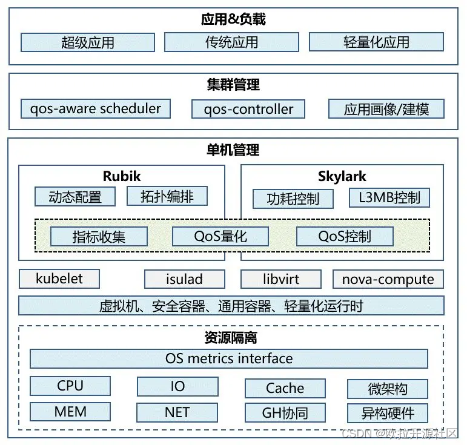

---
title: openEuler 资源利用率提升之道 01：概论
date: 2022-07-05
tags:
    - 资源利用率
archives: 2022-07
author: openEuler
summary: 多个研究表明，当前全球数据中心用户集群的平均 CPU 利用率低于 20%，存在巨大的资源浪费。因此，提升数据中心资源利用率是当前急需解决的一个重要问题。
---

## 问题背景

据 Canalys 发布的一份报告显示 [1]，全球云基础设施服务支出在 2022 年第一季度同比增长 34%，达到 559 亿美元。然而，多个研究表明，当前全球数据中心用户集群的平均 CPU 利用率低于 20%，存在巨大的资源浪费。因此，提升数据中心资源利用率是当前急需解决的一个重要问题 [2]。

## 问题成因

资源利用率低下的主要原因是任务和资源调配失衡，这种失衡又有多种表现形式，例如：

 1. 调度系统和集群独立：不同的作业采用不同的调度系统，作业不能在更加广泛的集群中流动，其他集群的空闲资源不能有效利用。
 2. 任务类型缺乏多样性：集群中的作业同质化严重，作业集中使用一部分资源，导致这部分资源利用率较高，但是其余资源空闲。
 3. 缺乏优先级分级管理：要么是缺乏低优先级作业填补空闲资源，要么是有低优先级作业但是集群不具备分级管控能力，导致资源过度分配。
 4. 集群中资源类型单一：集群内部资源整体规格单一，不能根据总体业务对各类资源的动态需求进行弹性伸缩，导致部分资源配置过高。

总体而言，是集群内部任务和资源的多样性不足，调度对多样性任务和资源的管理能力薄弱导致。

## 解决思路

将不同类型的作业混合部署，分别从时间上和空间上提升资源的使用率。

 - 资源超卖（空分超卖）：在线业务的空闲资源超卖给离线作业，提升总体资源利用率。
 - 错峰使用（时分超卖）：在线业务的空闲时段填充离线作业，减少资源空转。

## 技术挑战

不论是空分超卖还是时分超卖，都存在共峰资源不足的问题，该问题会导致部分业务服务质量（QoS）受损。如何在提升资源利用率之后，保障业务 QoS 不受损是技术上的关键挑战。

此外，云上业务的多样性和复杂性进一步加大了保障服务质量的难度：

一方面，从负载特征可感知程度，可以分为白盒应用，黑盒应用和灰盒应用。白盒应用可以被系统感知内部结构，实时获取 QoS 指标；黑盒业务则不能被系统感知内部结构，系统甚至不知道应用的 QoS 是什么；可感知程度介于二者之间的应用称为灰盒应用。如何精准量化黑盒业务的服务质量并定位干扰源是能力泛化的技术挑战，也是业界研究热点。

另一方面，从负载的业务复杂程度，可以分为轻量化应用（如微服务，函数计算），传统应用（如单体应用）和超级应用（如 HPC/AI）等。需要克服全栈协同感知等技术难题，构建具有普适性的统一系统。

## 解决方案简介

根据上面的成因分析，进一步的，将多样性业务 / 负载和资源融合部署调度，能够显著提升资源调配的灵活性，从而达到提升高资源利用效率的目的。但这也带来了更大的技术挑战，管理的业务 / 负载越多，资源类型越多，依赖关系越复杂，对系统的多目标优化要求就越复杂。基于此，我们将其分为如下几个发展阶段：

**L0：独立部署：** 集群独立技术栈、独立资源池，集群利用率低（<20%）。

**L1：共享部署：** 统一技术栈扩大集群规模，单一类型业务共享资源部署，基于动态弹性提升资源利用率，集群资源利用率较低（<30%）。

 - 相关技术：技术栈统一、容器化改造、弹性伸缩

**L2：「混合部署」：** 统一技术栈扩大集群规模，多种类型业务共享资源部署，基于超卖和隔离技术提升资源利用率，集群资源利用率高（>40%）。

 - 相关技术：资源超卖、资源分级隔离、反馈控制

**L3：「泛型混部」：** 混合部署业务类型泛化，支持公有云上成千上万种黑盒业务共享资源部署，基于 QoS 量化感知保障关键业务服务质量。

- 相关技术：QoS 量化 / 定位、精准控制、QoS 感知调度

**L4：「融合部署」：** 在负载类型泛化的基础之上，融合容器、虚机、轻量化运行时等多样性负载，结合 HPC/AI + 异构资源感知等复杂场景，全面提升各类资源整体利用率。

 - 相关技术：异构资源感知调度、统一调度

其中，L1~L2 以提升集群 CPU 资源利用率为主，
L3~L4 对资源利用率提升技术进行泛化。

业界当前在内部业务上进行 L2 级别的探索并显著的提升了集群甚至数据中心的整体利用率，但在公有云泛化上还处于早期阶段，还没有大规模商用。

我们在结合未来泛型与融合部署的趋势上，构筑了一套可持续演进的资源利用率解决方案，如下图所示：

为了达到最佳的部署效果，需要任务执行的多个层面进行控制和优化：

**「集群管理层」：** 调度层面将性能干扰较强的业务分开部署，通过任务组合优化减少不必要的干扰。

**「单机管理层」：** 单机管理层面实时感知资源竞争，消除对关键作业的影响。

**「资源隔离层」：** 通过对任务分级优先控制，保障高优先级任务资源需求。

目前华为基于上述框架已经实现了 L2 级解决方案，相关特性已在华为内部完成验证并陆续上线。技术上在各层面上均取得了重要突破：

**「集群管理层」：**

预测调度：支持基于节点物理资源使用率预测调度 [3]、负载均衡调度、资源抢占调度等特性。
特征建模：设计并实现了一套通用的应用画像建模组件，该组件能够自动进行干扰注入、指标采集和模型输出。

**「单机管理层」：**

QoS 量化：基于量化模型实时检测业务 QoS 并对干扰源进行实时控制。
拓扑编排：根据硬件拓扑关系，对业务进行动态亲和性编排，在资源配额不变的情况下，提升整体性能。
功耗控制：资源利用率提升后增加了整机功耗过高风险，需实时监测功耗变化，进行针对性的功耗压制。
L3/MB 控制：当前底层硬件提供了 L3 缓存和内存带宽隔离能力，但仍需软件动态控制，以实现干扰控制和资源利用率的平衡。

**「资源隔离层」：**

分级抢占：对可优先级排队资源提供分级抢占能力，如 CPU、MEM、IO/NET 等，其中 CPU 绝对压制能力（避免优先级翻转），NET 抢占性能 (<100ms) 等业界领先。

弹性调度：支持潮汐亲和性、CPU Burst 等弹性调度能力。

以上细颗粒特性，我们也会陆续开放到 openEuler 上，请大家多多使用、在社区上多多交流。

## 未来计划

当前我们已经在一些内部场景验证并落地了混合部署方案，已经达到了 L2 阶段。短期来看，还需要突破黑盒业务 QoS 保障相关技术并进入 L3 阶段，只有达到 L3 阶段才能让更多用户从中收益。长期来看，除了容器场景外，还有更多的负载类型、资源类型需要提升资源利用率，这需要在集群调度、OS 等层面出现更多的技术突破。

本文简要介绍对于云上资源利用率提升解决技术的思考，后续计划对其中涉及的隔离技术，反馈控制技术，感知调度技术等进行详细介绍，敬请期待！

## 参考资料

 1. Global cloud services spend hits US$55.9 billion in Q1 2022
 2. 王康瑾，贾统，李影。在离线混部作业调度与资源管理技术研究综述。软件学报，2020,31 (10):3100-3119
 3. Volcano：在离线作业混部管理平台，实现智能资源管理和作业调度

文中所述资源利用率提升技术，由 Cloud Native SIG、High Performance Network SIG，Kernel SIG, OpenStack SIG 和 Virt SIG 共同参与，其源码将在 [openEuler 社区](https://gitee.com/openeuler)逐步开源。
