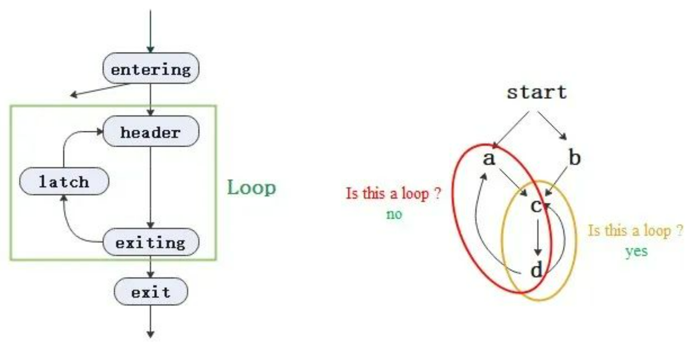
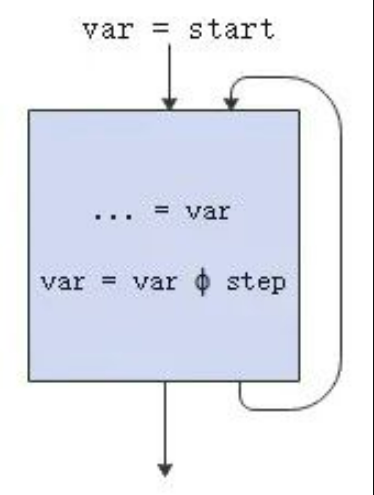
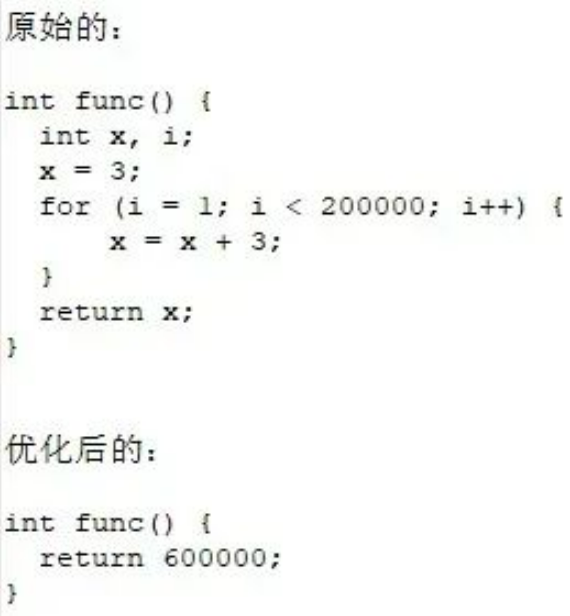

---
title: 编译器优化那些事儿（4）：归纳变量
date: 2022-07-06
tags:
    - LibcarePlus
    - CVE
archives: 2022-07
author: 孔荔
summary: openEuler 社区与天翼云基础架构技术团队通力合作，共同打造了全面支持 aarch64 及 x86 平台的 LibcarePlus 热补丁功能，可以应用于 CVE 漏洞修复，也可应用于不中断应用服务的紧急 bug 修复。
---


## 0. 基础知识盘点

### 0.1 循环（loop）

**定义**

loop（llvm里理解为natural loop）是定义在CFG中的一个结点集合L，并具有以下属性 [1] [2]：

- 有单一的入口结点（称为header），该结点支配loop中的所有结点；
- 存在一条进入循环头的回边。

**相关术语**

- entering block：一个非loop内的结点有一条边连接到loop。当只有一个entering block且其只有一条边连接到header，称之为preheader；作为非loop结点的peheader支配整个loop；
- latch：有一条边连接到header；
- backedge：称为回边，一条从latch到header的边；
- exiting edge：一条边从loop内到loop外，边的出发结点称之为exiting block，目标结点称之为exit block；

<div align=center>



</div></br>

上面右图中，黄色区域是一个loop，而红色区域不是，为什么呢？
因为红色区域a和c都是入口结点，不满足单一入口结点的性质。

### 0.2 Scalar Evolution（SCEV）

**定义**

SCEV是编译器对变量进行分析的优化（往往只针对整数类型），且主要用于分析循环中变量是如何被更新的，然后根据这个信息来进行优化。

**循环链**

如图所示，循环中归纳变量var的起始值为start，迭代的方式为ϕ，步长为step；

<div align=center>



</div></br>

它的循环链（chrec，Chains of Recurrences）如下：

```
var = {start, ϕ , step}
// ϕ∈{+,∗}
// start: starting value
// step: step in each iteration
````

举个例子：

```
int m = 0;
for (int i = 0; i < n; i++) {
  m = m + n;
  *res = m;
}
```

那么m的循环链为：m = {0,+,n}。

## 1. Induction Variable（归纳变量）

### 1.1  定义

```
for (i = 0; i < 10; ++i) {
    j = 17 * i;
}
```

### 1.2 益处

归纳变量优化的好处，有但不局限于以下几点：

- 用更简单的指令替换原来的计算方式。比如，上面的例子中识别到归纳变量，将对应的乘法替换为代价更小的加法。

```
j = -17;
for (i = 0; i < 10; ++i) {
    j = j + 17;
}
```
- 减少归纳变量的数目，降低寄存器压力。

```
extern int sum;
int foo(int n) {
    int i, j;
    j = 5;
    for (i = 0; i < n; ++i) {
        j += 2;
        sum += j;
    }
    return sum;
}
```

当前的loop有两个归纳变量：i、j，用其中一个变量表达另外一个后，如下：

```
extern int sum;
int foo(int n) {
    int i;
    for (i = 0; i < n; ++i) {
        sum += 5 + 2 * (i + 1);
    }
    return sum;
}
```

- 归纳变量替换，使变量和循环索引之间的关系变得明确，便于其他优化分析（如依赖性分析）。举例如下，将c表示为循环索引相关的函数：

```
int c, i;
c = 10;
for (i = 0; i < 10; i++) {
    c = c + 5; // c is incremented by 5 for each loop iteration
}
```

转换为：

```
int c, i;
c = 10;
for (i = 0; i < 10; i++) {
    c = 10 + 5 * (i + 1);  // c is explicitly expressed as a function of loop index
}
```

## 2. 实践

### 2.1 相关编译选项

|compiler|option|
|--|--|
|gcc|fivopt|
|毕昇|indvars|
	
### 2.2 优化用例

归纳变量的优化（ivs）在llvm中的位置是：`llvm\lib\Transforms\Scalar\IndVarSimplify.cpp`
让我们通过一个用例，看看毕昇编译器的优化过程。
如下图，假设上面func里面的部分就是要优化的代码，下面func里面就是预期生成的结果：</br>

<div align=center>



</div></br>

它的IR用例`test.ll`是：

<div align=center>


</div></br>

编译命令是：

```
opt test.ll -indvars -S
```

当前的例子中，`header`、`latch`和`exiting block`都是同一个BB，即bb5。

<div align=center>


</div></br>

步骤一：依据`def-use` 关系，遍历`loop`的 `ExitBlock`中`phi`结点的操作数的来源，计算出最终值同时替换它，继而替换该phi结点的使用。

例子中，计算`%tmp2.lcssa` ，其唯一的操作数是`%tmp2 = add nuw nsw i32 %i.01.0, 3 `，该表达式所在的`loop`是bb5，此时`%tmp2`的循环链为


```
%tmp2 = {3,+,3}<nuw><nsw><%bb5>
```

获取当前`loop`的不退出循环的最大值是199999，那当前`%tmp2=add(3, mul(3,199999))=600000`；接下来会看当前的替换不是高代价（代价的计算会依据不同架构有所不同），同时在`phi`结点的`user`中替换该值。优化结果如下：

<div align=center>


</div></br>

步骤二：遍历`ExitingBlock`，对其跳转条件进行计算，依据`def-use`的关系，删除相应的指令。
例子中，计算出`br i1 %0, label %bb5, label %bb7`的`%0`是 `false`，跳转指令替换后，`%0 = icmp ult i32 %tmp4，200000` 不存在 `user`，将其加入到“死指令”中。优化结果如下：

<div align=center>


</div></br>


步骤三：删除所有“死指令”，并看看他的操作数是否要一并删除。
例子中，作为`%0`的操作数的`%tmp4`还有其他的`user %x.03.0`，因此不能被视为“死指令”被删除。优化结果如下：

<div align=center>


</div></br>

## 参考

1. <https://llvm.org/docs/LoopTerminology.html>
2. 《编译原理》 [美]Alfred V.Aho，[美]Monica S.Lam，[美]Ravi Sethi等著，赵建华，郑滔等译，<https://en.wikipedia.org/wiki/Induction_variable>
3. 毕昇编译器，<https://www.hikunpeng.com/developer/devkit/compiler/bisheng>
4. 原文链接，<https://mp.weixin.qq.com/s/9CQheIx4nlPfp-xPff5PJQ>
---
欢迎加入Compiler SIG交流群与大家共同交流学习编译技术相关内容，扫码添加小助手微信邀请你进入Compiler SIG交流群。

<div align=center>


</div></br>


