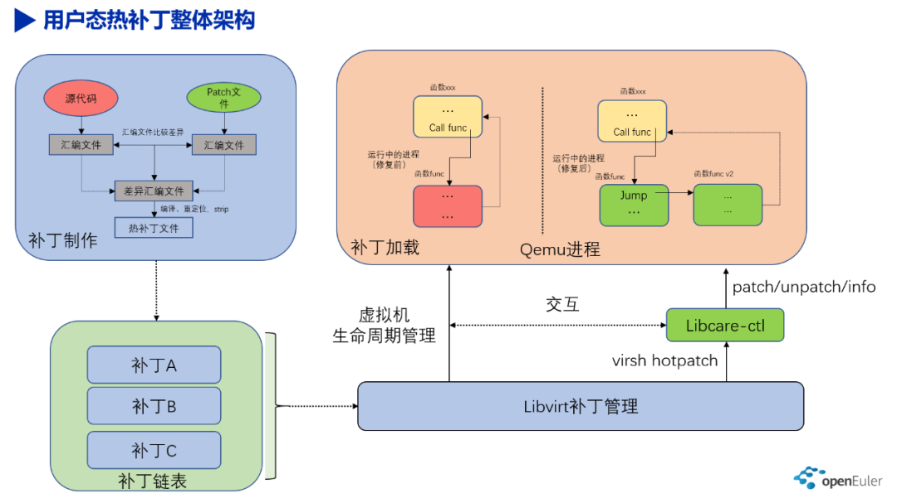
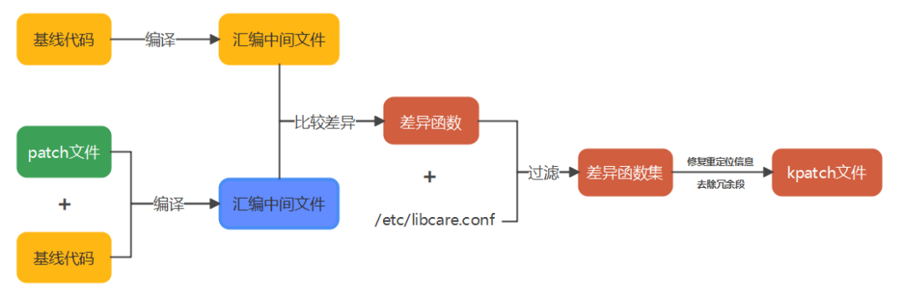
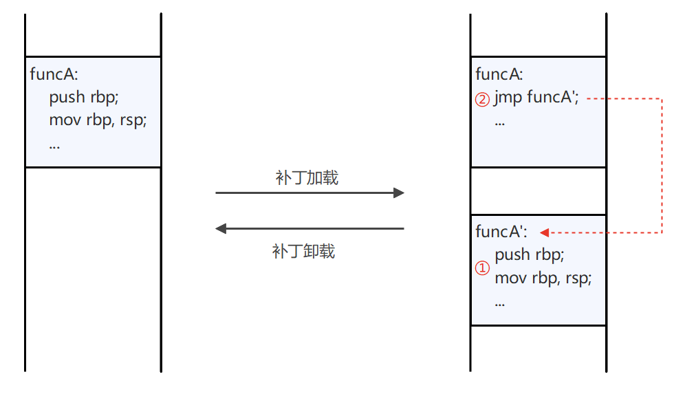

---
title: LibcarePlus 用户态热补丁技术那些事
date: 2022-07-07
tags:
    - LibcarePlus
    - CVE
archives: 2022-07
author: Virt SIG
summary: openEuler 社区与天翼云基础架构技术团队通力合作，共同打造了全面支持 aarch64 及 x86 平台的 LibcarePlus 热补丁功能，可以应用于 CVE 漏洞修复，也可应用于不中断应用服务的紧急 bug 修复。
---

LibcarePlus 用户态热补丁作为 openEuler 社区关键技术，受到了广大开发者的关注和讨论。openEuler 社区与天翼云基础架构技术团队通力合作，共同打造了全面支持 aarch64 及 x86 平台的 LibcarePlus 热补丁功能，可以应用于 CVE 漏洞修复，也可应用于不中断应用服务的紧急 bug 修复。下面我们就来聊聊什么是热补丁技术。

## 热补丁技术背景

当运行的程序存在漏洞的时候，我们一般有以下几种解决办法：

- 替换最新的包含修复补丁的 OS 版本，在有主备倒换能力的组网环境上，可以先将当前运行的程序迁移到备区，待主区升级完后，再将程序迁移到主区；
- 替换程序的 rpm 包，然后重新运行程序（注意此时需要考虑依赖包的兼容性），对于具备热替换能力的程序，则可以利用热替换能力，实现程序运行内容的替换；
- 直接给运行的程序内容打补丁，替换有问题的代码，实现程序漏洞的修复；

从补丁粒度上来说，上述技术漏洞修复粒度是从大到小变化的：
- 第一个是系统级的，主要涉及的技术有热迁移技术；
- 第二个是 rpm 包级的，主要涉及的技术有热替换；
- 第三个是运行程序级的，主要涉及的技术有热补丁。

从业务中断时长来说，上述技术的业务中断时长也是从大到小变化的：
- 第一种技术业务中断时间一般在分钟级，且一般涉及整个系统业务的主备倒换，升级周期最长，一般需要几个月的升级窗口；
- 第二种技术业务中断时间一般在百毫秒级，且该技术一般不通用，需要侵入式修改和适配大量业务代码，升级周期相对比较短，一般仅需要一个月的升级窗口；
- 第三种技术业务中断时间则一般在毫秒级，该技术比较通用，不需要侵入式修改和适配业务代码，仅需要适配一些通用代码，适配工作量较小，升级周期相对比较短，一般仅需要一个月的升级窗口。

通过上述分析，我们大概能总结出热补丁的如下几个优点：一是热补丁能够在不影响现网业务的情况下，完成程序漏洞的修复；二是热补丁适用于需要快速响应的市场环境，将验证工作从版本验证简化为补丁验证。总结一句话：热补丁短小精悍，适合使用在需要快速响应的场景中。

今天，我们就来简单介绍一下，集万千宠爱于一身的 LibcarePlus 热补丁技术。

## LibcarePlus 热补丁技术的基本原理

LibcarePlus 热补丁技术是基于上游社区 libcare 独立发展的分支，当前由 openEuler 社区进行自主孵化。相比于上游社区的 libcare，LibcarePlus 支持主流的 x86_64 架构和 aarch64 架构，全面支持 openEuler Qemu 组件，支持函数级过滤，支持增量补丁，支持补丁文件解析等。

我们以 LibcarePlus Qemu 热补丁技术为例，进行相关介绍。热补丁的整体架构如下：

LibcarePlus 热补丁技术主要包括：**热补丁制作**、**补丁管理**和**补丁加/卸载**。

### 1. 热补丁制作

LibcarePlus 制作热补丁的基本原理是基于汇编级指令比较技术。LibcarePlus 通过比较基线代码生成的汇编中间文件和打了补丁的基线代码生成的汇编中间文件，找到两者之间的差异部分；再基于差异部分，去除冗余段和修复重定位信息，最终得到热补丁 kpatch 文件。在分析汇编差异的前，LibcarePlus 会基于一些关键信息将汇编内容分成函数块和变量块，然后通过比较函数块和变量块之间的差异，找到差异的函数和变量。补丁制作的大概流程如下图所示：

### 2. Qemu热补丁管理

热补丁加/卸载的基本原理如下图所示：

 

LibcarePlus 热补丁加/卸载基于内核提供的 ptrace 能力。通过 ptrace 目标进程，将目标进程短暂冻结，随后进行补丁加载环境的安全校验，在确保补丁加载环境安全的情况下，以 mmap 映射的方式，将适配好的补丁文件插入到目标进程的内存空洞中。在执行完上述步骤后，通过修改缺陷函数的前面五个字节的代码，让缺陷函数在被调用时跳转到新函数的地址中，从而使热补丁生效。最后，解冻目标进程，完成热补丁的加载。

在热补丁加载过程中，缺陷函数被替换的前五个字节代码会保存在目标进程的热补丁的管理结构中，将这五个字节代码重新写回原地址处，可使热补丁回滚到原来状态，从而实现了热补丁卸载。

## 加入我们

LibcarePlus 当前已经在 openEuler 社区开源。后续我们将开展一系列技术分享，让大家更加详细地了解 LibcarePlus。如果您对热补丁技术感兴趣，欢迎您的围观。您也可以扫描文末小助手二维码，回复 LibcarePlus 加入 SIG 交流群。

项目地址：<https://gitee.com/openeuler/libcareplus>

项目交流：<https://gitee.com/openeuler/libcareplus/issues>

