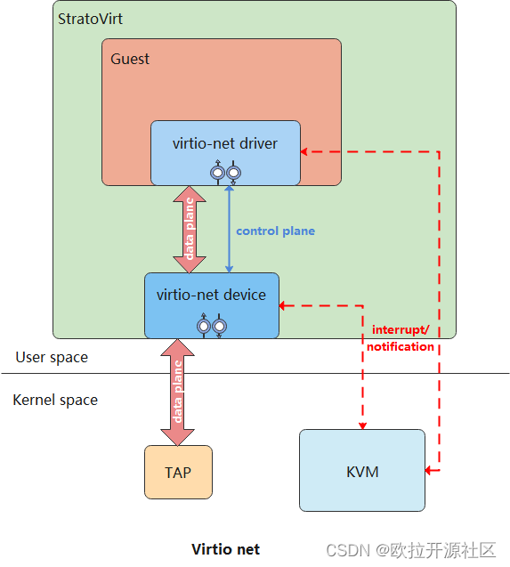
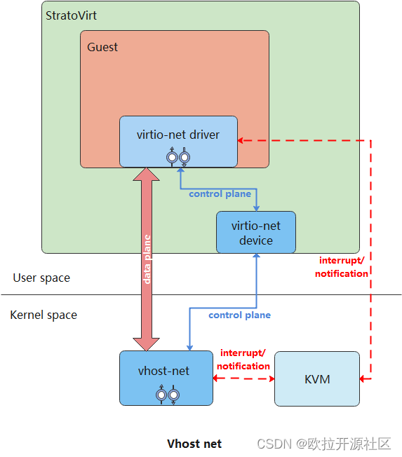
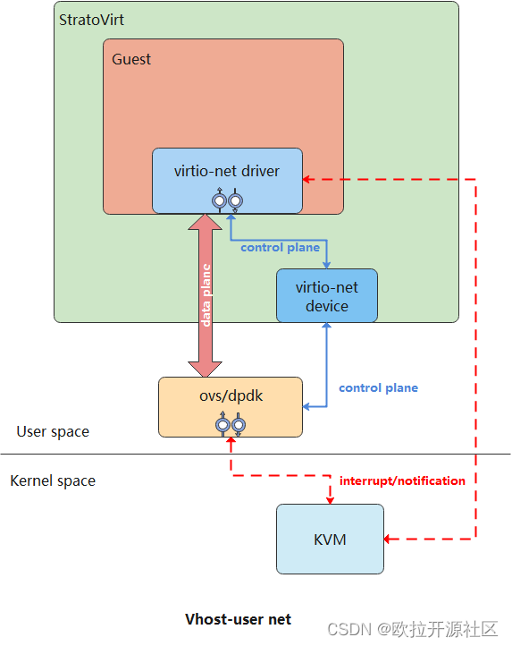

---
title: StratoVirt 中的虚拟网卡是如何实现的？
date: 2022-08-09
tags:
    - StratoVirt
    - 虚拟网卡
archives: 2022-08
author: openEuler
summary: StratoVirt 当前支持 Virtio-net/Vhost-net/Vhost-user-net 三种虚拟网卡，这三种虚拟网卡都基于 virtio 协议实现数据面。
---

StratoVirt 当前支持 Virtio-net/Vhost-net/Vhost-user-net 三种虚拟网卡，这三种虚拟网卡都基于 virtio 协议实现数据面。Virtio-net 数据面存在一层用户态到内核态的切换，Vhost-net 通过将数据面卸载到内核态解决了该问题，但是仍然需要 Guest 陷出来通知后端。Vhost-user net 将数据面卸载到用户态进程中，并绑定固定的核，不停的对共享环进行轮训操作，解决了 Vhost-net 存在的问题。接下来分别介绍每种虚拟网卡是如何实现的。

## Virtio-net

Virtio-net 是一种虚拟的以太网卡，通过 tap 设备基于 virtio 协议的半虚拟化框架来实现前后端通信。Virtio 协议是一种在半虚拟化场景中使用的 I/O 传输协议，它的出现解决了全虚拟化场景中模拟指令导致的性能开销问题。整体架构如下图所示：



Guest 中需要支持 virtio-net 驱动， Guest 和 StratoVirt 之间基于 virtio 协议通过共享内存实现 I/O 请求的处理。

「**发包流程：**」

1） Guest 通过 virtio-net 驱动将 I/O 请求放入发送队列，并触发陷出通知后端；

2） 陷出后由 KVM 通过 eventfd 通知 StratoVirt，共享环中有数据需要处理；

3） StratoVirt 将数据从环中取出并发送给 tap 设备，后由 tap 设备自动发给物理网卡；

「**收包流程：**」

1） 物理网卡发送数据到 tap 设备时，StratoVirt 会监听到；

2） StratoVirt 将 I/O 请求从 tap 设备中取出，放入到共享环的接收队列中；

3） StratoVirt 通过 irqfd 通知 KVM，由 KVM 注入中断通知 Guest 接收数据；

## Virto-net 实现

使用 NetIoHandler 结构体作为处理 virtio-net 虚拟网卡事件的主体。其中包含收/发包结构 RxVirtio（rx）和 TxVirtio（tx）、tap 设备及其对应的文件描述符。RxVirtio/TxVirtio 中都包含队列 queue 和事件描述符 queue_evt，队列用 Mutex 锁保护，可以保证多线程共享时的数据安全。代码路径：virtio/src/net.rs

```cpp
struct TxVirtio {
    queue: Arc<Mutex<Queue>>,
    queue_evt: EventFd,
}

struct RxVirtio {
    queue: Arc<Mutex<Queue>>,
    queue_evt: EventFd,
    ...
}

struct NetIoHandler {
    // 收报结构
    rx: RxVirtio,
    // 发包结构
    tx: TxVirtio,
    // tap设备
    tap: Option<Tap>,
    // tap设备对应的文件描述符
    tap_fd: RawFd,
    ...
}
```

## 收/发包实现

虚拟机收包时，StratoVirt 从 tap 设备读取数据到 avail ring 中。然后将索引加入到 used ring，再发送中断给虚拟机，通知虚拟机接收数据。虚拟机发包流程和收包流程相似，不再单独介绍。收包操作核心代码（virtio/src/net.rs）实现如下：

```cpp
fn handle_rx(&mut self) -> Result<()> {
    let mut queue = self.rx.queue.lock().unwrap();
    while let Some(tap) = self.tap.as_mut() {
        ...
        // 获取avail ring中的elem，用于保存发给Guest的包
        let elem = queue
            .vring
            .pop_avail(&self.mem_space, self.driver_features)
            .chain_err(|| "Failed to pop avail ring for net rx")?;
        let mut iovecs = Vec::new();
        for elem_iov in elem.in_iovec.iter() {
            // Guest地址转换为HVA
            let host_addr = queue
                .vring
                .get_host_address_from_cache(elem_iov.addr, &self.mem_space);
            if host_addr != 0 {
                let iovec = libc::iovec {
                    iov_base: host_addr as *mut libc::c_void,
                    iov_len: elem_iov.len as libc::size_t,
                };
                iovecs.push(iovec);
            } else {
                error!("Failed to get host address for {}", elem_iov.addr.0);
            }
        }
        // 从tap设备读取数据
        let write_count = unsafe {
            libc::readv(
                tap.as_raw_fd() as libc::c_int,
                iovecs.as_ptr() as *const libc::iovec,
                iovecs.len() as libc::c_int,
            )
        };
        ...
        queue
            .vring
            .add_used(&self.mem_space, elem.index, write_count as u32)
            .chain_err(|| {
                format!(
                    "Failed to add used ring for net rx, index: {}, len: {}",
                    elem.index, write_count
                )
            })?;
        self.rx.need_irqs = true;
    }

    if self.rx.need_irqs {
        self.rx.need_irqs = false;
        // 中断通知Guest
        (self.interrupt_cb)(&VirtioInterruptType::Vring, Some(&queue))
            .chain_err(|| ErrorKind::InterruptTrigger("net", VirtioInterruptType::Vring))?;
    }

    Ok(())
}
```
##  Vhost-net

Vhost-net 将 Vritio-net 中的数据面卸载到了内核中，内核中会启动一个线程来处理 I/O 请求，绕过了 StratoVirt，可以减少用户态和内核态之间的切换，提高网络性能。整体框架如下图所示：



Vhost-net 的控制面基于 vhost 协议将 vring、eventfd 等信息发给 vhost-net 驱动，vhost-net 驱动在内核中可以访问 vring 信息，完成收/发包操作，用户态和内核态之间无需切换，有效的提升网络性能。

「**发包流程：**」

1） Guest 通过 virtio-net 驱动将 I/O 请求放入发送队列，并触发陷出通知后端；

2） 陷出后由 KVM 通过 eventfd 通知 vhost-net，共享环中有数据需要处理；

3） Vhost-net 将数据从环中取出并发送给 tap 设备，后由 tap 设备自动发给物理网卡；

「**收包流程：**」

1） 物理网卡发送数据到 tap 设备时，会通知 vhost-net；

2） vhost-net 将 I/O 请求从 tap 设备中取出，放入到共享环的接收队列中；

3） vhost-net 通过 irqfd 通知 KVM，由 KVM 注入中断通知 Guest 接收数据；

## Vhost-net 实现

虚拟机启动时，当虚拟机中 virtio-net 驱动准备好后，StratoVirt 中调用 activate 函数使能 virtio 设备。该函数基于 vhost 协议将前后端协商的特性、虚拟机的内存信息、vring 的相关信息、tap 的信息等发送给 vhost-net 驱动，将 virtio 数据面卸载到单独的进程中进行处理，来提升网络性能。使能设备核心代码（virtio/src/vhost/kernel/net.rs）实现如下：

```bash
fn activate(
    &mut self,
    _mem_space: Arc<AddressSpace>,
    interrupt_cb: Arc<VirtioInterrupt>,
    queues: &[Arc<Mutex<Queue>>],
    queue_evts: Vec<EventFd>,
) -> Result<()> {
    let backend = match &self.backend {
        None => return Err("Failed to get backend for vhost net".into()),
        Some(backend_) => backend_,
    };

    // 设置前后端协商的特性给vhost-net
    backend
        .set_features(self.vhost_features)
        .chain_err(|| "Failed to set features for vhost net")?;

    // 设置虚拟机的内存信息给vhost-net
    backend
        .set_mem_table()
        .chain_err(|| "Failed to set mem table for vhost net")?;

    for (queue_index, queue_mutex) in queues.iter().enumerate() {
        let queue = queue_mutex.lock().unwrap();
        let actual_size = queue.vring.actual_size();
        let queue_config = queue.vring.get_queue_config();

        // 设置vring的大小给vhost-net
        backend
            .set_vring_num(queue_index, actual_size)
            .chain_err(...)?;
        // 将vring的地址给vhost-net
        backend
            .set_vring_addr(&queue_config, queue_index, 0)
            .chain_err(...)?;
        // 设置vring的起始位置给vhost-net
        backend.set_vring_base(queue_index, 0).chain_err(...)?;
        // 设置轮询vring使用的eventfd给vhost-net
        backend
            .set_vring_kick(queue_index, &queue_evts[queue_index])
            .chain_err(...)?;
        ...
        // 设置callfd给vhost-net，处理完请求后通知KVM时使用
        backend
            .set_vring_call(queue_index, &host_notify.notify_evt)
            .chain_err(...)?;

        let tap = match &self.tap {
            None => bail!("Failed to get tap for vhost net"),
            Some(tap_) => tap_,
        };
        // 设置tap信息给vhost-net
        backend.set_backend(queue_index, &tap.file).chain_err(...)?;
    }
    ...
}
```

## Vhost-user net

Vhost-user net 在用户态基于 vhost 协议将 Vritio-net 的数据面卸载到了用户态进程 Ovs-dpdk 中，数据面由 Ovs-dpdk 接管，该进程会绑定到固定的核，不停的对共享环进行轮训操作，来确认 vring 环中是否有数据需要处理。该轮训机制使虚拟机在发送数据时不再需要陷出，相对于 Vhost-net 减少了陷出开销，进一步提高网络性能。整体框架如下图所示：



类似于 Vhost-net，Vhost-user net 的控制面基于用户态实现的 vhost 协议，在 StratoVirt 中调用 activate 函数激活 virtio 设备时，将虚拟机的内存信息、Vring 的相关信息、eventfd 等发送给 Ovs-dpdk，供其进行收/发包使用。

「**发包流程：**」

1） Guest 通过 virtio-net 驱动将 I/O 请求放入发送队列；

2） Ovs-dpdk 一直在轮训共享环，此时会轮训到 1）中的请求；

3） Ovs-dpdk 将 I/O 请求取出并发送给网卡；

「**收包流程：**」

1） Ovs-dpdk 从网卡接收 I/O 请求；

2） Ovs-dpdk 将 I/O 请求放入到共享环的接收队列中；

3） Ovs-dpdk 通过 irqfd 通知 KVM，由 KVM 注入中断通知 Guest 接收数据；

该部分的代码实现类似于 vhost-net，不再单独介绍。

## 总结

Virtio-net/Vhost-net/Vhost-user-net 三种虚拟网卡各有优缺点，针对不同的场景可以选择使用不同的虚拟网卡。最通用的是 Virtio-net 虚拟网卡。对性能有一定要求且 Host 侧支持 vhost 时，可以使用 Vhost-net 虚拟网卡。对性能要求较高，并且 Host 侧有充足的 CPU 资源时，可以使用 Vhost-user net 虚拟网卡。

---

StratoVirt 当前已经在 openEuler 社区开源。后续我们将开展一系列技术分享，让大家更加详细地了解 StratoVirt。如果您对虚拟化技术或者 StratoVirt 感兴趣，欢迎扫描文末小助手二维码，回复 StratoVirt 加入 SIG 交流群。

项目地址：<https://gitee.com/openeuler/stratovirt>

项目交流：<https://gitee.com/openeuler/stratovirt/issues>

