0. 引言
1. 概念介绍
2. 活跃变量分析与图着色算法
3. 线性扫描
4. llvm中实现
5. 参考

## 引言

本文首先会简述用到的基本概念，然后借助一个例子介绍活跃变量分析和图着色算法，最后会介绍线性扫描算法及其llvm12中实现。

## 概念介绍

在介绍算法之前，我们回顾下基本概念：
- |X|：X的度数，(无向图中)节点的邻居个数。

- CFG：控制流图。

- successor：本文指CFG中基本块的后继。

- 四元式：(op,result,arg1,arg2)，比如常见的`a=b+c`就可以看作四元式(+,a,b,c)。

- SSA(Static Single Assignment)：静态单赋值。

- use/def：举个例子，对于指令`n: c <- c+b`来说 use[n]={c,b}，def[n]={c}。

- live-in：当以下任一条件满足时，则称变量a在节点n中是live-in的，写作a∈in[n]。节点n本文中代表指令。

   	1. a∈use[n]；
    	2. 存在从节点n到其他节点的路径使用了a且不包括a的def。

- live-out: 变量a在节点n的任一后继的live-in集合中。写作a∈out[n]
  $$
  in[n] = use[n]\cup(out[n]-def[n])\\
  out[n] = in[s_1]\cup in[s_2]\cup ...\cup in[s_n], where\ s_1,...,s_n are\ all\ successors\ of\ n
  $$

- 干涉：在某一时刻，两个变量在同一`live-in`集合中。

- RIG(Register Interfere Graph): 无向图，其点集和边集构成如下：

   - 节点：变量
   - 边：如果两节点存在干涉，那么这两节点之间就有一条干涉边

- k-着色：给定无向图G=(V,E)，其中V为顶点集合，E为边集合。将V分为k个组，每组中没有相邻顶点，可称该图G是k着色的。当然可着色前提下，k越小越好。
  需要注意的是，我们后续的算法会作用在最普通的四元式上，而不是SSA。在介绍寄存器分配算法之前，我们需要活跃变量分析来构建干涉图。

## 活跃变量分析与图着色算法

### 活跃变量分析

简单来说，就是计算每个点上有哪些变量被使用。

算法描述如下[1]：

```mathematica
input: CFG = (N, E, Entry, Exit)
begin
// init
for each basic block B in CFG
	in[B] = ∅
// iterate
do{
	for each basic block B other than Exit{
		out[B] = ∪(in[s]),for all successors s of B
		in[B] = use[B]∪(out[B]-def[B])
	}
}until all in[] do't change
```
> 活跃变量分析还有孪生兄弟叫Reaching Definitions，不过实现功能类似，不再赘述。


举个例子：对图1的代码进行活跃变量分析

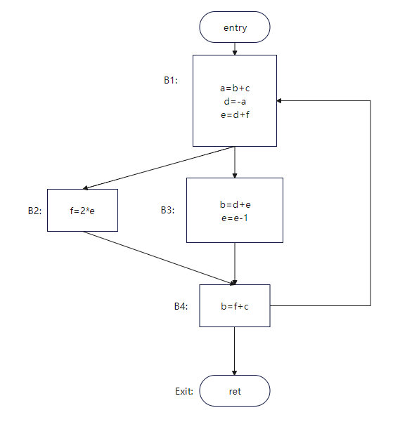

> 图1，参考[2]画的

可以得到每个点的活跃变量如图2所示：
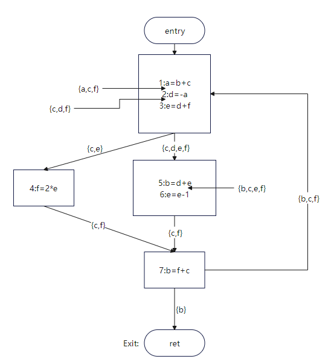

> 图2

过程呢？限于篇幅，仅仅计算第一轮指令1的结果，剩余部分读者可自行计算。

| 步骤 | 下标 | out | in |
| ---- | ------------- | - | - |
| 第一次迭代 | 1 |   {} |  {b,c} |
| ...| ... | ... | ... |

可画出RIG如图3：

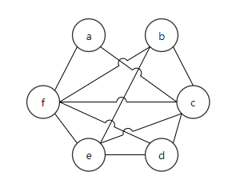

> 图3

### 图着色

经过上文的活跃变量分析，我们得到了干涉图，下一步对其进行上色。

但是图着色是一个NP问题，我们会采用**启发式**算法对干涉图进行着色。
基本思路是：

1. 找到度小于k的节点;
2. 从图中删除;
3. 判断是否为可着色的图;
4. 迭代运行前3步直到着色完成。

算法描述[3]：

```mathematica
input: RIG, k
// init
stack = {}
// iterate
while RIG != {} {
	t := pick a node with fewer than k neighbors from RIG // 这里RIG可以先按度数排序节点再返回
	stack.push(t)
	RIG.remove(t)
}
// coloring
while stack != {} {
	t := stack.pop()
	t.color = a color different from t's assigned colored neighbors
}
```

对于例子1，假设有4个寄存器r1、r2、r3、r4可供分配。

| 步骤 | stack         | RIG                                                          |
| ---- | ------------- | ------------------------------------------------------------ |
| 0    | {}            | 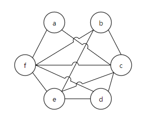 |
| 1    | {a}           | 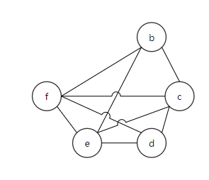 |
| 2    | {d,a}         | 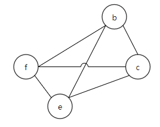 |
| 3    | {c,d,a}       | 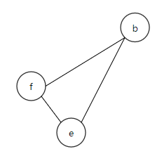 |
| 4    | {b,c,d,a}     | 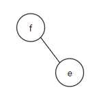 |
| 5    | {e,b,c,d,a}   |  |
| 6    | {f,e,b,c,d,a} |                                                              |


| 寄存器分配                                                   | stack       |
| ------------------------------------------------------------ | ----------- |
|  | {e,b,c,d,a} |
| 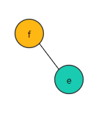 | {b,c,d,a}   |
| 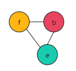 | {c,d,a}     |
| 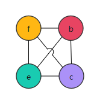 | {d,a}       |
| 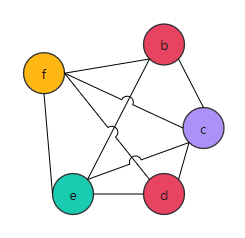 | {a}         |
| 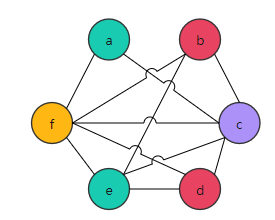 | {}          |

所以图3中的RIG是`4-着色`的。但如果只有三种颜色可用，怎么办呢？

没关系，我们还有大容量的内存，虽然速度慢了那么一点点。着色失败就把变量放在内存里，用的时候再取出来。

依然是上例，但是k=3，只有三个颜色。

| 步骤 | stack | RIG                                                          |
| ---- | ----- | ------------------------------------------------------------ |
| 0    | {}    |  |
| 1    | {a}   |  |
| 2    | 没有度数小于3的节点了，需要溢出变量了     | /                                                            |

如果f的邻居是2-着色的就好了，但不是。那就只能选一个变量存入内存了。
这里我们选择将变量`f`溢出至内存。溢出后的IR和RIG如图：

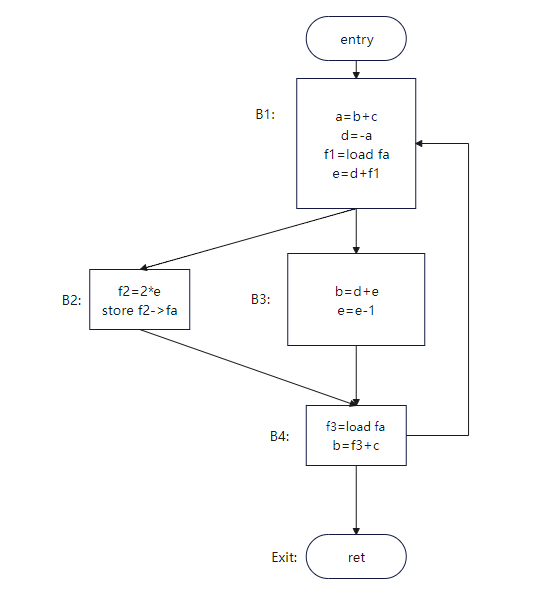

> 图4：溢出后的IR

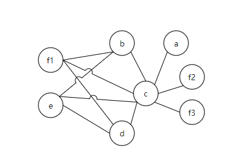

> 图5：溢出后的RIG

所以，溢出其实是分割了变量的生命周期以降低被溢出节点的邻居数量。
溢出后的着色图如图6：
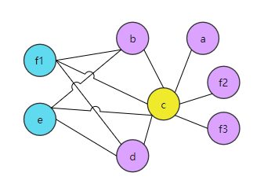

> 图6：着色后的图5

这里溢出变量`f`并不是明智的选择，关于如何优化溢出变量读者可自行查阅资料。

至此，图着色算法基本介绍完毕。不过，如果代码中的复制指令，应该怎么处理呢？

寄存器分配之前会有Copy Propagation和Dead Code Elimination优化掉部分复制指令，但是两者并不是全能的。

比如：代码段1中，我们可以合并Y和X。但是代码段2中Copy Propagation就无能为力了，因为分支会导致不同的Y值。

```txt
// 代码段1
X = ...
A = 10
Y = X
Z = Y + A
return Z

// 代码段2
X= A + B
Y = C
if (...) {Y = X}
Z = Y + 4
```


所以，寄存器分配算法也需要对复制指令进行处理。如何处理？给复制指令的源和目标分配同一寄存器。

那么如何在RIG中表示呢？如果把复制指令的源和目标看作**RIG中相同的节点**，自然会分配同一寄存器。

- 相同节点？可以扩展RIG：新增虚线边，代表合并候选人。

- 成为合并候选人的条件是：如果X和Y的生命周期不重合，那么对于`Y=X`指令中的X和Y是可合并的。

- 为了保证合并合法且不造成溢出：合并后局部的度数<k

那么如何计算局部的度数？介绍三种算法：

- 简单算法
- Brigg's 算法
- George's 算法

1. 简单算法：`(|X|+|Y|)<k`，很保守的算法但是可能会错过一些场景

   比如k=2时：图7应用简单算法是没办法合并的

   > 图7，图源[3]

   但明显图7可以合并成图8：

   > 图8，图源[3]

2. Brigg's 算法：X和Y可合并，如果X和Y中度数≥k的邻居个数＜k。但是如果X的度数很大，算法效率就不高

3. George's算法：X和Y可合并，如果对Y的每个邻居T，|T|<k或者T和X冲突。

   比如k=2时图9就可以合并X和Y

   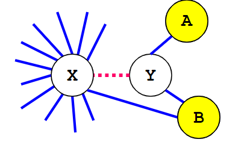

   > 图9，图源[3]

   相对于Brigg算法、George算法不用遍历节点的邻居。注意，图着色时可以按节点度数从小到大依次访问。

到此，图着色算法介绍完毕。

## 线性扫描

接下来介绍一种不同思路的算法：线性扫描。算法描述如下[4]：

```txt
LinearScanRegisterAllocation:
	active := {}
	for i in live interval in order of increasing start point
		ExpireOldIntervals(i)
		if length(avtive) == R
			SpillAtInterval(i)
		else
			register[i] := a regsiter removed from pool of free registers
			add i to active, sorted by increasing end point
ExpireOldInterval(i)
	for interval j in active, in order of increaing end point
		if endpoint[j] >= startpoint[i]
			return
		remove j from active
		add register[j] to pool of free registers
SpillAtInterval(i)
	spill := last interval in active
	if endpoint[spill] > endpoint[i]
		register[i] := register[spill]
		location[spill] := new stack location
		remove spill from active
		add i to active, sorted by increasing end point
	else
		location[i] := new stack location
```

live interval其实就是变量的生命期，用活跃变量分析可以算出来。不过需要标识第一次出现和最后一次出现的时间点。

举个例子：

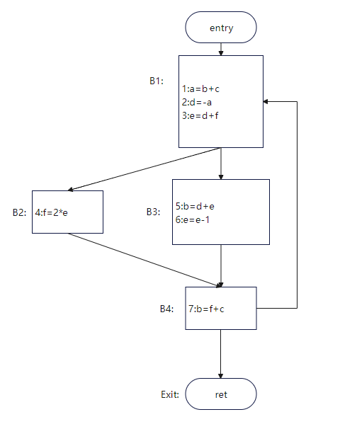

| 变量名 | live interval |
| ------ | ------------- |
| a      | 1,2           |
| d      | 2,3,4,5       |
| e      | 3,4,5,6       |

## llvm中实现

在上文中介绍的算法都是作用在最普通的四元式上，但LLVM-IR是SSA形式，有PHI节点，但PHI节点没有机器指令表示，所以在寄存器分配前需要把PHI节点干掉，消除PHI节点的算法限于篇幅不展开，请自行查阅。

llvm作为工业级编译器，有多种分配算法，可以通过llc的命令行选项`-regalloc=pbqp|greedy|basic|fast`来手动控制分配算法。

不同优化等级默认使用算法也不同：O2和O3默认使用greedy，其他默认使用fast。

fast算法的策略很简单，扫描代码并为出现的变量分配寄存器，寄存器不够用就溢出到内存。用途主要是**调试**。

basic算法以linearscan为基础并对life interval设置了溢出权重而且用优先队列来存储life interval。

greedy算法也使用优先队列，但特点是先为生命期长的变量分配寄存器，而短生命期的变量可以放在间隙中，详情可以参考[5]。

pbqp算法全称是Partitioned Boolean Quadratic Programming，限于篇幅，感兴趣的读者请查阅[6]。

至于具体实现，自顶向下依次是：

- `TargetPassConfig::addMachinePasses`含有寄存器分配和其他优化
- `addOptimizedRegAlloc`中是与寄存器分配密切相关的pass，比如上文提到的消除PHI节点
- `addRegAssignAndRewriteOptimized`是实际的寄存器分配算法
- 寄存器分配相关文件在lib/CodeGen下的RegAllocBase.cpp、RegAllocGreedy.cpp、RegAllocFast.cpp、RegAllocBasic.cpp和RegAllocPBQP.cpp等。
- RegAllocBase类定义了一系列接口，重点是selectOrSplit和enqueue/dequeue方法，数据结构的重点是priority queue。
	selectOrSplit方法可以类比上文中提到的SpillAtInterval。
	priority queue类比active list。
简要代码如下：
```c++
void RegAllocBase::allocatePhysRegs() {
  // 1. virtual reg其实就是变量
  while (LiveInterval *VirtReg = dequeue()) {

    // 2.selectOrSplit 会返回一个可用的物理寄存器然后返回新的live intervals列表
    using VirtRegVec = SmallVector<Register, 4>;
    VirtRegVec SplitVRegs;
    MCRegister AvailablePhysReg = selectOrSplit(*VirtReg, SplitVRegs);
	// 3.分配失败检查
    if (AvailablePhysReg == ~0u) {
    	...
    }
	// 4.正式分配
    if (AvailablePhysReg)
      Matrix->assign(*VirtReg, AvailablePhysReg);
	
    for (Register Reg : SplitVRegs) {
      // 5.入队分割后的liver interval
      LiveInterval *SplitVirtReg = &LIS->getInterval(Reg);
      enqueue(SplitVirtReg);
    }
  }
}
```

至于这四种算法的性能对比，我们主要考虑三个指标：运行时间、编译时间和溢出次数。

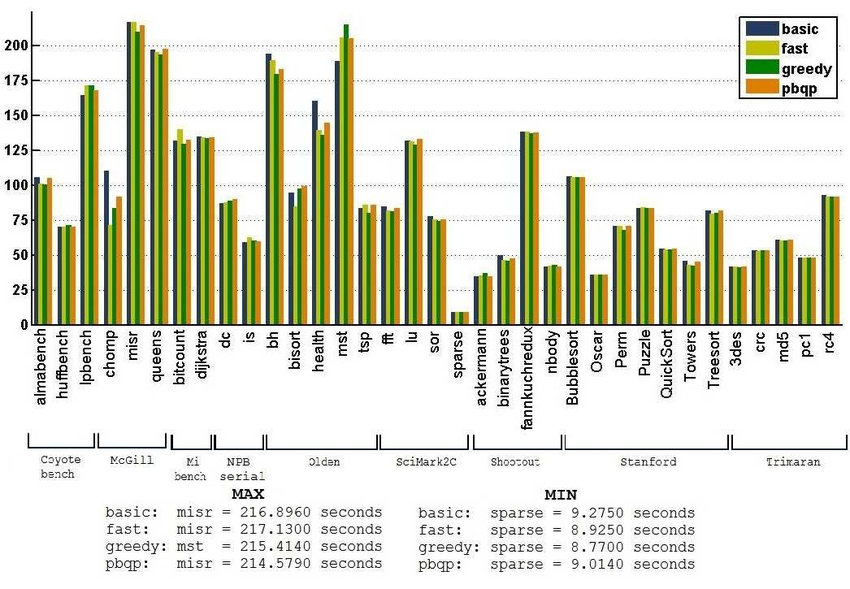

> 各算法的运行时间，图源[6], 横坐标是测试集，纵坐标是以秒为单位的运行时间

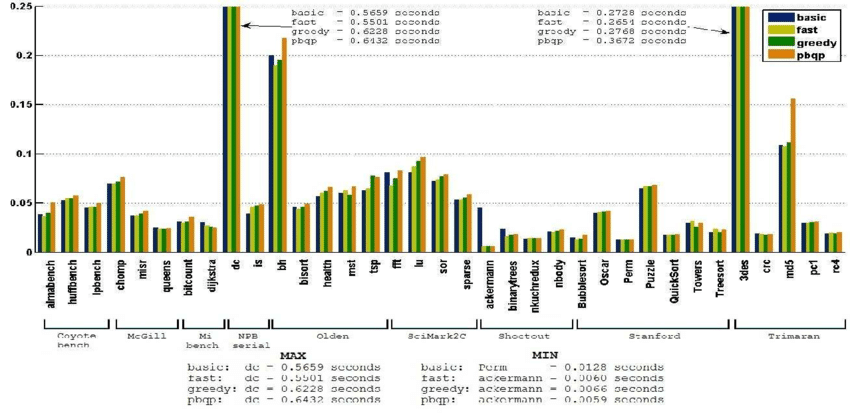

> 各算法的编译时间，图源[6], 横坐标是测试集，纵坐标是编译时间

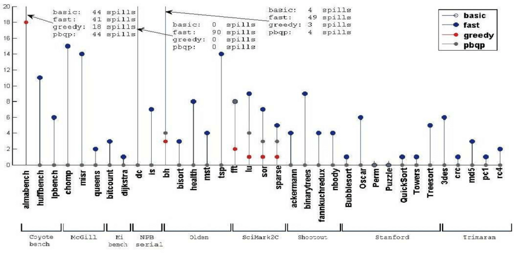

> 各算法的溢出次数，图源[6]

从这三幅图可以看出greedy算法在大多数测试集上都优于其他算法，因此greedy作为默认分配器是可行的。

## 小结

我们通过一个例子介绍了活跃变量分析和图着色算法。借助活跃变量分析，我们知道了变量的生命期，有了变量生命期建立干涉图，对干涉图进行着色。如果着色失败，可以选择某个变量溢出到内存中。之后在RIG的基础上介绍了寄存器合并这一变换。

然后我们简单介绍了不同思路的寄存器分配算法：linearscan。最后介绍了llvm12中算法的实现并对比了llvm中四种算法的性能差异。

## 参考

1. [Introduction to Data Flow Analysis (cmu.edu)](http://www.cs.cmu.edu/afs/cs.cmu.edu/academic/class/15745-s18/www/lectures/L5-Intro-to-Dataflow-pre-class.pdf) 
2. [register-allocation](http://web.cecs.pdx.edu/~mperkows/temp/register-allocation.pdf)
3. [Register Allocation (cmu.edu)](http://www.cs.cmu.edu/afs/cs.cmu.edu/academic/class/15745-s18/www/lectures/L12-Register-Allocation.pdf) 和 [Register Allocation: Coalescing (cmu.edu)](http://www.cs.cmu.edu/afs/cs.cmu.edu/academic/class/15745-s18/www/lectures/L13-Register-Coalescing.pdf) 
4. [linearscan.pdf (ucla.edu)](http://web.cs.ucla.edu/~palsberg/course/cs132/linearscan.pdf) 
5. [greedy-register-allocation-in-llvm-30](http://blog.llvm.org/2011/09/greedy-register-allocation-in-llvm-30.html)
6. T. C. d. S. Xavier, G. S. Oliveira, E. D. d. Lima and A. F. d. Silva, "A Detailed Analysis of the LLVM's Register Allocators," 2012 31st International Conference of the Chilean Computer Science Society, 2012, pp. 190-198, doi: 10.1109/SCCC.2012.29.