# 从0到1构建bishengJDK-rpm包（基于openeuler和树莓派）

bishengJDK是Huawei内部OpenJDK定制版Huawei JDK的开源版本，是一个高性能、可用于生产环境的OpenJDK发行版。HuaweiJDK运行在华为内部500多个产品上，HuaweiJDK团队积累了丰富的开发经验，解决了业务实际运行中遇到的多个问题，并在ARM架构上进行了性能优化，毕昇JDK运行在大数据等场景下可以获得更好的性能。

RPM软件包管理器（RPM）是在Red Hat Enterprise Linux，CentOS和Fedora上运行的软件包管理系统,RPM可以更轻松地分发，管理和更新为Red Hat Enterprise Linux，CentOS和Fedora创建的软件。将软件打包到RPM软件包中有如下优点：安装、重新安装、删除、升级和验证软件包、将原始软件源打包为源包和二进制包、将软件包添加到Yum repositories、对packages进行数字签名等

本文通过两部分，分别在装有openEuler系统的虚拟机及装有openEuler系统的树莓派中对openjdk-1.8.0对rpm包构建过程进行解析。

## 一、基于openEuler的bishengJDK-rpm包构建过程解析

### 1、openEuler系统安装

#### openEuler系统镜像文件下载

openEuler是一款开源操作系统。当前openEuler内核源于Linux，支持鲲鹏及其它多种处理器，能够充分释放计算芯片的潜能，是由全球开源贡献者构建的高效、稳定、安全的开源操作系统，适用于数据库、大数据、云计算、人工智能等应用场景。同时，openEuler是一个面向全球的操作系统开源社区，通过社区合作，打造创新平台，构建支持多处理器架构、统一和开放的操作系统，推动软硬件应用生态繁荣发展。

进入openeuler官网<https://www.openeuler.org/en/download/>选择所需版本进行下载，这里选择openEuler 20.03 LTS，openEuler 20.03 LTS版的生命周期为四年，是一种标准发行版，可以满足开放方案的要求

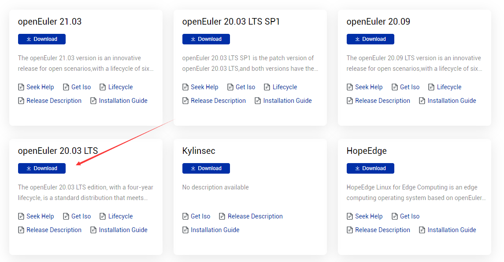

选择好对应版本后点击Download，在版本Download界面选择ISO/进行镜像文件的下载，ISO文件为光盘的镜像文件，刻录软件可以直接把ISO文件刻录成可安装的系统光盘，ISO文件一般以iso为扩展名

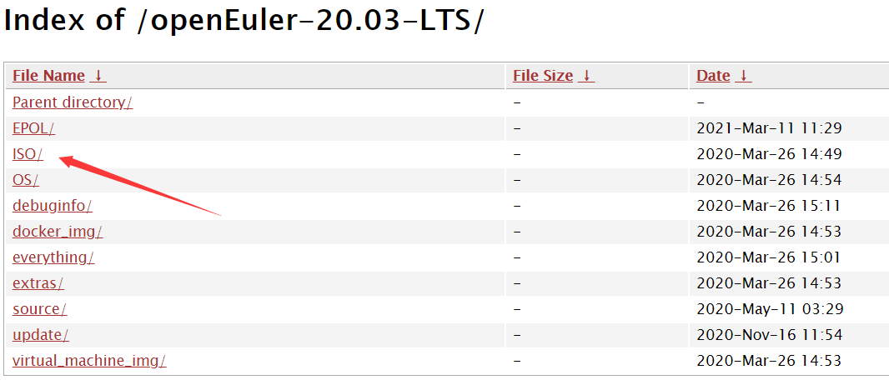

在ISO/界面选择版本的所要下载的系统，openEuler 20.03 LTS的ISO下载列表有提供AArch64架构的ISO、x86_64架构的ISO及openEuler源码ISO，这里选择x86_64架构的ISO

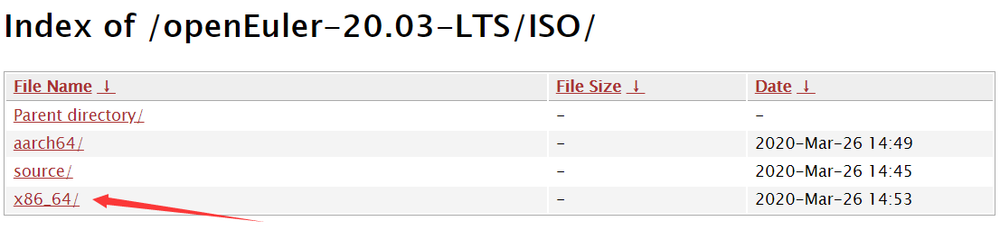

在/openEuler-20.3-LTS/ISO/x86_64/界面按照需求下载对应的ISO文件，这里下载openEuler-20.03-LTS-x86_64-dvd.iso

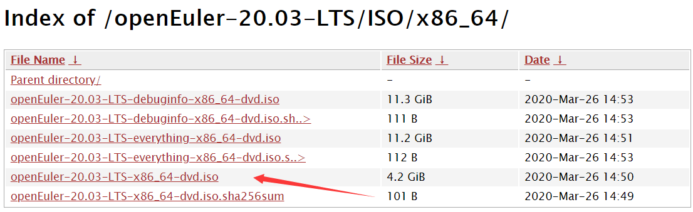

#### 新建虚拟机

通过VMware Workstation软件或者Oracle VM软件新建虚拟机，使用的ISO映像文件为下载的openEuler-20.03-LTS-x86_64-dvd.iso文件

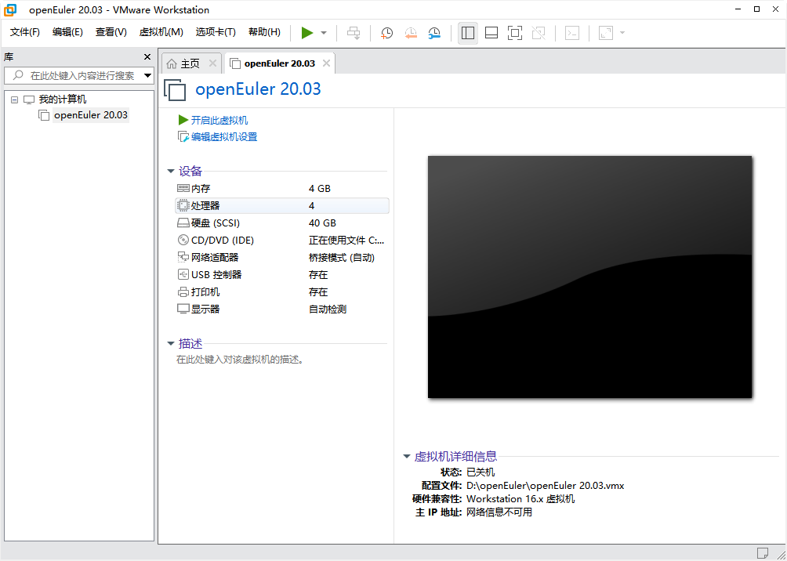

可在 openEuler INSTALLATION SUMMARY界面按需进行相关安装设置，如Keyboard、Language Support、Time&Date、Installation Destination等

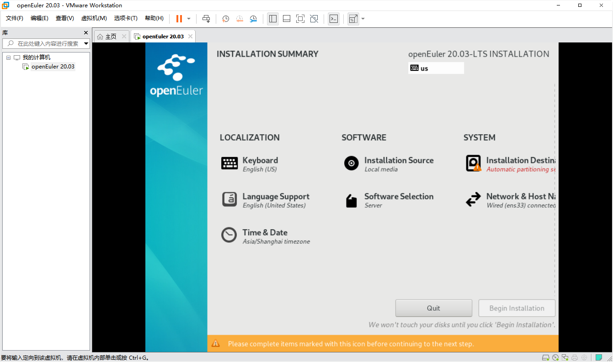

在“INSTALLATION SUMMARY”页面中选择“Installation Destination”，按需设置操作系统的安装磁盘及分区

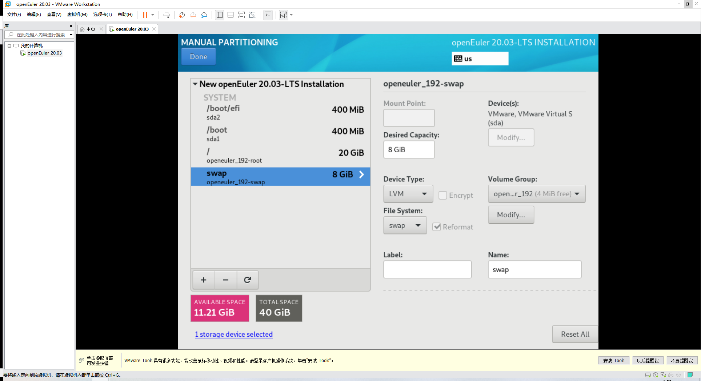

对虚拟机的Root用户Password进行设置，root帐户是尝用来执行关键系统管理任务，不建议在日常工作及系统访问时使用root帐户


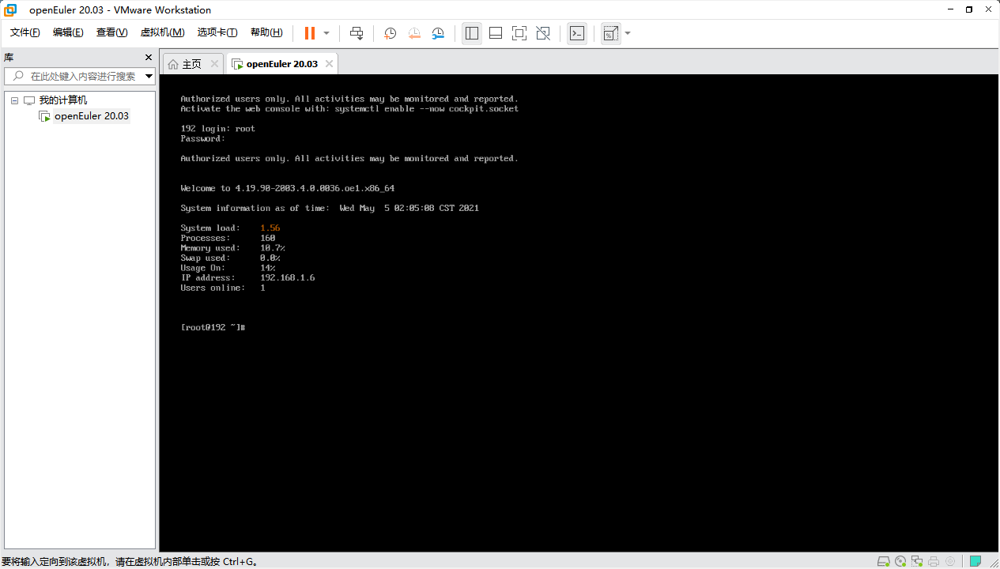

#### 创建用户

```
useradd zhangsan   //创建个人用户
passwd zhangsan    //修改个人密码
su - zhangsan      //切换至个人用户
```

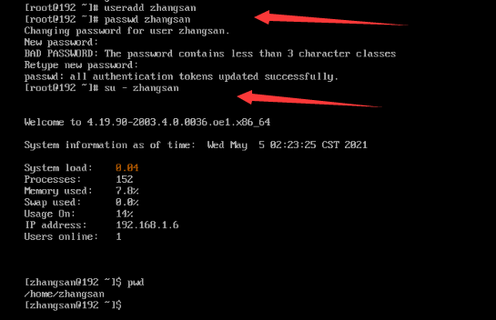

用户设置的root用户密码或新创建用户的密码均需要满足密码复杂度要求，否则会导致密码设置或用户创建失败。设置密码的复杂度的要求如下：口令长度至少8个字符、口令至少包含大写字母、小写字母、数字和特殊字符中的任意3种、口令不能和账号一样、口令不能使用字典词汇

#### 连接远程网络工具MobaXterm

MobaXterm是进行远程计算的工具箱，MobaXterm专注于一个简单的目标：提供一个直观的用户界面，可以通过不同的网络或系统有效地访问远程服务器，虚拟机创建配置完成后，就可通过远程网络工具MobaXterm进行完成连接，虚拟机的IP地址由创建虚拟机后分配产生


通过IP地址及用户名密码对openEuler虚拟机进行远程连接


### 2、安装依赖及源文件下载

#### rpm构建工具包安装

`yum install rpm-build rpm-devel rpmdevtools`

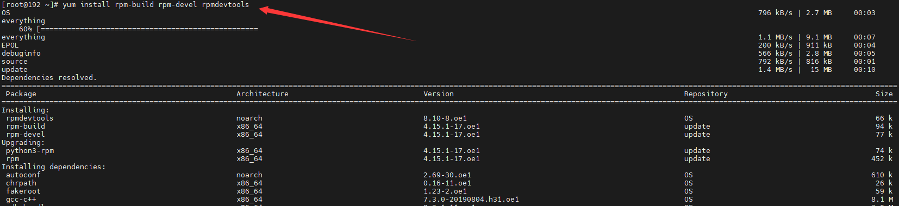

查看软件包所提供的打包RPM的实用程序：`rpm -ql rpmdevtools | grep bin` `rpm -ql rpm-devel | grep bin` `rpm -ql rpm-build | grep bin`

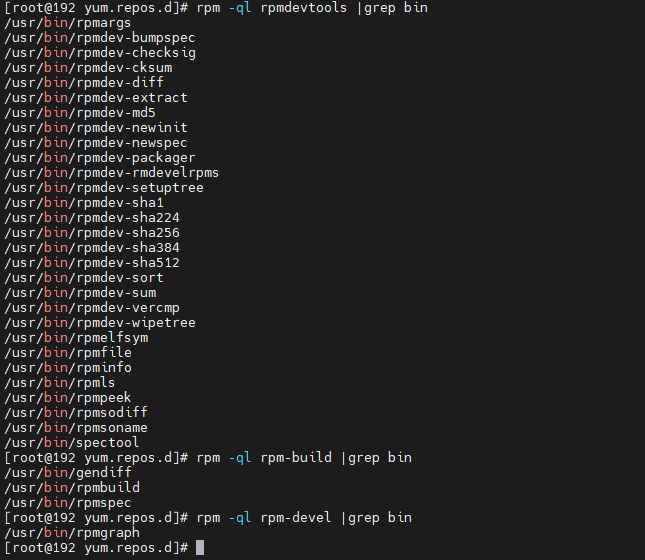

其中rpmdev-setuptree:创建构造rpm打包空间的目录布局、rpmdev-newspec:创建一个未填充的SPEC文件、rpmbuild:从SPEC文件创建实际的rpm软件包、rpmspec：用于规格查询已解析输出的新命令

#### 生成rpmbuild目录及相关子目录

进入个人文件夹下执行`rpmdev-setuptree`自动生成rpmbuild目录及相关子目录


生成的rpmbuild目录及相关子目录如下图，BUILD目录：构建软件包时，`%buildroot`将在此处创建各种目录。如果日志输出未提供足够的信息，这对于调查失败的构建很有用，RPMS目录：在不同体系结构的子目录中创建二进制RPM，例如在子目录`x86_64`和中`noarch`，SOURCES:在这里放置压缩的源代码存档和补丁,该`rpmbuild`命令在此处查找，SPECS:存放SPECS文件，SRPMS:当`rpmbuild`用于构建SRPM而不是二进制RPM时，将在此处创建结果SRPM

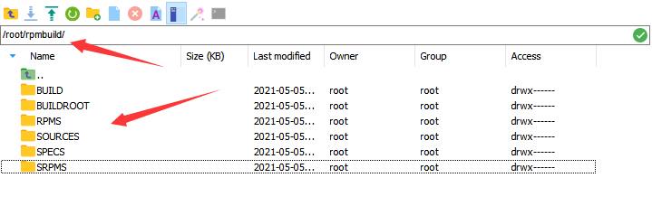

#### 源码包及spec文件准备

在/rpmbuild/SOURCES/文件夹下,进行需要构建rpm包的jdkSource文件下载`git clone https://gitee.com/src-openeuler/openjdk-1.8.0.git `  （若要构建其他版本jdk,则更换url即可），该openjdk的url:https://gitee.com/src-openeuler/openjdk-1.8.0


将下载的jdk文件中的.spec文件移动到SPECS目录下`mv ./openjdk-1.8.0/*spec ../SPECS/`

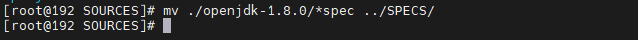

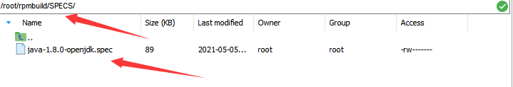

将余下的jdk文件中的其他文件移动至SOURCE文件夹下`mv ./openjdk-1.8.0/* ./`

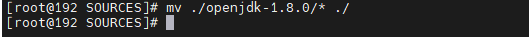

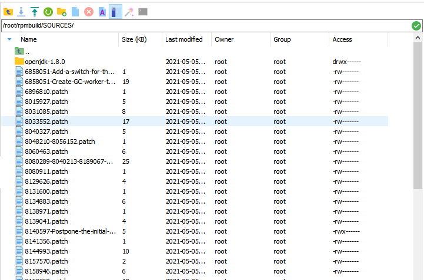

#### jdk8安装及配置

可通过`yum list | grep openjdk`查看openEuler附带的yum源内可安装的jdk版本，并进行安装，若没有所需jdk，则需要另行安装或者更新yum源


安装命令：`yum install java-1.8.0-openjdk.x86_64`

检查jdk是否安装成功`java -version`

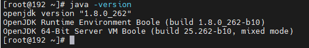

Openjdk各个yum源所提供的版本如下：

https://repo.openeuler.org/openEuler-20.03-LTS/OS/x86_64/Packages/


https://repo.openeuler.org/openEuler-20.03-LTS/everything/x86_64/Packages/


https://repo.openeuler.org/openEuler-21.03/everything/x86_64/Packages/


#### 安装依赖

 `yum install alsa-lib-devel cups-devel elfutils-devel fontconfig-devel freetype-devel giflib-devel harfbuzz-devel lcms2-devel nss-devel`


若后续还存在其他依赖未安装，则使用`yum install package`进行安装即可

### 3、rpm包构建

进入SPECS文件夹下，按需输入对应指令即可进行构建

```
rpmbuild -bi java-1.8.0-openjdk.spec //执行到install阶段
rpmbuild -bb java-1.8.0-openjdk.spec //生成rpm二进制包
rpmbuild -bs java-1.8.0-openjdk.spec //生成rpm源码包
rpmbuild -ba java-1.8.0-openjdk.spec //生成rpm二进制包和源码包
```

完成rpm包构建


文件列表


### 4、常见报错及解决方案

#### There are no enabled repositories in "/etc/yum.repos.d"

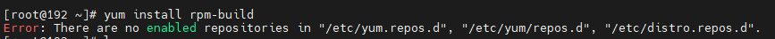

解决方法：

`cd /etc/yum.repos.d`

`vi openEuler_x86_64.repo` (若为arrch64系统则为`vi openEuler_aarch64.repo`)

添加内容：

```
#generic-repos is licensed under the Mulan PSL v2.
#You can use this software according to the terms and conditions of the Mulan PSL v2.
#You may obtain a copy of Mulan PSL v2 at:
#    http://license.coscl.org.cn/MulanPSL2
#THIS SOFTWARE IS PROVIDED ON AN "AS IS" BASIS, WITHOUT WARRANTIES OF ANY KIND, EITHER EXPRESS OR
#IMPLIED, INCLUDING BUT NOT LIMITED TO NON-INFRINGEMENT, MERCHANTABILITY OR FIT FOR A PARTICULAR
#PURPOSE.
#See the Mulan PSL v2 for more details.

[OS]
name=OS
baseurl=http://repo.openeuler.org/openEuler-20.03-LTS/OS/$basearch/
enabled=1
gpgcheck=1
gpgkey=http://repo.openeuler.org/openEuler-20.03-LTS/OS/$basearch/RPM-GPG-KEY-openEuler

[everything]
name=everything
baseurl=http://repo.openeuler.org/openEuler-20.03-LTS/everything/$basearch/
enabled=1
gpgcheck=1
gpgkey=http://repo.openeuler.org/openEuler-20.03-LTS/everything/$basearch/RPM-GPG-KEY-openEuler

[EPOL]
name=EPOL
baseurl=http://repo.openeuler.org/openEuler-20.03-LTS/EPOL/$basearch/
enabled=1
gpgcheck=1
gpgkey=http://repo.openeuler.org/openEuler-20.03-LTS/OS/$basearch/RPM-GPG-KEY-openEuler

[debuginfo]
name=debuginfo
baseurl=http://repo.openeuler.org/openEuler-20.03-LTS/debuginfo/$basearch/
enabled=1
gpgcheck=1
gpgkey=http://repo.openeuler.org/openEuler-20.03-LTS/debuginfo/$basearch/RPM-GPG-KEY-openEuler

[source]
name=source
baseurl=http://repo.openeuler.org/openEuler-20.03-LTS/source/
enabled=1
gpgcheck=1
gpgkey=http://repo.openeuler.org/openEuler-20.03-LTS/source/RPM-GPG-KEY-openEuler

[update]
name=update
baseurl=http://repo.openeuler.org/openEuler-20.03-LTS/update/$basearch/
enabled=1
gpgcheck=1
gpgkey=http://repo.openeuler.org/openEuler-20.03-LTS/OS/$basearch/RPM-GPG-KEY-openEuler
```

该yum源来自于码云，链接如下：<https://gitee.com/src-openeuler/openEuler-repos/blob/openEuler-20.03-LTS/generic.repo#>

#### Failed build dependencies: packages is needed by java-1.8.0-openjdk-1:1.8.0.282.b08-17.x86_64

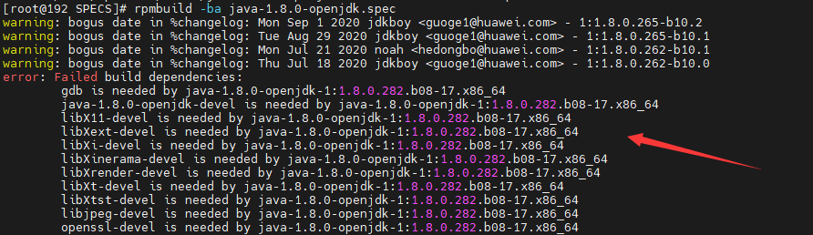

问题原因：specs文件中构建rpm包所需相应包未进行安装

解决方法：通过`yum install packages`对对应包进行安装

`yum install gdb java-1.8.0-openjdk-devel libX11-devel libXext-devel libXi-devel libXinerama-devel libXrender-devel libXt-devel libXtst-devel libjpeg-devel openssl-devel`


#### error:java-8-openjdk-devel is is needed by xxx

报错原因：spec文件中BuildRequires要求了openjdk-devel，当前安装的openjdk版本未满足要求

解决方法：若确定安装openjdk版本可以满足构建需求，则可将该行要求注释掉或者修改版本要求，若不确定当前版本是否满足构建需求，则可安装配置其要求的openjdk版本

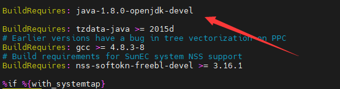

#### error:tzdate-java>=2020a is needed by xxx

报错原因：spec文件中BuildRequires要求了tzdate-java的版本，当前安装的版本未满足要求

解决办法：若确定安装tzdate-java版本可以满足构建需求，则可将该行要求注释掉或者修改版本要求，若不确定当前版本是否满足构建需求，则可安装配置其要求的版本

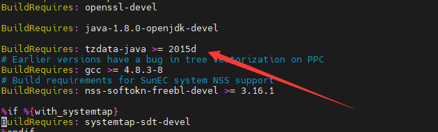

#### error：Bad exit status from /var/tmp/rpm-tem.f4PLQX(%build)

原因：jdk8已经在系统配置完成，但是下载的spec文件还未进行修改，需进入spec文件把jdk的路径修改为本地jdk-8的路径

`vim /root/rpmbuild/SPECS/java-1.8.0-openjdk.spec`
`?configure` 找到configure配置位置，将jdk的路径改为自己本地安装的jdk8的路径


### 5、其他jdk版本rpm包构建

其他jdk版本，如果jdk11、jdk15等rpm包构建仅需要在源码包处下载对应版本的jdk源码包，更换对应的url，后续的jdk路径改成相应的jdk路径即可，其他构建过程与jdk8的rpm包构建相同，如有报错等信息都可参考jdk8的rpm包的构建过程

## 二、openEuler系统树莓派rpm包构建过程解析

### 1、openEuler系统iso镜像安装

#### 安装要求

在树莓派环境上安装 openEuler 操作系统，则树莓派需要满足如下的硬件兼容性和最小硬件要求：树莓派版本3B、3B+、4B，内存：为了获得更好的应用体验，建议至少 4GB，硬盘：为了获得更好的应用体验，建议至少8GB，树莓派官网https://www.raspberrypi.org/，openEuler社区网站https://www.openeuler.org/en/download/

#### 获取安装源

获取openEuler 发布的树莓派镜像及其校验文件，登陆openEuler社区网站https://www.openeuler.org/en/download/，单击卡片 openEuler 20.03 LTS SP1 上的“download”按钮

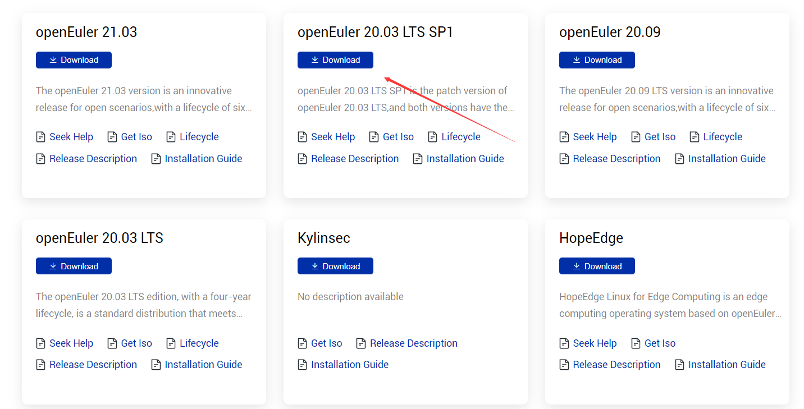

单击“raspi_img”，进入树莓派镜像的下载列表


单击“openEuler-20.03-LTS-SP1-raspi-aarch64.img.xz”，将 openEuler 发布的树莓派镜像下载到本地

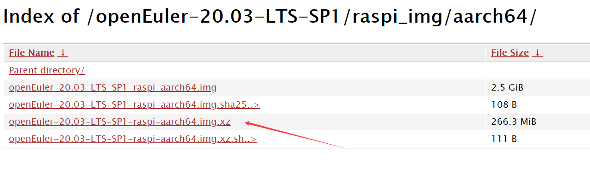

#### 格式化SD卡

下载并安装格式化SD卡工具，以下操作以DiskGenius磁盘格式化工具为例

选中需要格式化的SD卡的对应盘符，删除内容并保存

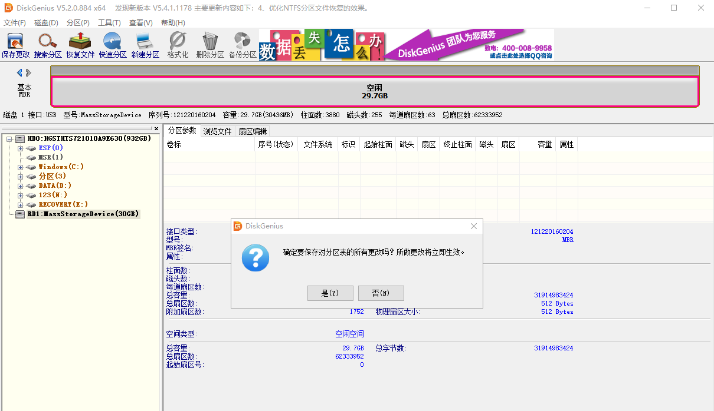

选中刚刚删除内容并保存的磁盘，建立新分区，文件系统类型选择FAT32,并保存格式化


格式化后的磁盘如图所示

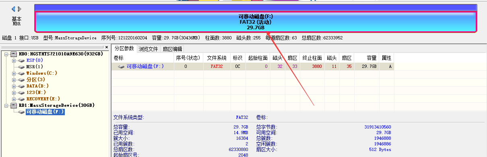

#### 镜像文件写入SD卡

下载并安装刷写镜像的工具，以下操作以 Win32 Disk Imager 工具为例

镜像文件选择镜像文件下载路径下的openEuler-20.03-LTS-SP1-raspi-aarch64.img，设备选择SD卡的盘符后点击写入即可


说明：镜像文件写入后，会显示SD卡的磁盘容量减少，原因为Windows下认不出ext文件系统，为正常现象

#### 启动系统

将写入镜像后的 SD 卡插入树莓派，通电启用

#### 登陆系统

登录树莓派有以下两种方式：本地登陆和ssh远程登陆

本地登陆：树莓派连接显示器、键盘、鼠标后，启动树莓派，可以看到树莓派启动日志输出到显示器上。待树莓派启动成功，输入用户名（root）和密码（openeuler）登录

ssh远程登陆：如果树莓派连接已知路由器，可登录路由器查看，新增的 IP 即为树莓派 IP，或者通过IP扫描工具来将树莓派IP进行扫描获取，这里以advanced_ip_scanner为例

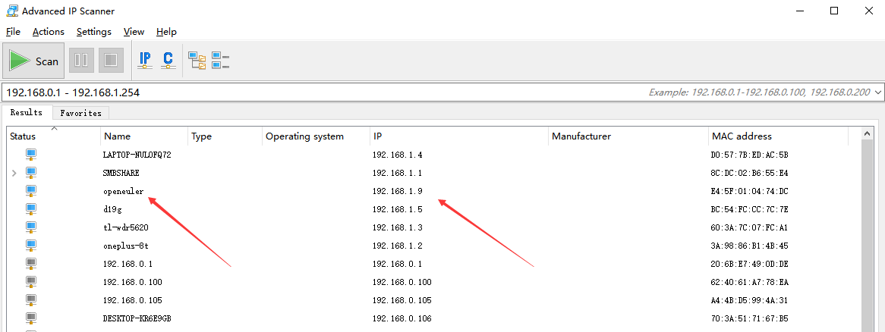

例如，树莓派对应 IP 为：192.168.1.9，则可以使用远程网络工具MobaXterm进行访问，MobaXterm专注于一个简单的目标：提供一个直观的用户界面，可以通过不同的网络或系统有效地访问远程服务器

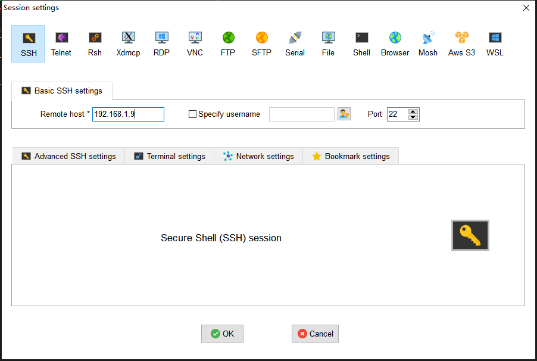

远程访问成功，输入用户名（root）和密码（openeuler）登录，通过MobaXterm远程网络访问工具访问树莓派openEuler系统界面如下


### 2、树莓派openEuler安装yum

进入系统，进行yum进行包及依赖安装，会提示`-bash：yum：command not found`


需要自动手动安装下载`yum-4.2.23-3.oe1.noarch.rpm`并上传

URL:https://repo.openeuler.org/openEuler-20.03-LTS-SP1/everything/aarch64/Packages/yum-4.2.23-3.oe1.noarch.rpm，在同目录下执行`rpm -ivh --force --nodeps yum-4.2.23-3.oe1.noarch.rpm`


### 3、安装依赖及源文件下载

#### rpm构建工具包安装

`yum install rpm-build rpm-devel rpmdevtools`


#### 生成rpmbuild目录及相关子目录

进入个人文件夹下执行`rpmdev-setuptree`自动生成rpmbuild目录及相关子目录

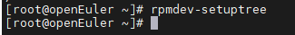

生成的rpmbuild目录及相关子目录如下图，BUILD目录：构建软件包时，`%buildroot`将在此处创建各种目录。如果日志输出未提供足够的信息，这对于调查失败的构建很有用，RPMS目录：在不同体系结构的子目录中创建二进制RPM，例如在子目录`x86_64`和中`noarch`，SOURCES:在这里放置压缩的源代码存档和补丁,该`rpmbuild`命令在此处查找，SPECS:存放SPECS文件，SRPMS:当`rpmbuild`用于构建SRPM而不是二进制RPM时，将在此处创建结果SRPM


#### 源码包及spec文件准备

在/rpmbuild/SOURCES/文件夹下,进行需要构建rpm包的jdkSource文件下载`git clone https://gitee.com/src-openeuler/openjdk-1.8.0.git `  （若要构建其他版本jdk,则更换url即可）,该openjdk的url:https://gitee.com/src-openeuler/openjdk-1.8.0


将下载的jdk文件中的.spec文件移动到SPECS目录下`mv ./openjdk-1.8.0/*spec ../SPECS/`


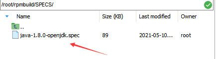

将余下的jdk文件中的其他文件移动至SOURCE文件夹下`mv ./openjdk-1.8.0/* ./`


#### jdk8安装及配置

可通过`yum list | grep openjdk`查看openEuler附带的yum源内可安装的jdk版本，并进行安装，若没有所需jdk，则需要另行安装或者更新yum源

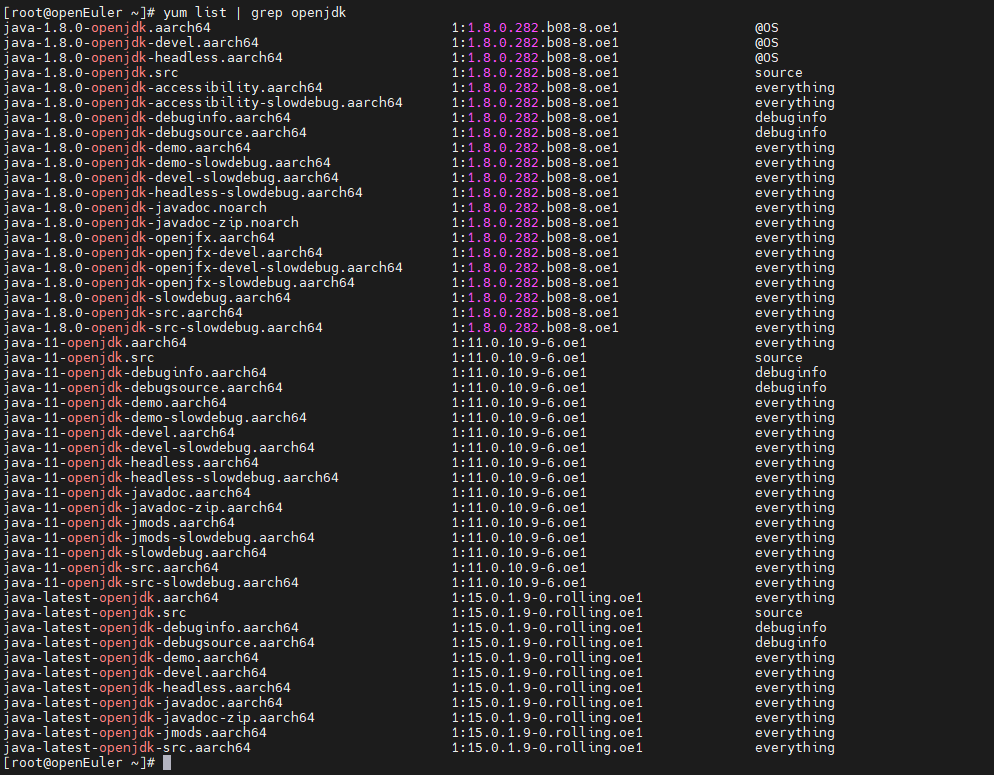

安装命令：`yum install java-1.8.0-openjdk.aarch64`

检查jdk是否安装成功`java -version`

#### 安装依赖

`yum install alsa-lib-devel cups-devel elfutils-devel fontconfig-devel freetype-devel giflib-devel harfbuzz-devel lcms2-devel`


若后续还存在其他依赖未安装，则使用`yum install package`进行安装即可

### 4、rpm包构建

进入SPECS文件夹下，按需输入对应指令即可进行构建

`rpmbuild -bi java-1.8.0-openjdk.spec `执行到install阶段
`rpmbuild -bb java-1.8.0-openjdk.spec`生成rpm二进制包
`rpmbuild -bs java-1.8.0-openjdk.spec `生成rpm源码包
`rpmbuild -ba java-1.8.0-openjdk.spec `生成rpm二进制包和源码包

完成rpm包构建图如下

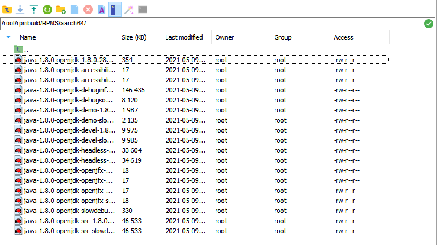

文件列表如下：


### 5、常见问题及解决方案

#### 树莓派无法使用远程连接：

SSH连接，需要确认的是：①树莓派有没有连接网络、②使用软件时，填写的IP、用户名和密码是否正确、③有没有打开SSH，若确认已经连接到网络并且ip用户名和密码都正确，依旧无法正确使用远程连接，则为SSH未开启

解决方案：外界显示器情况下，可连接到系统显示界面情况下：检查安装系统时是否已经安装SSH服务端软件包`rpm -qa|grep openssh`若显示结果中包含`openssh-server-`,则说明已经安装,直接启动sshd服务就可以了`service iptables start`


未外界显示器，无法连接到系统显示界面：SD卡内，新建ssh文件（无后缀）,即可开启远程访问

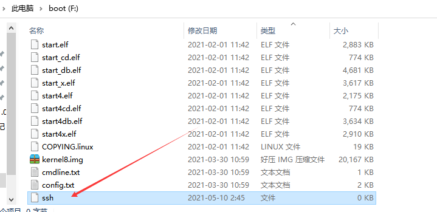

#### -bash：yum：command not found

使用yum指令，会提示`-bash：yum：command not found`

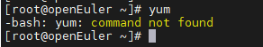

需要自动手动安装下载`yum-4.2.23-3.oe1.noarch.rpm`并上传

URL:https://repo.openeuler.org/openEuler-20.03-LTS-SP1/everything/aarch64/Packages/yum-4.2.23-3.oe1.noarch.rpm，在同目录下执行`rpm -ivh --force --nodeps yum-4.2.23-3.oe1.noarch.rpm`

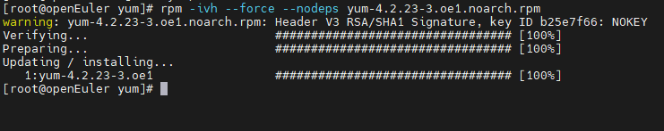

#### Failed build dependencies: xxx is needed by java-1.8.0-openjdk-1:1.8.0.282.b08-17.aarch64

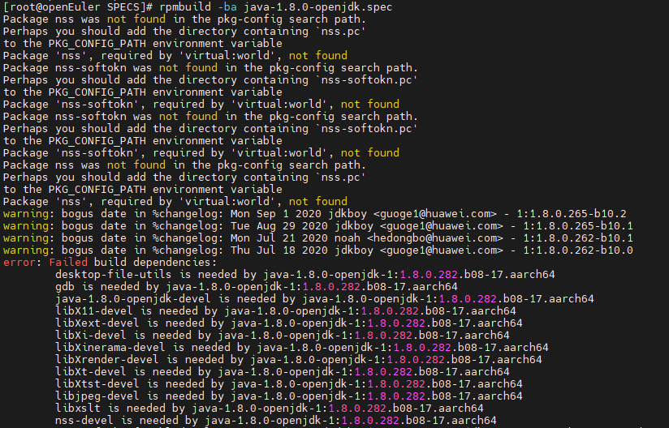

问题原因：specs文件中构建rpm包所需相应包未进行安装

解决方法：通过`yum install xxx`对对应包进行安装

`yum install gdb java-1.8.0-openjdk-devel libX11-devel libXext-devel libXi-devel libXinerama-devel libXrender-devel libXt-devel libXtst-devel libjpeg-devel openssl-devel`

#### error:java-8-openjdk-devel is needed by xxx

报错原因：spec文件中BuildRequires要求了openjdk-devel，当前安装的openjdk版本未满足要求

解决方法：若确定安装openjdk版本可以满足构建需求，则可将该行要求注释掉或者修改版本要求，若不确定当前版本是否满足构建需求，则可安装配置其要求的openjdk版本


#### error：Bad exit status from /var/tmp/rpm-tem.f4PLQX(%build)

原因：jdk8已经在系统配置完成，但是下载的.spec文件还未进行修改，需进入.spec文件把jdk的路径修改为本地jdk-8的路径

`vim /root/rpmbuild/SPECS/java-1.8.0-openjdk.spec`
`?configure` 找到configure配置位置，将jdk的路径改为自己本地安装的jdk8的路径


### 5、其他jdk版本rpm包构建

其他jdk版本，如果jdk11、jdk15等rpm包构建仅需要在源码包处下载对应版本的jdk源码包，更换对应的url，后续的jdk路径改成相应的jdk路径即可，其他构建过程与jdk8的rpm包构建相同，如有报错等信息都可参考jdk8的rpm包的构建过程

## References

How to create an RPM package:https://fedoraproject.org/wiki/How_to_create_an_RPM_package/zh-cn#.25files_.E9.83.A8.E5.88.86

RPM Packaging Guide:https://rpm-packaging-guide.github.io/

bishengJDK 8 user guide:https://gitee.com/openeuler/bishengjdk-8/wikis/Home?sort_id=2879418

Raspberry pi:https://www.raspberrypi.org/
