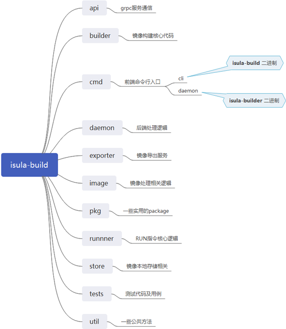
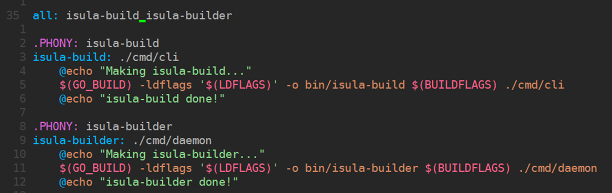
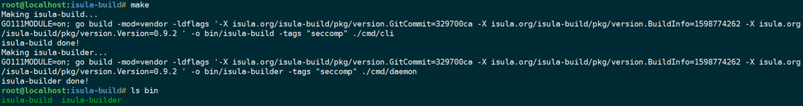
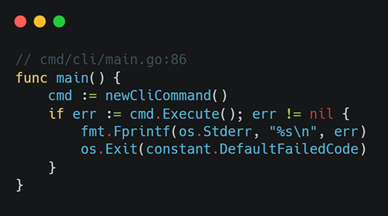
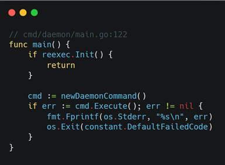
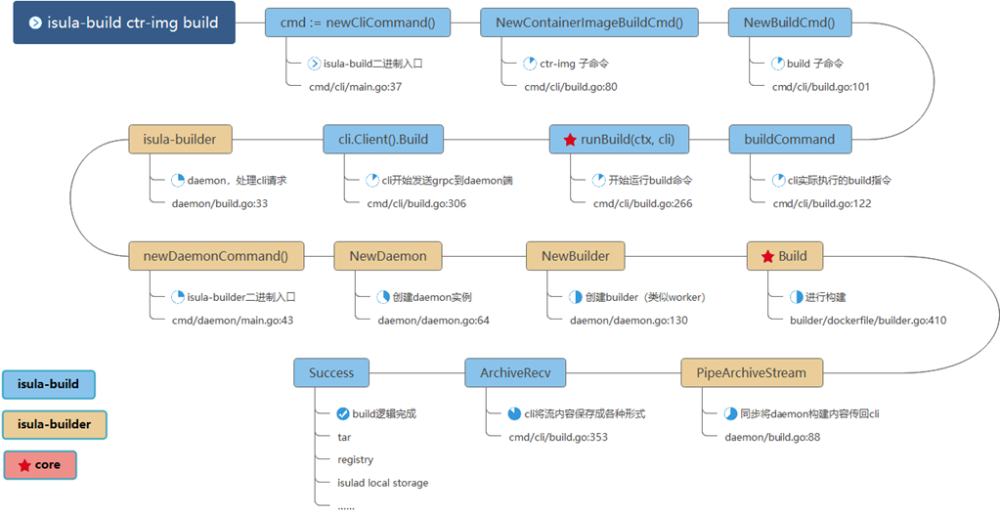
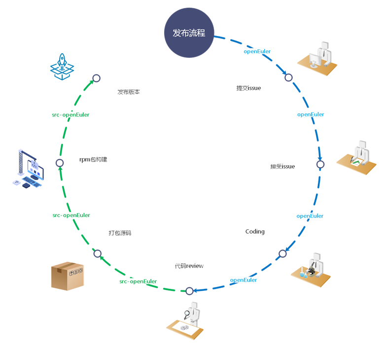

在观看了前几期[容器镜像构建工具的使用和介绍](https://www.bilibili.com/video/BV1Gp4y1i7Rs)之后，你或许想去研究下这个工具的内部逻辑，或者想去给这个初生的小工具提一些建议或者改进，那么，你需要一个快速入手`isula-build`开源项目的方法，本期文章就来带你一起走进`isula-build`容器镜像构建工具的内部([视频链接](https://www.bilibili.com/video/BV1Ca4y177te))。话不多说，一起来看看吧。

## isula-build代码剖析

本期文章目标

1. 介绍isula-build是什么

2. 深入代码，搞懂你敲下的指令在做什么

3. 社区发布流程、如何参与isula-build社区

### isula-build 是什么

说起isula-build，就不得不提及`iSulad`


`iSulad`是华为自主研发的通用容器引擎，旨在统一的架构设计来满足 CT 和 IT 领域的不同需求。相比 Golang 编写的 Docker，轻量级容器具有**轻、灵、巧、快**的特点，不受硬件规格和架构的限制，底噪开销更小，可应用领域更为广泛。目前**已开源**（开源地址：https://gitee.com/openeuler/iSulad）。

作为`iSulad`生态的一员，`isula-build` 承载了镜像构建、管理、分发等功能。

### isula-build 能做什么

- 安全快速构建容器镜像、管理镜像
- 与isulad、docker均可快速集成，部署方便
- 镜像管理增删改查功能，麻雀虽小五脏俱全
- 构成容器全栈解决方案

### isula-build 架构全景图

`isula-build`采用经典的 C-S 架构，分为客户端`isula-build`和服务端`isula-builder`，客户端和服务端使用`GRPC`通信。用户可通过`isula-build`命令行与服务端`isula-builder`进行交互，发起镜像构建、镜像管理等请求。


### isula-build 代码全景图

isula-build使用`golang`作为开发语言，目前自研代码行数超过2w+

```bash
--------------------------------------------------------------------------------
Language                      files          blank        comment           code
--------------------------------------------------------------------------------
Go                              134           3293           2676          25038
Markdown                          9            486              0           1098
Bourne Shell                     15             95            225            499
XML                               9              0              0            419
Protocol Buffers                  2             41             97            193
make                              1             18              1             89
Dockerfile                        6             14              0             68
Bourne Again Shell                1              8              4             31
TOML                              3             37            255             15
JSON                              1              0              0              8
--------------------------------------------------------------------------------
SUM:                            181           3992           3258          27458
--------------------------------------------------------------------------------
```

进入isula-build项目，我们可以看到有一系列文件夹，分别承载了不同的功能和设计


下图为一些文件夹的主要功能概述



看到这里你可能已经懵逼了，如何快速的了解代码呢？

### isula-build 代码解析 --- 编译

首先在我看来，如何最快了解一个项目的最快方法就是不要一开始就钻进代码里，而是先去`编译和运行`这个软件，然后通过将外在表象和内在逻辑一一对应的方法，来熟悉整个项目。

那么，如何运行isula-build？如果我们没有安装rpm包，那么就需要我们去手动编译二进制了，那目标就是找到`Makefile`，在其中查找蛛丝马迹。

我们看到了项目里有Makefile，那么里面肯定写了如何编译这个项目。我们打开文件，找到isula-build和isula-builder这两个二进制是在哪里编译的，就能找到代码最开始的地方，也就是我们即将进入的程序入口。



那么，我们尝试着去编译一下，看看会发生什么



我们发现，在isula-build/bin目录下，生成了两个二进制，那这两个二进制就是我们的成品啦，试着去运行下吧~

### isula-build 代码解析 --- 命令行入口

学过go语言的朋友都知道，每个二进制都是由`main.go`文件生成的，那么我们根据之前的isula-build代码全景图可以知道，`isula-build`的入口就在`cmd/cli/main.go`里面，而`isula-builder`的入口也就在对应的`cmd/daemon/main.go`里面啦。



试着敲敲`isula-build -h`和`isula-builder -h`帮助信息，看看都有什么吧！


### isula-build 代码解析 --- 外在表现和内部逻辑

那么，知道了程序入口，我们就好比拿到了开启宝藏的钥匙，那么，我们就以一条`构建容器镜像并将其保存为本地tar包`的命令来讲述代码的流程：

> 例子：isula-build ctr-img build –f Dockerfile –o docker-archive:busybox.tar:busybox:latest .




限于篇幅，上图为大家准备了小抄，可以方便快速的找到整个构建流程的每一处关键点位，大家可以参考上图的`S`形，按图索骥，找到对应的代码，并加以扩展

> 考考你：到目前为止，isula-build 有多少个二级子命令？

### isula-build 社区开发

那么，在熟悉了isula-build代码框架之后，你是否已经跃跃欲试，想给我们的小工具提点建议或者改进的方向。那么，如何参与到开源社区的开发中呢？

首先不得不说下我们代码开发和发布的流程



上图概述了开发的整个流程。

如图所示，首先作为用户或者开发者的你会拿到我们发布的isula-build `rpm`包或者源码。在你的使用过程中，你会有一些问题不明白或者你想参与改进，你就需要去我们的[源码仓](https://gitee.com/openeuler/isula-build) `提交issue`。

那比如我发现，哦哟，小伙子不错哦，还真是个好的改进点，办它！那你的issue就进入了`issue accepted `阶段。我们会根据问题的紧急、难易程度等要素进行排期。

接下来，有热心群众就会去认领该issue并开始码代码，也就进入了`coding`阶段。本地代码写完之后，功能也测试完毕，你兴奋的点击了提交按钮。那么你的提交就会来到了代码仓的pull request中。这里存放着大家的奇思妙想~

那是不是就意味着你的代码可以直接合入了呢？当然不能啦！所有人提交的代码要经过严格的审核，这里包括大佬们（maintainer)肉眼的review和机器人（ci bot）无情的自动化用例检查，确保每一次合入都是OK的~ 经过了一系列的审查，大家都觉得你提交的代码又短小又精悍（#手动狗头），那么你的代码进可以合入`源码仓`啦。至此，所有在源码仓中的活动也就告一段落了。

你以为这就完了？你写的代码是如何变成一个rpm包让你使用简单的`yum install isula-build`就能装在你的电脑中并运行的呢？这里就涉及到我们的另一个仓库，[制品仓](https://gitee.com/src-openeuler/isula-build)。

制品仓中的isula-build代码会以tar包的形式存在，也就是`源码打包`，并伴随有相应的spec文件，进行`rpm 包构建`，最终集成到我们openEuler的`发布件`中一起发布。当然，你也可以单独获取我们的[rpm包](https://build.openeuler.org/package/show/openEuler:Mainline/isula-build)

到这里，我们整体的isula-build代码架构和流程剖析就告一段落了，接下来，我们唯一需要的，就是屏幕前观看文章的你，加入我们，一起收获更多！


> isula-build 源码仓：https://gitee.com/openeuler/isula-build
>
> isula-build 制品仓：https://gitee.com/src-openeuler/isula-build
>
> isula-build obs地址：https://build.openeuler.org/package/show/openEuler:Mainline/isula-build


