# 云原生网络数据面加速方案浅析

## 背景

云原生网络数据面性能直接决定整个系统的吞吐量、服务响应时间等关键性能指标。数据面提速是系统提速的重要手段。

云原生网络包括CNI、ServiceMesh、Ingress、数据中心网络，其中大部分都是虚拟网络，除数据中心网络以外。数据面提速聚焦在这些虚拟网络内。


## 总体概要

CNI：PoD内通信路径、PoD间通信路径（Nod内）、网络策略、访问Service路径、PoD通信后端（Node间通信）

ServiceMesh：Side-car通信路径

Ingress：Ingress加速

### PoD内通信加速

PoD内主要数据路径集中在内核协议栈，内核协议栈本身一直在研究并持续的性能优化，但是其性能还是远不如DPDK、AF_XDP这类用户态协议栈。

#### 提速方案

PoD内引入数据多平面，当PoD内存在Legacy/IO intensive APP并存时，后者可以走高性能数据面，提速的同时可以避免对其他APP的影响。

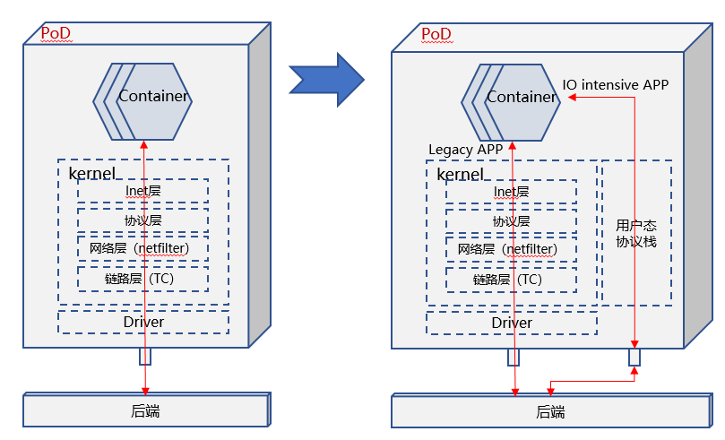

#### 小结

方案名称：**用户态CNI**（openEuler高性能网络sig已经在设计/开发这款软件：**Gazelle CNI**）

用户态CNI可以基于DPDK、AF_XDP两种技术实现，两种技术各有优劣，互补关系，所以需要考虑同时支持DPDK、AF_XDP两种技术。

在控制面/数据面分离、Legacy/IO intensive APP并存、多租户隔离等场景，用户态CNI存在应用价值。

### PoD间通信加速

PoD间的通信通常取决于容器网络模型，网络模型通常有：Bridge（缺省模式）、Host、Container、None。参见下图：

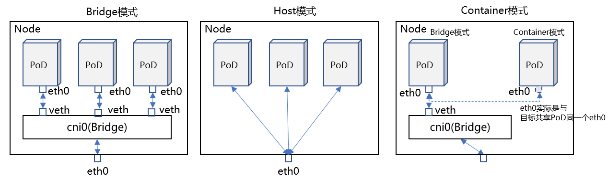


Bridge模式：给每个PoD启动一个eth0，通过veth pair将其接入一个Bridge（缺省命名cni0），然后与Node eth0通信。

Host模式：直接与Node共享Namespace，所以PoD能够看到Node上的eth0（当然也包括其他接口）。

Container模式：与其他容器共享Namespace，这样目标容器的接口就能够被其识别并使用。

None模式：没有接口。（没有不代表真的就没有，实际就是给开发者留了自定义空间，无代表有，少即是多）

这里我们重点分析Bridge、None两种模式（其他两种没有分析价值）。None模式中，常见的自定义模式中，经常用Router来解决通信问题。所以我们分析Bridge、Router两者数据路径的加速。

#### 提速方案

缺省情况下，Bridge/Router分别位于内核协议栈链路层、IP层，数据路径经过内核协议栈处理后，才能到达目的PoD。

提速方案是使用XDP over veth，在XDP Prog中通过help函数查询内核FIB信息，完成类似Bridge、Router

的转发动作，但是整个转发路径无需进入内核协议栈，只需在Driver层处理完成。

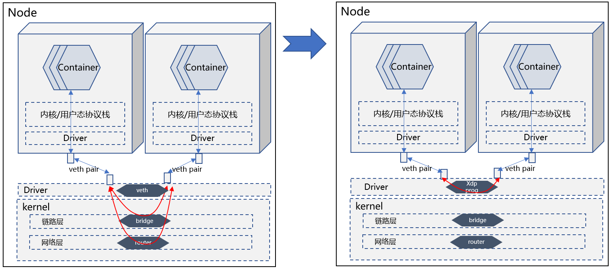

#### 小结

方案名称：**VNF powered by XDP**

这个场景里面的VNF是Bridge, Router。这种方案与应用场景不耦合，所以很容易复制应用到其他场景，适合基础软件供应商提供。

### Node间通信加速

由于我们聚焦虚拟网络的加速，所以Node特指VM。

VM间通信主流方案有Open vSwitch，VMware virtual switch，Cisco Nexus 1000V，huawei 1800v，huawei evs等。其中大部分采用了DPDK技术提速。


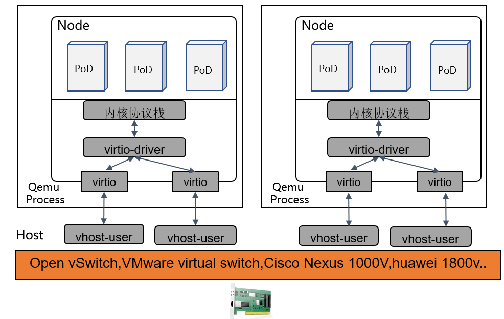

#### 提速方案

从性能角度看，现有成熟方案已经是性能最优方案。但是如果从硬件可获得角度看，可以改用AF_XDP代替DPDK，性能上略有差距，但可以弥补硬件不可获得的缺陷。

可以参考：https://events19.linuxfoundation.cn/wp-content/uploads/2017/11/Accelerating-VM-Networking-through-XDP_Jason-Wang.pdf

#### 小结

方案名称：**VNF powered by DPDK**

裸机上针对VM间通信加速，DPDK基本处于垄断地位，留给AF_XDP的空间很小，针对这种场景的性能改进工作，想象空间很小。


### K8S网络策略加速

K8S缺省定义了一些网络策略spec（各种CNI插件方案会重定义自己的网络策略spec），从下面示例可以看出网络策略定义能力非常灵活，可以针对IP/Port、Namespace、Pod等几种维度定义，可以单一使用，也可以混合使用。

```
apiVersion: networking.k8s.io/v1
kind: NetworkPolicy
metadata:
  name: test-network-policy
  namespace: default
spec:
  podSelector:
    matchLabels:
      role: db
  policyTypes:
  - Ingress
  - Egress
  ingress:
  - from:
    - ipBlock:  #  基于网络地址定义网络策略
        cidr: 172.17.0.0/16
        except:
        - 172.17.1.0/24
    - namespaceSelector:  #  基于namespace定义网络策略
        matchLabels:
          project: myproject
    - podSelector:   #  基于PoD标签定义网络策略
        matchLabels:
          role: frontend
    ports:
    - protocol: TCP
      port: 6379
  egress:
  - to:
    - ipBlock:
        cidr: 10.0.0.0/24
    ports:
    - protocol: TCP
      port: 5978
```

 这些网络策略定义后，控制面会转换成linux iptables规则下发至linux网络数据面实现网络访问控制。

```
#控制面会通过侦听环境运行状态，填入合适的网络地址信息
iptables -A INPUT -s X.X.X.X -d X.X.X.X -j ACCEPT
iptables -A INPUT -s X.X.X.X -d X.X.X.X -j ACCEPT 
…
iptables -A OUTPUT -s X.X.X.X -d X.X.X.X -j ACCEPT
iptables -A OUTPUT -s X.X.X.X -d X.X.X.X -j ACCEPT
….
```

数据面执行iptables规则时：

1. Iptables基于网络位置标识进行访问控制。
2. 网络位置标识随PoD生命周期变化而变化，处于不稳定状态，网络访问规则总是在刷新。
3. 网络位置与PoD数量（集群规模）成正比增长，且是非线性增长，网络访问规则剧增。
4. Iptables固有缺陷：

- 时延性能低：iptables线性匹配规则，随着集群规模扩大，规则数量剧增，匹配的时间复杂度是O(N)。
- 扩展性差：无法增量更新规则，由于规则数量庞大，更新提交时，内核会执行kernel lock，这个过程只能等待。
- 可用性差：服务扩缩容时，iptables规则刷新会导致协议链接断开，服务不可用。

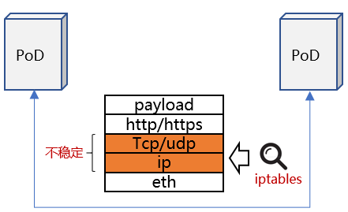

#### 提速方案1

数据面、控制面视角存在差异，前者视角是从网络地址（IP/Port）执行访问策略，后者是从K8S Deployment信息定义访问策略，期间的Gap就是导致性能劣化的原因。

如果将K8S Deployment翻译成一个集群唯一的identify，将其加入网络负载中，数据面基于identify进行访问控制，统一两者的视角。

具体方案如下：

1. 使用eBPF自定义网络策略控制逻辑，基于K8S deployment（映射成集群唯一identify）访问控制。
2. K8S deployment不会随PoD生命周期变化而变化。
3. K8S deployment属于业务视角抽象信息相比较IP/Port这类物理位置信息，能够起到聚合效果，有效降低规则数量。
4. eBPF控制更灵活，执行性能优于iptables。

```
#举例说明聚合效果
#K8S定义访问控制策略如下
Ingress：
  from：
     podSelector:
        matchLabels:
          role: frontend
#上述策略如果翻译成iptables这类基于网络地址进行访问控制的规则可能存在数十条（取决于后端PoD实例数量）
#翻译成基于identify访问控制策略只有2条
#1 allow pod-label=frontend
#2 deny all
```

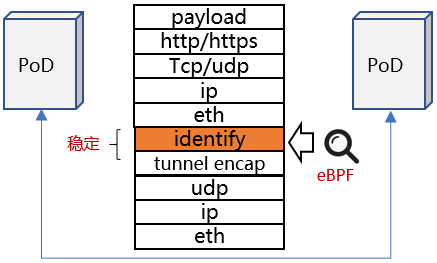

#### 提速方案2

方案1性能固然比较好，但是其依赖CNI ISV完全重新设计CNI解决方案，并且由于增加了隧道封装，降低了传输效率。从方案适用性角度看，方案1并不被看好，这也是众多CNI解决方案里面，只有cilium采用此方案。

大部分CNI解决方案是改进数据面后端，用eBPF技术重新打造iptables。

例如：

- Calico cni 插件式管理数据面，可以支持多种数据面组件，包括eBPF打造的高性能数据面。（参考：https://docs.projectcalico.org/about/about-calico）
- 兼容iptables前端，eBPF技术重新实现iptables后端。（参考：https://github.com/mbertrone/bpf-iptables）

#### 小结

方案1名称：**Network Policy base by K8S identify**

方案2名称：**iptables power by eBPF**

- 方案1更适合CNI ISV厂商，从整体出发，将管理面、数据面充分融合在一起。
- 方案2更适合基础软件供应商，比如兼容iptables前端，替换后端实现。


### 服务网格加速

服务网格（比如常见的istio）在云原生系统中应用比较普遍，它为集群管理带来服务治理能力。


istio会在每个PoD内部署一个Proxy组件（通常称其为side-car），该组件会接管PoD所有对外通信请求，同时为PoD带来L7层负载分担、API流量可视、拓扑管理等能力。但是所有数据流量都会经过Proxy处理，无意将数据路径加长，如下图所示：

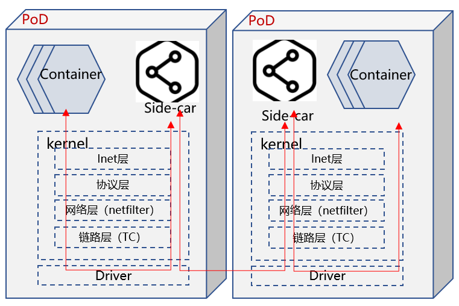

#### 提速方案

通过eBPF实现socket map方案，将PoD 内Container 与 side-car之间TCP链接的一对socket进行映射，两个socket收发数据时，eBPF提前将数据丢到另一个socket内，并唤醒其所属线程，避免其进入完整的内核协议栈。

如下图所示：

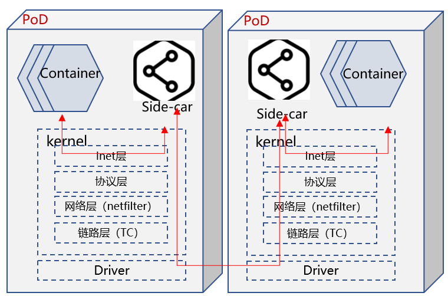

#### 小结

方案名称：**SocketMap**

SocketMap加速方案除了应用在ServiceMesh场景，也可以快速复制到其他场景，比如相同Namespace APP之间的通信加速。这种提速方案容易被复制到其他应用场景，所以适合基础软件供应商提供。

### 访问Service加速

背景： Kubernetes为了提升可用性，提出service的概念，将应用程序提供的服务抽象成一个endpoint，并为其分配IP/Port，而该service则由多个backend实例提供服务，通过这种服务、程序实例分离，并程序多实例部署的方式，实现服务的高可用性。

集群内访问Service时，需要根据实际的Backend实例进行地址转换，将请求LB到具体的PoD实例内。这个过程时由kubernetes组件kube-proxy控制，它会监听Service/Backend的匹配关系，并将其形成LB数据信息写入数据面。现有kube-proxy支持两种数据面：iptables、ipvs。后者性能优于前者。

举例Service之间互访数据流：

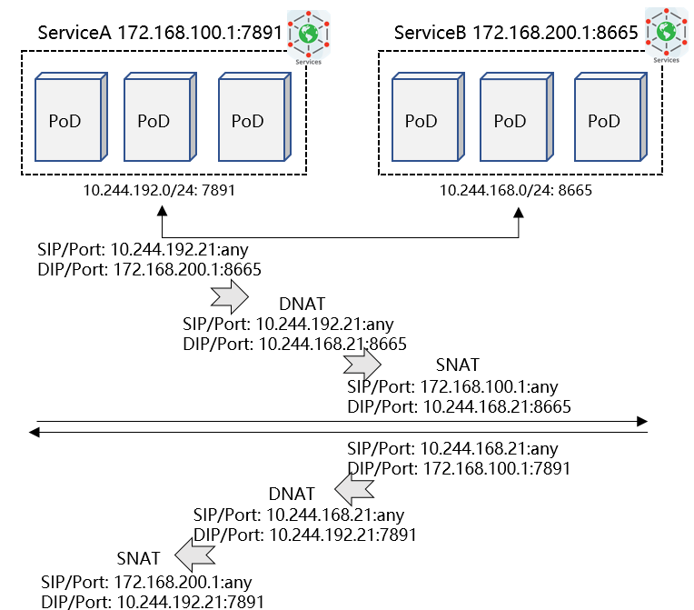


iptables存在诸多限制（参考前面章节介绍），ipvs相对而言性能更优，请参考如下性能测试数据：

- [ ] **时延性能比较**

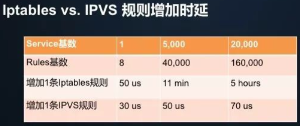

- 增加 Iptables 规则的时延，随着规则数的增加呈“指数”级上升；
- 当集群中的 Service 达到 2 万个时，新增规则的时延从 50us 变成了 5 小时；
- 而增加 IPVS 规则的时延始终保持在 100us 以内，几乎不受规则基数影响。

- [ ] **带宽性能比较**

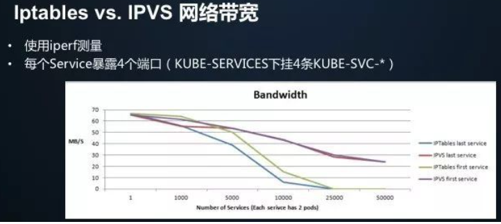

- iptables模式下，随着service数量增加，first/last service的带宽直线下降，在25000个service时，基本已经不可用。
- ipvs模式下，随着service数量增加，first/last service的带宽略有下降，并且first/last service之间的带宽差别不大。

- [ ] **CPU usage比较**

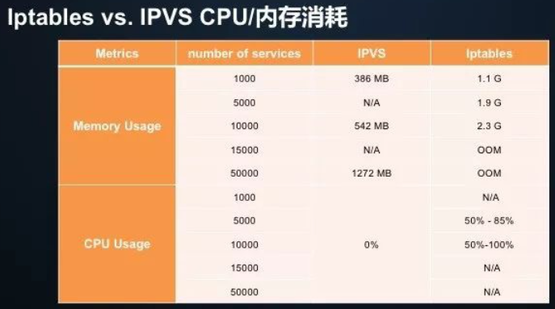

很明显，IPVS 在 CPU/内存两个维度的指标都要远远低于 Iptables。

备注：以上数据来源 https://zhuanlan.zhihu.com/p/37230013


#### 提速方案1

目前kube-proxy仍然将iptables设置为缺省模式，isula平台可以在安装阶段将kube-proxy设置为ipvs模式。


#### 提速方案2

ipvs性能明显好于iptables，但是kube-proxy仍然默认采用iptables，背后的原因是什么？

一方面存在兼容性问题，另一方面是ipvs在数据路径中的处理阶段与iptables不同，在有些场景下如果两者并存可能会存在一些兼容性问题。

所以有些CNI ISV厂商（比如 cilium）干脆替换kube-proxy组件，CNI软件采取eBPF技术实现Service寻址Backend的过程（暂定命名为：LB power by eBPF）。

但是这种方案适合个别CNI，对于大部分CNI而言不具备这种能力，为了让LB power by eBPF覆盖场景更广，可以沿用iptables power by eBPF的技术思路。

#### 小结

方案1名称：**ipvs**

方案2名称：**iptables power by eBPF**

- 提速方案1应该慎重采纳，兼容性问题并不容易发现及解决。
- 提速方案2中 eBPF改造iptables的方案更适合基础软件供应商。


### Ingress加速

背景： Kubernetes cluster有时需要向集群外暴露service，一般有三种方案，具体如下：

1. NodePort方案：在K8S节点上开放一个特定端口，该端口对外暴露，所以该端口流量都被转发到特定Service。（缺点：1）每个Service占用一个端口；2）如果Node IP发生变更直接影响入口流量）
2. LoadBalancer方案：集群外部署一个LB节点，该LB地址需要暴露出去，基于L4层完成流量转发，直接将流量转发到Service Backend实例上。（缺点：每类Service均需要在internet上暴露一个独立LB IP，并支付费用）
3. Ingress方案：集群内部署一个ingress节点，ingress基于L7层负载分担，并由ingress controller兼容集群内service的变化，实时更新ingress规则。由于其采用L7层解析分担方式，所以其可以一个ingress节点支持负载分担多种Service。


#### 提速方案

ingress是主流方案，ingress可以采用多种ingress软件，包括HA Proxy、Nginx等。其中Nginx是最常见的ingress方案。

openEuler已经完成针对nginx的性能优化，在一些场景优化超过50%。（详细优化方案可以参考《Innovation Drivers the Feature of openEuler》）

#### 小结

方案名称：nginx性能优化

## 总结

我们总结下各场景的性能优化方案以及适合提供这类技术方案的软件厂商。

| 场景            | 加速方案                            | 适合的软件供应商 | 关键技术 |
| --------------- | ----------------------------------- | ---------------- | -------- |
| PoD内通信加速   | 用户态CNI                           | OS及基础软件     | AF_XDP   |
| PoD间通信加速   | VNF powered by XDP                  | OS及基础软件     | XDP      |
| Node间通信加速  | VNF powered by DPDK                 | ISV              | DPDK     |
| K8S网络策略加速 | Network Policy base by K8S identify | ISV              | CNI      |
|                 | iptables power by eBPF              | OS及基础软件     | eBPF     |
| 服务网格加速    | SocketMap                           | OS及基础软件     | eBPF     |
| Service访问加速 | ipvs                                | 不推荐该方案     |          |
|                 | iptables power by eBPF              | OS及基础软件     | eBPF     |
| Ingress加速     | nginx性能优化                       | OS及基础软件     | nginx    |
