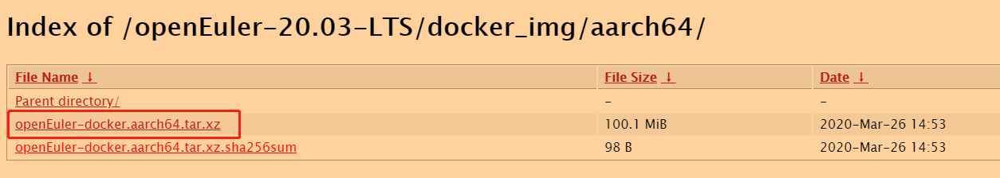
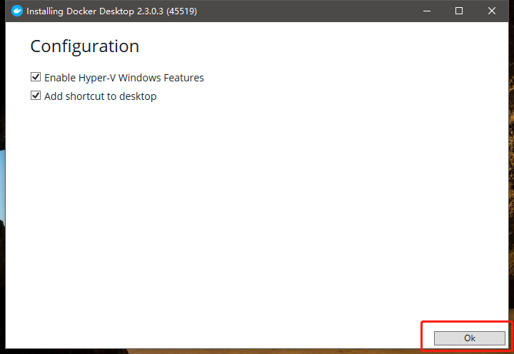
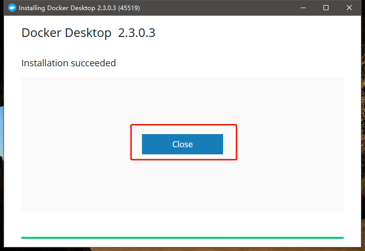
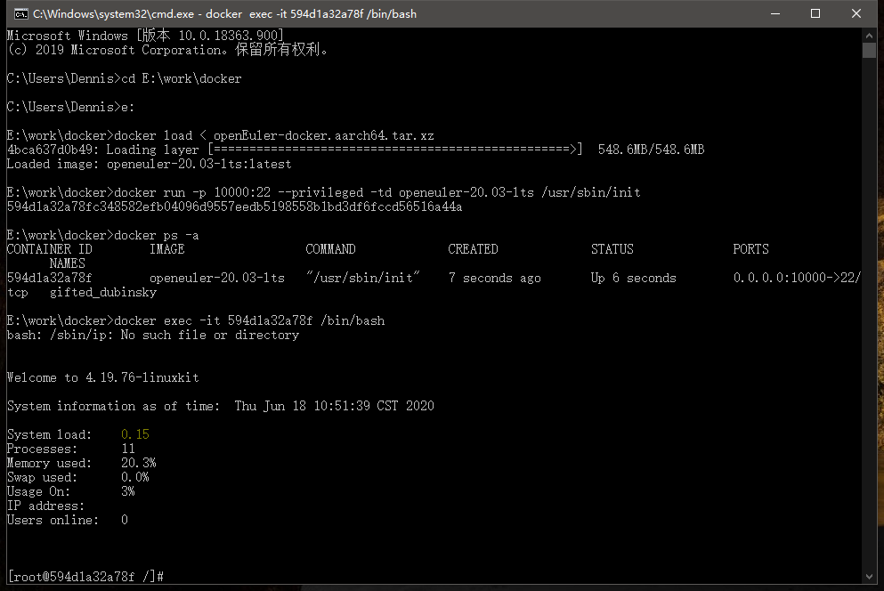
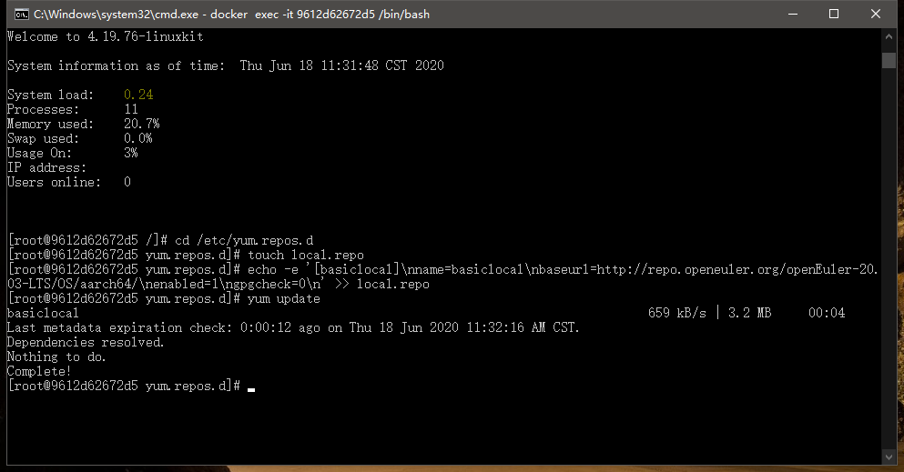

### 【背景】
很多小伙伴基本上都是在使用windows，windows下面跑linux有很多方法，下面就来介绍其中一种——使用容器Docker

### 【环境准备】

- Windows10 64位
- Docker Desktop Installer
- openEuler开源社区下载：[openEuler-docker.aarch64.tar.xz](https://repo.openeuler.org/openEuler-20.03-LTS/docker_img/aarch64/)  （aarch64）



### 【安装步骤】

##### 一、下载安装Docker

在[Docker官网](https://www.docker.com/get-started) 选择Download for Windows


安装直接默认选择，点击OK;



安装成功之后，点击Close关闭;有的小伙伴可能是第一次配置Hyper-V，所以需要重启电脑;



##### 二、导入openEuler

双击打开桌面上的Docker Desktop，等待Docker图标从Docker is starting变成Docker is running


第一次打开Docker Desktop的时候，我们选择跳过教程，之后不用去管界面了


运行CMD，进入**openEuler-docker.aarch64.tar.xz**的存放目录，执行命令
```
docker load < openEuler-docker.aarch64.tar.xz
```

等待加载完毕之后，执行命令
```
docker run -p 10000:22 --privileged -td openeuler-20.03-lts /usr/sbin/init
```

容器运行起来之后，执行命令查看CONTAINER_ID
```
docker ps -a
```

执行命令，把CONTAINER_ID替换成你自己的容器ID
```
docker exec -it CONTAINER_ID /bin/bash
```



##### 三、配置openEuler
现在我们已经进入到openEuler系统中，但我们会发现在的系统连yum，vim等基本工具都无法使用，所以接下来我们来安装这些工具

让我们配置repo源，依次执行下面的命令
```
cd /etc/yum.repos.d
touch local.repo
echo -e '[basiclocal]\nname=basiclocal\nbaseurl=http://repo.openeuler.org/openEuler-20.03-LTS/OS/aarch64/\nenabled=1\ngpgcheck=0\n' >> local.repo
yum update
```



更新完成之后，就可以使用yum来安装软件包了

到这里Docker安装openEuler就完成了，谢谢大家
最后谢谢 @Yikun @hao 的指导，https://gitee.com/openeuler/community/issues/I1K1BG#note_2665664