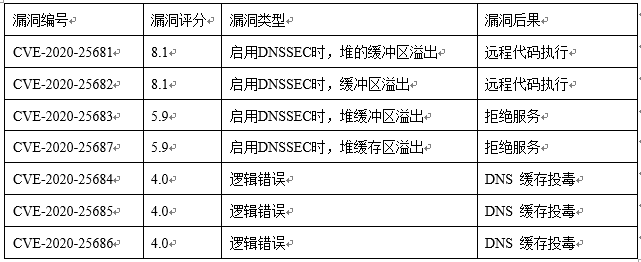
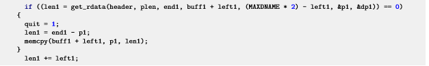

### 1.1	概述  
Dnsmasq是一个开源的轻量级DNS转发软件，为小型网络提供DNS和DHCP等网络基础服务，被广泛地用于智能手机和IoT设备。近期JSOF披露了七个Dnsmasq漏洞（CVE-2020-25681、CVE-2020-25682、CVE-2020-25683、CVE-2020-25684、CVE-2020-25685、CVE-2020-25686和CVE-2020-25687），这些漏洞被统称为DNSpooq，攻击者可以利用这些漏洞发起DNS缓存投毒、远程执行代码和拒绝服务攻击。

### 1.2	漏洞详情  

1）缓冲区溢出漏洞：CVE-2020-25681、CVE-2020-25682、CVE-2020-25683、CVE-2020-25687   
当dnsmasq被配置为使用DNSSEC时，攻击者成功利用这些漏洞，可以导致远程执行任意代码或者dnsmasq服务崩溃。这4个CVE主要涉及两个函数：  
static int sort_rrset(struct dns_header *header, size_t plen, u16 *rr_desc, int rrsetidx,
					  unsigned char **rrset, char *buff1, char *buff2)  
static int get_rdata(struct dns_header *header, size_t plen, unsigned char *end, char *buff, int bufflen, unsigned char **p, u16 **desc)

sort_rrset中的代码：  

 当get_rdata返回0时，表示RDATA中的剩余数据被复制到buff1中。由于buff1的大小为MAXDNAME * 2（2050）字节，同时由于dnsmasq支持使用UDP进行数据传输，而UDP允许的最大报文长度为4096字节，由于代码中缺少长度校验，所以攻击者可以发送超过2050字节的RRset报文，触发系统缓冲区溢出。  

2）DNS缓存投毒：CVE-2020-25684 CVE-2020-25685 CVE-2020-25686  
DNS缓存投毒攻击（也称为DNS欺骗）。DNS缓存投毒是一种攻击方法，攻击者利用该方法可以篡改设备上的DNS记录，将恶意DNS注入到设备中，从而将用户重定向到攻击者指定的恶意服务器。  

### 1.3	影响性分析  

影响范围 dnsmasq< 2.83的版本源代码之中均存在该漏洞，openEuler使用的是2.82版本。 

### 1.4	缓解措施

1、缓冲区溢出漏洞：CVE-2020-25681、CVE-2020-25682、CVE-2020-25683、CVE-2020-25687  
在升级漏洞修复版本之前，暂时禁用DNSSEC验证选项。  

2、DNS缓存投毒：CVE-2020-25684 CVE-2020-25685 CVE-2020-25686  
禁用dnsmasq缓存：在/etc/dnsmasq.conf配置文件中添加cache-size=0配置。
说明：禁用dnsmasq缓存后，所有DNS查询都转发到上游服务器，所以影响DNS的响应速度，在应用之前，请评估缓解措施是否适合系统的环境。  

### 1.5	漏洞修复方法

•	下载openEuler发布最新的dnsmasq软件包：  
	漏洞SA：https://www.openeuler.org/zh/security/safety-bulletin/detail.html?id=openEuler-SA-2021-1001  
	20.03-LTS：  
		[aach64架构软件包](https://repo.openeuler.org/openEuler-20.03-LTS/update/aarch64/Packages)  
		[x86架构软件包](https://repo.openeuler.org/openEuler-20.03-LTS/update/x86_64/Packages)  
	20.03-LTS-SP1：  
		[aach64架构软件包](https://repo.openeuler.org/openEuler-20.03-LTS-SP1/update/aarch64/Packages/)  
		[x86架构软件包](https://repo.openeuler.org/openEuler-20.03-LTS-SP1/update/x86_64/Packages/)  
•	升级dnsmasq软件包  
	rpm -Uvh dnsmasq-*.rpm  
•	升级完成之后查看dnsmasq软件包是否升级成功。  
	rpm -qi dnsmasq  
	20.03-LTS修复版本：dnsmasq-2.82-4。  
	20.03-LTS-SP1修复版本：dnsmasq-2.82-5。  
