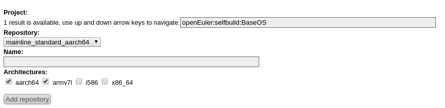
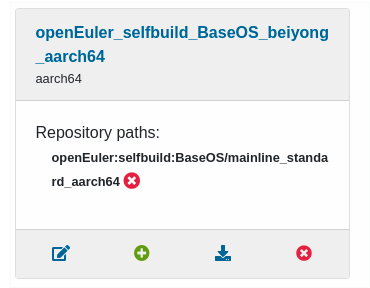
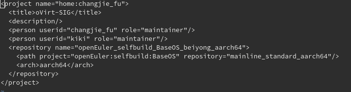
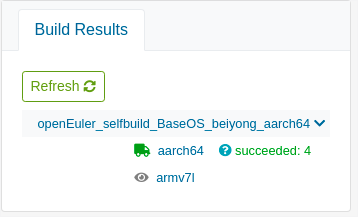

## OBS是什么

OBS是Open Build Service 的简写（官方网址：[https://openbuildservice.org/](https://openbuildservice.org/)）， 

原本是作为发行版openSUSE专用的rpm打包的平台，后续扩展为面向多发行版、多架构、多格式的打包发布平台。


## 与koji的不同

- 管理范围

与koji只管理包（包括源码包与二进制包）仓库不同，OBS同时管理着源码与包两个仓库。koji是从一个包编译完成后开始接手，根据包的NVR（Name-Version-Release）确定包的位置，在编译验证后入库保存。而OBS是从源码阶段开始管理，它拥有自己的包版本标记与changelog日志。OBS可以像git一样保存源码的历史版本，对源码进行分支管理。并生成各版本的二进制包与源码包。
    
换句话说，OBS可以同时实现koji和git的功能。
> OBS接受源码的格式与git普遍的保存格式并不相同，所以OBS无法完全取代git。

- 适用格式

OBS可以生成rpm、deb等格式的包，而koji只适用于rpm格式。


## OBS使用

### 安装osc

osc是OBS的命令行程序，您可以在[这里](https://download.opensuse.org/repositories/openSUSE:/Tools/) ，选择自己的系统版本，添加软件源到自身包管理器中。

这里以Fedora30为例：

1. 添加软件源

将文件`http://download.opensuse.org/repositories/openSUSE:/Tools/Fedora_30/openSUSE:Tools.repo`另存到/etc/yum.repo.d/中。
> 需要root权限。

2. 安装osc

执行 `dnf install osc` 命令安装osc。

### 配置openEuler的OBS

有很多方法可以将osc链接至openEuler外网的OBS：

1. 最基础的方法为在每次执行 `osc` 命令时添加参数： `-A http://openeuler-build.huawei.com/`
2. 使用alias：`alias iosc="osc -A http://openeuler-build.huawei.com/"`
3. 修改位于`home`目录下的osc配置文件：`vi ~/.oscrc`，并写入以下内容：

```
[general]
apiurl = http://openeuler-build.huawei.com/

[http://openeuler-build.huawei.com/]

```

### 注册OBS账号

打开 [http://openeuler-build.huawei.com/](http://openeuler-build.huawei.com/)，点击右上角“Sign Up”，注册自己喜欢的帐号。

注册完成后，重新回到上面网址。点击右上角的“Login”，用新账户登录。系统会在注册时自动创建一个以“home:用户名”为格式命名的Home Project。

### 创建本地目录

创建obs工作目录：
`mkdir ~/obs`

进入obs工作目录：
`cd ～/obs`

将远程obs库同步到本地：
`osc checkout  home:用户名`

输入网页用户名与密码


第一次登陆时会询问本地密码保存方式，三种方式分别是：

1. 明文保存
2. 加密保存
3. 不保存（需要每次输入） 


这里推荐选择2。同步结束后可以看到当前目录下有以Project名命名的文件夹。

### 配置Project

两种方法：网页操作、命令行操作

- 网页操作： 
    
在obs主页点击右上角


依次进入 Home Project -> Repositories -> Add from a Distribution 。



按上图所示填写基础配置，并在Name栏填写喜欢的名字。

在选择后后退至Repositories界面，可以看到如下图所示的环境：



  1. 第一个为编辑按钮，可以选择当前发行版编译架构
  2. 第二个为添加按钮，可在发行版标准环境上额外添加单独的包（例如其他私人编译的依赖包）
  3. 第三个为下载，点击后转到当前环境的仓库
  4. 第四个为删除


- 命令行操作：

执行命令： `osc meta prj -e [project名]` ，会看到类似如下文本：



其中，
  1. repository标签为仓库标签， 可添加此项添加编译时的基础环境
  2. Path标签为可用包路径标签， 需手动添加发行版包路径。如需要额外依赖， 也可以单独添加。
  3. Arch标签为编译架构， 可同时添加多个。

例如：

    ```xml
      <repository name="openEuler_selfbuild_BaseOS_beiyong_aarch64">
    	<path project="openEuler:selfbuild:BaseOS" repository="mainline_standard_aarch64"/>
    	<path project="openEuler:selfbuild:BaseOS" repository="standard_aarch64"/>    	//此为额外添加依赖
    	<arch>aarch64</arch>
    	<arch>armv7l</arch>	//此为多架构选项
      </repository>
    ```

### 新建包

进入Project目录：
 `cd [project名]`

新建Package：
`osc mkpac [package名]`

进入Package目录并将下载源码以【tar包、所有patch、spec文件、其他source文件】格式放置：

!


向新创建的package中添加以上文件：
`osc add * `


将更改上传至服务器：
`osc commit`


在这里可以注明本次上传的简短介绍，用`:wq`保存并退出

之后就可以在网页上等待编译并查看结果了。


### 查看包状态与下载包

您可以在Project与Package主页右侧看到当前编译状态




- `finished `   表示在某个系统平台执行编译链接、安装检查的过程结束
- `succeeded `  状态为编译成功
- `failed `     为编译失败，您可以点击查看日志

您可以点击*编译平台 -> Go to download repository* 到达编译仓库，获得此Project的repo源与所有编译成功的package。

### 更新包

进入project文件夹： 
`cd [project名]`

更新本地代码为最新代码： 
`osc up `

进入package目录，使用 `osc add` 命令将新文件添加到package，修改spec文件后使用`osc commit`命令上传新版本。


## 参考资料
- [openSUSE Wiki](https://en.opensuse.org/openSUSE:Build_Service_Concept_SourceService)
- [OBS官网文档](https://openbuildservice.org/help/manuals/obs-user-guide/cha.obs.source_service.html)
