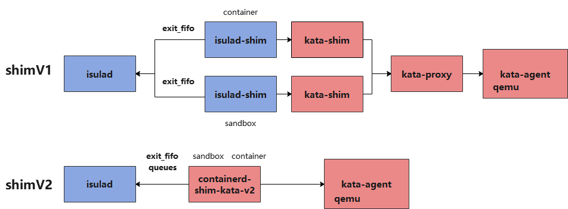

当前shim有shimV1和shimV2两种实现架构，shimV1作为传统shim的实现方案，主要被用作容器引擎和runtime的中间层，实现io、signals等的转发；最新版本的shimV2，在shimV1的基础上集成了runtime的功能，缩短了容器创建的调用链， 在某些场景能够有效降低底噪开销。在本文中的shimV2 默认使用的是[containerd-shim-kata-v2](<https://github.com/kata-containers/runtime/tree/master/containerd-shim-v2>)，以此为分析对象，分别分析了iSulad和containerd中对pause和container(业务容器）两种类型的容器退出监控流程的实现方式。

### shimV2介绍

在shimV1架构中，安全容器的启动涉及kata-shim、 kata-runtime、  kata-proxy、kata-agent组件以及用于创建虚机的qemu组件。在shimV2架构中，将shim、proxy和runtime集成到一个二进制中，当启动pause容器和在pause中启动业务容器时，host os中只存在一个containerd-shim-kata-v2进程和qemu-kvm进程，也就是说pause容器和其中的业务容器共用同一个containerd-shim-kata-v2进程和虚拟机。[shimV2和shimV1架构对比](<https://github.com/kata-containers/documentation/blob/master/design/architecture.md>)如下。shimV1在单pause+多业务容器场景，每启动一个pause或者业务容器都有一个containerd-shim或者isulad-shim、kata-shim进程被拉起，pause和其中的业务容器共用kata-proxy(非vsock)进程和虚机进程（2N+1）。然而， shimV2在单pause+多业务容器场景中，host os中只有一个containerd-shim-kata-v2进程和qemu-kvm进程，调用链更短， 总体底噪更低，特别是当pause中业务容器数量增加时，低底噪优势将更加明显。


### iSulad与shimV1和shimV2关系

1. iSulad中shimv1的实现

   isulad-shim组件作为iSulad中shimv1的实现方案，代码在iSulad仓库中，随iSulad一起编译安装；可用于对接不同的OCI Runtime， 如runc、kata-runtime.

2. iSulad中shimv2的实现

   当前iSulad对接shimv2仍处于调试阶段，shimV2分为containerd-shim-kata-v2和containerd-shim-runc-v2两种实现，本文以containerd-shim-kata-v2作为对象，分析在shimv2场景下，安全容器的退出监控实现机制。

3. shimv1和shimv2的区别如下图所示



2021-04-09-isulad-shimv2-arch

### iSulad中容器退出监控剖析

以isulad-shim为例，iSulad中通过epoll机制监控每个isulad-shim进程中开启的exit_fifo fd是否关闭，isulad-shim在监控到容器退出后将其退出码写入此fifo， 在iSulad中读取并设置容器退出状态，业务容器和pause容器均会打开一个exit_fifo fd。对于pause容器和业务容器这两种CRI流程的容器会分别拉起独立的isulad-shim进程。

iSulad  | <==> isulad-shim <==> container init

iSulad  | <==> isulad-shim <==> pause init

iSulad中在start 容器流程中开启exit_fifo的读端fd并加入epoll监控， 关键代码如下：

```c
int do_start_container(container_t *cont, const char *console_fifos[], bool reset_rm, pid_ppid_info_t *pid_info)
{
    runtime_start();
    do_post_start_on_success() {
        container_supervisor_add_exit_monitor() {
            supervisor_handler_lock();
    	    epoll_loop_add_handler();
        }
    }
}
```


### containerd中容器退出监控

containerd在启动容器并监控其退出状态时不再使用fifo来实现而是使用rpc调用中的Wait方法， 启动pause容器、业务容器以及调用容器exec命令时，均会在containerd中开启一个协程来获取其退出状态。containerd重启后，connect方法实现将全部容器的wait方法进行重建。

- start sandbox和start container监控流程

代码文件：containerd/vendor/github.com/containerd/cri/pkg/server/events.go

```go
// eventMonitor monitors containerd event and updates internal state correspondingly.
// TODO(random-liu): Handle event for each container in a separate goroutine.
type eventMonitor struct {
	c  *criService
	ch <-chan *events.Envelope
	// exitCh receives container/sandbox exit events from exit monitors.
	exitCh  chan *eventtypes.TaskExit
	errCh   <-chan error
	ctx     context.Context
	cancel  context.CancelFunc
	backOff *backOff
}
// container 监控退出
func (c *criService) StartContainer(ctx context.Context, r *runtime.StartContainerRequest) (retRes *runtime.StartContainerResponse, retErr error) {
    // wait is a long running background request, no timeout needed. //ght container这里监听
	exitCh, err := task.Wait(ctrdutil.NamespacedContext())
    
    // start the monitor after updating container state, this ensures that
	// event monitor receives the TaskExit event and update container state
	// after this.
	c.eventMonitor.startExitMonitor(context.Background(), id, task.Pid(), exitCh)
}

// RunPodSandbox creates and starts a pod-level sandbox. Runtimes should ensure
// the sandbox is in ready state.
func (c *criService) RunPodSandbox(ctx context.Context, r *runtime.RunPodSandboxRequest) (_ *runtime.RunPodSandboxResponse, retErr error) {
    // wait is a long running background request, no timeout needed.
	exitCh, err := task.Wait(ctrdutil.NamespacedContext())
    // start the monitor after adding sandbox into the store, this ensures
	// that sandbox is in the store, when event monitor receives the TaskExit event.
	//
	// TaskOOM from containerd may come before sandbox is added to store,
	// but we don't care about sandbox TaskOOM right now, so it is fine.
	c.eventMonitor.startExitMonitor(context.Background(), id, task.Pid(), exitCh)
}
```

containerd/process.go

```go
// containerd/process.go 监控container exec等进程退出
func (p *process) Wait(ctx context.Context) (<-chan ExitStatus, error) {
	c := make(chan ExitStatus, 1)
	go func() {
		defer close(c)
		r, err := p.task.client.TaskService().Wait(ctx, &tasks.WaitRequest{
			ContainerID: p.task.id,
			ExecID:      p.id,
		})
		if err != nil {
			c <- ExitStatus{
				code: UnknownExitStatus,
				err:  err,
			}
			return
		}
		c <- ExitStatus{
			code:     r.ExitStatus,
			exitedAt: r.ExitedAt,
		}
	}()
	return c, nil
}
```

- containerd重新获取shim pid，与shimV1不同的是这里的shim pid并不是作为容器的ppid， 因此在容器进程无法正常kill时，不能通过kill shim pid来强制容器退出。

```go
func (m *TaskManager) loadTasks(ctx context.Context) error {}
  func loadShim() 
	func (s *shim) Connect(ctx context.Context) error {
	response, err := s.task.Connect(ctx, &task.ConnectRequest{
		ID: s.ID(),
	})
	if err != nil {
		return err
	}
	s.taskPid = int(response.TaskPid) // 获取shim的pid
	return nil
}

```


### containerd-kata-shim-v2代码分析

1. ttrpc 服务端入口：

文件containerd-shim-v2/service.go中定义了containerd-kata-shim-v2作为ttrpc服务端监听来自容器引擎的ttrpc调用的入口函数并实现了容器退出状态的监控、io和信号转发等操作。

```go
// service is the shim implementation of a remote shim over GRPC
type service struct {
	mu          sync.Mutex
	eventSendMu sync.Mutex

	// pid Since this shimv2 cannot get the container processes pid from VM,
	// thus for the returned values needed pid, just return this shim's
	// pid directly.
	pid uint32

	ctx        context.Context
	sandbox    vc.VCSandbox
	containers map[string]*container // pause和container容器全部保存在这里
	config     *oci.RuntimeConfig
	events     chan interface{}// publish使用 128缓冲
	monitor    chan error // 监控sandbox即虚机的状态

	cancel func() // ctx cancel

	ec chan exit // 保存了容器推出码 pid等信息， 32缓冲， shim中协程检查进程写入events，向上publish
	id string// io.containerd.kata.v2
}
```

- service 实现了ttrpc server和shim管理的接口

```go
type TaskService interface {
	State(ctx context.Context, req *StateRequest) (*StateResponse, error)
	Create(ctx context.Context, req *CreateTaskRequest) (*CreateTaskResponse, error)
	Start(ctx context.Context, req *StartRequest) (*StartResponse, error)
	Delete(ctx context.Context, req *DeleteRequest) (*DeleteResponse, error)
	Pids(ctx context.Context, req *PidsRequest) (*PidsResponse, error)
	Pause(ctx context.Context, req *PauseRequest) (*google_protobuf1.Empty, error)
	Resume(ctx context.Context, req *ResumeRequest) (*google_protobuf1.Empty, error)
	Checkpoint(ctx context.Context, req *CheckpointTaskRequest) (*google_protobuf1.Empty, error)
	Kill(ctx context.Context, req *KillRequest) (*google_protobuf1.Empty, error)
	Exec(ctx context.Context, req *ExecProcessRequest) (*google_protobuf1.Empty, error)
	ResizePty(ctx context.Context, req *ResizePtyRequest) (*google_protobuf1.Empty, error)
	CloseIO(ctx context.Context, req *CloseIORequest) (*google_protobuf1.Empty, error)
	Update(ctx context.Context, req *UpdateTaskRequest) (*google_protobuf1.Empty, error)
    // 获取容器退出状态
	Wait(ctx context.Context, req *WaitRequest) (*WaitResponse, error)
	Stats(ctx context.Context, req *StatsRequest) (*StatsResponse, error)
    // 获取shim pid
	Connect(ctx context.Context, req *ConnectRequest) (*ConnectResponse, error)
    // 取消全部context子任务并停止containerd-shim-kata-v2进程
	Shutdown(ctx context.Context, req *ShutdownRequest) (*google_protobuf1.Empty, error)
}
// Shim server interface
type Shim interface {
	shimapi.TaskService
	Cleanup(ctx context.Context) (*shimapi.DeleteResponse, error)
	StartShim(ctx context.Context, id, containerdBinary, containerdAddress string) (string, error)
}
```


### iSulad通过containerd-shim-kata-v2运行容器

- 启动pause容器。

```bash
isula run -tid --runtime io.containerd.kata.v2 --network none --annotation io.kubernetes.docker.type=podsandbox <pause-image> <command>
```

此处获取pod的sandbox-id。

- 创建业务容器并加入到这个pod中

```bash
isula run -tid --runtime io.containerd.kata.v2 --network none --annotation io.kubernetes.docker.type=container --annotation io.kubernetes.sandbox.id=<sandbox-id> busybox <command>
```


### containerd通过containerd-shim-kata-v2运行容器

自行安装cri-tools工具，本文使用github.com上master分支编译安装。

- containerd配置：

containerd配置文件/etc/containerd/config.toml中增加如下一段用来配置kata参数

```toml
[plugins."io.containerd.grpc.v1.cri".containerd.runtimes]
//
        [plugins."io.containerd.grpc.v1.cri".containerd.runtimes.kata]
          runtime_type = "io.containerd.kata.v2"
          pod_annotations = ["com.github.containers.virtcontainers.sandbox_cpu", "com.github.containers.virtcontainers.sandbox_mem", "com.github.containers.virtcontainers.static_devices", "com.github.containers.virtcontainers.sandbox_drivers", "com.github.containers.virtcontainers.boot_cgroup"]
          container_annotations = ["com.github.containers.virtcontainers.storage_spec"]
//
        [plugins."io.containerd.grpc.v1.cri".containerd.runtimes.runc]
          base_runtime_spec = ""

```

- 安装cni插件：

参考如下教程，自行编译plugins

```
https://github.com/containerd/containerd/blob/master/script/setup/install-cni
```

- 指定runtime运行pod:

```bash
$ crictl -i unix:///var/run/containerd/containerd.sock -r unix:///var/run/containerd/containerd.sock runp --runtime kata sandbox-config.json
$ cat sandbox-config.json
{
    "metadata": {
            "name": "nginx-sandbox",
            "namespace": "default",
            "attempt": 1,
            "uid": "hdishd83djaidwnduwk28bcsb"
        },
    "image": {
        "image": "docker.io/library/busybox:latest"
    },
    "linux": {
        }
}

```

----

Author:高华涛