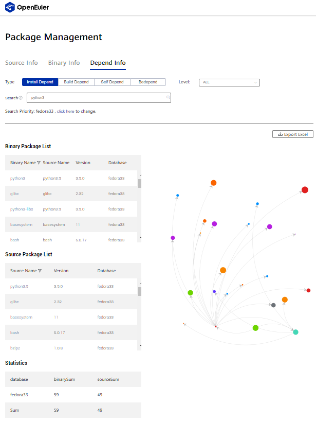
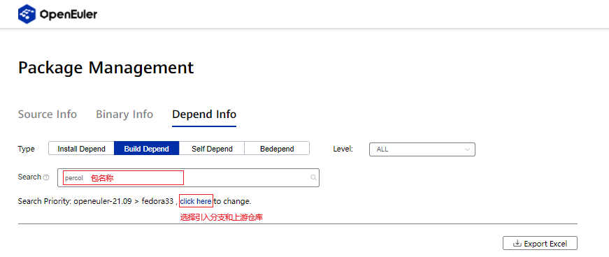
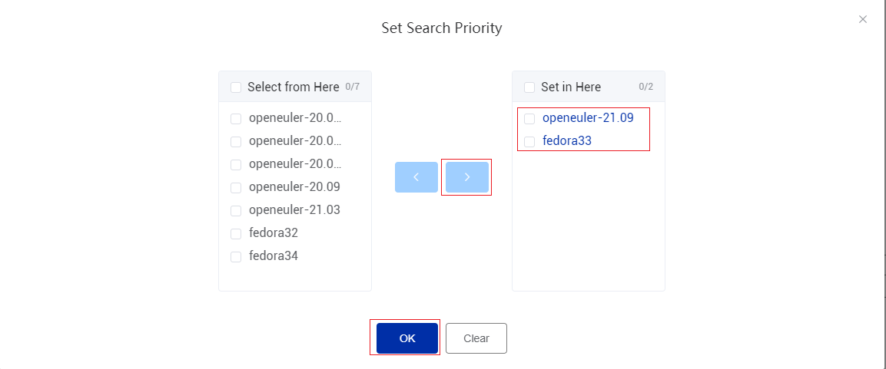
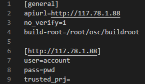
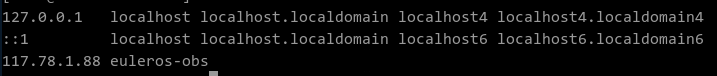
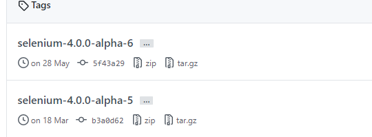

# openEuler社区软件包引入分析指南

为提升软件包引入效率，保证软件包引入质量，发布本指南指导社区贡献者进行软件包引入的分析工作。

## 1. 软件包准入checklist

软件包引入提交PR前需待引入软件包以及依赖进行软件包引入检查，根据[软件包引入前检查checklist](https://gitee.com/openeuler/community/blob/master/zh/technical-committee/governance/software-management.md#%E8%BD%AF%E4%BB%B6%E9%80%89%E5%9E%8B%E5%8F%8A%E5%BC%95%E5%85%A5%E5%89%8D%E6%A3%80%E6%9F%A5)逐个分析带引入软件包及其依赖是否符合openEuler社区准入规则。openEuler软件包引入原则如下：


| 检查点           | 说明                                                         |
| ---------------- | ------------------------------------------------------------ |
| 归一化           | 1、原则上一款软件只在src-openeuler中引入一次。               |
| 来源可靠         | 1、开源软件都应该从开源软件官网获取或官网指定的代码托管地址获取。 |
| 规范化软件名称   | 1、 软件名称必须和官网/社区保持一致，不可随意命名， 2、 不允许以软件包中的子模块作为软件名， 3、 当软件是某个语言的开发库时，我们允许追加python-、perl-等前缀予以规范化管理。 |
| 社区运营状态检查 | 1、软件来自知名社区或组织，社区或组织通过发布公告、修改软件仓库状态、将仓库放到特定目录下等方式告知停止维护的，不建议引入， 2、软件来自个人、小型社区或组织，两年内未发布版本（含正式版本与测试版本），无明确版本计划，社区提交了有效的Bug或PR，但是半年以上未响应的，不建议引入， 3、社区运营状态不明确，通过Issue 或者邮件等方式询问社区是否继续维护，半年以上未响应或者答复停止维护的，不建议引入。 |
| 官网必填         | 1、软件官方网址填写规范，使用软件供应商提供的网址，或者无单独正式官网的情况下，提供主流代码托管商上面对应的项目网址如github 2、不能使用maven、mvnrepository、springsource等托管库作为官方网址 |
| 软件包信息提供   | 1、必须提供官方提供的源代码包的下载地址，以达到可溯源 2、如果有需要二进制包，需要提供官方的二进制包下载地址 |
| license检查      | 1、待引入软件是否有license 2、入库时填写的license是否和官网保持一致；是否和软件包中license保持一致；高风险license的开源软件谨慎引入 |
| copyright检查    | 1、通过官网、社区、代码托管网站、源码包、发布件中等地方获取并提供copyright信息 |


**注意事项：**

1. 归一化：检验时应注意多版本软件包的检查，例如mysql和mysql5，引入多版本请先与技术委员会和SIG发起沟通。
2. License检查和copyright白黑名单参见[许可证名单筛查](https://spdx.org/licenses/)


## 2. 软件包依赖分析

软件包引入原则上在提交PR前完成相关软件包依赖分析工作，可通过如下几种方式对软件包依赖进行分析。

### 2.1. Pkgship工具依赖分析

Pkgship是由openEuler开发团队针对openEuler社区软件管理开发的包管理工具，可对openEuler各个版本以及fedora源中软件包进行依赖分析以及二进制包、源码包查询，现已部署在openEuler官方网站：[Pkgship](https://pkgmanage.openeuler.org/)。

#### 2.1.1. Pkgship在线依赖分析

Pkgship依赖分析支持安装依赖、构建依赖、自安装依赖、被依赖共四个场景的包依赖分析。软件包引入主要关注编译依赖和安装依赖部分，通过在Pkgship在线依赖分析，用户可以得到待引入软件包的安装依赖和编译依赖的表单。




**选择依赖分析类型：**

Package Management 界面选择Depend Info并选择合适的依赖分析类型，填写包名称后，点击click here选择仓库。



**选择分支和上游社区：**

在弹出页面选择待引入的分支和上游社区并点击OK确认。




**结果查询：**

点击放大镜查询，Pkgship将自动根据用户设置进行依赖分析。


**依赖查询结果分析：**

查看 Source Package List 列表，其中 Database列中显示为 fedora33 的软件包即为待引入源码包。


#### 2.1.2. Pkgship本地依赖分析

另外，Pkgship支持本地部署，自定义源进行依赖分析，详细见：[Pkgship用户部署](https://gitee.com/src-openeuler/pkgship)

**注意：**
如果在使用过程中发现问题，欢迎在[pkgship仓库下反馈](https://gitee.com/openeuler/pkgship/issues)


### 2.2. 上游社区依赖分析

对于不能根据Pkgship进行依赖分析的软件包，则需要对软件包依赖进行人工分析。

#### 2.2.1. 构建依赖

**使用上游社区自带spec分析**：

根据 spec文件中BuildRequires字段下依赖包名称，查询待引入包的构建依赖。

**根据各个语言管理工具和依赖管理文件分析**：

若上游社区未提供spec，根据语言管理工具或特定依赖文件进行分析，下面是部分语言的包管理工具和依赖管理文件类型：

| 语言    | 包管理工具 | 文件类型                  |
| ------- | ---------- | ------------------------- |
| C++     | CMake      | Makefile                  |
| java    | maven pom  | pom.xml                   |
| go      | go modules | go.mod                    |
| rust    | cargo      | Cargo.toml                |
| ruby    | RubyGems   | *.gemspec                 |
| python  | pip        | requirements.txt/setup.py |
| Node.js | npm/yarn   |                           |

**根据openEuler提供的spec生成工具：**

- [pyporter](https://gitee.com/openeuler/pyporter): python软件包的spec推荐使用[pyporter工具](https://gitee.com/openeuler/pyporter)自动生成
- [rubyporter](https://gitee.com/openeuler/rubyporter): Ruby软件包的spec可使用[rubyporter工具](https://gitee.com/openeuler/rubyporter)自动生成。
- [nodejsporter](https://gitee.com/openeuler/nodejsporter): nodejs软件包的spec可使用[nodejsporter工具](https://gitee.com/openeuler/nodejsporter)自动生成。
- [perlporter](https://gitee.com/openeuler/pyporter): perlporter软件包的spec可使用[perlporter工具](https://gitee.com/openeuler/pyporter)自动生成。
- **注意：** 工具生成后还需要人工审视的点，
  - description是否合理地给出了软件的描述信息（不是单单列出了包名或者为空）
  - spec中各部分应有合理的空行分割保证SPEC的规范和美观（如%prep，%description等的前面）等。 


#### 2.2.2. 安装依赖和运行依赖

**使用上游社区自带spec分析**：

根据 spec文件中Requires字段下依赖包名称，查询待引入包的安装依赖。

**使用rpmbuild工具分析：**

```bash
rpm -a requires [package_name] # 查看安装依赖
```


## 3. 软件包自验证

原则上任何引入openEuler社区的软件包在提交PR前均需要对其进行完整的依赖分析和自验证。

### **3.1. SPEC整改**

#### 3.1.1.  格式整改和静态检查

- 关键字顺序整改
- changelog整改：新软件包的spec文件changelog只需要package init的日志
- 敏感词排除，patch非敏感注释保留: openEuler原则上不接受fedora 和 rhel 上游社区
- Release 版本修改：新软件包引入Release 设置为1，每次对spec文件修改都应该对Release +1
- License 名单对比：不应引入有风险的license的软件包。

#### 3.1.2.  代码溯源检查

- spec中的官网url的有效性，确认浏览器能够访问

- spec中源码包的下载地址source0的有效性，链接源码包与软件包的源码包的一致性 

  - 如果下载源码包与自带源码包不一致，使用下载的源码包进行后续验证。

    - ```bash
       md5sum 压缩包名1 压缩包名2   # 看执行后的两个字符串是否一样
       ```
    

  - 如果source0下载链接不可用，则搜索上游社区（类似github）维护的版本可使用的下载链接进行重新验证（可从原spec的注释中寻找线索）。

### **3.2  rpmbuild**

使用rpmbuild进行本地编译构建验证

```bash
rpmbuild -ba [spec file] # 使用 -ba 参数，根据spec文件构建二进制包和源代码包。
```


### **3.3. [OBS](https://117.78.1.88/)编译构建验证** 

实践中虽然可以使用rpmbuild进行本地构建验证，但由于obs环境与本地开发者有所差异可能会导致obs构建结果与本地不同，故提交PR前应在obs拉取相应分支进行编译构建验证。

#### 3.3.1. osc 环境配置

在~（/root/）用户目录下创建.oscrc文件设置osc客户端配置。 osc配置选项有如下两种方式：

- 直接在配置文件中指定ip地址

  

- 在配置文件中使用域名，在/etc/hosts中加上ip与域名的映射 

  

  

#### 3.3.2. OBS开发验证

- **拉取分支**

  1. 拉取分支已有的软件包

     

  2. 在分支新建没有的软件包

     

3、本地 新建分支

- **OSC编译**

  1. 执行osc命令下载在线仓库到本地 

     ```bash
     osc co home:xxxxx:branches:openEuler:Mainline 软件包名称
     ```

  2. 进入到个人分支 home:xxxxx:branches:openEuler:Mainline/软件包名称

  3. 将包对应的spec文件和tar包(还可能需要上传patch或配置文件) 移动到个人分支目录中

  4. 本地编译，因OBS构建资源有限，建议在上传到OBS在线编译之前使用osc build先进行本地构建验证，避免反复上传构建浪费时间。

     ```bash
     osc build
     ```

  5. 移动到个人分支目录中，执行osc命令将本地文件上传至OBS在线个人分支 

     ```bash
     osc add *
     osc ci
     ```

  6. 在线查看OBS个人分支的编译构建结果

     


### 3.4. 软件包安装卸载验证

- 
  确认环境中没有别的版本的该包

  ```bash
  rpm -e `rpm -qa | grep $fileName`
  ```

- 安装软件包

  ```bash
  rpm –ivh xxx-2.0.1-2.aarch64.rpm
  ```
   由于rpm不能自动搜索依赖，需要将依赖包提前安装好以便验证。

- 能否成功卸载

  ```bash
  rpm –e xxx-2.0.1-2.aarch64.rpm
  ```


### 3.5. **软件包基础功能验证**

**带有命令行的软件包功能验证：**

```bash
rpm –qpl xxx.rpm # 查看命令(/usr/bin/目录下的即为新增命令)，运行相关的指令验证功能是否可以正常使用。
```

**服务类软件包功能验证：**

```bash
systemctl start [service.name]
```


## 4. 编写yaml文件 

openEuler-Advisor 的目标是为 openEuler 制品仓的日常工作提供自动化的巡检和建议。为支持openEuler-Advisor自动化运行，应参考openEuler社区发布的[openEuler-Advisor yaml文件命名规范](https://gitee.com/openeuler/openEuler-Advisor#31yaml-%E6%96%87%E4%BB%B6%E8%A7%84%E8%8C%83)，在仓库下配置yaml文件。

1. 创建yaml文件，yaml文件名应与spec文件名称保持一致。

2. 编辑yaml文件，添加相应字段内容

   - **version_control**: 上游仓库的版本控制协议，目前支持svn, git, hg, github, gnome, metacpan, pypi。

     未包含的版本控制协议填写NA。

   - **src_repo:** 上游仓库的实际地址，通过version_control 和 src_repo 可以工具可以下载对应的代码。

   - **tag_prefix：**上游仓库的tag 中version 前缀，如果是 git 协议，通过 git tag 命令即可显示所有tag。如果上游给的tag 是 v1_0_1, 那么tag_prefix 应该配置为"^v"，我们通过匹配tag_prefix即可取出正确的版本信息得到 1_0_1。若存在tag格式修改的状况，已最新的tag格式为准。

     如存在特殊情况如下:

     

     可使用如下通配符

     ```bash
     "selenium-(.*?)-alpha-(.*?)"
     ```

   - **separator:** tag中版本的间隔符，如果 tag是 v1_0_1，然后配置separator 为"_"，我们通过代码解析可以得到正确的版本号"1.0.1"。

   

 

## 参阅

openEuler 技术委员会：[《openEuler 软件包管理策略原则》](https://gitee.com/openeuler/community/blob/master/zh/technical-committee/governance/software-management.md)

openEuler《软件包引入流程v1.0》----- [**disnight **](https://gitee.com/disnight)

openEuler 《[openEuler-Advisor](https://gitee.com/openeuler/openEuler-Advisor#31yaml-%E6%96%87%E4%BB%B6%E8%A7%84%E8%8C%83)》