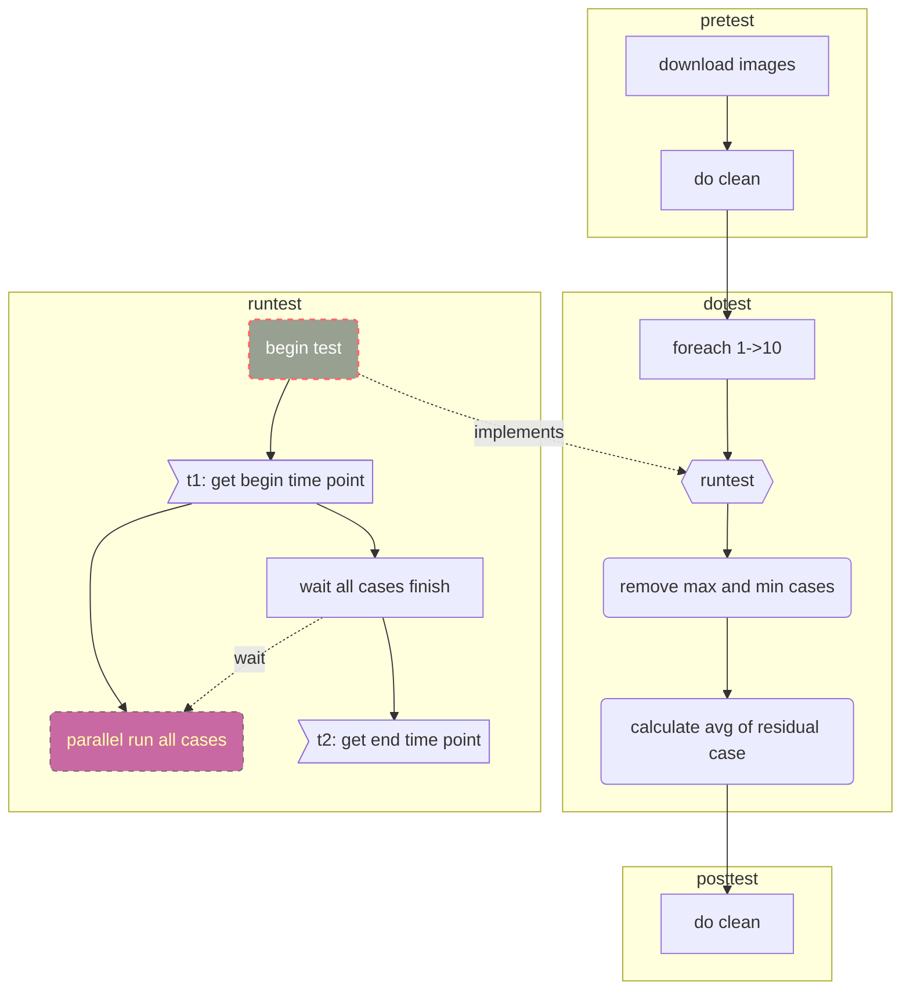
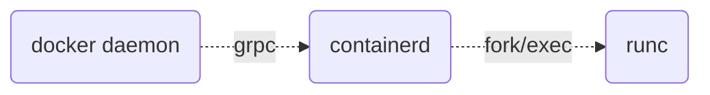

iSula容器引擎具有很多优点：轻、快等等。那么，如何呈现这些优点呢？这篇文章我们主要关注iSula容器引擎的“快”。为了证明“快”，那就需要有参照物进行对比。环视业内，我们发现几个能打的；容器引擎鼻祖Docker、红帽的Podman以及CRI-O。

目标确定了，我们开始明确对比范围了。

## 测试范围

容器引擎的使用模式主要是：

- 客户端使用模式：多见于个人开发、测试以及部分生产场景；
- PAAS通过CRI接口使用模式：云计算的经典场景，通过CRI接口调用容器引擎能力，管理pod集群；

为了尽量覆盖应用场景，因此我们需要覆盖上述两种场景，对客户端模式和CRI模式分别进行测试对比。

### 客户端模式

由于CRI-O不具备客户端功能，所以我们选择的测试对象是：

- Docker
- Podman
- iSula

### CRI模式

CRI接口，需要通过`cri-tools`工具进行测试。

为了对比的观赏性，我们在CRI模式下也选择三个测试对象：

- Docker
- CRI-O
- iSula

## 环境准备

### 机器环境

#### X86

| 配置项 | 配置信息                                 |
| ------ | ---------------------------------------- |
| OS     | Fedora32 X86_64                          |
| 内核   | linux 5.7.10-201.fc32.x86_64             |
| CPU    | 48核，Intel Xeon CPU E5-2695 v2 @ 2.4GHZ |
| 内存   | 132 GB                                   |

#### ARM

| 配置项 | 配置信息      |
| ------ | ------------- |
| OS     | Euleros       |
| 内核   | linux 4.19.90 |
| CPU    | 64核          |
| 内存   | 196 GB        |

### 安装iSulad

参考[官方文档](https://gitee.com/openeuler/iSulad/blob/master/docs/build_guide.md)安装即可。

```bash
$ isula version

Client:
  Version:	2.0.3
  Git commit:	3bb24761f07cc0ac399e1cb783053db8b33b263d
  Built:	2020-08-01T09:40:06.568848951+08:00

Server:
  Version:	2.0.3
  Git commit:	3bb24761f07cc0ac399e1cb783053db8b33b263d
  Built:	2020-08-01T09:40:06.568848951+08:00

OCI config:
  Version:	1.0.1
  Default file:	/etc/default/isulad/config.json
```

### 安装cri-tools

CRI测试，使用统一的客户端工具进行测试，选择K8S对应的`V1.15.0`版本即可。

```bash
$ git clone https://github.com/kubernetes-sigs/cri-tools
$ cd cri-tools
$ git checkout v1.15.0
$ make
$ export PATH=$PATH:$GOPATH/bin
```

### 安装docker

根据[官方文档](https://docs.docker.com/engine/install/fedora/)安装即可。

```bash
$ docker version

Client:
 Version:           19.03.11
 API version:       1.40
 Go version:        go1.14.3
 Git commit:        42e35e6
 Built:             Sun Jun 7 21:16:58 2020
 OS/Arch:           linux/amd64
 Experimental:      false

Server: Docker Engine - Community
 Engine:
  Version:          19.03.11
  API version:      1.40 (minimum version 1.12)
  Go version:       go1.14.3
  Git commit:       42e35e6
  Built:            Sun Jun 7 00:00:00 2020
  OS/Arch:          linux/amd64
  Experimental:     false
 containerd:
  Version:          1.3.3
  GitCommit:        
 runc:
  Version:          1.0.0-rc10+dev
  GitCommit:        fbdbaf85ecbc0e077f336c03062710435607dbf1
 docker-init:
  Version:          0.18.0
  GitCommit:
```

### 安装kubelet

我们选择`V1.15.0`版本作为测试版本，下载源码`https://github.com/kubernetes/kubernetes.git`。

#### 准备源码

如果下载失败或者太慢，可以配置代理：

```bash
# 设置国内代理
go env -w GOPROXY=https://goproxy.cn,direct
# 设置私有仓库地址
go env -w GOPRIVATE=.gitlab.com,.gitee.com
# 设置sum验证服务地址
go env -w GOSUMDB="sum.golang.google.cn"
```

开始下载源码：

```bash
$ cd $GOPATH/src/k8s.io
$ git clone https://github.com/kubernetes/kubernetes.git
$ cd kubernetes
$ git checkout v1.15.0
$ go mod tidy
```

#### 编译

```bash
$ make all WHAT=cmd/kubelet
```

注意：

- **K8S的版本对go的版本有要求，例如`V1.15.0`需要go 1.12版本**
- 可以使用`go mod tidy`，测试依赖代码下载，如果存在鉴权失败的仓库，可以使用`go get -v -insecure`下载

#### 安装

```bash
$ cp _output/bin/kubelet /usr/local/bin/kubelet
$ kubelet --version
  Kubernetes v1.15.0
```

#### 启动kubelet

```bash
$ kubelet --network-plugin=cni --runtime-cgroups=/systemd/system.slice --kubelet-cgroups=/systemd/system.slice --cgroup-driver="systemd"  --fail-swap-on=false  -v 5 --enable-controller-attach-detach=false --experimental-dockershim
```

注：cgroup由systemd管理

### 安装CRI-O

由于直接通过`dnf`安装`CRI-O`的`v1.15.4`版本有问题，所以需要源码编译安装。

```bash
$ dnf install glib-2.0 glibc-devel glibc-static container-common
$ git clone https://github.com/cri-o/cri-o.git
$ cd crio
$ make
$ make install
$ mkdir -p /etc/crio && cp crio.conf /etc/crio/
```

### 安装podman

直接使用`dnf`的源安装即可：

```bash
$ dnf install -y podman

$ podman --version
  podman version 2.0.3
```

## 测试方案

本文档主要关注容器引擎的容器生命周期的性能，所以测试方案如下：

- 单容器的create、start、stop、rm和run等操作的性能；
- 100个容器并发create、start、stop、rm和run等操作的性能；
- 单pod的runp、stopp和rmp等操作的性能；
- 单pod包含单容器的run、stop和rm等操作的性能；
- 100个pod并发runp、stopp和rmp等操作的性能；
- 100个包含单容器的pod并发run、stop和rm等操作的性能；

注：pod的配置，必须指定linux，不然docker会给pod创建一个默认的网卡，导致cni插件执行失败。

```json
{
    "metadata": {
        "name": "nginx-sandbox",
        "namespace": "default",
        "attempt": 1,
        "uid": "hdishd83djaidwnduwk28bcsb"
    },
    // linux字段必须存在
    "linux": {
    }
}

```

### 方案详细设计

单次测试和并发测试虽然是两种测试场景，但是单次可以看成并发的特例。因此，设计测试用例的时候，通过控制并发数量来实现两种场景的区分。具体设计如下图：



### 客户端模式

#### X86环境测试结果

单容器操作性能对比

| 操作耗时 (ms) | Docker  (avg) | Podman (avg) | iSula (avg) | VS Docker | VS Podman |
| ------------- | ------------- | ------------ | ----------- | --------- | --------- |
| create        | 287           | 180          | 131         | -54.36%   | -27.22%   |
| start         | 675           | 916          | 315         | -53.33%   | -65.61%   |
| stop          | 349           | 513          | 274         | -21.49%   | -46.59%   |
| rm            | 72            | 187          | 60          | -16.67%   | -67.91%   |
| run           | 866           | 454          | 359         | -58.55%   | -20.93%   |

100容器并发操作性能对比

| 操作耗时 (ms) | Docker  (avg) | Podman (avg) | iSula (avg) | VS Docker | VS Podman |
| ------------- | ------------- | ------------ | ----------- | --------- | --------- |
| 100 * create  | 4995          | 3993         | 1911        | -61.74%   | -52.14%   |
| 100 * start   | 10126         | 5537         | 3861        | -61.87%   | -30.27%   |
| 100 * stop    | 8066          | 11100        | 4268        | -47.09%   | -61.55%   |
| 100 * rm      | 3220          | 4319         | 1967        | -38.91%   | -54.46%   |
| 100 * run     | 9822          | 5979         | 4392        | -55.28%   | -26.54%   |

#### ARM环境测试结果

单容器操作性能对比

| 操作耗时 (ms) | Docker  (avg) | Podman (avg) | iSula (avg) | VS Docker | VS Podman |
| ------------- | ------------- | ------------ | ----------- | --------- | --------- |
| create        | 401           | 361          | 177         | -55.86%   | -50.97%   |
| start         | 1160          | 1143         | 523         | -54.91%   | -54.24%   |
| stop          | 634           | 576          | 395         | -37.70%   | -31.42%   |
| rm            | 105           | 398          | 89          | -15.24%   | -77.64%   |
| run           | 1261          | 1071         | 634         | -49.72%   | -40.80%   |

100容器并发操作性能对比

| 操作耗时 (ms) | Docker  (avg) | Podman (avg) | iSula (avg) | VS Docker | VS Podman |
| ------------- | ------------- | ------------ | ----------- | --------- | --------- |
| 100 * create  | 14563         | 12081        | 4172        | -71.35%   | -65.47%   |
| 100 * start   | 23420         | 15370        | 5294        | -77.40%   | -65.56%   |
| 100 * stop    | 22234         | 16973        | 8619        | -61.24%   | -49.22%   |
| 100 * rm      | 937           | 10943        | 926         | -1.17%    | -92.33%   |
| 100 * run     | 28091         | 16280        | 9015        | -67.91%   | -44.63%   |

### CRI模式

#### X86环境测试结果

单pod操作

| 操作耗时 (ms) | Docker  (avg) | CRIO (avg) | iSula (avg) | VS Docker | VS CRIO |
| ------------- | ------------- | ---------- | ----------- | --------- | ------- |
| runp          | 681           | 321        | 239         | -64.90%   | -25.55% |
| stopp         | 400           | 356        | 272         | -32.00%   | -23.60% |

单pod单容器操作

| 操作耗时 (ms) | Docker  (avg) | CRIO (avg) | iSula (avg) | VS Docker | VS CRIO |
| ------------- | ------------- | ---------- | ----------- | --------- | ------- |
| run           | 1249          | 525        | 382         | -69.42%   | -27.24% |
| stop          | 554           | 759        | 564         | +1.81%    | -25.69% |

100并发pod操作

| 操作耗时 (ms) | Docker  (avg) | CRIO (avg) | iSula (avg) | VS Docker | VS CRIO |
| ------------- | ------------- | ---------- | ----------- | --------- | ------- |
| 100 * runp    | 13998         | 4946       | 3887        | -72.23%   | -21.41% |
| 100 * stopp   | 8402          | 4834       | 4631        | -44.88%   | -4.20%  |
| 100 * rmp     | 2076          | 1388       | 1073        | -48.31%   | -22.69% |

100并发pod容器操作

| 操作耗时 (ms) | Docker  (avg) | CRIO (avg) | iSula (avg) | VS Docker | VS CRIO |
| ------------- | ------------- | ---------- | ----------- | --------- | ------- |
| 100 * run     | 28158         | 9077       | 5630        | -80.01%   | -37.98% |
| 100 * stop    | 9395          | 8443       | 8196        | -12.76%   | -2.93%  |
| 100 * rm      | 4415          | 3739       | 1524        | -65.48%   | -59.24% |

#### ARM环境测试结果

单pod操作

| 操作耗时 (ms) | Docker  (avg) | CRIO (avg) | iSula (avg) | VS Docker | VS CRIO |
| ------------- | ------------- | ---------- | ----------- | --------- | ------- |
| runp          | 1339          | 2366       | 536         | -59.97%   | -77.35% |
| stopp         | 443           | 419        | 255         | -42.44%   | -39.14% |

单pod单容器操作

| 操作耗时 (ms) | Docker  (avg) | CRIO (avg) | iSula (avg) | VS Docker | VS CRIO |
| ------------- | ------------- | ---------- | ----------- | --------- | ------- |
| run           | 2069          | 3039       | 338         | -83.66%   | -88.88% |
| stop          | 684           | 688        | 214         | -68.71%   | -68.90% |

100并发pod操作

| 操作耗时 (ms) | Docker  (avg) | CRIO (avg) | iSula (avg) | VS Docker | VS CRIO |
| ------------- | ------------- | ---------- | ----------- | --------- | ------- |
| 100 * runp    | 27802         | 29197      | 9827        | -64.65%   | -66.34% |
| 100 * stopp   | 14429         | 11173      | 6394        | -55.69%   | -42.77% |
| 100 * rmp     | 771           | 9007       | 1790        | +132.17%  | -80.13% |

100并发pod容器操作

| 操作耗时 (ms) | Docker  (avg) | CRIO (avg) | iSula (avg) | VS Docker | VS CRIO |
| ------------- | ------------- | ---------- | ----------- | --------- | ------- |
| 100 * run     | 54087         | 43521      | 5284        | -90.23%   | -87.86% |
| 100 * stop    | 18317         | 19108      | 2641        | -85.58%   | -86.18% |
| 100 * rm      | 1592          | 18390      | 2162        | +35.80%   | -88.24% |

## 总结分析

从测试数据来看，在容器的生命周期的操作和并发操作上面，我们iSulad都是优于其他容器引擎的。尤其是在ARM上的表现尤为出色，并发性能已经接近于X86的性能了；而其他容器引擎在ARM上面的表现不尽如人意，甚至出现性能下降1倍以上。

那么，我们iSulad为什么有这么大的优势呢？我觉得，主要是从下面几个方面来看。

- 首先，iSulad是用C/C++语言写的，而Docker/Podman/CRI-O都是用golang写的；C/C++在速度方面本身就有优势；
- 架构设计上面，相对于Docker，iSulad架构更加简单，调用链更短；而Podman是serverless模式，并发更加不具备优势；
- 在容器创建流程中，减小锁粒度、消减容器的依赖（例如镜像管理模块），从而提高了并发的性能；

### 架构对比

iSulad架构设计如下：


Docker官网给的架构图如下：


但是，docker daemon里面还涉及到containerd和runc的流程没有描述，大体结构如下：



从架构来看，docker的容器生命周期流程涉及：客户端到docker daemon的restful通信；daemon到containerd的GRPC通信；然后fork执行runc。而iSulad的流程：客户端到服务端的GRPC通信，然后fork执行lxc-start。

## 参考文档

- https://stackoverflow.com/questions/46726216/kubelet-fails-to-get-cgroup-stats-for-docker-and-kubelet-services
- https://developer.aliyun.com/article/630682
- https://blog.csdn.net/bingshiwuyu/article/details/107333259
- https://github.com/cri-o/cri-o
- https://gitee.com/openeuler/iSulad/blob/master/docs/build_guide.md

