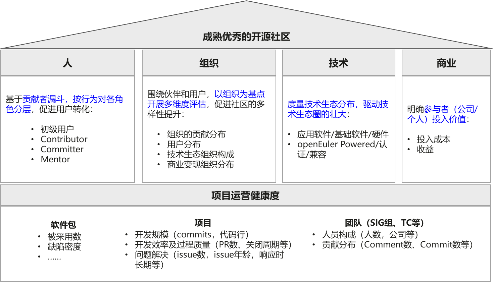
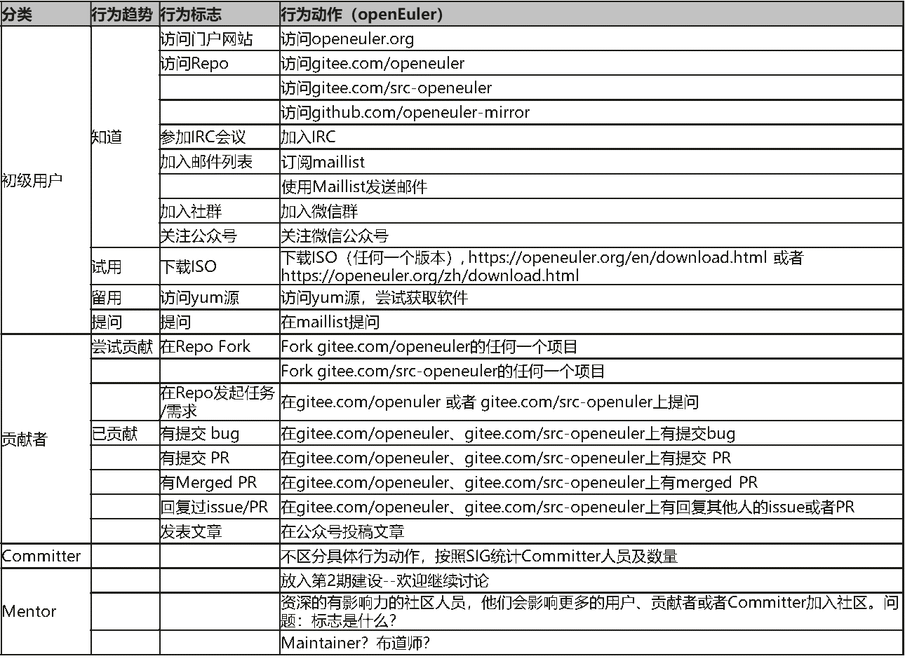
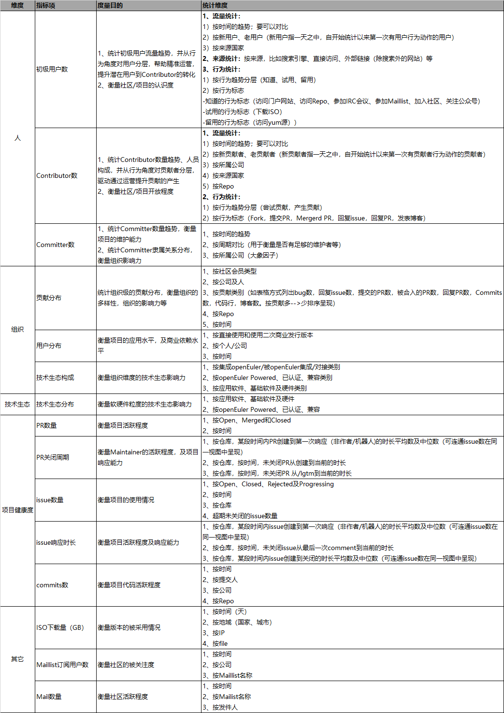

---
title: 浅谈openEuler开源社区运营度量及分析
date: 2020-05-06
tags:
    - 社区运营
    - 度量
archives: 2020-05
author: Ivye
summary: 浅谈openEuler开源社区运营度量及分析，属于系列博客的第一篇。
---

# 浅谈openEuler开源社区运营度量及分析

伴随openEuler社区的运转，如何评估开源社区运营状态以改进社区运营成为一个关键问题。那么，我们需要哪些指标、哪些数据并开展什么样的分析呢？经过一段时间的摸索，对于社区运营的目标、独立指标、度量可视化及数据分析有初步的思考和沉淀，本博客记录下来，欢迎大家一起探讨。

## 一、	度量的诉求

好的开源社区，应该是人们愿意使用、贡献、并主动宣传的人气社区，并且有完善的用户生态、贡献者生态、技术生态和伙伴生态。社区成员也会希望通过数据统计及分析，来帮助了解社区状态、识别运营诉求、开展运营改进，支撑社区更健康的发展。

## 二、	度量指标框架

带着对好的开源社区的理解及度量诉求，构想以终为始，围绕“人、组织、技术生态和商业”，辅以“项目运营健康度”为支撑，构建开源社区度量指标框架。

## 三、	必要的基础数据定义

任何能够获取数据的地方，都可以收集并跟踪。但需要哪些数据？怎么定义？于是，围绕角色（初级用户、贡献者、Committer及Mentor），基于行为趋势，定义了相关的基础数据。
（说明，在进行指标梳理和定义时，参考了<https://github.com/chaoss>。）

## 四、	第一期度量指标

我认为不同的项目、不同有阶段有其独特的健康度衡量，所需的指标及分析也会随项目的诉求而变化。
第一期列出了面向开发者从感知到贡献的一些指标，当前这仅仅是支撑后续深入分析的初始阶段。

## 五、运营系统搭建

基于第一期指标集，我们团队正在开展运营系统的搭建，可以期待一下接下来的分享哦~~

### 参与指南

开源社区运营度量讨论目前都是在openEuler开源社区进行的，欢迎大家贡献思路和建议。

**1、Mail List:**

<community@openeuler.org>

**2、Issues：**

[[1]](https://gitee.com/openeuler/community/issues/I1BAO0)为主任务，主要为度量框架讨论，详细内容在文档[[3]](https://docs.qq.com/doc/DRmlaYnZSbEViRm5G)；

[[2]](https://gitee.com/openeuler/community/issues/I1BSJ4)是第一批的度量指标项，详细内容在文档 [[4]](https://docs.qq.com/doc/DUG1jWGptQ2xSc0xw)。

[1] https://gitee.com/openeuler/community/issues/I1BAO0

[2] https://gitee.com/openeuler/community/issues/I1BSJ4

[3] https://docs.qq.com/doc/DRmlaYnZSbEViRm5G

[4] https://docs.qq.com/doc/DUG1jWGptQ2xSc0xw
