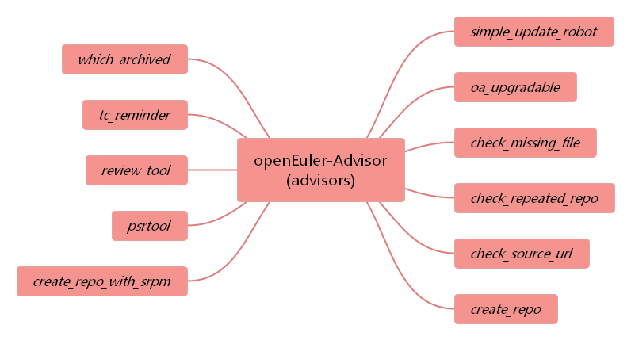
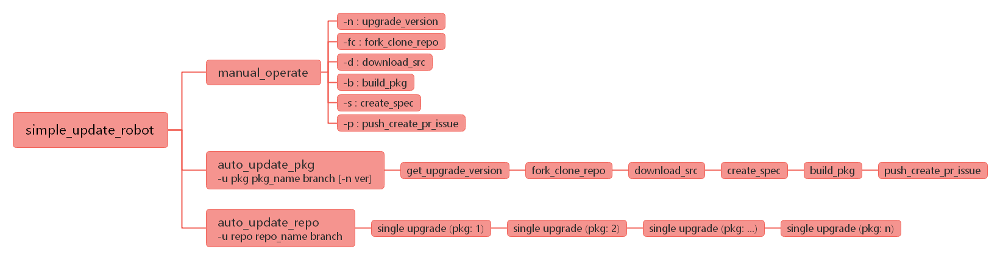

## 目录

- openEuler-Advisor功能与定位

- 为什么会有openEuler-Advisor项目

- openEuler-Advisor基本组成

- 基本配置与安装

- 版本推荐与自动升级使用方法
---

## openEuler-Advisor功能与定位

openEuler-Advisor, 为社区提供日常辅助功能或提供相关建议的功能集合, [主页](https://gitee.com/openeuler/openEuler-Advisor)描述为:

Collection of automation tools for easily maintaining openEuler(用于便捷维护openEuler的自动化工具集)

因此，该软件的定位是用于自动化维护（查询、巡检、升级、提示等）openEuler软件仓库的一套功能集合  

## 为什么会有openEuler-Advisor项目

openEuler发行版集成了上游社区的软件，每个软件从被集成到持续维护，都需要一定工作量。而对一个发行版来说，基础数量已经以千为单位，为了考虑生态，更是以万为单位(参考业界社区fedora/ubuntu/openSUSE)，因此总工作量巨大。

这种情况下，社区需要一套可以减少总工作量的工具，不但要减少贡献者、维护者的工作量，而且要减少校验者的工作量，因此openEuler-Advisor应运而生。  

## openEuler-Advisor基本组成

openEuler-Advisor核心模块在advisors目录下，主要提供软件包上游信息查询、版本推荐、软件仓巡检（文件检查、重复软件包检查、软件source地址检查、衰退软件检查等）、自动创建软件仓、软件包自动升级、软件仓自动化review等功能。下面将对各组成模块功能进行简单介绍：

<div align='center'>


</div>

- simple_update_robot: 用于src-openeuler仓库内软件包的自动升级工作，能够自动fork软件仓，下载要升级的源码包，修改spec文件（自动匹配上游社区已合入的补丁），本地obs编译，自动创建PR（包含差异分析报告）及issue等；  

<div align='center'>


</div>

- oa_upgradable: 用于查询软件包上游发布信息及版本推荐等，能够获取软件包当前社区有效的release tags，并通过版本推荐算法，推荐出软件包的最新版本和维护版本，如果需要，可判断当前软件包版本是否需要升级，并创建相关issue； 

- check_missing_file: 用于检查src-openeuler中各个软件仓进行检查，是否有文件缺失，如果存在，则自动在对应的仓库下创建任务，提示Maintainer进行补充；

- check_repeated_repo: 用于检查src-openeuler中是否存在可能重复的软件仓，针对upstream地址相同，软件仓名不同的情况，进行提示，由Maintainer进行审视，确保软件仓整洁及唯一； 

- check_source_url: 用于检查各个软件包的source地址是否有效，即能否通过source地址下载到有效的源码包，如果不能，则自动为对应的软件仓创建任务，提示Maintainer进行确认与修改；

- create_repo/create_repo_with_srpm: 这两个模块提供了批量创建代码仓的功能，后者可以根据rpm包自动获取其Name、Summary、description及upstream等信息；

- psrtool: 用于查询软件包归属SIG及某个SIG下所管理的软件包列表信息；

- review_tool: 该模块作为代码自动检视工具，可为指定软件仓PR生成代码审视清单，规范PR审视过程，能够自动完成部分检查项的检查工作，为Commiter减轻工作量，保证检视质量；

- tc_reminder: 用于自动为TC成员创建相关提示信息，比如社区TC成员列表，PR状态信息等，方便整个社区自动化管理；

- which_archived: 用于检查软件包上游社区是否已经处于归档状态，即软件包是否停止维护，从而方便维护团队及时调整维护策略；  

## 基本配置与安装

- 安装软件包依赖:

```
pip3 install python-rpm-spec (ver>=0.10)
pip3 install PyYAML (ver>=5,3.1)
pip3 install requests (ver>=2.24.0)
yum install rpmdevtools (ver>=8.3)
pip3 install beautifulsoup4 (ver>=4.9.3)
```

- json文件配置:

    创建json文件: root/.gitee_presonal_token.json

    json文件格式: {"user":"gitee用户名", "access_token": "token密码"}

    gitee token密码设置入口: https://gitee.com/profile/personal_access_tokens

- gitee ssh配置:

    如果未配置，请参考: https://gitee.com/help/articles/4181

- obs配置:

    如果未配置，请参考: https://openeuler.org/zh/docs/20.09/docs/ApplicationDev/%E6%9E%84%E5%BB%BARPM%E5%8C%85.html

- python环境配置:

    如果处于开发态，直接使用该工具，首先需要配置Python环境路径: source ./develop_env.sh  

## 版本推荐与自动升级使用方法

这里主要介绍软件包版本信息查询和推荐，以及软件包自动升级功能的使用:

- oa_upgradable:

    **查询软件包上游社区信息及版本推荐**: python3 oa_upgradable.py pkg_name [-d default_yaml_path] [-p]

    参数说明: -d指定默认查询所需的yaml地址，yaml配置了软件包基本上游信息，详情可到openEuler-Advisor官网进行了解; -p表示若查询结果显示该软件包可以升级，会自动向软件仓创建issue

    例如: python3 oa_upgradable.py glibc

- simple_update_robot:

    **单软件包手动升级**: python3 simple_update_robot.py pkg_name branch_name [-fc] [-d] [-s] [-n new_version] [-b] [-p]

    参数说明: -fc表示fork clone软件仓到本地; -d表示下载要升级的源码包; -s表示修改spec进行升级; -n表示要升级的版本; -b表示进行本地编译; -p表示本地验证ok后提交升级PR并创建相应的issue

    例如: python3 simple_update_robot.py snappy openEuler-20.03-LTS -fc -d -s -b -n 1.8.1

    **单软件包自动升级**: python3 simple_update_robot.py -u pkg pkg_name branch_name [-n new_version]

    参数说明: -u pkg表示单软件包升级; -n用于指定要升级的版本，若不指定系统自动推荐合适版本

    例如: python3 simple_update_robot.py -u pkg snappy master

    **多软件包自动升级**: python3 simple_update_robot.py -u repo repo_name branch_name

    参数说明: -u repo表示多软件包升级，repo_name表示要升级的集合/仓库名，默认先从本地读取同名yaml，若没有则尝试从community中进行读取

    例如: python3 simple_update_robot.py -u repo src-openeuler master

用户可以在本地工作目录下配置要升级的repo列表，yaml格式如下:

比如: upgrade-example.yaml

```
repositories:
- name: A-Tune
- name: python-py
- name: python-ply
```

如果想为某些软件包指定升级版本，可以配置为:

```
repositories:
- name: A-Tune
  u_ver: x.y.z
- name: python-py
- name: python-ply
```

然后通过工具自动升级: python3 simple_update_robot.py -u repo upgrade-example master

