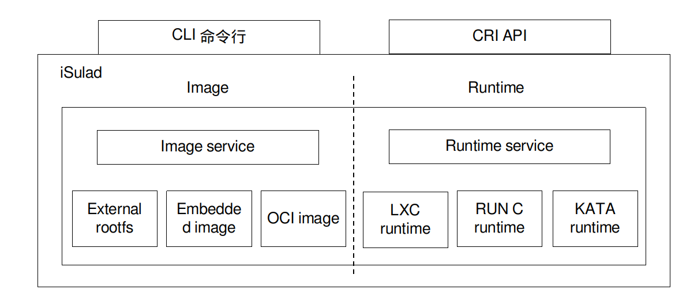
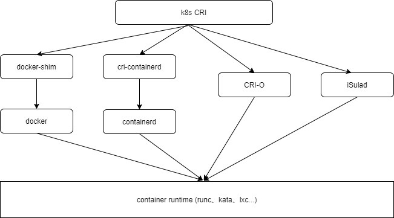
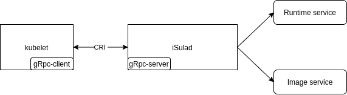
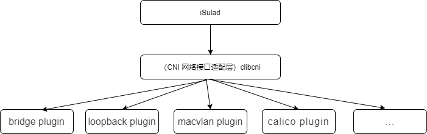
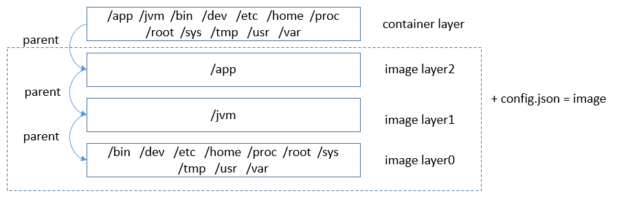
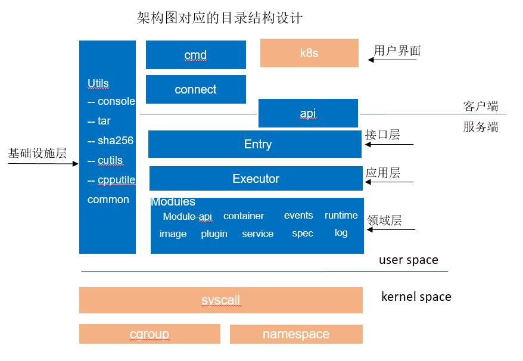

_作者简介：李峰， 具有多年容器、操作系统软件开发经验，对容器引擎、runtime 等领域有比较深入的研究与理解。深度参与 lxc、containers 等开源容器社区。现在担任 openeuler 轻量级容器引擎 iSulad 社区 maintainer。_

iSulad 是一种由 C/C++编程语言编写的容器引擎，当前已经在 openeuler 社区开源(https://gitee.com/openeuler/iSulad)。 当前主流的容器引擎 docker、containerd、cri-o 等均是由 GO 语言编写。随着边缘计算、物联网等嵌入式设备场景的不断兴起，在资源受限环境下，业务容器化的需求越来越强烈。由高级语言编写的容器引擎在底噪占用上的劣势越来越凸显。另外由于容器引擎对外接口的标准化，因此用 C/C++重写一个容器引擎成为了可能。iSulad 整体架构如下图所示。



iSulad 对外提供命令行以及基于 gRPC 的 CRI 两种对外接口，其中核心功能根据业务分为镜像管理和容器管理。

通过下图可以理解 iSulad 在生态中的定位。

 

本文介绍 iSulad 的功能特性以及对整体架构进行介绍。

## iSulad 功能特性介绍

### 提供客户端命令行进行容器、镜像操作

iSulad 是典型的 CS 架构模式。iSulad 作为 daemon 服务端，同时也提供了单独的客户端命令 isula，供用户使用。

iSula 提供的命令参数覆盖了常用的大部分的应用场景。包含容器的操作接口，如运行、停止、删除、pause 等操作，也包含了镜像相关的操作，如下载、导入、删除等。

```
$ sudo isula --help
USAGE:
	isula <command> [args...]

COMMANDS:
	attach 	Attach to a running container
	cp     	Copy files/folders between a container and the local filesystem
	create 	Create a new container
	events 	Get real time events from the server
	exec   	Run a command in a running container
	export 	export container
	images 	List images
	import 	Import the contents from a tarball to create a filesystem image
	info   	Display system-wide information
	inspect	Return low-level information on a container or image
	kill   	Kill one or more  running containers
	load   	load an image from a tar archive
	login  	Log in to a Docker registry
	logout 	Log out from a Docker registry
	logs   	Fetch the logs of a container
	pause  	Pause all processes within one or more containers
	ps     	List containers
	pull   	Pull an image or a repository from a registry
	rename 	Rename a container
	restart	Restart one or more containers
	rm     	Remove one or more containers
	rmi    	Remove one or more images
	run    	Run a command in a new container
	start  	Start one or more stopped containers
	stats  	Display a live stream of container(s) resource usage statistics
	stop   	Stop one or more containers
	tag    	Create a tag TARGET_IMAGE that refers to SOURCE_IMAGE
	top    	Display the running processes of a container
	unpause	Unpause all processes within one or more containers
	update 	Update configuration of one or more containers
	version	Display information about isula
	wait   	Block until one or more containers stop, then print their exit codes
```

### 使用举例

假设您使用的为openeuler发行版本，可以采用以下方式使用iSulad。

#### 使用yum命令安装isulad

```
[root@openeuler ~]# yum install -y iSulad
```

#### 安装完成后，查看服务运行状态

```
[root@openeuler ~]# systemctl status isulad
● isulad.service - iSulad Application Container Engine
   Loaded: loaded (/usr/lib/systemd/system/isulad.service; enabled; vendor preset: disabled)
   Active: active (running) since Mon 2020-09-14 15:53:43 CST; 4h 35min ago
 Main PID: 1248 (isulad)
    Tasks: 25
   Memory: 88.3M
   CGroup: /system.slice/isulad.service
           ├─1248 /usr/bin/isulad
```

#### 修改isulad的配置文件，添加镜像仓库地址

```
[root@openeuler iSula]# vi /etc/isulad/daemon.json   
{
    .......
    "registry-mirrors": [
        "hub.oepkgs.net"
    ],
    .......
```

#### 重启isulad服务

```
[root@openeuler iSula]# systemctl restart isulad
```

#### 基于openeuler:20.09镜像运行容器

创建容器：

```
[root@openeuler iSula]# isula create -it openeuler/openeuler:20.09
Unable to find image 'openeuler/openeuler:20.09' locally
Image "openeuler/openeuler:20.09" pulling
Image "8c788f4bfb7290e434b2384340a5f9811db6ed302f9247c5fc095d6ec4fc8f32" pulled
e91e5359be653f534312bc2b4703dcc6c4ca0436ac7819e09e1ff0e75ee1d733
```

由于没有运行容器，所以利用isula ps命令无法找到刚刚创建的容器：

```
[root@openeuler iSula]# isula ps
CONTAINER ID	IMAGE				COMMAND	CREATED		STATUS	PORTS	NAMES
```

可以使用isula pa –a命令可以找到刚刚创建的容器：

```
[root@ecs-cdf3 ~]# isula ps -a
CONTAINER ID	IMAGE				COMMAND	CREATED		STATUS	PORTS	NAMES
e91e5359be65		openeuler/openeuler:20.09	"/bin/bash"		8 seconds ago	Created	 e91e5359be653f534312bc2b4703dcc6c4ca0436ac7819e09e1ff0e75ee1d733
```

启动容器：

```
[root@openeuler iSula]# isula start e91e5359be65
```

由于已经运行容器，可以利用isula ps命令查找运行中的容器

```
[root@openeuler iSula]# isula ps
CONTAINER ID	IMAGE				COMMAND	CREATED		STATUS	PORTS	NAMES
e91e5359be65		openeuler/openeuler:20.09	"/bin/bash"		30 seconds ago	Up 4 seconds	     e91e5359be653f534312bc2b4703dcc6c4ca0436ac7819e09e1ff0e75ee1d733
```

执行命令输出容器系统版本信息：

```
[root@ecs-cdf3 ~]# isula exec e91e5359be65 cat /etc/os-release
NAME="openEuler"
VERSION="20.09"
ID="openEuler"
VERSION_ID="20.09"
PRETTY_NAME="openEuler 20.09"
ANSI_COLOR="0;31"
```

可以看到我们在openeuler 20.03系统上成功运行openeuler 20.09容器。

暂停/恢复一个容器

```
[root@openeuler iSula]# isula pause e91e5359be65
e91e5359be65
[root@openeuler iSula]# isula unpause e91e5359be65
e91e5359be65
```

强制删除运行中的容器

```
[root@openeuler iSula]# isula rm -f 6c1d81467d33
6c1d81467d3367a90dd6e388a16c80411d4ba76316d86b6f56463699306e1394
```

删除镜像

```
[root@openeuler iSula]# isula rmi openeuler/openeuler:20.09
Image " openeuler/openeuler:20.09" removed
```

### 支持 CRI 标准协议

CRI(Container Runtime Interface)是由 K8S 定义的容器引擎需要向 k8S 对外提供的容器和镜像的服务的接口,供容器引擎接入 K8S。

CRI 接口基于 gRPC 实现。iSulad 遵循 CRI 接口规范，实现 CRI gRPC Server，包括 Runtime Service 和 Image Service 分别用来提供容器运行时接口和镜像操作接口。iSulad 的 gRPC Server 需要监听本地的 Unix socket，而 K8S 的组件 kubelet 则作为 gRPC Client 运行。



### 支持 CNI 网络标准协议

CNI(Container Network Interface) 是 google 和 CoreOS 主导制定的容器网络标准协议。通过 CNI 协议，iSulad 通过 JSON 格式的文件与具体网络插件进行通信，进而实现容器的网络功能。容器网络具体的功能均由网络插件来实现。iSulad 中使用 C 语言实现了 clibcni 接口模块，用来实现对应功能。



### 遵循 OCI 标准

OCI 包含两个标准规范 **容器运行时标准 （runtime spec）和 容器镜像标准（image spec）**。

#### 支持 OCI 标准镜像格式

首先介绍下，什么是容器镜像。容器运行所需的 rootfs 以及一些资源配置等信息被打包成特定的数据结构，称为容器镜像。基于容器镜像可以方便地运行容器。由于运行环境和应用被一起打包到了容器镜像中，这样就解决了应用部署时的环境依赖问题。每个容器镜像由一个或多个层数据、以及一个 config.json 配置文件组成。多个层之间有依赖关系，这种依赖关系称为父子关系（被依赖的层为父层）。运行容器之前，所有层的数据会合并挂载成一个 rootfs 供容器使用，称为容器层。合并后的数据如果有冲突，则子层的数据会覆盖父层中路径名称都相同的数据，镜像组织结构如下图所示：



镜像的分层是为了解决空间占用问题。如果本层及其所有递归依赖的父层具有相同的数据，这些数据就可以复用，以减少空间占用。下图描述的是具有相同 layer0 层和 layer1 层的两个容器镜像的数据复用结构：


iSulad 支持 OCI 标准镜像格式以及与 docker 兼容的镜像格式。能够 支持从 docker hub 等镜像仓库下载容器镜像，或者导入由 docker 导出的镜像文件来启动容器使用。

#### 支持 OCI 标准 runtime

iSulad 支持标准 OCI runtime 操作接口，可以进行容器生命周期管理。iSulad 不仅支持当前主流的容器 runtime 如 runc、kata，而且针对低底噪的需求，将 C 语言编写的 lxc 进行了适配修改，使其能够作为支持 OCI 标准协议的 C 语言 runtime，进一步降低了容器引擎基础设施底噪开销。
​ 下面使用 iSulad 来运行一个新的容器，通过查看运行过程中产生的进程以及持久化的配置，理解运行新容器的过程。

运行容器，首先需要下载镜像，我们使用 前文中提到的 openeuler/openeuler:20.09 来作为容器镜像。

调用 isula 客户端命令下载镜像。

```bash
$ sudo isula pull openeuler/openeuler:20.09
Image "openeuler/openeuler:20.09" pulling
Image "c7c37e472d31c1685b48f7004fd6a64361c95965587a951692c5f298c6685998" pulled
```

运行容器指创建一个新的容器，并启动它。

```bash
$ sudo isula run -itd openeuler/openeuler:20.09
42fc2595f876b5a18f7729dfb10d0def29789fb73fe0f1327e0277e6d85189a1
```

运行容器后，可以通过本地文件查看持久化的容器配置文件。

```bash
# cd /var/lib/isulad/engines/lcr/42fc2595f876b5a18f7729dfb10d0def29789fb73fe0f1327e0277e6d85189a1
# ls -al
total 92
drwxr-x--- 3 root root  4096 7月  27 16:25 .
drwxr-x--- 3 root root  4096 7月  27 16:25 ..
-rw-r----- 1 root root  4045 7月  27 16:25 config
-rw-r----- 1 root root 23878 7月  27 16:25 config.json
-rw-r----- 1 root root  2314 7月  27 16:25 config.v2.json
-rw-r----- 1 root root     0 7月  27 16:25 console.log
-rw-r----- 1 root root   101 7月  27 16:25 hostconfig.json
-rw-r--r-- 1 root root    10 7月  27 16:25 hostname
-rw-r--r-- 1 root root   183 7月  27 16:25 hosts
drwx------ 3 root root  4096 7月  27 16:25 mounts
-rw-r----- 1 root root     5 7月  27 16:25 ocihooks.json
-rw-r--r-- 1 root root   707 7月  27 16:25 resolv.conf
-rw-r----- 1 root root 26140 7月  27 16:25 seccomp
```

其中 config.json 文件为符合 OCI 标准协议的容器配置文件，内容包括启动容器所需的配置信息。

```bash
# cat config.json
{
    "ociVersion": "1.0.1",
    "hooks": {

    },
    "hostname": "localhost",
    "mounts": [
        {
            "source": "tmpfs",
            "destination": "/dev",
            "options": [
                "nosuid",
                "strictatime",
                "mode=755",
                "size=65536k"
            ],
            "type": "tmpfs"
        },
        {
            "source": "mqueue",
            "destination": "/dev/mqueue",
            "options": [
                "nosuid",
                "noexec",
                "nodev"
            ],
            "type": "mqueue"
        },
        ...
```

config.v2.json 为 iSulad 维护管理容器持久化的一些信息,包括容器的基础配置，以及创建时间，启动时间，容器的 PID、运行启动时间等信息。

```bash
# cat config.v2.json
{
    "CommonConfig": {
        "Path": "sh",
        "Config": {
            "Hostname": "localhost",
            "User": "",
            "Tty": true,
            "OpenStdin": true,
            "Env": [
                "PATH=/usr/local/sbin:/usr/local/bin:/usr/sbin:/usr/bin:/sbin:/bin"
            ],
            "Cmd": [
                "sh"
            ],
            "WorkingDir": "",
            "LogDriver": "json-file"
        },
        "Created": "2020-07-27T16:25:16.170149428+08:00",
        "Image": "openeuler/openeuler:20.09",
        "ImageType": "oci",
        "Name": "42fc2595f876b5a18f7729dfb10d0def29789fb73fe0f1327e0277e6d85189a1",
        "id": "42fc2595f876b5a18f7729dfb10d0def29789fb73fe0f1327e0277e6d85189a1"
    },
    "Image": "sha256:c7c37e472d31c1685b48f7004fd6a64361c95965587a951692c5f298c6685998",
    "State": {
        "FinishedAt": "0001-01-01T00:00:00Z",
        "Pid": 19232,
        "PPid": 19229,
        "StartTime": 2731408,
        "PStartTime": 2731402,
        "Running": true,
        "StartedAt": "2020-07-27T16:25:16.286812971+08:00"
    }
}
```

## 性能表现

### 与其他容器引擎性能比较

#### 测试环境

| Configuration | Information                                  |
| ------------- | -------------------------------------------- |
| OS            | Fedora32 X86_64                              |
| kernel        | linux 5.7.10-201.fc32.x86_64                 |
| CPU           | 48 cores，Intel Xeon CPU E5-2695 v2 @ 2.4GHZ |
| memory        | 132 GB                                       |

#### 测试版本

| Name      | Version                                                               |
| --------- | --------------------------------------------------------------------- |
| iSulad    | Version: 2.0.3 , Git commit: 3bb24761f07cc0ac399e1cb783053db8b33b263d |
| docker    | Version: 19.03.11, Git commit: 42e35e6                                |
| podman    | version 2.0.3                                                         |
| CRI-O     | v1.15.4                                                               |
| kubelet   | v1.15.0                                                               |
| cri-tools | v1.15.0                                                               |

#### 单容器操作

使用客户端

| operator (ms) | Docker | Podman | iSulad | vs Docker | vs Podman |
| ------------- | ------ | ------ | ------ | --------- | --------- |
| create        | 287    | 180    | 87     | -69.69%   | -51.67%   |
| start         | 675    | 916    | 154    | -77.19%   | -83.19%   |
| stop          | 349    | 513    | 274    | -21.49%   | -46.59%   |
| rm            | 72     | 187    | 60     | -16.67%   | -67.91%   |
| run           | 866    | 454    | 195    | -77.48%   | -57.05%   |

使用 CRI 接口

| operator (ms) | Docker | CRIO | iSulad | vs Docker | vs Podman |
| ------------- | ------ | ---- | ------ | --------- | --------- |
| runp          | 681    | 321  | 186    | -72.69%   | -42.06%   |
| stopp         | 400    | 356  | 169    | -57.75%   | -52.53%   |

#### 并发 100 容器操作

使用客户端

| operator (ms) | Docker | Podman | iSulad | vs Docker | vs Podman |
| ------------- | ------ | ------ | ------ | --------- | --------- |
| 100 \* create | 4995   | 3993   | 829    | -83.40%   | -79.24%   |
| 100 \* start  | 10126  | 5537   | 1425   | -85.93%   | -74.26%   |
| 100 \* stop   | 8066   | 11100  | 2273   | -71.82%   | -79.52%   |
| 100 \* rm     | 3220   | 4319   | 438    | -86.40%   | -89.86%   |
| 100 \* run    | 9822   | 5979   | 2117   | -78.45%   | -64.59%   |

使用 CRI 接口

| operator (ms) | Docker | CRIO | iSulad | vs Docker | vs Podman |
| ------------- | ------ | ---- | ------ | --------- | --------- |
| 100 \* runp   | 13998  | 4946 | 2825   | -79.82%   | -42.88%   |
| 100 \* stopp  | 8402   | 4834 | 4543   | -45.93%   | -6.02%    |

## iSulad 代码架构介绍

前面介绍了 iSulad 的主要的功能特性，现在让我们深入到 iSulad 的代码中，了解下 iSulad 的代码组织架构。

### **DDD 分层架构设计**

iSulad 采用 DDD（Domain Driven Design，领域驱动设计）的思想进行架构分层组织，层次划分如下：


各逻辑分层划分以及对应的职责如下：

| **层次**   | **职责划分**                                                                           |
| ---------- | -------------------------------------------------------------------------------------- |
| 用户界面   | 负责向用户展现信息以及解释用户命令                                                     |
| 接口层     | 客户端服务端通信接口、CRI 接口的定义与实现                                             |
| 应用层     | 调用领域层的接口，实现对应的业务应用                                                   |
| 领域层     | 本层包含关于领域的信息，这是 iSulad 软件的核心所在。包含多种模块，业务逻辑实际的执行层 |
| 基础设施层 | 本层作为其他层的支撑库。它提供各种工具函数供其他层次调用使用                           |

根据上述逻辑分层的设计思想，iSulad 对应源码目录架构设计为:



其中 api 目录中定义了 iSulad 对外提供的 gRPC 服务的 proto 文件，在编译时会使用 grpc 生成对应客户端、服务端代码。

### 各层代码组织结构

#### 用户界面层

用户界面层的代码位于 src/cmd 目录下，在该目录下，提供了 iSulad 对外的命令行接口。在 cmd 目录下，提供了 isula 客户端、isulad 服务端、isulad-shim 三个命令行相关的命令行解析、参数显示。代码组织结构如下：

```bash
├── CMakeLists.txt
├── command_parser.c
├── command_parser.h
├── isula # 客户端命令行以及子命令的定义
│   ├── base # 容器操作基础命令，如创建、启动、删除等命令
│   ├── client_arguments.c
│   ├── client_arguments.h
│   ├── CMakeLists.txt
│   ├── extend  # 容器操作扩展命令，如update更新容器资源、events查看容器事件日志
│   ├── images # 镜像相关操作命令，如下载、导入、删除等操作
│   ├── information # 查询容器信息操作命令，如inspect、info等操作
│   ├── isula_commands.c
│   ├── isula_commands.h
│   ├── main.c
│   └── stream  # 长连接命令，如cp、attach、exec等需要与服务端进行长连接操作的命令
├── isulad # 服务端命令行以及参数的定义
│   ├── CMakeLists.txt
│   ├── isulad_commands.c
│   ├── isulad_commands.h
│   └── main.c
└── isulad-shim # isulad-shim命令行以及参数的定义
│   ├── CMakeLists.txt
│   ├── common.c
│   ├── common.h
│   ├── main.c
│   ├── process.c
│   ├── process.h
│   ├── terminal.c
│   └── terminal.h
└── options # 通用的参数解析方法
│   ├── CMakeLists.txt
│   ├── opt_log.c
│   ├── opt_log.h
│   ├── opt_ulimit.c
│   └── opt_ulimit.h


```

#### 接口层

iSulad 的接口层代码位于 src/daemon/entry 目录，其中提供了客户端服务端通信接口、CRI 接口的定义。

用以处理客户端接口的请求以及 CRI 接口请求。

其中 CRI 接口处理中，可以从文件名中看到，iSulad 分别实现了 image 和 runtime 的两种 service。

```bash
├── CMakeLists.txt
├── connect # 处理客户端请求
│   ├── CMakeLists.txt
│   ├── grpc # grpc 请求接口处理
│   ├── rest # restful 请求接口处理
│   ├── service_common.c
│   └── service_common.h
└── cri  # 处理CRI接口请求
    ├── checkpoint_handler.cc
    ├── checkpoint_handler.h
    ├── CMakeLists.txt
    ├── cni_network_plugin.cc
    ├── cni_network_plugin.h
    ├── cri_container.cc # cri接口中容器相关操作请求接口处理
    ├── cri_container.h
    ├── cri_image_service.cc # cri接口中image相关操作请求接口处理
    ├── cri_image_service.h
    ├── cri_runtime_service.cc  # cri接口中runtime相关操作请求接口处理
    ├── cri_runtime_service.h
    ├── cri_sandbox.cc # cri接口中pod相关操作请求接口处理
    ├── cri_sandbox.h
    ├── cri_security_context.cc # cri接口中安全配置处理
    ├── cri_security_context.h
    └── websocket  # 使用websocket服务处理CRI 流式服务请求
```

#### 应用层

iSulad 的应用层代码位于 src/daemon/executor 目录，其作用为调用领域层的接口，实现对应的业务应用，属于业务调度层。可以从文件夹的命名中看到，应用层分别实现了 image 和 runtime 的两种业务模块。

```bash
├── callback.c
├── callback.h
├── CMakeLists.txt
├── container_cb # 容器业务模块
│   ├── CMakeLists.txt
│   ├── execution.c
│   ├── execution_create.c
│   ├── execution_create.h
│   ├── execution_extend.c
│   ├── execution_extend.h
│   ├── execution.h
│   ├── execution_information.c
│   ├── execution_information.h
│   ├── execution_network.c
│   ├── execution_network.h
│   ├── execution_stream.c
│   ├── execution_stream.h
│   ├── list.c
│   └── list.h
└── image_cb # 镜像业务模块
    ├── CMakeLists.txt
    ├── image_cb.c
    └── image_cb.h
```

#### 领域层

领域层包含领域的信息，这是 iSulad 软件的核心所在。其中包含各个业务模块，是业务逻辑实际的执行层。领域层代码位于 src/daemon/modules。

```bash
├── api # 领域层统一对外提供的头文件，供应用层调用
│   ├── CMakeLists.txt
│   ├── container_api.h
│   ├── events_collector_api.h
│   ├── events_sender_api.h
│   ├── event_type.h
│   ├── image_api.h
│   ├── io_handler.h
│   ├── log_gather_api.h
│   ├── plugin_api.h
│   ├── runtime_api.h
│   ├── service_container_api.h
│   ├── service_image_api.h
│   └── specs_api.h
├── CMakeLists.txt
├── container # 容器模块，维护容器全生命周期，维护容器状态
│   ├── CMakeLists.txt
│   ├── container_events_handler.c
│   ├── container_events_handler.h
│   ├── container_gc
│   ├── containers_store.c
│   ├── containers_store.h
│   ├── container_state.c
│   ├── container_state.h
│   ├── container_unix.c
│   ├── container_unix.h
│   ├── health_check
│   ├── restart_manager
│   ├── restore
│   └── supervisor
├── events # 事件收集模块，负责收集iSulad运行过程中产生的容器、镜像事件
│   ├── CMakeLists.txt
│   ├── collector.c
│   ├── monitord.c
│   └── monitord.h
├── events_sender  # 事件发送模块，该接口提供向事件收集模块发送事件的接口
│   ├── CMakeLists.txt
│   └── event_sender.c
├── image # 镜像管理模块
│   ├── CMakeLists.txt
│   ├── embedded # embedded格式镜像管理
│   ├── external # external格式镜像管理
│   ├── image.c
│   ├── image_rootfs_handler.c
│   ├── image_rootfs_handler.h
│   └── oci	# oci格式镜像管理
├── log # 日志收集模块
│   ├── CMakeLists.txt
│   └── log_gather.c
├── plugin # 插件机制模块
│   ├── CMakeLists.txt
│   ├── plugin.c
│   ├── pspec.c
│   └── pspec.h
├── runtime # 容器运行时模块
│   ├── CMakeLists.txt
│   ├── engines # 基于lxc的轻量级runtime对接接口
│   ├── isula # oci 标准runtime对接接口
│   └── runtime.c
├── service # 服务模块，包含多个模块协同调用的实现
│   ├── CMakeLists.txt
│   ├── io_handler.c
│   ├── service_container.c # 容器服务操作接口
│   └── service_image.c  # 镜像服务操作接口
└── spec  # oci规范配置模块，对外提供OCI spec合并、校验等功能接口
    ├── CMakeLists.txt
    ├── specs.c
    ├── specs_extend.c
    ├── specs_extend.h
    ├── specs_mount.c
    ├── specs_mount.h
    ├── specs_namespace.c
    ├── specs_namespace.h
    ├── specs_security.c
    ├── specs_security.h
    ├── verify.c  # 配置校验功能接口
    └── verify.h
```

#### 基础设施层

基础设施层位于 src/utils 目录下，本层作为其他层的支撑库。它提供各种工具函数供其他层次调用使用：

```bash
├── buffer # buffer 工具函数
│   ├── buffer.c
│   ├── buffer.h
│   └── CMakeLists.txt
├── CMakeLists.txt
├── console # IO 终端处理工具函数
│   ├── CMakeLists.txt
│   ├── console.c
│   └── console.h
├── cpputils # C++ 使用到的工具函数，包含基础字符串处理、url、线程工具
│   ├── CMakeLists.txt
│   ├── cxxutils.cc
│   ├── cxxutils.h
│   ├── stoppable_thread.cc
│   ├── stoppable_thread.h
│   ├── url.cc
│   └── url.h
├── cutils # C使用到的工具函数，包含基础字符串处理、数据类型转换、文件处理、正则表达式等工具函数
│   ├── CMakeLists.txt
│   ├── util_atomic.c
│   ├── util_atomic.h
│   ├── utils_aes.c
│   ├── utils_aes.h
│   ├── utils_array.c
│   ├── utils_array.h
│   ├── utils_base64.c
│   ├── utils_base64.h
│   ├── utils.c
│	....
├── http # http 处理工具函数，包含http请求、解析、认证等工具
│   ├── certificate.c
│   ├── certificate.h
│   ├── CMakeLists.txt
│   ├── http.c
│   ├── http.h
│   ├── mediatype.h
│   ├── parser.c
│   ├── parser.h
│   ├── rest_common.c
│   └── rest_common.h
├── sha256 # sha256 工具函数，用来计算sha256
│   ├── CMakeLists.txt
│   ├── sha256.c
│   └── sha256.h
└── tar # 压缩、解压工具函数，用来压缩、解压文件
    ├── CMakeLists.txt
    ├── isulad_tar.c
    ├── isulad_tar.h
    ├── util_archive.c
    ├── util_archive.h
    ├── util_gzip.c
    └── util_gzip.h
```

### 调用流程

可以借助**Structure101** 代码分析工具，梳理出 iSulad 各个代码目录之前的调用依赖关系。


首先，用户界面层（cmd）作为上层，仅会调用其他模块的接口，不会被其他模块所依赖。cmd 会调用 client 目录中的函数，与 daemon 端进行通信。由于 cmd 目录中存在 iSulad daemon 的命令行接口，因此会依赖 daemon 目录下的函数定义。

daemon 目录作为服务端代码的顶层目录，其中包含接口层（entry）、应用层（executor）、领域层（modules）的代码。接口层作为调用 daemon 服务的入口，需要调用其他层中的函数进行业务调度处理，而不会被其他层次所依赖。应用层需要调用领域层（modules）中各个模块的接口来实现具体的业务。

modules 目录作为 iSulad 的核心领域层代码，包含各个子功能模块的具体实现。以 image 模块为例，首先在 src/daemon/modules/api 中提供了 image_api.h，屏蔽了各种不同镜像格式的差异，对外提供统一的 image 操作函数接口。

```c
int image_module_init(const isulad_daemon_configs *args);

void image_module_exit();

int im_list_images(const im_list_request *request, im_list_response **response);

int im_rm_image(const im_rmi_request *request, im_remove_response **response);

int im_tag_image(const im_tag_request *request, im_tag_response **response);

int im_inspect_image(const im_inspect_request *request, im_inspect_response **response);

int im_import_image(const im_import_request *request, char **id);

int im_load_image(const im_load_request *request, im_load_response **response);

int im_pull_image(const im_pull_request *request, im_pull_response **response);

char *im_get_image_type(const char *image, const char *external_rootfs);

bool im_config_image_exist(const char *image_name);

int im_login(const im_login_request *request, im_login_response **response);

int im_logout(const im_logout_request *request, im_logout_response **response);

int im_container_export(const im_export_request *request);

void free_im_export_request(im_export_request *ptr);

```

在镜像管理模块内部，对不同格式的镜像操作进行区分。

```c
static const struct bim_type g_bims[] = {
#ifdef ENABLE_OCI_IMAGE
    {
        .image_type = IMAGE_TYPE_OCI,
        .ops = &g_oci_ops,
    },
#endif
    { .image_type = IMAGE_TYPE_EXTERNAL, .ops = &g_ext_ops },
#ifdef ENABLE_EMBEDDED_IMAGE
    { .image_type = IMAGE_TYPE_EMBEDDED, .ops = &g_embedded_ops },
#endif
};
```

其他模块也都是类似的设计，具体深入到不同模块的详细解析，在后续的博客中会一一进行分析。
