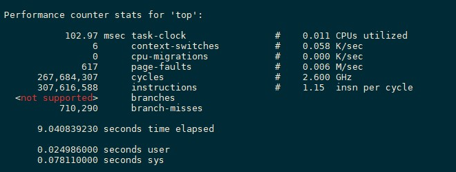
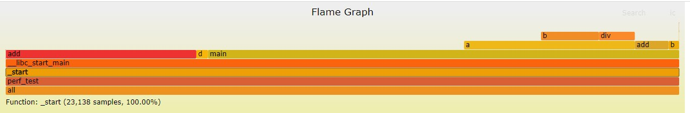

## 虚拟机性能调优工具

# 1 trace工具

## 1.1 简介

顾名思义，trace即为追踪的意思，源码位于\kernel\trace\trace.c。该工具主要用来跟踪和记录系统内核相关信息，包括内核信息，内核拓展信息，用户程序等等，尤其是对系统调用，内核服务和中断处理有着详细记录。

该命令有三种工作模式：默认模式、单一模式和循环模式：

1. 默认模式：该模式默认将trace的数据写入磁盘。
2. 单一模式：该模式先将数据写入内存的缓冲区，待trace终止后写回磁盘；当缓冲区满了trace会自动停止。
3. 循环模式：该模式也会将数据先写入内存，不同点是缓冲区满了之后会被循环利用覆盖之前的区域，直到输入“trcstop”命令才会停止trace，写到磁盘。

## 1.2 获取Trace数据

最常用的收集trace的命令作为例子：trace -a -l -T2000000 -L4000000 -o trace.out （2000000 和 4000000 只是一个例子） 

-a : 表示trace进程在后台运行（异步运行） 
-l ：表示trace工作在循环模式 
-o ：指定trace输出文件的目录和文件名，默认的输出文件名为 /var/adm/ras/trcfile 
-T ：表示缓冲区的大小，单位为byte，默认值为128KB。 
-L ：表示写到磁盘上的trace输出文件的大小，单位为byte，默认值为1MB。 

# 2 perf工具

## 2.1 简介

perf (performance 的缩写)，是 Linux 系统原生提供的性能分析工具，会返回 CPU 正在执行的函数名以及调用栈(stack)。

它基于事件采样原理，以性能事件为基础，支持针对处理器相关性能指标与操作系统相关性能指标的性能剖析，常用于性能瓶颈的查找与热点代码的定位。

CPU周期(cpu-cycles)是默认的性能事件，所谓的CPU周期是指CPU所能识别的最小时间单元，通常为亿分之几秒，是CPU执行最简单的指令时所需要的时间，例如读取寄存器中的内容，也叫做clock tick。

perf的具体原理是这样的：每隔一个固定的时间，就在CPU上（每个核上都有）产生一个中断，在中断上看看，当前是哪个pid，哪个函数，然后给对应的pid和函数加一个统计值，这样，我们就知道CPU有百分几的时间在某个pid，或者某个函数上了。工作模式类似下图：

这是一种采样的模式，我们预期，运行时间越多的函数，被时钟中断击中的机会越大，从而推测，那个函数（或者pid等）的CPU占用率就越高。

## 2.2 常用子工具

+ perf-list

  Perf-list用来查看perf所支持的性能事件，主要分为三类：

  1. Hardware Event 是由 PMU 硬件产生的事件，比如 cache 命中，当您需要了解程序对硬件特性的使用情况时，便需要对这些事件进行采样。

  2. Software Event 是内核软件产生的事件，比如进程切换，tick 数等。

  3. Tracepoint event 是内核中的静态 tracepoint 所触发的事件，这些 tracepoint 用来判断程序运行期间内核的行为细节，比如 slab 分配器的分配次数等。

  hw/cache/pmu都是硬件相关的；tracepoint基于内核的ftrace；sw实际上是内核计数器。

  > 使用方法：perf list [hw | sw | cache | tracepoint | event_glob]

+ perf-stat

  面对一个性能问题的时候，最好采用自顶向下的策略。先整体看看该程序运行时各种统计事件的大概，再针对某些方向深入细节。

  整体监测代码性能就需要使用perf stat这个工具，该工具主要是从全局上监控，可以看到程序导致性能瓶颈主要是什么原因。perf stat通过概括精简的方式提供被调试程序运行的整体情况和汇总数据。

  在默认情况下，perf stat会统计cycles、instructions、cache-misses、context-switches等对系统或软件性能影响最大的几个硬件和软件事件。通过这些统计情况，基本上就能了解软件的运行效率是受CPU影响较大还是IO影响较大，是受运算指令数影响较大还是内存访问影响较大。通过指令数、缓存访问数等统计还能大致判断软件性能是否符合对应的功能设计，是否有代码级优化的可能。

  > 使用方法：
  >
  > perf stat [-e <EVENT> | --event=EVENT] [-a] <command>
  >
  > perf stat [-e <EVENT> | --event=EVENT] [-a] - <command> [<options>]

  即perf stat + 程序，程序运行完之后，然后使用**ctrl+c**来终止程序（若程序自动终止则不用），之后，perf便会打印出监控事件结果，类似如下所示：

  

  1. 102.97 task-clock是指程序运行期间占用了xx的任务时钟周期，该值高，说明程序的多数时间花费在CPU计算上而非IO操作。

  2. 6 context-switches是指程序运行期间发生了xx次上下文切换，记录了程序运行过程中发生了多少次进程切换，频繁的进程切换是应该避免的。（有进程进程间频繁切换，或者内核态与用户态频繁切换）

  3. 0 cpu-migrations 是指程序运行期间发生了xx次CPU迁移，即用户程序原本在一个CPU上运行，后来迁移到另一个CPU

  4. 617 page-faults 是指程序发生了xx次页错误

  5. 其他可以监控的譬如分支预测、cache命中等

+ perf-top

  perf top可以用于观察系统和软件内性能开销最大的函数列表。通过观察不同事件的函数列表可以分析出不同函数的性能开销情况和特点，判断其优化方向。

  例如如果某个函数在perf top -e instructions中排名靠后，却在perf top -e cache-misses和perf top -e cycles中排名靠前，说明函数中存在大量cache-miss造成CPU资源占用较多，就可以考虑优化该函数中的内存访问次数和策略，来减少内存访问和cache-miss次数，从而降低CPU开销。

  > 使用方法：perf top [-e <EVENT> | --event=EVENT] [<options>]
  >
  > > 常用参数：
  > >
  > > -e <event>：指明要分析的性能事件。
  > >
  > > -p <pid>：Profile events on existing Process ID (comma sperated list). 仅分析目标进程及其创建的线程。
  > >
  > > -k <path>：Path to vmlinux. Required for annotation functionality. 带符号表的内核映像所在的路径。
  > >
  > > -K：不显示属于内核或模块的符号。
  > >
  > > -U：不显示属于用户态程序的符号。
  > >
  > > -d <n>：界面的刷新周期，默认为2s，因为perf top默认每2s从mmap的内存区域读取一次性能数据。
  > >
  > > -g：得到函数的调用关系图。

+ perf-record/perf-report

  收集采样信息，并将其记录在数据文件中。随后可以通过其它工具(perf-report)对数据文件进行分析，结果类似于perf-top。

  > 使用方法：首先perf record记录并生成data文件，然后通过perf report显示。

# 3 火焰图

## 3.1 简介

整个图形看起来就像一团跳动的火焰，这也正是其名字的由来。燃烧在火苗尖部的就是 CPU 正在执行的操作，不过需要说明的是颜色是随机的，本身并没有特殊的含义，纵向表示调用栈的深度，横向表示消耗的时间。因为调用栈在横向会按照字母排序，并且同样的调用栈会做合并，所以一个格子的宽度越大越说明其可能是瓶颈。综上所述，主要就是看那些比较宽大的火苗，特别留意那些类似平顶山的火苗。

CPU火焰图中的每一个方框是一个函数，方框的长度，代表了它的执行时间，所以越宽的函数，执行越久。火焰图的楼层每高一层，就是更深一级的函数被调用，最顶层的函数，是叶子函数。

## 3.2 使用方法

1、Flame Graph项目位于GitHub上：https://github.com/brendangregg/FlameGraph

2、可以用git将其clone下来：git clone https://github.com/brendangregg/FlameGraph.git

我们以perf为例，看一下flamegraph的使用方法：

1、第一步

> perf record -e cpu-clock -g -p `pidof xxx`

Ctrl+C结束执行后，在当前目录下会生成采样数据perf.data.

2、第二步

用perf script工具对perf.data进行解析

> perf script -i perf.data &> perf.unfold

3、第三步（进入FlameGraph目录）

将perf.unfold中的符号进行折叠：

> ./stackcollapse-perf.pl perf.unfold &> perf.folded

4、最后生成svg图：

> ./flamegraph.pl perf.folded > perf.svg

## 3.3 解析火焰图

火焰图是基于 stack 信息生成的 SVG 图片，用来展示 CPU 的调用栈。

y 轴表示调用栈，每一层都是一个函数。调用栈越深，火焰就越高，顶部就是正在执行的函数，下方都是它的父函数.

x 轴表示抽样数，如果一个函数在 x 轴占据的宽度越宽，就表示它被抽到的次数多，即执行的时间长。注意，x 轴不代表时间，而是所有的调用栈合并后，按字母顺序排列的.

火焰图就是看顶层的哪个函数占据的宽度最大。只要有 “平顶”(plateaus)，就表示该函数可能存在性能问题。即火焰图就是看函数占据的宽度，宽度越大越可能存在性能问题。

# 4 Linux常用的性能检测工具

| 工具        | 功能描述               |
| ----------- | ---------------------- |
| uptime      | 系统平均负载率         |
| dmesg       | 硬件/系统信息          |
| top         | 进程进行状态           |
| iostat      | CPU和磁盘平均使用率    |
| vmstat      | 系统运行状态           |
| sar         | 实时收集系统使用状态   |
| free        | 内存使用率             |
| traffic-vis | 网络监控（只有SUSE有） |
| pmap        | 进程内存占用率         |
| strace      | 追踪程序运行状态       |
| ulimit      | 系统资源使用限制       |
| mpstat      | 多处理器使用率         |

* ### top

  **命令功能：**

  显示当前系统正在执行的进程的相关信息，包括进程ID、内存占用率、CPU占用率等

  **命令参数：**

  -b 批处理

  -c 显示完整的治命令

  -I 忽略失效过程

  -s 保密模式

  -S 累积模式

  -i<时间> 设置间隔时间

  -u<用户名> 指定用户名

  -p<进程号> 指定进程

  -n<次数> 循环显示的次数

* ### free

  **命令功能：**

  显示系统已用及空余物理内存量、交换分区使用情况（swap memory）、内核占用的缓存、及共享内存。

  **命令参数：**

  -b, –bytes， 以Byte为单位显示内存使用情况

  -k, –kilo， 以KB为单位， 这也是默认值

  -m, –mega， 以MB为单位显示内容使用情况

  -g, –giga， 以GB为单位显示内存使用情况

  -h, –human， 自动将数值转换为人类易读形式

  -c, –count， 展示结果count次，需与-s配合使用

  -s, –seconds， 动态刷新内存使用情况的间隔

+ ### iostat

  **命令功能：**

  查看CPU、网卡、tty设备、磁盘、CD-ROM 等等设备的活动情况,负载信息。

  **命令参数：**

  -C 显示CPU使用情况

  -d 显示磁盘使用情况

  -m 以 M 为单位显示

  -k 以 KB 为单位显示

  -N 显示磁盘阵列(LVM) 信息

  -n 显示NFS 使用情况

  -p[磁盘] 显示磁盘和分区的情况

  -t 显示终端和CPU的信息

  -x 显示详细信息

  -V 显示版本信息