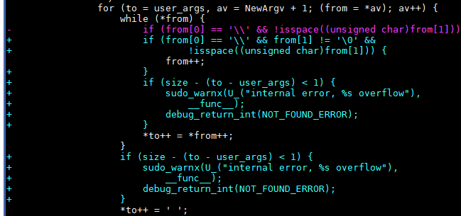

### 1.1 概述
近日，国外研究团队Qualys披露出sudo堆溢出漏洞(CVE-2021-3156), 攻击者可以通过“sudoedit -s”和以单个反斜杠字符结尾的命令行参数将特权提升到 root 用户。
### 1.2 漏洞详情
1）技术分析
在sudo解析命令行参数的方式中发现了基于堆的缓冲区溢出。任何本地用户(普通用户和系统用户，sudoers和非sudoers)都可以利用此漏洞，从而无需进行身份验证就能从普通账号权限提升获取到root权限。此漏洞带来的最大威胁是对数据机密性和完整性以及系统可用性的威胁。
该漏洞在2011年7月被引入(commit 8255ed69)，当执行sudoedit –s / 时，sudo的src/parse_args.c文件的parse_args函数会把字符“/” 设置为"\"。
 

漏洞代码位于plugins/sudoers/sudoers.c文件的set_cmnd函数中，关键代码如下：
 

如果参数以单个反斜杠字符结尾 ("sudoedit –s /"会执行这段代码逻辑)，则情况如下：
1) 在905行，"from[0]"是\ , "from[1]"是空的终止符 (不是空格字符)
2) 在906行，"from"指针加1并指向空的终止符
3）在907行，空的终止符被拷贝到"user_args"缓冲区中，"from"指针再次加1，并指向空的终止符的下一个字符(此时已越界)。
4）再次进行906-908行的while循环，并把已越界的字符拷贝到"user_args"缓冲区中。

2）漏洞修复方法：
修复在user_args中转义反斜杠时的缓冲区溢出问题；并且除非在"运行模式并且通过shell命令执行"的情况下,不要尝试转义反斜杠。同时拒绝不安全的-H和-P参数：执行sudoedit –H或sudoedit –P，会输出"usage:"开头的错误信息。

3）排查方法：
以非root用户登录系统并执行命令： sudoedit -s /
- 如果输出以"sudoedit:"开头的错误信息，表明存在漏洞。
- 如果输出以"usage:"开头的错误信息，表明补丁已生效。

### 1.3 影响性分析
受影响版本：从1.8.2到1.8.31p2的所有版本
           从1.9.0到1.9.5p1的所有稳定版本
openEuler使用的是1.9.2版本。 
###1.4   缓解措施
使用 systemtap 进行临时缓解，使sudoedit命令不可用：
首先，安装所需的 systemtap 软件包、依赖包以及sudo的debuginfo软件包。
yum install systemtap kernel-devel-"$(uname -r)"
debuginfo-install sudo
然后，创建以下 systemtap 脚本，并将文件命名为 sudoedit-block.stap:
probe process("/usr/bin/sudo").function("main") {
        command = cmdline_args(0,0,"");        
        if (strpos(command, "edit") >= 0) {                
                raise(9);        
        }
}

最终，使用root权限执行以下脚本：
nohup stap -g sudoedit-block.stap &

该脚本将使易受攻击的sudoedit二进制文件停止工作。sudo命令仍将照常工作。上述更改在重启后失效，每次重启后必须重新执行。
一旦安装了补丁，就可以通过取消systemtap进程来删除systemtap脚本, 使sudoedit重新可用。
 例如使用：# kill -s SIGTERM 26285 (其中26285是systemtap进程的PID)

### 1.5 漏洞修复方法
•	下载openEuler发布最新的dnsmasq软件包：  
	漏洞SA：https://openeuler.org/zh/security/safety-bulletin/detail.html?id=openEuler-SA-2021-1001  
	20.03-LTS：  
		[aach64架构软件包](https://repo.openeuler.org/openEuler-20.03-LTS/update/aarch64/Packages)  
		[x86架构软件包](https://repo.openeuler.org/openEuler-20.03-LTS/update/x86_64/Packages)  
	20.03-LTS-SP1：  
		[aach64架构软件包](https://repo.openeuler.org/openEuler-20.03-LTS-SP1/update/aarch64/Packages/)  
		[x86架构软件包](https://repo.openeuler.org/openEuler-20.03-LTS-SP1/update/x86_64/Packages/) 
 •	升级sudo软件包
	rpm -Uvh sudo-*.rpm
•	升级完成之后查看sudo软件包是否升级成功。
	rpm -qi sudo
	20.03-LTS在：sudo-1.9.2-2版本修复。
	20.03-LTS-SP1在：sudo-1.9.2-3版本修复。

### 1.6 接口变更
不再支持sudoedit -H，sudoedit –P命令。
执行sudoedit –H 和sudoedit –P命令，都会输出"usage:"开头的错误信息。