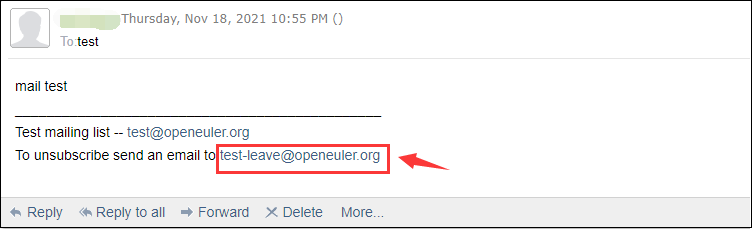

---  
title: 如何退订openEuler的邮件列表  
date: 2021-11-23
tags:   
    - openEuler  
    - 邮件列表  
    - 退订  
sig: sig-Gatekeeper  
archives: 2021-11  
author: liuqi<469227928@qq.com>
summary: 本博客介绍了两种退订openEuler邮件列表的方式 

---  
最近openEuler基础设施团队收到一些社区维护者与贡献者的反馈，不清楚如何退订openEuler的邮件列表。下面具体介绍两种退订方式，一种是发送邮件退订，一种是用户界面退订。
  
### 一、发送邮件退订

发送邮件退订有两种场景。一种是在有退订指引页脚的邮件中，可直接点击邮件页脚的退订标识编辑发送邮件退订。另一种是直接编辑邮件发送给`**-leave@openeuler.org`退订。接下来以退订test@openeuler.org（已订阅）为例具体说明。

-
  部分邮件带有退订指引的页脚，点击页脚的`test-leave@openeuler.org`即可编辑发送退订邮件, 邮件的标题和内容不限
  
  
  随后，你会收到一封test-bounces发送的退订成功告知邮件
  

-
  你也可以使用订阅邮箱给test-leave@openeuler.org发送一封邮件，标题和内容不限
  

  随后，你会收到一封test-bounces发送的退订成功告知邮件
  

### 二、用户界面退订
如果你已是openEuler邮件列表的注册用户（当前注册接口未开放），可直接登录[**postorius**](https://mailweb.openeuler.org/postorius/lists/)，
进入需要退订的邮件列表，点击**Unsubscribe**即可

### 更多
更多社区邮件列表相关问题可参考[**Mailweb List FAQ**](https://osinfra.cn/faq/mailinglist.html)
