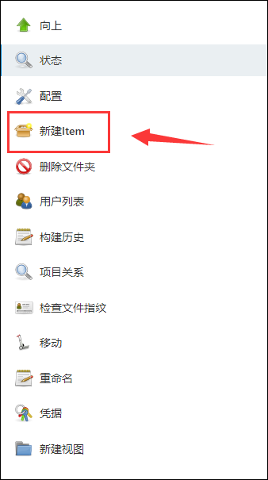
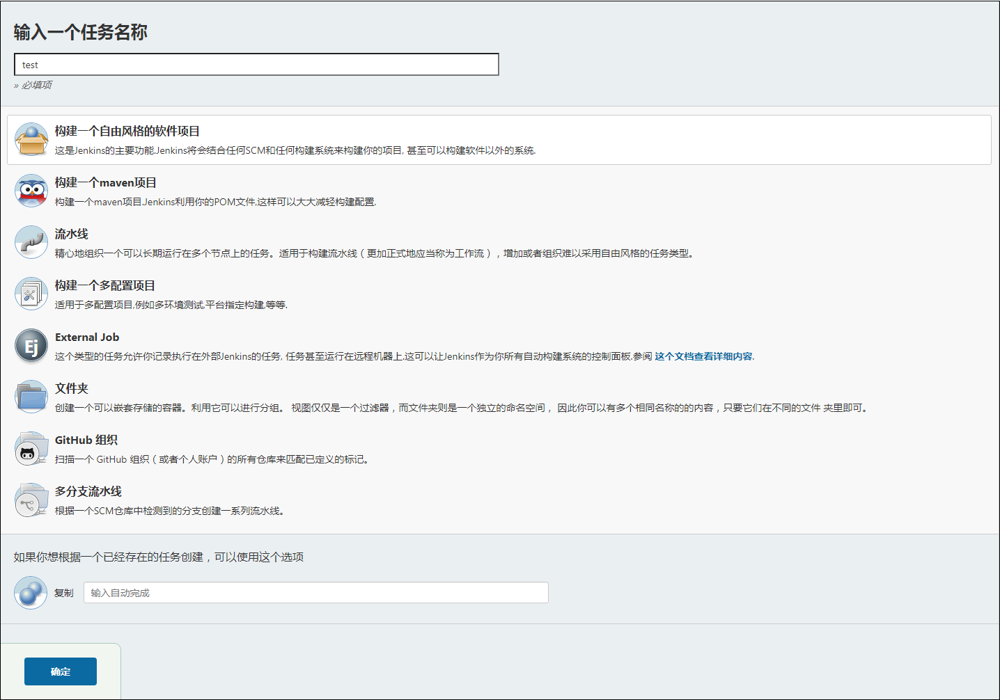
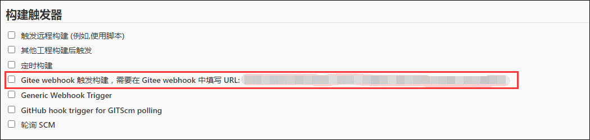
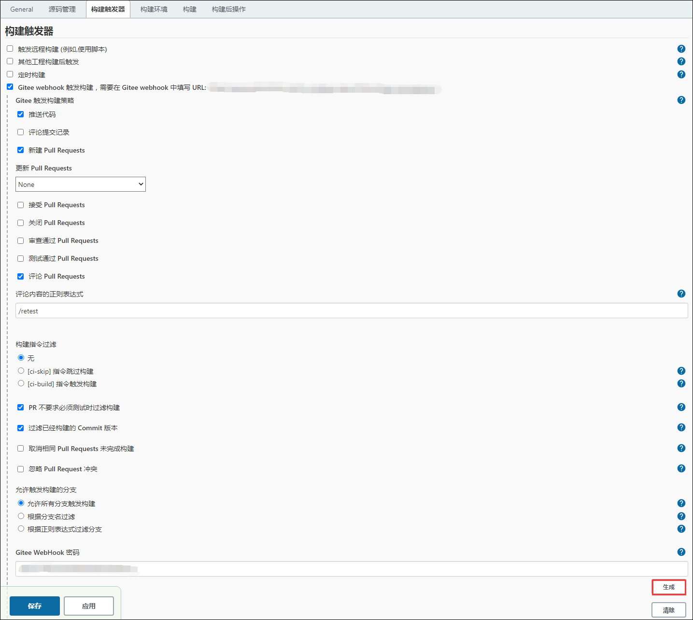
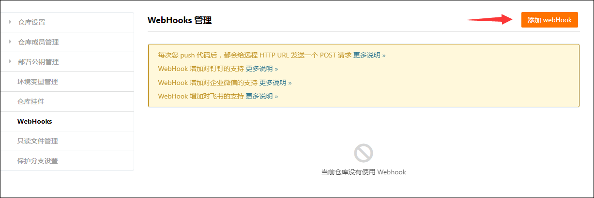
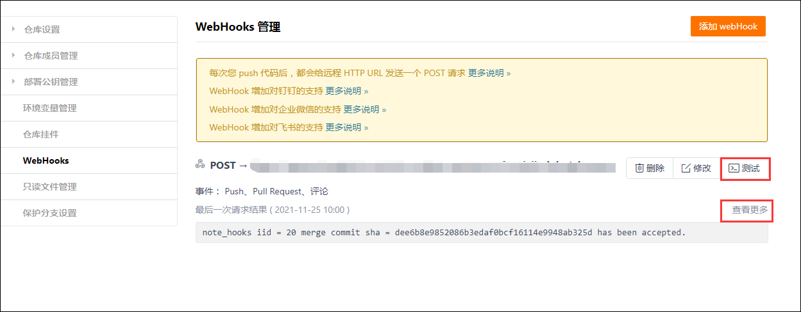
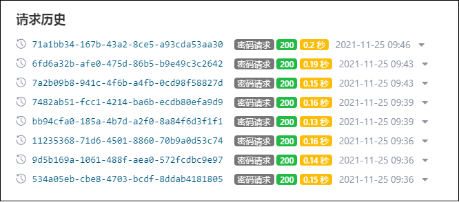

--- 
title: 如何在Jenkins上关联Gitee的Webhook  
date: 2021-11-25
tags:  
    - Jenkins  
    - Gitee  
    - Webhook  
sig: sig-Gatekeeper  
archives: 2021-11  
author: liuqi
summary: 本博客介绍了如何在Jenkins上关联Gitee的Webhook  
  
---   
本文通过Jenkins项目的创建和配置与Gitee webhook的配置介绍了如何添加一个关联Jenkins项目的Gitee webhook

### 创建Jenkins项目  

- 在指定目录下选择`新建Item`
  
  
  
- 输入项目名称，选择`构建一个自由风格的软件项目`并确定，一个Jenkins自定义项目就创建好了，接下来进行设置
  
  

  
### Jenkins项目配置

- 创建项目后默认进入设置，在**构建触发器**下勾选`Gitee webhook 触发构建`，此处的URL作为新增Gitee webhook的URL

  

- 按照下图所示配置，并点击生成 Gitee Webhook 密码，作为新增Gitee webhook的密码
  
  

### 在Gitee仓库配置Webhooks

- 进入将要配置Webhooks的Gitee仓库，从管理项进入**Webhooks**，点击`添加 webHook`

   

- 输入Jenkins项目设置中的**Gitee webhook URL**和**Gitee Webhook 密码**，勾选选择事件的`Pull Request`和`评论`，添加webhook

  
 
- 如图新增了一个webhook，点击`测试`，看到测试成功的弹窗后，点击`查看更多`
  
  

- 在请求历史可查看webhook的每个请求，当请求返回的状态码为200时，说明Jenkins已经接收到了Gitee发出的请求，那么webhook也就配好了
  
  
 
