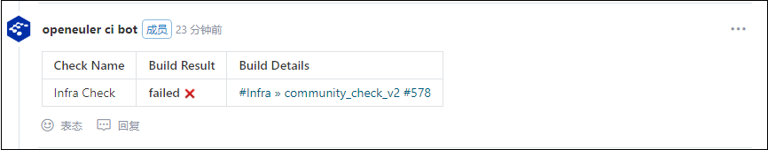
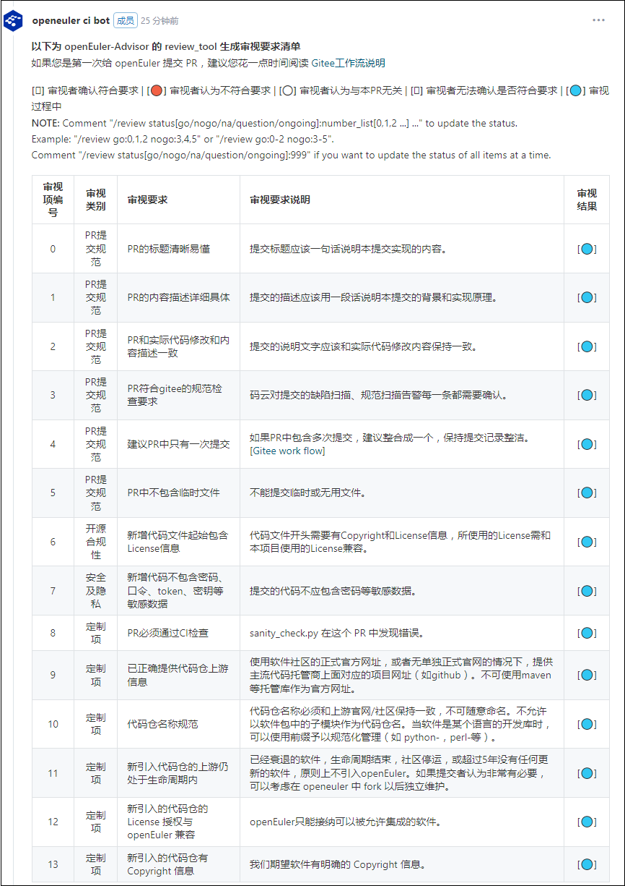

# openEuler 社区门禁工程分享

### openEuler社区的PR合入流程

openeuler-ci-bot（后面统称ci-bot）是openEuler社区的机器人，在检测到新建PR后，ci-bot会评论一条欢迎信息。ci-bot还会检查PR提交者是否已签署了CLA（Contributor License Agreement），如果你尚未签署CLA，ci-bot会在PR中打上`openeuler-cla/no`的标签，并在评论中指引你完成CLA的签署。完成CLA签署后，可评论/check-cla刷新PR中CLA标签的状态。

新建PR或强制推送还会触发社区门禁的构建以及生成PR审视要求清单。
       
- 门禁检查结果
当门禁在进行中时，ci-bot会给PR打上`ci_processing`标签；如果门禁结果为 success，说明PR已经通过了门禁检查，ci-bot会给PR打上`ci_successful`标签；如果是failed的话，具体错误则需要点击Build Details下对应的地址去jenkins的门禁构建console中定位，同时，ci-bot会给PR打上`ci_failed`标签。下图是一个失败的门禁检查结构。

   

	    
-  PR审视清单
审视清单列出了PR需要审视的内容与描述，在审视者确认无误，修改审视结果为符合要求后，审视完成。
   

   
 当一条可合入的PR拥有`openeuler-cla/yes`，`ci_successful`，`lgtm`，`approved`等标签，ci-bot会自动将该PR合入；对处于开启状态的PR，可通过评论/check-pr检查PR的标签是否已满足合入条件，满足的话会合入PR。
     
 如果一条新增仓库的PR被合入，ci-bot在检测到PR合入后创建仓库，并根据仓库所属sig的OWNERS文件为仓库配置开发者。如果新增的是src-openeuler的仓库，ci-bot还会自动为该项目生成_service文件，推到https://gitee.com/src-openeuler/obs_meta的master/openEuler:Factory ，同时会在Jenkins上为该项目创建一系列门禁的工程（trigger，x86-64，aarch64，comment）。
 
### openEuler社区门禁

openEuelr社区门禁的构建托管在Jenkins，地址为 https://openeulerjenkins.osinfra.cn/job/Infra/job/community_check_v2/ ，新建PR或强制推送会触发门禁检查，检查项具体为以下几项：
- conflict check
- sanity check
- branch check

conflict check会检查目标PR是否存在冲突，sanity check会对提交的健全性做一系列检查，branch check则会对仓库的分支变更做检查。

sanity check的检查逻辑可参考源代码 https://gitee.com/openeuler/community/blob/master/ci-scripts/sanity_check.py

branch check的检查逻辑可参考源代码 https://gitee.com/openeuler/community/blob/master/ci-scripts/check_branch.py

branch check的配置文件为 https://gitee.com/openeuler/release-management/blob/master/valid_release_branches.yaml
