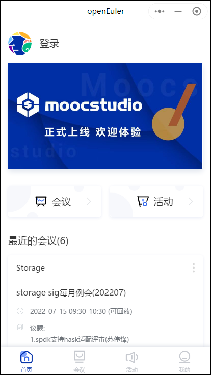
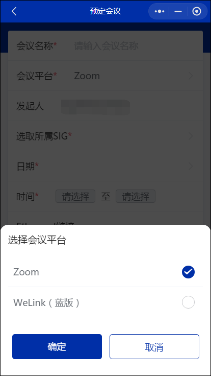
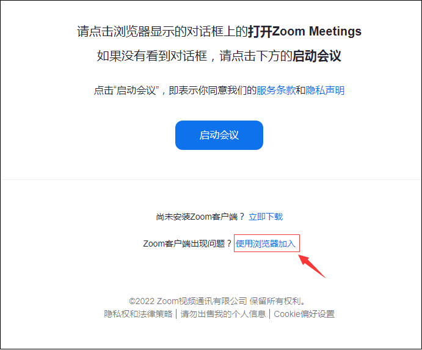
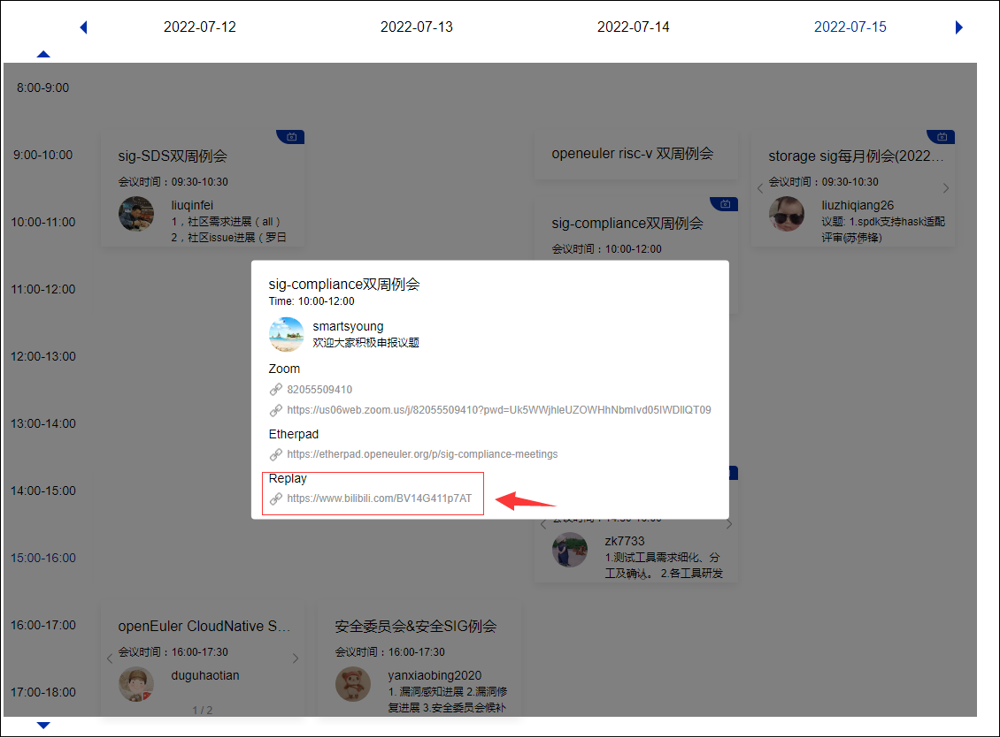

--- 
title: openEuler小程序会议指南
date: 2022-07-15
tags:
    - openEuler
    - 小程序
    - 会议
sig: sig-Gatekeeper
archives: 2022-07
author: liuqi
summary: 本博客介绍了openEuler小程序的会议流程

---

openEuler小程序是一款为参与openEuler社区贡献的维护者、开发者所熟知的微信小程序。

openEuler小程序主页
 

下面是会议模块的流程指引。

### 预定会议

如果您是openEuler社区某个SIG的maintainer，并且有预定SIG会议的需求，在联系小助手添加权限后您可以预定该SIG的会议。在预定会议时，您可以选择是否自动录制会议，选择要通知的邮箱或邮件列表，也可以选择使用不同的第三方会议平台（目前支持Zoom和蓝版WeLink）。预定会议后系统会自动为该会议生成一个便于会前交流和记录会议纪要etherpad（一款支持多人同时在线编辑文本的应用）地址。
 

选择第三方会议平台

### 加入会议

首先在加入会议之前请确保您已在您的设备上安装了对应的第三方会议客户端。

为便于参会者快速进会，预定的会议会生成一个免密的参会地址，您可以快速地从openEuler小程序、openEuler官网日历或会议邀请邮件中获取地址加入会议。

**tips: 如果您在加入Zoom会议时无法进会，可以选择点击启动页面的 `使用浏览器加入` 加入会议。**

Zoom会议使用浏览器加入

### 会议回溯

在一场自动录制的会议结束后，系统会自动获取录像、制作封面并上传到bilibili。

如果您错过了一场自动录制的会议，您可以通过官网日历找到该会议视频链接观众回放。

官网查询回放链接

