 _作者：罗宇哲，中国科学院软件研究所智能软件研究中心_ 

本文介绍了一个自动搭建openEuler虚拟机QEMU运行环境的脚本使用方法，本脚本能下载并安装各种依赖项，自动下载并编译安装QEMU4.1.1和busybox 1.25.1，下载并安装对Linux 4.19.1进行ARM64交叉编译并用gdb进行调试的环境，该环境能帮助我们理解openEuler内核的运行，以及下载和QEMU环境下安装openEuler1.0版。本脚本参考了前辈[1]在ARM32位环境下对Linux Kernel的交叉编译脚本，特此感谢！我们修改了QEMU、busybox和Linux kernel的版本和根文件系统搭建的方法，增加了依赖项，并将ARM交叉编译环境和gdb改为了64位，而且增加了openEuler的相关内容。

## 一、openEuler虚拟机运行环境搭建

环境准备：在VMware 15.1.0 或VirtualBox 6.10上搭建Ubuntu 18.04虚拟机，建议分配硬盘大小120G，内存大小2G以上。

自动搭建脚本码云地址：https://gitee.com/luo_yu_zhe/openEulerInstallation

**运行脚本之间请手动更改下载源为国内源！否则下载较慢，更改源的方式参考[3]。**

###### 脚本运行流程

1. sudo ./prepare.sh
2. source \~/.bashrc
3. sudo ./build.sh, 做完这一步ARM64交叉编译环境、linux kernel 4.19.1、busybox和QEMU以及依赖项应该都装好了。
4. sudo ./start-qemu.sh进行无gdb调试linux kernel 4.19.1 或者sudo./start-qemu-gdb.sh之后另开一个窗口， aarch64-linux-gnu-gdb进入gdb界面，再输入 target remote localhost:1234进入调试阶段，在gdb窗口输入c就可以切换到qemu窗口运行。

sudo ./start-qemu.sh后：

开启gdb运行后：

###### Prepare.sh 脚本功能介绍

该脚本用于下载并解压64位ARM交叉编译工具、QEMU-4.1.1和openEuler镜像，此外，它还会通过apt install 安装依赖项。该脚本会检查压缩包是否存在，若存在不会重复下载解压。

下载openEuler镜像：

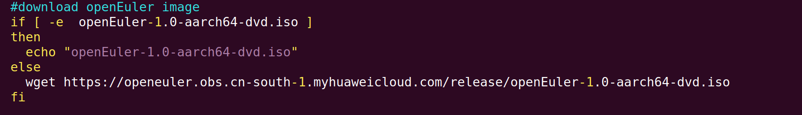

下载并解压交叉编译gcc，设置环境变量：

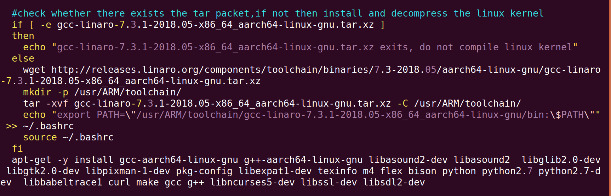

安装依赖项：

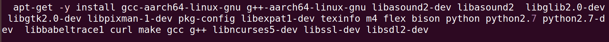

下载并安装QEMU-4.1.1:

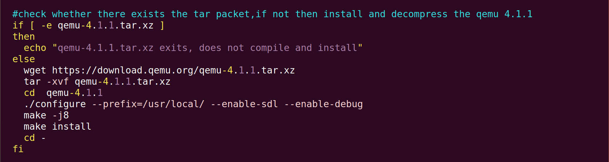

下载QEMU UEFI启动固件并生成img文件，大小可以分配：

###### Build.sh脚本功能介绍

下载并编译linux kernel 4.19.1，下载并编译busybox
1.25.1，制作根文件系统。架构和版本可以通过文件开头的参数进行设置。

下载并编译Linux内核4.19.1版：

把编译好的Image文件copy到目标文件夹：

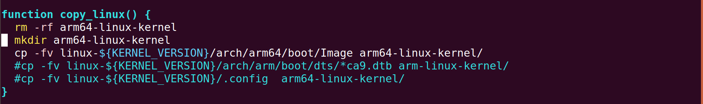

下载并解压busybox:

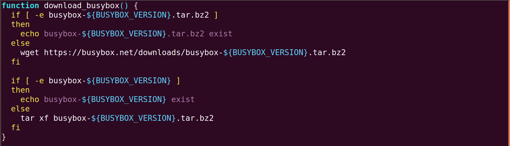

编译安装busybox:

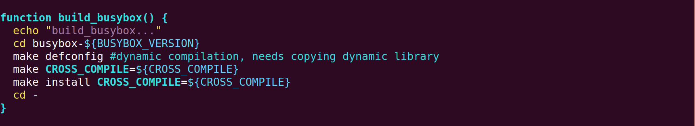

制作根文件系统：

###### qemu启动脚本介绍

start-qemu.sh: qemu普通启动。

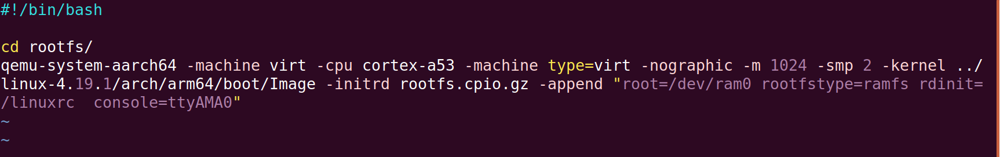

start-qemu-gdb.sh:带gdb 启动。

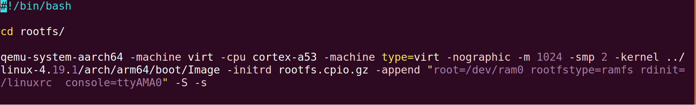

start-euleros.sh :用qemu启动euleros镜像。

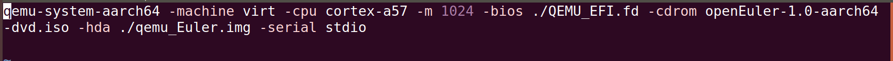

采用gdb模式启动的时候首先运行sudo./start-qemu-gdb.sh命令，然后重新启动一个terminal，运行aarch64-linux-gnu-gdb，输入端口号然后按c。

qemu常见选项[2]：

\-hda file、-hdb file、-hdc file和-hdd file。

把文件当成hard disk 0、hard disk 1、hard disk 2和hard disk 3。

 

\-append cmdline

将cmdline作为kernel command line，所谓kernel command line就是在kernel启动的时候，用cmdline对内核进行配置。比如"root=/dev/hda"，将/dev/hda设置成根文件系统。

\-M machine

选择模拟的机器(我们可以输入-M?提到一个模拟的机器列表)

\-fda file/-fdb file

使用file作为软盘镜像.我们也可以通过将/dev/fd0作为文件名来使用主机软盘。

\-cdrom file

使用文件作为CD-ROM镜像(但是我们不可以同时使用'-hdc'和'-cdrom').我们可以通过使用'/dev/cdrom'作为文件名来使用主机的CD-ROM。

\-boot [a\|c\|d]

由软盘(a),硬盘(c)或是CD-ROM(d).在默认的情况下由硬盘启动.

\-snapshot

写入临时文件而不是写入磁盘镜像文件.在这样的情况下,并没有写回我们所使用的磁盘镜像文件.然而我们却可以通过按下C-a s来强制写回磁盘镜像文件。

\-m megs

设置虚拟内存尺寸为megs M字节.在默认的情况下为128M。

\-smp n

模拟一个有n个CPU的SMP系统.为PC机为目标,最多可以支持255个CPU。

\-nographic

在通常情况下,Qemu使用SDL来显示VGA输出。使用这个选项,我们可以禁止所有的图形输出,这样Qemu只是一个简单的命令行程序。模拟的串口将会重定向到命令行。所以，我们仍然可以在Qemu平台上使用串口命令来调试Linux内核。

## 二、openEuler 系统安装说明

##### 1.QEMU安装openEuler镜像

运行完sudo ./prepare.sh后，运行sudo./start_euleros.sh,运行该脚本会执行一下命令：

qemu-system-aarch64 -machine virt -cpu cortex-a57 -m 1024 -bios ./QEMU_EFI.fd
-cdrom openEuler-1.0-aarch64-dvd.iso -hda ./qemu_Euler.img -serial stdio

QEMU会读入openEuler的镜像文件然后进入安装流程。选择安装openEuler后，选择安装模式（**选择test media选项**），之后分别配置每个前面有”[!]”这个标记的选项，主要有installation destination, root password和user password等，注意选择的时候是先输入选项对应的数字，确定之后按回车，然后再按c（continue）继续安装。以下是一个选择的流程，选项前面有[x]代表选中了该选项：

###### A.选择 Use text mode 选项

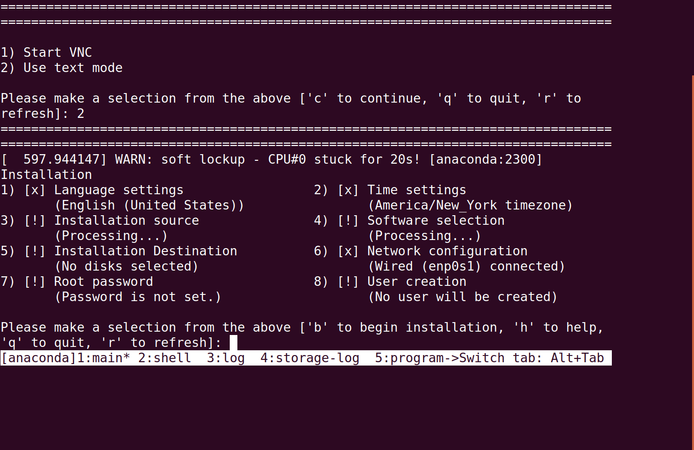

###### B.选择Root password选项并配置

配置完之后我们可以发现大部分之前有[!]的选项之前都变成了[x]。

###### 配置安装目的地

选择大小：

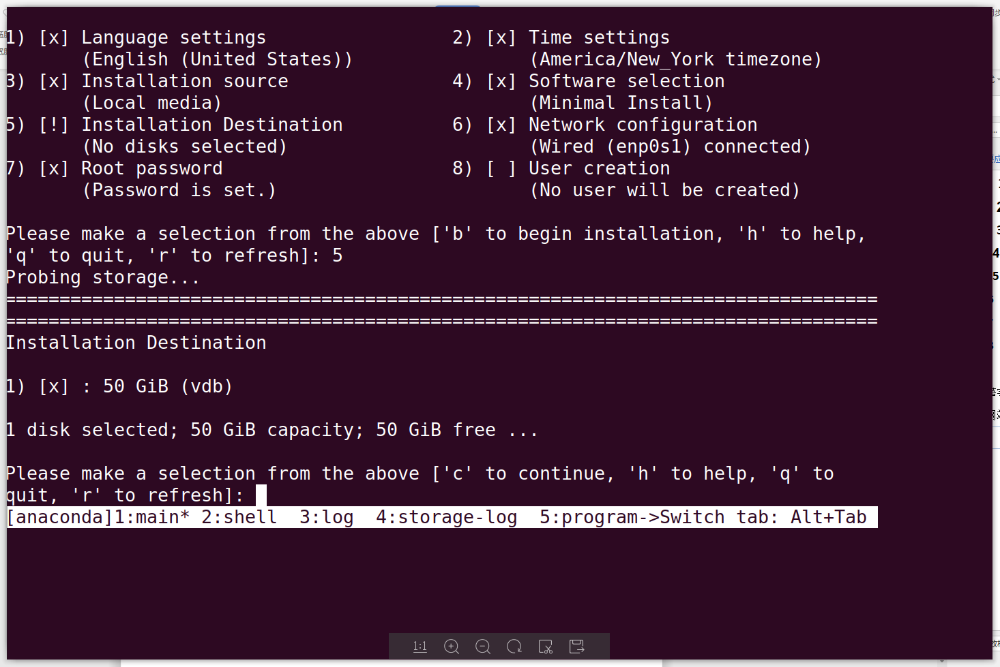

选择使用空间：

VMware：

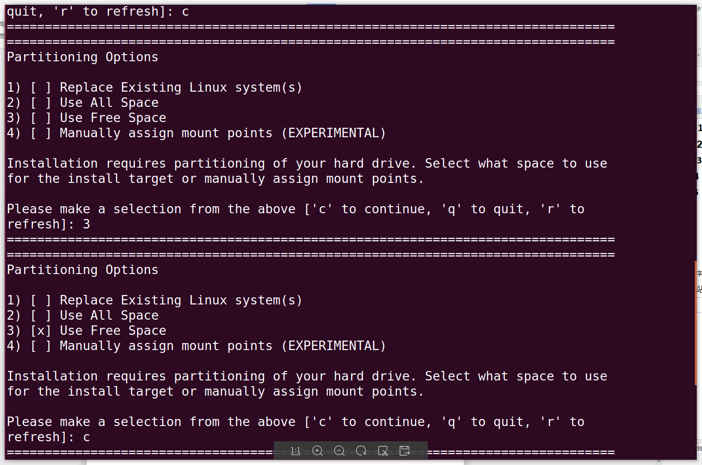

VirtualBox：

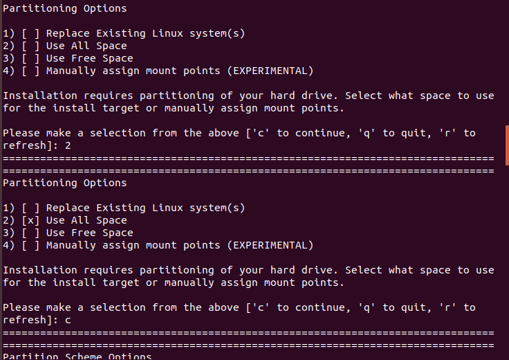

选择Partition方式：

VMware：

VirtualBox：

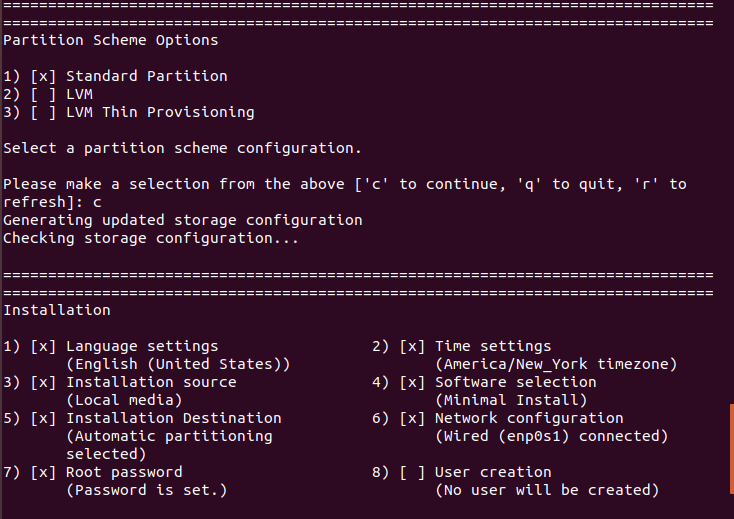

###### 配置用户账户，输入b完成配置

###### E.安装完成

到这一步需要按一下回车然后输入之前设定的用户名和密码才行。

然后就和linux的操作基本一样了\~有一个问题是每次运行都要安装一次，所以装好之后最好能保存一个虚拟机快照。

## 参考文献

[1]https://github.com/xianjimli/qemu-arm-linux.git

[2]https://blog.csdn.net/ustc_dylan/article/details/5385691

[3]https://blog.csdn.net/qq_35451572/article/details/79516563