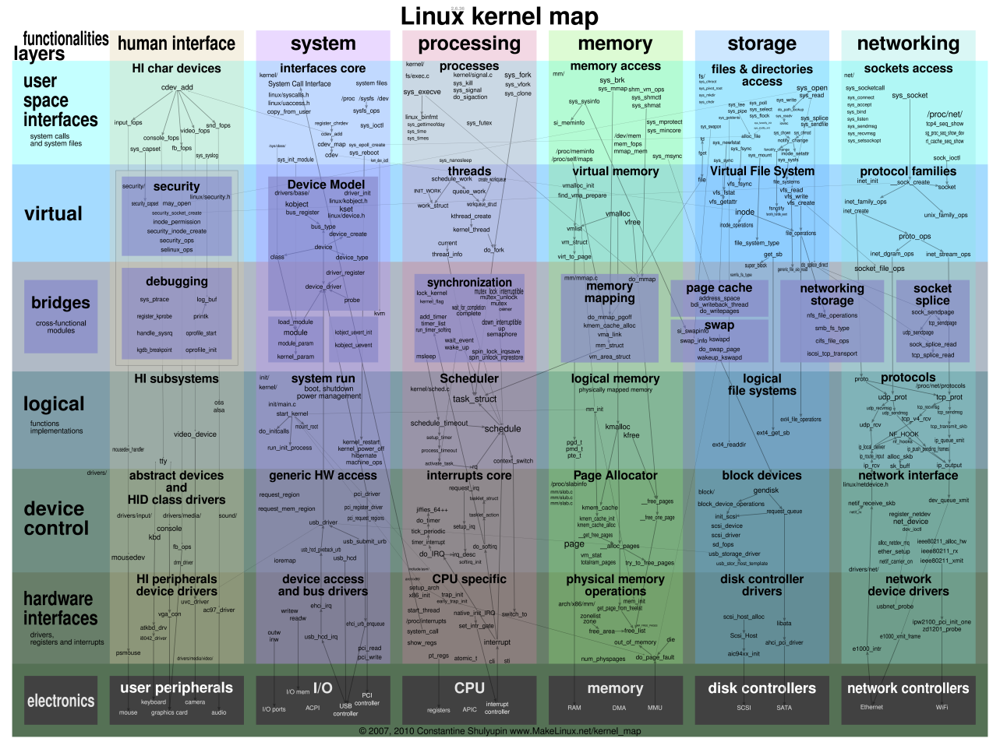
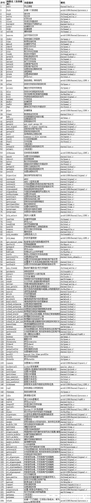
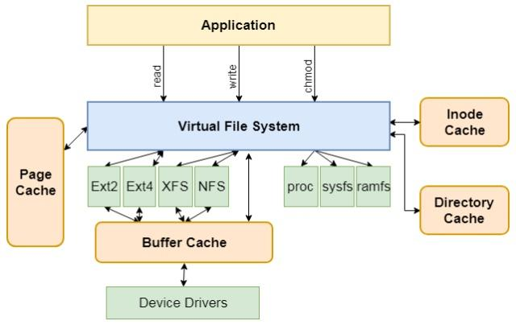
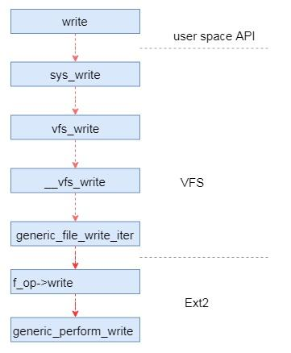

 _作者：罗宇哲，中国科学院软件研究所智能软件研究中心_ 

在上一期中，我们按照openEuler内核的目录结构简要介绍了openEuler内核目录中各个子目录的功能，这一期我们将简要介绍**Linux内核的基本功能和抽象层级。**

### 一、Linux内核Kernel Map简介

Linux内核的Kernel Map从功能上将Linux内核划分为不同功能的区域，并展示了不同区域中函数互相之间的调用关系。下图展示了Linux 2.6.36版内核的Kernel Map[1]:

从Kernel Map中我们可以看出，操作系统事实上提供了硬件资源的抽象，供用户程序调用，例如在图中操作系统管理的硬件资源有用户外设（如键盘、摄像头和图形卡等）、IO端口（如USB、PCI接口等）、CPU、内存、磁盘和网络设备等。

针对所有硬件资源的使用，在用户态程序看来都是一系列的系统调用，这些系统调用展示在user space interface层，例如对于进程来说有fork、execve等系统调用，分别用于创建新的进程和运行可执行文件等；而对于文件系统则有read和write等系统调用，用于读写文件等。Linux系统可以通过执行软中断将系统控制权交给内核，内核可以执行不同的系统调用再将结果返回[2]。下表列出了**Linux内核各系统调用的基本功能**[2]：

硬件设备之上是设备驱动程序，驱动程序能控制硬件设备上的微控制器，如磁盘的磁盘控制器，来达到控制硬件设备的目的。然而，在高层的系统调用和设备驱动程序之间有着很大的鸿沟，需要用不同级别的软件抽象来实现。以用于管理磁盘的文件系统为例，对用户程序来说，只需要关注一般的读写功能统一函数接口就可以了，而不需要关注具体使用的是什么样的文件系统，例如是Ext2还是Ext4文件系统，这是因为虚拟文件系统（VFS）对这些不同的文件系统进行了统一的抽象。虚**拟文件系统与具体的文件系统的关系**如下图所示[3]：

以Ext2文件系统的写数据为例，在调用用户态的write()接口的时候，需要传入文件描述符。内核根据文件描述符找到file，然后调用函数接口（file-\>fop-\>write）将数据写入文件。其中file结构体的fop指针就是在打开文件的时候通过inode初始化的[3]。这个过程如下图所示：

此外，从Kernel Map中可以看出，有一些对系统资源抽象的重要功能，如进程/线程的调度，也在Kernel Map的中间层实现。注意在Linux中，进程和线程都是由task_struct数据结构来管理的，它们的区别在于线程间共享虚拟地址空间而进程的内存资源互相独立[4]。内核从靠近硬件的底层到靠近用户程序的高层，抽象程度逐渐提升，实现了提供给用户程序的各种硬件资源抽象和使用它们所需要的公共功能，最终抽象为系统调用供用户程序使用。内核程序一般运行在CPU的特权级别，可以访问系统的所有资源，而用户态程序运行在CPU的用户级别下，只能访问其进程的资源，这种设计增加了系统的稳定性。

### 二、结语

本期我们结合Linux内核Kernel Map简要介绍了Linux内核的基本功能和抽象层级，从下一期开始我们将介绍Linux内核编程环境。

参考文献

[1] https://makelinux.github.io/kernel/map/

[2] https://baijiahao.baidu.com/s?id=1604601045858159778&wfr=spider&for=pc

[3] https://baijiahao.baidu.com/s?id=1621555464151870974&wfr=spider&for=pc

[4] https://blog.csdn.net/u012218309/article/details/81912074