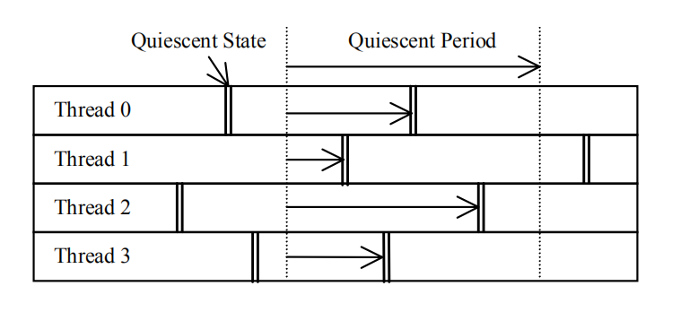
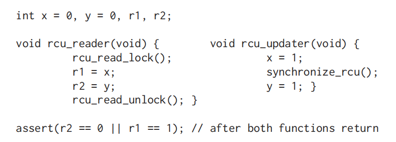
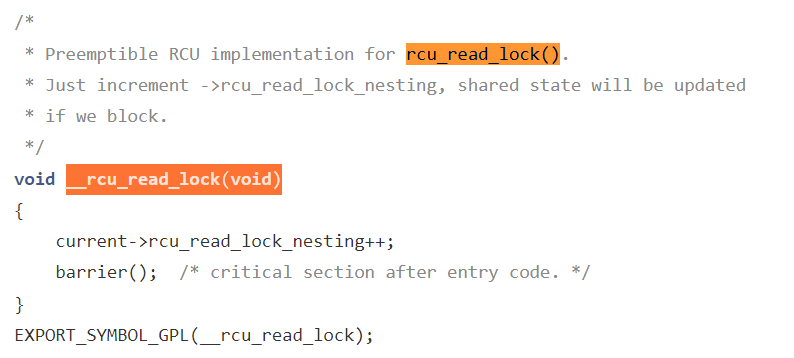

#  openEuler中的Read-Copy Update机制

​        随着CPU核的指令执行速度的提升超过多核架构中延迟下降的速度，全局同步的开销将会被进一步加大，这种情况催生了更有效率的锁机制，Read-Copy Update(RCU)机制就是在这样的背景之下诞生的。RCU机制是针对读访问频率远高于写访问的数据结构而实际的一种非对称的读写同步机制。其基本原理是通过以提升写访问开销的代价换取读访问开销的下降，从而降低对数据结构频繁读少量写的整体开销。RCU机制对读操作不施加同步操作或者锁，从而对数据结构的更新不会阻塞读操作，这就意味着读操作有可能读到旧的值，而读旧值在RCU机制中是允许出现的。

​       为了更好地理解RCU机制，我们需要首先了解以下基本概念：

- 被保护的数据结构（Guarded Data Structure）：被锁等同步机制保护的数据结构，如果没有这些机制的保护该数据结构就不能被安全地访问；

- 静止状态（Quiescent state）：在静止状态中的线程不保留任何被保护的数据结构的前置状态（prior state）；

- 静止期（Quiescent period）：在一个静止期中，每一个线程都至少经历了一个静止状态；

  



上图展示了静止状态和静止期之间的关系，在静止期中，线程1-4先后经历了一个静止状态。容易理解，任何一个包含静止期的时间段都是静止期。**静止期能够保证任何在静止期之前发生的对被保护数据结构的操作都能在静止期之后被观察到。**

​      在RCU机制中，读者可以无锁地对相关数据结构进行读取操作；当写者对相关数据结构进行写操作时，如果读者正在进行读者操作，那么写者需要将原数据结构重新拷贝一份，然后在重新拷贝的数据结构上进行更新操作，再等到适当的时机用新的数据结构替换旧的数据结构。这个合适的时机就是所有读者都退出的时机，这时候更新新的值，那么接下来的读者就能读到新值了。那么如何找到这个读者都退出的时机呢？这就是静止期的作用，如果线程最近经历了一个静止期，那么该线程没有保留所有之前的数据结构的状态，我们就可以确认线程的读操作都退出了。在操作系统中，典型的静止状态有CPU idle状态、运行用户程序、halt和进行上下文切换，在这些操作中，线程不再保留对任何内核数据结构的访问。

​    下面我们来看一个RCU机制的例子，假设线程0正在更新链表中的元素B而线程1在无锁便利该链表：


​    如果线程0无法对元素B进行原子更新操作，那么在线程1的干扰下，它就无法直接修改元素B的值。根据RCU机制的规则，它首先将B拷贝到B Prime：


​    线程0更新被拷贝的B值后，元素A的下一个元素变成了B Prime，但这不影响线程1，因为元素B的旧值仍然存在且其下一个元素为C。现在，线程0只需要等待线程1不再访问元素B就能释放它了：


​    线程0等待一个静止期，这时候线程1已经无法再访问元素B了，是时候释放元素B的空间了：


​      释放元素B之后，链表中的B值已经被新的值替换：


​     RCU机制中，我们需要了解合适静止期结束，从而我们需要一个静止期的检测算法：

1. 任何需要等待静止期的实体将其在静止期后要进行的操作用回调函数的方式注册到其CPU的回调函数链表中；
2. 一段时间之后，该CPU通知其它CPU静止期开始；
3. 每个接到新静止期开始通知的其它CPU保存一个静止状态计数器的快照（我的理解，这个计数器保存了当前已经经历静止状态的CPU的数目，即一个CPU经历了静止状态后，就给该计数器进行加一的原子操作，一个静止期内一个CPU只有一次修改该计数器的机会）；
4. 当每个CPU都发现其快照值与当前的静止状态计数器的快照值不同时，可以确定已经经历了一个静止期，最后一个经历静止状态的CPU同时记录已经经历了一个静止期；
5. 每一个CPU得知新的静止期结束后，调用其回调函数列表中注册的回调函数操作；

在实际的系统设计中，操作系统往往需要支持大量的CPU，从而要求RCU机制具有良好的扩展性，树状RCU孕育而生。在现代操作系统中，**RCU原本设计中的静止期一般也被称为宽限期（grace period）**。实际上，RCU机制中的核心问题是确定何时静止期结束，从而能在适当的时候调用回调函数。然而，在大规模的多CPU系统中记录CPU的静止状态变得更加复杂，而树状RCU能更好地适应这种情况。树状RCU中有两种关键的数据结构：rcu_node和rcu_data。rcu_data用于记录每个处理器的静止状态，它是一个每处理器数据结构, 并构成rcu_node构成的树中的叶子节点中；rcu_node用于将其子节点的静止状态信息上传到根节点，以及从根节点将静止期信息传到CPU。一旦一个rcu_node的子节点全部上报了静止状态信息，该节点就会向父节点报告静止状态信息。当根节点收到了所有静止状态报告后，它会向叶子节点下发静止期结束的通知，从而处理器可以执行该静止期中或在更早的时间注册的回调函数，例如销毁对象的回调函数。

rcu_node在kernel/rcu/tree.h文件中：

```
/*
 * Definition for node within the RCU grace-period-detection hierarchy.
 */
struct rcu_node {
	raw_spinlock_t __private lock;	/* Root rcu_node's lock protects */
					/*  some rcu_state fields as well as */
					/*  following. */
	unsigned long gp_seq;	/* Track rsp->rcu_gp_seq. */
	unsigned long gp_seq_needed; /* Track rsp->rcu_gp_seq_needed. */
	unsigned long completedqs; /* All QSes done for this node. */
	unsigned long qsmask;	/* CPUs or groups that need to switch in */
				/*  order for current grace period to proceed.*/
				/*  In leaf rcu_node, each bit corresponds to */
				/*  an rcu_data structure, otherwise, each */
				/*  bit corresponds to a child rcu_node */
				/*  structure. */
	unsigned long rcu_gp_init_mask;	/* Mask of offline CPUs at GP init. */
	unsigned long qsmaskinit;
	……
				/*  Only one bit will be set in this mask. */
	int	grplo;		/* lowest-numbered CPU or group here. */
	int	grphi;		/* highest-numbered CPU or group here. */
	u8	grpnum;		/* CPU/group number for next level up. */
	u8	level;		/* root is at level 0. */
	bool	wait_blkd_tasks;/* Necessary to wait for blocked tasks to */
				/*  exit RCU read-side critical sections */
				/*  before propagating offline up the */
				/*  rcu_node tree? */
				bool	wait_blkd_tasks;/* Necessary to wait for blocked tasks to */
				/*  exit RCU read-side critical sections */
				/*  before propagating offline up the */
				/*  rcu_node tree? */
	struct rcu_node *parent;
	struct list_head blkd_tasks;
				/* Tasks blocked in RCU read-side critical */
				/*  section.  Tasks are placed at the head */
				/*  of this list and age towards the tail. */
	struct list_head *gp_tasks;
				/* Pointer to the first task blocking the */
				/*  current grace period, or NULL if there */
				/*  is no such task. */
	
				
	
	……
} ____cacheline_internodealigned_in_smp;
```

其中gp_seq为本节点的当前静止期编号；qsmask记录了本节点的子节点的静止状态，一个bit为1表明该bit对应的子节点还没有报告静止期；level记录了本rcu_node在树中所处的层数，根节点处在第0层；parent指针指向本节点的父节点；blkd_tasks为阻塞进程列表，保存了在读端临界区里被其它进程抢占的进程；gp_tasks指向阻塞当前静止期的第一个进程。

rcu_data数据结构的源码也可以在同一个文件中找到：

```
/* Per-CPU data for read-copy update. */
struct rcu_data {
	/* 1) quiescent-state and grace-period handling : */
	unsigned long	gp_seq;		/* Track rsp->rcu_gp_seq counter. */
	unsigned long	gp_seq_needed;	/* Track rsp->rcu_gp_seq_needed ctr. */
	unsigned long	rcu_qs_ctr_snap;/* Snapshot of rcu_qs_ctr to check */
					/*  for rcu_all_qs() invocations. */
	union rcu_noqs	cpu_no_qs;	/* No QSes yet for this CPU. */
	bool		core_needs_qs;	/* Core waits for quiesc state. */
	bool		beenonline;	/* CPU online at least once. */
	bool		gpwrap;		/* Possible ->gp_seq wrap. */
	struct rcu_node *mynode;	/* This CPU's leaf of hierarchy */
	unsigned long grpmask;		/* Mask to apply to leaf qsmask. */
	/* 2) batch handling */
	struct rcu_segcblist cblist;	/* Segmented callback list, with */
					/* different callbacks waiting for */
					/* different grace periods. */
    ……

	int cpu;
	struct rcu_state *rsp;
};
```

其中gp_seq为本处理器看到的当前最高的静止期编号；cpu_no_qs数据结构记录了本处理器是否经历过静止状态; core_need_qs变量表示RCU需要本处理器报告静止状态；cblist本处理器中注册的回调函数列表；cpu是本处理器的编号；rsp则指向一个维护RCU全局状态的数据结构rcu_state。

RCU机制的基本流程，可以用rcu_read_lock(), rcu_read_unlock()和synchronize_rcu（）三个API来描述。其中rcu_read_lock()函数用于进入读端临界区；rcu_read_unlock()用于退出读端临界区；synchronize_rcu()函数用于等待静止期结束。

例如对于如下一段代码：



假设CPU0运行rcu_reader(),CPU1运行rcu_update(),那么该树状RCU包含两个rcu_data数据结构（分别对应CPU0和CPU1）,它们的父节点为一个rcu_node：


在理想状态下，CPU1将x设置为1并调用synchronize_rcu()等待静止期结束，synchronize_rcu()会阻塞CPU1中的进程并造成上下文切换，从而CPU1经历静止状态并由rcu_data记录；CPU0进入读端临界区，读取x和y的值，然后退出读端临界区，一个随后的上下文切换将会使CPU0的rcu_data记录静止状态，从而系统的静止期结束，这时候CPU1的rcu_update()函数可以将y值设置为1了。

其中rcu_read_lock()函数最终调用了函数 **__rcu_read_lock**() ，该函数将读端临界区嵌套次数加一，这种设计允许RCU读者在读端临界区里被其它进程抢占，然后迁移到其它处理器退出读端临界区， **__rcu_read_lock**() 的代码在kernel/rcu/tree_plugin.h文件中可以找到：



相比于进入读端临界区只需要增加读端临界区的嵌套次数，退出读端临界区的过程较为复杂，其代码也在tree_plugin.h文件中：

```
/*
 * Preemptible RCU implementation for rcu_read_unlock().
 * Decrement ->rcu_read_lock_nesting.  If the result is zero (outermost
 * rcu_read_unlock()) and ->rcu_read_unlock_special is non-zero, then
 * invoke rcu_read_unlock_special() to clean up after a context switch
 * in an RCU read-side critical section and other special cases.
 */
void __rcu_read_unlock(void)
{
	struct task_struct *t = current;

	if (t->rcu_read_lock_nesting != 1) {
		--t->rcu_read_lock_nesting;
	} else {
		barrier();  /* critical section before exit code. */
		t->rcu_read_lock_nesting = INT_MIN;
		barrier();  /* assign before ->rcu_read_unlock_special load */
		if (unlikely(READ_ONCE(t->rcu_read_unlock_special.s)))
			rcu_read_unlock_special(t);
		barrier();  /* ->rcu_read_unlock_special load before assign */
		t->rcu_read_lock_nesting = 0;
	}
#ifdef CONFIG_PROVE_LOCKING
	{
		int rrln = READ_ONCE(t->rcu_read_lock_nesting);

		WARN_ON_ONCE(rrln < 0 && rrln > INT_MIN / 2);
	}
#endif /* #ifdef CONFIG_PROVE_LOCKING */
}
EXPORT_SYMBOL_GPL(__rcu_read_unlock);
```

如果嵌套层数不为1，那么说明不是最后一个退出读端临界区的进程，只需要将嵌套层数减一；否则将嵌套层数设置为负数，这样如果被其它进程抢占，则其它进程会意识到该进程正在退出读端临界区的最外层，并继续执行从读端临界区退出的剩余部分，而这个被抢占的进程也会调用rcu_read_unlock_special()函数将自己从rcu_node的阻塞进程列表中删除，最后退出读端临界区最外层的进程将嵌套层数设为0。

synchronize_rcu()的代码也在tree_plugin.h文件中：

```
/**
 * synchronize_rcu - wait until a grace period has elapsed.
 *
 * Control will return to the caller some time after a full grace
 * period has elapsed, in other words after all currently executing RCU
 * read-side critical sections have completed.  Note, however, that
 * upon return from synchronize_rcu(), the caller might well be executing
 * concurrently with new RCU read-side critical sections that began while
 * synchronize_rcu() was waiting.  RCU read-side critical sections are
 * delimited by rcu_read_lock() and rcu_read_unlock(), and may be nested.
 *
 * See the description of synchronize_sched() for more detailed
 * information on memory-ordering guarantees.  However, please note
 * that -only- the memory-ordering guarantees apply.  For example,
 * synchronize_rcu() is -not- guaranteed to wait on things like code
 * protected by preempt_disable(), instead, synchronize_rcu() is -only-
 * guaranteed to wait on RCU read-side critical sections, that is, sections
 * of code protected by rcu_read_lock().
 */
void synchronize_rcu(void)
{
	RCU_LOCKDEP_WARN(lock_is_held(&rcu_bh_lock_map) ||
			 lock_is_held(&rcu_lock_map) ||
			 lock_is_held(&rcu_sched_lock_map),
			 "Illegal synchronize_rcu() in RCU read-side critical section");
	if (rcu_scheduler_active == RCU_SCHEDULER_INACTIVE)
		return;
	if (rcu_gp_is_expedited())
		synchronize_rcu_expedited();
	else
		wait_rcu_gp(call_rcu);
}
EXPORT_SYMBOL_GPL(synchronize_rcu);
```

其基本作用是用于等待静止期的结束。它调用了wait_rcu_gp()函数，该函数会调用wake_me_after_rcu（）函数等待所有读者退出临界区。当所有读者退出临界区后，wake_me_after_rcu（）会唤醒wait_rcu_gp（）函数，随后synchronize_rcu（）函数就能返回调用者了。

那么如何判断静止期结束呢？在树状RCU中，当处理器经历了静止状态，还需将静止状态向上一层汇报，只有当根节点的所有成员都汇报了静止状态，当前静止期才可以结束。在报告静止期的过程中，首先时钟中断函数会调用函数rcu_check_callbacks()，该函数代码在kernel/rcu/tree.c文件中：

```
/*
 * Check to see if this CPU is in a non-context-switch quiescent state
 * (user mode or idle loop for rcu, non-softirq execution for rcu_bh).
 * Also schedule RCU core processing.
 *
 * This function must be called from hardirq context.  It is normally
 * invoked from the scheduling-clock interrupt.
 */
void rcu_check_callbacks(int user)
{
	trace_rcu_utilization(TPS("Start scheduler-tick"));
	increment_cpu_stall_ticks();
	if (user || rcu_is_cpu_rrupt_from_idle()) {

		/*
		 * Get here if this CPU took its interrupt from user
		 * mode or from the idle loop, and if this is not a
		 * nested interrupt.  In this case, the CPU is in
		 * a quiescent state, so note it.
		 *
		 * No memory barrier is required here because both
		 * rcu_sched_qs() and rcu_bh_qs() reference only CPU-local
		 * variables that other CPUs neither access nor modify,
		 * at least not while the corresponding CPU is online.
		 */

		rcu_sched_qs();
		rcu_bh_qs();
		rcu_note_voluntary_context_switch(current);

	} else if (!in_softirq()) {

		/*
		 * Get here if this CPU did not take its interrupt from
		 * softirq, in other words, if it is not interrupting
		 * a rcu_bh read-side critical section.  This is an _bh
		 * critical section, so note it.
		 */

		rcu_bh_qs();
	}
	rcu_preempt_check_callbacks();
	/* The load-acquire pairs with the store-release setting to true. */
	if (smp_load_acquire(this_cpu_ptr(&rcu_dynticks.rcu_urgent_qs))) {
		/* Idle and userspace execution already are quiescent states. */
		if (!rcu_is_cpu_rrupt_from_idle() && !user) {
			set_tsk_need_resched(current);
			set_preempt_need_resched();
		}
		__this_cpu_write(rcu_dynticks.rcu_urgent_qs, false);
	}
	if (rcu_pending())
		invoke_rcu_core();

	trace_rcu_utilization(TPS("End scheduler-tick"));
}


```

该函数首先检查了CPU是否经历了非Context Switch的静止状态，如用户模式或idle loop。如果是，那么调用rcu_sched_qs()函数将静止状态记录在CPU对应的rcu_data中；否则，判断该中断不是在软中断中触发，如果不是的话就调用rcu_bh_qs()函数记录静止状态。然后调用rcu_preempt_check_callbacks()函数，进而调用rcu_preempt_qs（）函数记录静止状态。最后调用rcu_pending()函数检查是否有RCU相关的工作需要处理，如果有，那么调用invoke_rcu_core()函数，该函数的代码在同一个文件中：

```
static void invoke_rcu_core(void)
{
	if (cpu_online(smp_processor_id()))
		raise_softirq(RCU_SOFTIRQ);
}
```

它触发了一个RCU软中断，该软中断的处理函数为rcu_process_call_backs(),从而一旦CPU有中断、抢占或底半机制使能的情况，就会调用rcu_process_call_backs()函数，这就启动了当前静止期的回调函数处理机制。rcu_process_call_backs()函数的代码在kernel/rcu/tree.c文件中可以找到：

```
/*
 * Do RCU core processing for the current CPU.
 */
static __latent_entropy void rcu_process_callbacks(struct softirq_action *unused)
{
	struct rcu_state *rsp;

	if (cpu_is_offline(smp_processor_id()))
		return;
	trace_rcu_utilization(TPS("Start RCU core"));
	for_each_rcu_flavor(rsp)
		__rcu_process_callbacks(rsp);
	trace_rcu_utilization(TPS("End RCU core"));
}
```

该函数调用了__rcu_process_callbacks（）函数，其代码在同一个文件中可以找到：

```
/*
 * This does the RCU core processing work for the specified rcu_state
 * and rcu_data structures.  This may be called only from the CPU to
 * whom the rdp belongs.
 */
static void
__rcu_process_callbacks(struct rcu_state *rsp)
{
	unsigned long flags;
	struct rcu_data *rdp = raw_cpu_ptr(rsp->rda);
	struct rcu_node *rnp = rdp->mynode;

	WARN_ON_ONCE(!rdp->beenonline);

	/* Update RCU state based on any recent quiescent states. */
	rcu_check_quiescent_state(rsp, rdp);

	/* No grace period and unregistered callbacks? */
	if (!rcu_gp_in_progress(rsp) &&
	    rcu_segcblist_is_enabled(&rdp->cblist)) {
		local_irq_save(flags);
		if (!rcu_segcblist_restempty(&rdp->cblist, RCU_NEXT_READY_TAIL))
			rcu_accelerate_cbs_unlocked(rsp, rnp, rdp);
		local_irq_restore(flags);
	}

	rcu_check_gp_start_stall(rsp, rnp, rdp);

	/* If there are callbacks ready, invoke them. */
	if (rcu_segcblist_ready_cbs(&rdp->cblist))
		invoke_rcu_callbacks(rsp, rdp);

	/* Do any needed deferred wakeups of rcuo kthreads. */
	do_nocb_deferred_wakeup(rdp);
}
```

该函数首先调用rcu_check_quiescent_state（），后者检查是否有新的宽限期开始或者本处理器是否已经经历了一个静止状态，其代码在同一个文件中可以找到：

```
/*
 * Check to see if there is a new grace period of which this CPU
 * is not yet aware, and if so, set up local rcu_data state for it.
 * Otherwise, see if this CPU has just passed through its first
 * quiescent state for this grace period, and record that fact if so.
 */
static void
rcu_check_quiescent_state(struct rcu_state *rsp, struct rcu_data *rdp)
{
	/* Check for grace-period ends and beginnings. */
	note_gp_changes(rsp, rdp);

	/*
	 * Does this CPU still need to do its part for current grace period?
	 * If no, return and let the other CPUs do their part as well.
	 */
	if (!rdp->core_needs_qs)
		return;

	/*
	 * Was there a quiescent state since the beginning of the grace
	 * period? If no, then exit and wait for the next call.
	 */
	if (rdp->cpu_no_qs.b.norm)
		return;

	/*
	 * Tell RCU we are done (but rcu_report_qs_rdp() will be the
	 * judge of that).
	 */
	rcu_report_qs_rdp(rdp->cpu, rsp, rdp);
}
```

如果处理器经历了一个静止状态，rcu_check_quiescent_state（）函数调用rcu_report_qs_rdp（）函数将静止状态记录到处理器的rcu_data中。在更新了处理器的状态后，__rcu_process_callbacks（）函数将调用invoke_rcu_callbacks（）函数处理当前静止期结束前注册的回调函数，其代码也在tree.c文件中：

```
/*
 * Schedule RCU callback invocation.  If the specified type of RCU
 * does not support RCU priority boosting, just do a direct call,
 * otherwise wake up the per-CPU kernel kthread.  Note that because we
 * are running on the current CPU with softirqs disabled, the
 * rcu_cpu_kthread_task cannot disappear out from under us.
 */
static void invoke_rcu_callbacks(struct rcu_state *rsp, struct rcu_data *rdp)
{
	if (unlikely(!READ_ONCE(rcu_scheduler_fully_active)))
		return;
	if (likely(!rsp->boost)) {
		rcu_do_batch(rsp, rdp);
		return;
	}
	invoke_rcu_callbacks_kthread();
}
```

如果处理器支持RCU priority boosting，则直接调用rcu_do_batch（）函数处理回调函数；否则唤醒每处理器的kthread处理回调函数。rcu_do_bach()函数的代码也在tree.c文件中：

```
/*
 * Invoke any RCU callbacks that have made it to the end of their grace
 * period.  Thottle as specified by rdp->blimit.
 */
static void rcu_do_batch(struct rcu_state *rsp, struct rcu_data *rdp)
{
	unsigned long flags;
	struct rcu_head *rhp;
	struct rcu_cblist rcl = RCU_CBLIST_INITIALIZER(rcl);
	long bl, count;

	/* If no callbacks are ready, just return. */
	if (!rcu_segcblist_ready_cbs(&rdp->cblist)) {
		trace_rcu_batch_start(rsp->name,
				      rcu_segcblist_n_lazy_cbs(&rdp->cblist),
				      rcu_segcblist_n_cbs(&rdp->cblist), 0);
		trace_rcu_batch_end(rsp->name, 0,
				    !rcu_segcblist_empty(&rdp->cblist),
				    need_resched(), is_idle_task(current),
				    rcu_is_callbacks_kthread());
		return;
	}

	/*
	 * Extract the list of ready callbacks, disabling to prevent
	 * races with call_rcu() from interrupt handlers.  Leave the
	 * callback counts, as rcu_barrier() needs to be conservative.
	 */
	local_irq_save(flags);
	WARN_ON_ONCE(cpu_is_offline(smp_processor_id()));
	bl = rdp->blimit;
	trace_rcu_batch_start(rsp->name, rcu_segcblist_n_lazy_cbs(&rdp->cblist),
			      rcu_segcblist_n_cbs(&rdp->cblist), bl);
	rcu_segcblist_extract_done_cbs(&rdp->cblist, &rcl);
	local_irq_restore(flags);

	/* Invoke callbacks. */
	rhp = rcu_cblist_dequeue(&rcl);
	for (; rhp; rhp = rcu_cblist_dequeue(&rcl)) {
		debug_rcu_head_unqueue(rhp);
		if (__rcu_reclaim(rsp->name, rhp))
			rcu_cblist_dequeued_lazy(&rcl);
		/*
		 * Stop only if limit reached and CPU has something to do.
		 * Note: The rcl structure counts down from zero.
		 */
		if (-rcl.len >= bl &&
		    (need_resched() ||
		     (!is_idle_task(current) && !rcu_is_callbacks_kthread())))
			break;
	}

	local_irq_save(flags);
	count = -rcl.len;
	trace_rcu_batch_end(rsp->name, count, !!rcl.head, need_resched(),
			    is_idle_task(current), rcu_is_callbacks_kthread());

	/* Update counts and requeue any remaining callbacks. */
	rcu_segcblist_insert_done_cbs(&rdp->cblist, &rcl);
	smp_mb(); /* List handling before counting for rcu_barrier(). */
	rcu_segcblist_insert_count(&rdp->cblist, &rcl);

	/* Reinstate batch limit if we have worked down the excess. */
	count = rcu_segcblist_n_cbs(&rdp->cblist);
	if (rdp->blimit == LONG_MAX && count <= qlowmark)
		rdp->blimit = blimit;

	/* Reset ->qlen_last_fqs_check trigger if enough CBs have drained. */
	if (count == 0 && rdp->qlen_last_fqs_check != 0) {
		rdp->qlen_last_fqs_check = 0;
		rdp->n_force_qs_snap = rsp->n_force_qs;
	} else if (count < rdp->qlen_last_fqs_check - qhimark)
		rdp->qlen_last_fqs_check = count;

	/*
	 * The following usually indicates a double call_rcu().  To track
	 * this down, try building with CONFIG_DEBUG_OBJECTS_RCU_HEAD=y.
	 */
	WARN_ON_ONCE(rcu_segcblist_empty(&rdp->cblist) != (count == 0));

	local_irq_restore(flags);

	/* Re-invoke RCU core processing if there are callbacks remaining. */
	if (rcu_segcblist_ready_cbs(&rdp->cblist))
		invoke_rcu_core();
}
```

该函数遍历已经准备好的回调函数的列表，并执行函数，最后调用invoke_rcu_core()函数处理剩余的回调函数,invoke_rcu_core()函数直接触发rcu软中断：

```
static void invoke_rcu_core(void)
{
	if (cpu_online(smp_processor_id()))
		raise_softirq(RCU_SOFTIRQ);
}
```

另一方面，唤醒每处理器的kthread处理回调函数的invoke_rcu_callbacks_kthread()函数的代码在kernel/rcu/tree_plugin.h文件中可以找到：

```
/*
 * Wake up the per-CPU kthread to invoke RCU callbacks.
 */
static void invoke_rcu_callbacks_kthread(void)
{
	unsigned long flags;

	local_irq_save(flags);
	__this_cpu_write(rcu_cpu_has_work, 1);
	if (__this_cpu_read(rcu_cpu_kthread_task) != NULL &&
	    current != __this_cpu_read(rcu_cpu_kthread_task)) {
		rcu_wake_cond(__this_cpu_read(rcu_cpu_kthread_task),
			      __this_cpu_read(rcu_cpu_kthread_status));
	}
	local_irq_restore(flags);
}
```

到这里为止，我们已经介绍了openEuler中RCU相关的一些基础知识，包括RCU的基本原理、RCU的使用方法、RCU相关的数据结构、RCU中的静止状态监测机制和上报机制以及回调函数的处理机制等。

------

参考文献

[1]Mckenney, Paul & SLINGWINE, JOHN. (1998). Read-copy update: Using execution history to solve concurrency problems. Parallel and Distributed Computing and Systems. 

[2] Liang L , Mckenney P E , Kroening D , et al. Verification of tree-based hierarchical read-copy update in the Linux kernel[C]// Design, Automation and Test in Europe Conference and Exhibition. 0. 

[3]《Linux内核深度解析》，余华兵著，2019