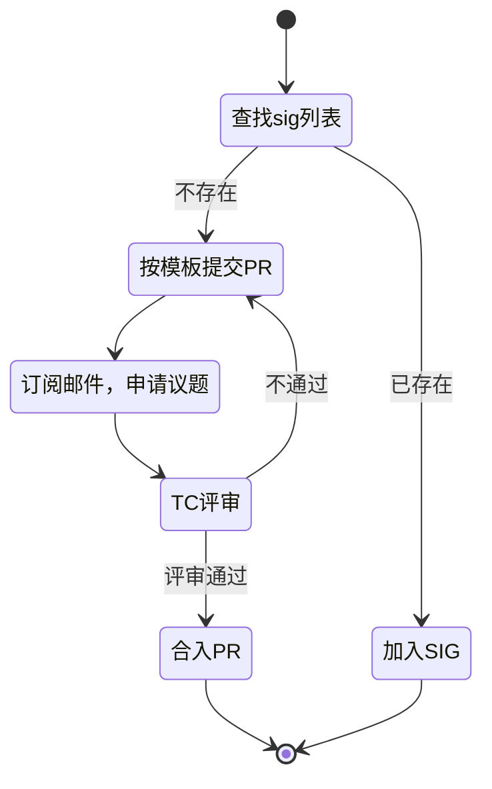
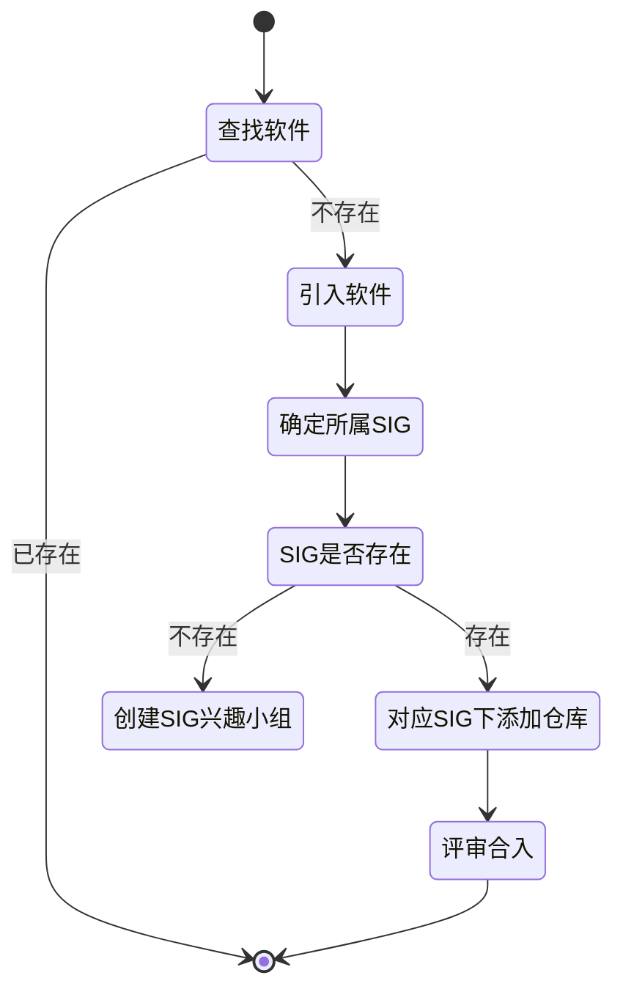

--- 
title: 我的社区参与之旅
date: 2020-06-10
tags:
  - 社区运营
  - 参与贡献
  - 流程规范
archives: 2020-06
author: overweight
summary: 我的社区参与之旅，介绍openEuler社区流程和操作。
---


## openEuler是什么?

openEuler是一个开源、免费的Linux发行版平台，将通过开放的社区形式与全球的开发者共同构建一个开放、多元和架构包容的软件生态体系。同时，openEuler也是一个创新的平台，鼓励任何人在该平台上提出新想法、开拓新思路、实践新方案。

**安装界面：**


**openEuler的官方网站： https://openeuler.org/**

**repo 下载地址： https://repo.openeuler.org**

**文档手册：https://openeuler.org/zh/docs/20.03_LTS/docs/Releasenotes/release_notes.html**


## openEuler版本怎么规划?


说明：

1. 有创新版本和LTS（Long term support）版本两条线的版本。

2. 遵循Upstream First原则，软件带包直接来源于原生社区，并反哺原生社区。

3. master分支即为当前最新版本开发分支，一旦发布创新版本或LTS版本，

   即会基于当前master主干拉出对应版本分支进入维护阶段。

|          | openEuler 创新版本（非LTS）            | **openEuler** LTS版本      |
| -------- | -------------------------------------- | -------------------------- |
| 版本定位 | 构筑开发者生态，新特性活跃，版本演进快 | 支持合作伙伴构筑商业发行版 |
| 发布周期 | 0.5年                                  | 2年                        |
| 维护周期 | 0.5年                                  | 4年 or more                |
| 质量标准 | 低，对标fedora质量要求                 | 中，对标centos质量要求     |
| 关键工作 | **新特性、**bugfix、CVE、升级选型等    | **有限特性、**bugfix、CVE  |
| 对应分支 | 当前无，下一个版本openEuler-20.09      | 最新分支openEuler-20.03LTS |

## openEuler 版本如何构建？

**openEuler构建模型：**


**版本如何构建：**


**说明：**

| 名字                     | 说明                                                         | 备注                                                         |
| ------------------------ | ------------------------------------------------------------ | ------------------------------------------------------------ |
| 码云 openuler  Group     | 这个组织下存放的都是由openEuler社区发起的原生项目，<br />相当于一个一个的上游社区。例如isula、atune项目。 | https://gitee.com/openeuler                                  |
| 码云 src-openeuler Group | 这里存放的是以rpm 源码形式的代码。每个仓库源码都可以直接构建rpm二进制。 | https://gitee.com/src-openeuler                              |
| OBS                      | open build service，opensuse发布的一套开源构建系统，类似于koji、yacto等。 | https://build.openeuler.org<br />https://openbuildservice.org |
| jenkins                  | CI/CD，持续集成平台，主要用于门禁任务、版本构建任务调度等    | http://114.116.250.98/                                       |
| repo                     | 用于归档发布的交付件及yum 软件源。                           | https://repo.openeuler.org/                                  |

## openEuler 版本里有啥软件？

最直观的方式是访问openEuler官方repo，看看发布件。

| 发布件                                                       | **构建工具**                  | **Repo****归档地址**                                         |
| ------------------------------------------------------------ | ----------------------------- | ------------------------------------------------------------ |
| ISO： <br /> Dvd  ISO 、<br />Debuginfo  ISO<br />  Everything  ISO  <br />Source  ISO | mkdvdiso（待开源）、     kiwi | http://repo.openeuler.org/openEuler-20.03-LTS/ISO            |
| Qcow2镜像                                                    | CreateImage（待开源）         | http://repo.openeuler.org/openEuler-20.03-LTS/docker_img     |
| 容器镜像                                                     | kiwi                          | http://repo.openeuler.org/openEuler-20.03-LTS/virtual_machine_img |
| LiveCD  ？                                                   |                               |                                                              |
| …                                                            |                               |                                                              |

另外一种方式，就是访问openEuler OBS上的构建工程，可以知道每个版本里包含哪些软件，当前的构建状态是啥样的。

| 版本                  | OBS工程                       | 说明                                                    | 约束                                    | 地址                                                         |
| --------------------- | ----------------------------- | ------------------------------------------------------- | --------------------------------------- | ------------------------------------------------------------ |
| master主干            | openEuler:Factory（新包引入） | 新软件加入，首先引入到openEuler软件工场，master分支代码 | 构建rpm，不会集成到iso或repo中          | https://build.openeuler.org/project/show/openEuler:Factory   |
|                       | openEuler:Mainline            | 主线工程，master分支代码                                | 里面涉及的包都会随着openEuler的版本发布 | https://build.openeuler.org/project/show/openEuler:Mainline  |
| LTS版本               | openEuler:20.03:LTS           | LTS版本构建工程，openeuler-20.03-LTS分支代码            |                                         | https://build.openeuler.org/project/show/openEuler:20.03:LTS |
| 20.09版本（未拉分支） | ---                           |                                                         |                                         | ---                                                          |

## 软件是如何管理的？

**openeuler源码仓库管理：**

- openEuler所有代码托管在gitee.com
- 有openeuler、src-openeuler两个group
- 都是源码化、配置化管理

| **group** | **openeuler**               | **src-openeuler**               |
| --------- | --------------------------- | ------------------------------- |
| 定位      | 代码仓、原生社区            | 软件包仓、制品仓                |
| 内容      | openEuler发起的原生项目     | spec  rpm格式归档的软件包仓库   |
| URL       | https://gitee.com/openeuler | https://gitee.com/src-openeuler |
| 仓库数量  | 50+                         | 2500+                           |
| 代码管理  | 源码树                      | src  rpm格式                    |
| 关系      | 是src-openeuler的上游社区   |                                 |

当前openEuler 软件的管理是**以sig组来承载**，所有的软件**唯一的归属于某个sig**。通过[sigs.yaml文件](https://gitee.com/openeuler/community/blob/3f8f9a73de9435857ce524e1ce387d2499a51f32/sig/sigs.yaml)，你可以查询到该软件属于哪个sig，并通过[sigs专有归档目](https://gitee.com/openeuler/community/tree/3f8f9a73de9435857ce524e1ce387d2499a51f32/sig)你可以查询对应的maintainer。**只有对应的maintainer才有对应仓库代码合入权限。**


openeuler/community仓库下，以下三个文件比较重要：

[sig/sigs.yaml](https://gitee.com/openeuler/community/blob/master/sig/sigs.yaml)   管理和维护各sig下维护的软件包，划分sig管理的软件包范围。

[repository/openeuler.yaml](https://gitee.com/openeuler/community/blob/master/repository/openeuler.yaml) openeuler下维护的软件包仓库信息。

[repository/src-openeuler.yaml]([src-openeuler.yaml](https://gitee.com/openeuler/community/blob/master/repository/src-openeuler.yaml))  src-openeuler下维护的软件包仓库信息。

通过修改这几个文件，来新增、删除软件包仓库，来给相应的软件包划分sig，从而实现sig的owner对软件包的权限管理。

##  了解openEuler SIGs

SIG就是Special Interest Group的缩写，openEuler社区按照不同的SIG来组织，以便于更好的管理和改善工作流程。

- SIG组和SIG的邮件列表是开放的，欢迎任何人和团体加入并参与贡献。
- SIG都是针对特定的一个或多个技术主题而成立的。SIG内的成员推动交付成果输出，并争取让交付成果成为openEuler社区发行的一部分。
- SIG的核心成员主导SIG的治理。请查看[SIG的角色说明](https://gitee.com/openeuler/community/blob/master/community-membership_cn.md)。您可以在贡献的同时积累经验和提升影响力。
- 每一个SIG在Gitee上都会拥有一个或多个项目，这些项目会拥有一个或多个Repository。SIG的交付成果会保存在这些Repository内。
- 可以在SIG对应的Repository内提交Issue、针对特定问题参与讨论，提交和解决问题，参与评审等。
- 您也可以通过邮件列表、IRC或视频会议和SIG内的成员进行交流。

**openEuler SIG 维护策略**

1. 根据所有软件所涉及领域和方向，openEuler已经垂直的划分了很多基础的SIG。
2. 每个独立软件要归属到唯一SIG里，SIG的maintainer管理该SIG涉及的软件包，并定期审视。
3. SIG之间要避免正交、耦合，粒度要合理，管理的软件仓规模避免太大。
4. 新成立SIG时，应提前了解当前openEuler是否已经存在相同或类似的SIG。
5. 新SIG申请时，应考虑和其他SIG沟通，将该SIG领域涉及软件一并接管过来。
6. SIG的成立、运营、废弃受TC委员会监管。

## openEuler社区开发全景？


上图是openEuler社区开发指引图。

说明：

1. 软件包管理按照软件包所处的时间点分为：、、。
2. 每个阶段的输入是圆框绿底，如。
3. 所有的开发和维护动作是由issue触发。issue可分为需求、问题、CVE等类型。。
4. 所有修改和操作通过PR来发起。
5. 全景图中，每个动作都可能涉及规范或指导。将在后面以表格的方式整理呈现。

**全景图中涉及的规范：**

| 阶段      | 动作                                                         | 规范或指导                                                   |
| --------- | ------------------------------------------------------------ | ------------------------------------------------------------ |
| 引入      |                                                              |                                                              |
|           |  | 指导：《如何申请SIG》 --待输出--                             |
|           |  | 规范：[《软件包引入和退出要求》](https://gitee.com/openeuler/community/blob/master/zh/technical-committee/governance/software-management.md)<br />指导：《openEuler加包指导》 --待输出-- |
|           |  | 规范：[《软件包打包规范》](https://gitee.com/openeuler/community/blob/master/zh/contributors/packaging.md) |
| 开发&维护 |                                                              |                                                              |
|           |  | 规范：《软件包升级选型规范》 --待输出--                      |
|           |  | 指导：[《软件包打包规范》](https://gitee.com/openeuler/community/blob/master/zh/contributors/packaging.md) |
|           |  | 规范：[《软件包打包规范》](https://gitee.com/openeuler/community/blob/master/zh/contributors/packaging.md)<br />指导：《如何提交PR、发起检视及合入验证》  --待输出-- |
|           |  | 规范：[《openEuler漏洞处理流程》](https://gitee.com/openeuler/security-committee/blob/master/security-process.md)<br />规范：[《openEuler漏洞严重性评估》](https://gitee.com/openeuler/security-committee/blob/master/security-evaluation.md)<br />指导：[《如何申请CVE、漏洞上报》](https://openeuler.org/zh/security.html) |
|           |  | 规范：《openEuler软件包随版本发布规范》 --待输出--<br />指导：《如何将软件包加入openEuler发布版本》--待输出-- |
|           |  | 规范：[《安全漏洞处理和发布流程》](https://gitee.com/openeuler/security-committee/blob/master/security-process.md) |
| 退出      |                                                              |                                                              |
|           |  | 规范：[《软件包引入和退出要求》](https://gitee.com/openeuler/community/blob/master/zh/technical-committee/governance/software-management.md) |

## 如果参与openEuler社区贡献？

第一步，开源并不意味者随心所欲，**签署CLA**：[“贡献者许可协议”](https://openeuler.org/zh/cla.html)是第一步，阅读并遵守openEuler社区的[行为守则](https://gitee.com/openeuler/community/blob/master/code-of-conduct.md)；

第二步，从了解、安装、使用、测试openEuler开始，**积极反馈问题和建议**，相关的[文档和手册](https://openeuler.org/zh/docs/20.03_LTS/docs/Releasenotes/release_notes.html)，以及相关的[资讯](https://openeuler.org/zh/blog.html)可以帮助你更加深入的了解openEuler。

第三步，开发者熟悉社区的开发流程后——[《贡献者指南》](https://openeuler.org/zh/developer.html)，可以基于自己感兴趣的项目和软件，在码云上openEuler对应的项目提交自己的贡献。

## 了解gitee工作流

- **准备工作**  

   [安装GIT](https://git-scm.com/downloads)、[注册账号](https://gitee.com/help/articles/4113)、[环境配置](https://gitee.com/openeuler/community/blob/master/zh/contributors/prepare-environment.md)、[找到感兴趣的项目](https://gitee.com/openeuler/community/blob/master/zh/contributors/README.md)

- **Fork仓库**

  

- **克隆到本地**

  ```bash
  git clone https://gitee.com/openeuler/kernel
  ```


- **拉分支**

  ```bash
  git checkout -b myfeature
  ```

- **修改验证提交**

  ```bash
  git add .
  git commit -m "提交原因"
  ```

- **推送到码云**

  ```bash
  git push -f origin myfeature
  ```

- **创建PR**

  访问你的个人主页，选择目标分支，点击   **`+ Pull Request`** 来创建一个PR

  

  

- **关注代码审查意见**

  给PR指派检视人员，及时回复reviewers的意见。

  

- **更新PR**

  码云默认会把个人仓库的分支与目标仓库的对应分支的差异作为一个PR，所以本地对该分支的修改，当push后，自动会更新到PR中。

**建议：**

1. 相关的修改，单独拉分支来修改提交，并创建PR。如果可以，一次commit一个分支。
2. 当PR合入后，可以强制同步最新代码到个人仓库。
3. 不要在master上提交代码，当PR未merge时，强制同步会失败。

## 开发者可以在openEuler社区做些什么？

**包括但不限于：**

- **提交一些需求，并尽可能实现它**
- **提交一个bug并修复它**
- **上报漏洞及漏洞处理**
- **提出一些建议，包括不限于网站改进、文档改进、流程规范改进、体验提升等。**
- **为社区添加新的软件**
- **发起社区新项目**

**结合前面的开发者全景图，可以分解成以下动作：**

### 1、创建issue，提交需求&问题&建议

- **提出问题**：如果您发现并想向社区上报问题或缺陷，问题提交的方式就是创建一个Issue。您只要将问题以Issue的方式提交到该项目Repository的Issue列表内，并查看[Issue提交指南](https://gitee.com/openeuler/community/blob/master/zh/contributors/issue-submit.md)以获取更多的信息。提交问题时，**请尽量遵守**问题提交准则。
- **提出建议**：如果您想对SIG领域内贡献出自己的意见或建议，也可以通过提交Issue的方式分享给大家。大家可以在该Issue上充分的交流和讨论。为了吸引更广泛的注意，您也可以把Issue的链接附在邮件内，通过邮件列表发送给所有人。
- **提出需求**：如果你希望某个特性或是技术在openEuler上落地，可以提交需求类issue，**清晰完整的描述有助于团队成员理解，并被更快的接受和排入开发计划。**

### 2、提交PR，修复一个问题（bug、cve、新特性）

当你提交一个PR的时候，就意味您已经开始给社区贡献代码了。请参考[openEuler社区PR提交指导](https://gitee.com/openeuler/community/blob/master/zh/contributors/pull-request.md) 与 [码云PR提交流程](http://git.mydoc.io/?t=153749)。

**注意事项**：

- openEuler只接受PR的形式来提交代码，不允许直接向openEuler下的仓库直接push代码。

- 首先，要找到修复问题对应的仓库，以[src-openEuler/mock](https://gitee.com/src-openeuler/mock)为例，点击fork按钮，复制仓库代码到个人名下。

  

- 将代码git clone到本地，如果你的修改不涉及二进制源码软件包的变化，将所修改的代码做成一个patch，因为仓库是以rpm源码包的格式组织的。

- 每个PR都会触发openEuler门禁的检查，包括不定命名、代码规范、代码构建。门禁的结果会稍后回显在评论中，存在失败的检查项要及时修正。

- 通过门禁中的openeuler-rpm-build的链接，你可以逐层找到这次提交构建的临时rpm二进制。后续会将生成的二进制直接回显到评论里。

  

  	

- 代码reviewers可以针对提交给出自己意见，当他认可你的提交时，会`/lgtm`来给出ok的意见。

- 仓库的maintainers有合入的权限，`/approve`的评论会触发robot自动合入，如果存在冲突，你需要提前解决冲突。

- 针对别人给出的检视意见。如果涉及修改代码，可以使用`git commit --amend； git push -f`来在同一个PR更新PR。

**检视代码**:

openEuler是一个开放的社区，我们希望所有参与社区的人都能成为活跃的检视者。可以参考[社区成员](https://gitee.com/openeuler/community/blob/master/community-membership_cn.md)，该文档描述了不同贡献者的角色职责。

**对于贡献者**，为了使您的提交更容易被接受，您需要：

- 遵循SIG组的编码约定，如果有的话
- 准备完善的提交信息
- 如果一次提交的代码量较大，建议将大型的内容分解成一系列逻辑上较小的内容，分别进行提交会更便于检视者理解您的想法
- 使用适当的SIG组和监视者标签去标记PR：社区机器人会发送给您消息，以方便您更好的完成整个PR的过程

**对于检视者**，强烈建议本着[行为准则](https://gitee.com/openeuler/community/blob/master/code-of-conduct.md)，超越自我，相互尊重和促进协作。[《补丁审核的柔和艺术》](https://sage.thesharps.us/2014/09/01/the-gentle-art-of-patch-review/)一文中提出了一系列检视的重点，说明代码检视的活动也希望能够促进新的贡献者积极参与，而不会使贡献者一开始就被细微的错误淹没，所以检视的时候，可以重点关注包括：

- 贡献背后的想法是否合理
- 贡献的架构是否正确
- 贡献是否完善

注意：如果您的PR请求没有引起足够的关注，可以在SIG的邮件列表或[dev@openeuler.org](mailto:dev@openeuler.org)求助。

这里是一个[可供参考的示例](https://gitee.com/open_euler/dashboard/projects/src-openeuler/ct-ng/pulls/2?tab=comments)。

### 3、创建兴趣小组




```markdown
	SIG列表：   gitee.com/openeuler/community/tree/master/sig
	TC邮件列表：gitee.com/openeuler/community/tree/master/zh/technical-committee
	PR模板：    gitee.com/openeuler/community/tree/master/sig/sig-template
	提交示例：  gitee.com/openeuler/community/pulls/398
```
**找到您感兴趣的SIG或项目**

找到您感兴趣的SIG组，可以帮助您在正确的地方提出问题，并得到更快的社区响应。

- 方式一：如果您不了解有哪些SIG或项目，您可以查看[SIG列表](https://gitee.com/openeuler/community/tree/master/sig)，它包含当前openEuler社区成立的所有SIG团队的清单。您可以通过该列表快速的定位到您感兴趣的领域所对应SIG团队。同时还会向您提供该SIG团队的如下信息：
  - SIG下的项目，以及项目的Repository地址
  - SIG内的交流方式，包括邮件列表、IRC或视频会议等
  - Maintainer的联系方式
- **方式二**：如果您知道感兴趣的项目名称，可以在openEuler的Repository列表下进行模糊搜索，从而快速定位到对应项目的首页地址。通常情况下，在该项目首页地址的`README.md`文件中，可以找到该项目所属的SIG信息、交流方式、成员和联系方式等。

如果上述两种方式都定位不到您感兴趣的SIG，您可以向[community@openeuler.org](mailto:community@openeuler.org)发求助邮件。建议您在邮件列表内用“【开发过程疑问】”作为标题，在内容中写出你寻找的SIG或项目的特征，我们会为您提供帮助。

确定好你要创建小组后，可以按照[模板](gitee.com/openeuler/community/tree/master/sig/sig-template)创建一个新的sig目录，并提交 PR 到 [community仓库](https://gitee.com/openeuler/community/tree/master/sig)，并在TC例会上申请议题（订阅tc@openeuler.org，并关注议题收集的邮件），经过大家一致同意后，合入PR，就代表sig创立成功。 

这里是一个PR提交创立sig-golang的[具体例子](https://gitee.com/openeuler/community/commit/27b68ca952fffe175ff86b5debe286ea356347db)，包括sig的raodmap、职责、管理的仓库（也许是从别的sig中移交过来）、联系方式和maintainer等信息。

### 4、贡献软件包




当前发现openEuler社区缺少你需要的软件时，你可以尝试动手为社区贡献软件包。这里不再赘述OS是如何由linux软件包组成的，以及如何制作一个rpm包。这里着重讲解贡献软件包的流程。

- 首先，要明确贡献的软件包的功能，遵循[openEuler软件包引入和退出原则](https://gitee.com/openeuler/community/blob/master/zh/technical-committee/governance/software-management.md)。

- 再者，由于软件唯一的归属于一个sig，你需要查看当前是否有合适的sig承载，如果没有，需要你按照步骤3申请成立一个新的sig。

- 然后，你可以通过提交PR的方式，在对应的sig下添加软件仓库。可参考[这个提交](https://gitee.com/openeuler/community/pulls/438)，一旦审核通过，后台会自动为你在对应的src-openeuler group下创建同名仓库，并在[Factory](https://build.openeuler.org/project/show/openEuler:Factory)工程中去创建同名package开始构建，由于默认仓库里只有readme，并不会进行真正的构建，而是exclude状态。

  

- 接着你可以按照2的操作提交一个PR，来上传可以构建的代码。一旦合入，Factory工程便会触发构建。

  

- 软件打包符合打包规范，请参考[如何打包](https://gitee.com/openeuler/community/blob/master/zh/contributors/packaging.md)。

- 该工程下所有软件包成功的构建结果，归档在：

  

  **它是以repo源的方式归档，可以直接使用yum安装。**

  

  

## openEuler OBS使用

这两片文章帮助你了解obs的基本使用。[如何使用 openEuler OBS - （一）介绍](https://openeuler.org/zh/blog/2020/03/26/2020-03-26-how-to-OBS.html)  和[如何使用 openEuler OBS - （二）与gitee的联动](https://openeuler.org/zh/blog/2020/03/26/2020-03-26-OBS-with-Git.html)

### 什么是obs？

OBS是Open Build Service 的简写（官方网址：https://openbuildservice.org/），

原本是作为发行版openSUSE专用的rpm打包的平台，后续扩展为面向多发行版、多架构、多格式的打包发布平台。


**与koji的不同**

- 管理范围

与koji只管理包（包括源码包与二进制包）仓库不同，OBS同时管理着源码与包两个仓库。koji是从一个包编译完成后开始接手，根据包的NVR（Name-Version-Release）确定包的位置，在编译验证后入库保存。而OBS是从源码阶段开始管理，它拥有自己的包版本标记与changelog日志。**OBS可以像git一样保存源码的历史版本，对源码进行分支管理**。并生成各版本的二进制包与源码包。

换句话说，OBS可以同时实现koji和git的功能。 > OBS接受源码的格式与git普遍的保存格式并不相同，所以OBS无法完全取代git。

- 适用格式

OBS可以生成rpm、deb等格式的包，而koji只适用于rpm格式。

- 支持Rest API

方便测试框架、构建工程调用。

### 如何配置obs

**安装osc**

osc是OBS的命令行程序，您可以在[这里](https://download.opensuse.org/repositories/openSUSE:/Tools/) ，选择自己的系统版本，添加软件源到自身包管理器中。

这里以Fedora30为例：

1. 添加软件源

将文件`http://download.opensuse.org/repositories/openSUSE:/Tools/Fedora_30/openSUSE:Tools.repo`另存到/etc/yum.repo.d/中。 > 需要root权限。

1. 安装osc

执行 `dnf install osc` 命令安装osc。

**配置openEuler的OBS**

有很多方法可以将osc链接至openEuler外网的OBS：

1. 最基础的方法为在每次执行 `osc` 命令时添加参数： `-A http://openeuler-build.huawei.com/`

2. 使用alias：`alias iosc="osc -A http://openeuler-build.huawei.com/"`

3. 修改位于`home`目录下的osc配置文件：`vi ~/.oscrc`，并写入以下内容：

   ```
   [general]
   apiurl = http://openeuler-build.huawei.com/
   
   [http://openeuler-build.huawei.com/]
   ```

**注册OBS账号**

打开 http://openeuler-build.huawei.com/，点击右上角“Sign Up”，注册自己喜欢的帐号。

注册完成后，重新回到上面网址。点击右上角的“Login”，用新账户登录。系统会在注册时自动创建一个以“home:用户名”为格式命名的Home Project。

后续需要邮箱向infra@openEuler.org申请。

### OSC 命令

osc help 是帮助指南。类似git命令。

List Existing Content on the Server

```
osc ls                    #list projects
osc ls Apache             #list packages in a project
osc ls Apache flood       #list files of package of a project
```

Checkout Content

```
osc co Apache                   # entire project
osc co Apache flood             # a package
osc co Apache flood flood.spec  # single file
```

Update a Working Ddirectory

```
osc up
osc up [directory]
osc up *            # from within a project dir, update all packages
osc up              # from within a project dir, update all packages AND check out all newly added packages
```

Upload Changed Content

```
osc ci                          # current dir
osc ci [file1] [file2]          # only specific files
osc ci [dir1] [dir2] ...        # multiple packages
osc ci -m "updated foobar"      # specify a commit message
```

Check the Commit Log

```
osc log
```

Show the status (which files have been changed locally)

```
osc st
osc st [directory]
```

If an update cannot be merged automatically, a file is in 'C' (conflict) state, and conflicts are marked with special lines. After manually resolving the problem, use `osc resolved *FILE*`.

Mark files to be Added or Removed on the Next Checkin

```
osc add foo
osc rm foo
```

Add all New Files in Local Copy and Removes all Disappeared files

```
osc addremove
```

Generate a diff to view the changes

```
osc diff [file]
```

Show the Build Results of the Package

```
osc results
osc results [platform]
```

Show the Log File of a Package

(you need to be inside a package directory)

```
osc buildlog [platform] [arch]
```

在本地机器上构建

```
osc build [platform] [arch] [specfile] [--clean|--noinit|...]
```

以abuild用户进入chroot环境，方便调试

```
osc chroot [platform] [arch]
```

### 如何创建自己的工程，package

**配置Project**

两种方法：网页操作、命令行操作

- 网页操作：

在obs主页点击右上角


依次进入 Home Project -> Repositories -> Add from a Distribution 。


按上图所示填写基础配置，并在Name栏填写喜欢的名字。

在选择后后退至Repositories界面，可以看到如下图所示的环境：


1. 第一个为编辑按钮，可以选择当前发行版编译架构
2. 第二个为添加按钮，可在发行版标准环境上额外添加单独的包（例如其他私人编译的依赖包）
3. 第三个为下载，点击后转到当前环境的仓库
4. 第四个为删除

- 命令行操作：

执行命令： `osc meta prj -e [project名]` ，会看到类似如下文本：


其中， 1. repository标签为仓库标签， 可添加此项添加编译时的基础环境 2. Path标签为可用包路径标签， 需手动添加发行版包路径。如需要额外依赖， 也可以单独添加。 3. Arch标签为编译架构， 可同时添加多个。

例如：

```
​```xml
  <repository name="openEuler_selfbuild_BaseOS_beiyong_aarch64">
    <path project="openEuler:selfbuild:BaseOS" repository="mainline_standard_aarch64"/>
    <path project="openEuler:selfbuild:BaseOS" repository="standard_aarch64"/>      //此为额外添加依赖
    <arch>aarch64</arch>
    <arch>armv7l</arch> //此为多架构选项
  </repository>
​```
```

**新建包**

进入Project目录： `cd [project名]`

新建Package： `osc mkpac [package名]`

进入Package目录并将下载源码以【tar包、所有patch、spec文件、其他source文件】格式放置：

! 

向新创建的package中添加以上文件： `osc add *`


将更改上传至服务器： `osc commit`


在这里可以注明本次上传的简短介绍，用`:wq`保存并退出

之后就可以在网页上等待编译并查看结果了。

**查看包状态与下载包**

您可以在Project与Package主页右侧看到当前编译状态


- `finished` 表示在某个系统平台执行编译链接、安装检查的过程结束
- `succeeded` 状态为编译成功
- `failed` 为编译失败，您可以点击查看日志

您可以点击*编译平台 -> Go to download repository* 到达编译仓库，获得此Project的repo源与所有编译成功的package。

**更新包**

进入project文件夹： `cd [project名]`

更新本地代码为最新代码： `osc up`

进入package目录，使用 `osc add` 命令将新文件添加到package，修改spec文件后使用`osc commit`命令上传新版本。

### _service 的使用，与码云的联动

分为两部分：

- 利用Source Services（下称源服务）直接获取git源码并编译成包
- 利用webhook 使源服务在git仓库push时触发，从而实现OBS始终跟进git仓库最新版本源码的效果

#### 利用源服务直接获取git源码并编译成包

**Source Services 相关**

> Source Services 是用于以可靠方式验证，生成或修改源的工具。它们被设计为最小的工具，并且可以按照经典UNIX设计的强大思想进行组合。

源服务就像是系统中的函数，我们可以通过运行脚本调用它；而脚本就是Package中的_service文件。

**创建使用源服务的Package**

1. 通过命令行工具或者网页新建一个空的Package


1. 进入Package目录并创建_service:
   - 网页端点击*Add file* ，点击*Choose a file*，并选择本地建好的_service文件。
   - 命令行则在Package目录中新建_service文件并上传之服务器。
2. 准备编辑_service文件

**编辑_service文件**

最基础的_service文件将会如下所示：

```powershell
	<services>
	  <service name="tar_scm">
	    <param name="scm">git</param>
	    <param name="url">git://github.com/cs2c-fu/hi.git</param>
	  </service>
	  <service name="recompress" mode="buildtime">
	    <param name="compression">xz</param>
	    <param name="file">*.tar</param>
	  </service>
	  <service name="set_version" mode="buildtime"/>
	</services>
```

最外层为``标记，在``内则为一个个``函数，而``则为``函数的参数。

为了实现“**利用源服务直接获取git源码并编译成包**”这个目标，

我们的_service应该类似于这样（以下格式请根据具体情况选择合适的顺序）：

```xml
<services>

  <service name="tar_scm">
    <param name="scm">git</param>
    <param name="filename">helloworld</param>
    <param name="url">git://github.com/cs2c-fu/hi.git</param>
    <param name="versionprefix">VERSION.git</param>
  </service>

  <service name="extract_file">
    <param name="archive">*.*</param>
    <param name="files">*/*.spec */*.patch</param>
  </service>

  <service name="recompress" mode="buildtime">
    <param name="compression">xz</param>
    <param name="file">*.tar</param>
  </service>

  <service name="set_version" mode="buildtime"/>

</services>
```

下面将对所需的服务逐一进行介绍：

**第一个服务：[tar_scm](https://github.com/openSUSE/obs-service-tar_scm)**

**tar_scm** 会将链接 url 中的仓库下载下来并打包为 tar 文件，文件包命名格式为：

> [Name]-[Version].[commit_timestamp].tar

其中，[commit_timestamp]为 commit 十六进制时间戳。

可选参数：

- **filename** 定义打包后文件的 Name，默认为git仓库名。
- **versionprefix** 定以打包后文件的 Version 格式，默认为当前十进制时间戳。

在OBS官方服务器中， **tar_scm** 服务由于在空间利用率上表现不佳， 已被 **obs_scm**、**tar** 服务取代，但openEuler的外网OBS暂时还不支持**obs_scm**，所以这里选择 **tar_scm** 。

> 详见：[链接](https://openbuildservice.org/2016/04/08/new_git_in_27/)

**第二个服务：[extract_file](https://github.com/openSUSE/obs-service-extract_file)**

**extract_file** 可以从tar包中提取文件， 具体需要提取什么文件取决于git仓库中的文件格式。

一般来说我们可以将打包需要的内容分为四大类：

- **源码** ： 参与编译过程的文件
- **spec文件** ： 指导如何打包的规范文件
- **patch文件** ： 修改源码的差异文件
- **源文件** ： 不参与编译但需要打包的文件

对于**git仓库**来说，一般会将所有文件放到仓库的根目录。


此时我们需要将**spec文件、patch文件、源文件**提取出来， **源码**则留在tar包中等待之后的服务将其压缩打包。

对于**OBS仓库**来说，为了方便OBS系统使用，人们已经对源码进行压缩打包。


此时我们需要将**所有文件**提取出来并省略之后的压缩打包环节。

参数：

- **archive** 定义提取来源文件格式
- **files** 定义提取文件类型 *注意：存在一个顶层目录，其名称未知，因此文件名应以 “\*/” 开头*

**第三个服务：[recompress](https://github.com/openSUSE/obs-service-recompress)**

**recompress** 会对指定文件进行压缩

参数：

- **compression** 压缩格式，可选：none、gz、bz2、xz
- **file** 压缩内容

**第四个服务：[set_version](https://github.com/openSUSE/obs-service-set_version)**

会将spec文件中的Version替换为obs_scm时的

```
[Version].[commit_timestamp]
```

spec文件中可以以

```
helloworld-%{version}.tar.xz
```

格式定位源码包。

**等待编译完成**

由于使用源服务获取源码，所以编译时需要额外过程与时间。


当状态显示为 **blocked** 时， 表明源服务正在运行。当源服务运行完毕时会正常开始打包过程。

我的参考案例：[链接](http://openeuler-build.huawei.com/package/show/home:changjie_fu/hi)

**Source Services 在实际场景中的应用**

在[oVirt-SIG](http://openeuler-build.huawei.com/project/show/oVirt-SIG)组中，我们应用了源服务实现代码由git到OBS的同步。

首先，我们在git仓库中以：**spec文件、patch文件、 **源码tar包** 的格式上传并管理源码。


在OBS系统中建立对应包并以一下格式定义_service文件：

```xml
<services>
  <service name="tar_scm">
    <param name="scm">git</param>
    <param name="filename">ioprocess</param>
    <param name="url">https://gitee.com/openkylin/ioprocess.git</param>
  </service>
  <service name="extract_file">
    <param name="archive">*.*</param>
    <param name="files">*/*</param>
  </service>
</services>
```

由于我们已经很好的在git仓库中设置了存储格式， 此时我们只需将所有文件下载并提取即可。

在这之后，OBS系统会帮助我们完成编译与打包的环节。

#### 利用 webhook 使源服务在git仓库push时触发

在写此文时，OBS系统还不支持gitee格式的webhook，所以以下内容为使用github仓库实现。

obs可以创建令牌（token），当令牌被触发时，OBS会运行源服务。

将网址与令牌添加到git仓库的webhook列表中，就可以在git仓库中实现触发源服务，进而更新OBS中的包版本。

**具体步骤：**

创建专属包的OBS Token（OBS令牌）：

```
osc token --create <PROJECT> <PACKAGE>
```

命令将生成仅对Project/Package生效的token。

- 使用命令 `osc token` 可以查看当前生效的令牌列表。
- 使用命令`osc token --delete ` 可以删除令牌

打开git仓库网址（以github为例）：


打开仓库 -> Setting -> Webhooks


点击左上方的 Add webhook 。


在 Payload URL中以：

```
http://openeuler-build.huawei.com/trigger/webhook?id=<令牌ID>
```

为格式填入。

在 Secret 中填入令牌秘匙，按需求选择trigger类型， 保证Webhook为Active状态。

之后点击 Add webhook 即成功实现。

可尝试触发trigger以验证成果。
