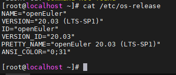
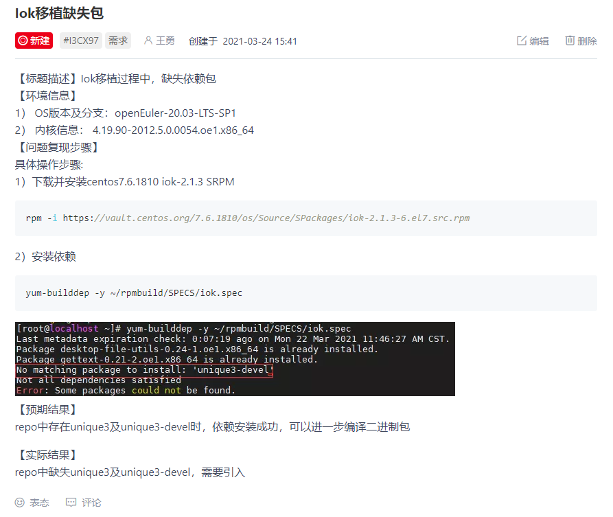

# Iok 2.1.3 移植指南 (openEuler 20.03 LTS SP1)

## 简介

>Iok是一款在屏幕上显示印度语言的键盘映射应用

### 选用版本

> 2.1.3

### 安装指南

> https://openeuler.org/zh/docs/20.03_LTS_SP1/docs/Installation/installation.html

### 检查当前系统版本信息

```shell
cat /etc/os-release
```



### 兼容性检查

#### 下载iok-2.1.3 SRPM

```
wget http://mirror.centos.org/centos/7/os/x86_64/Packages/iok-2.1.3-6.el7.x86_64.rpm
```

#### 下载工具

```
wget https://repo.oepkgs.net/openEuler/rpm/openEuler-20.03-LTS-SP1/stable/contrib/x2openEuler/noarch/Packages/x2openEuler-1.0-1.noarch.rpm

用户指南：
https://gitee.com/openeuler/docs/blob/stable2-20.03_LTS_SP1/docs/zh/docs/thirdparty_migration/x2openEuleruseguide.md
```

#### 部署工具

```
rpm -ivh x2openEuler-1.0-1.noarch.rpm
```

> 注意：安装rpm时需要使用root用户，且目前需要网络（用于下载安装依赖）
> 注意：根据提示安装依赖包如bzip2-devel等

```
su x2openEuler
x2openEuler redis-db -init
```

> 依次录入redis数据库的ip:127.0.0.1
> 端口：6379
> 数据库索引号（0-16）：0
> 密码（工具会对密码加密处理）：如果redis密码没有设置或者为空时，直接回车即可

```
x2openEuler init source_centos7.6-openEuler20.03-LTS-SP1.tar.gz
```

> 备注：x2openEuler使用rpm安装完成后会在/opt/x2openEuler目录下带有source_centos7.6-openEuler20.03-LTS-SP1.tar.gz这个默认资源包
> 需要支持centos8.2到openEuler20.03-LTS-SP1的评估，则需获取对应的静态资源包导入，如对应的资源包为source_centos8.2-openEuler20.03-LTS-SP1.tar.gz，导入此包命令：`x2openEuler init source_centos8.2-openEuler20.03-LTS-SP1.tar.gz`，请示情况选择对应的资源包

#### 扫描软件

```
x2openEuler scan iok-2.1.3-6.el7.x86_64.rpm
注意要分析的移植文件需要有能够让x2openEuler用户可以读取的权限
扫描完成后会在/opt/x2openEuler/output目录生成html格式的报告
```

## 查看评估结果

软件兼容性评估报告分三块内容展示软件兼容性，分别是依赖包兼容性、C/C++接口兼容性、java接口兼容性，依赖包兼容性反映了软件包安装过程中的直接依赖，非100%表明无法正确安装；接口兼容性反映的是单个软件运行过程中对其他软件包、动态库或系统接口的调用变化，非100%表明在某个功能调用时可能会触发异常，未调用到时可能表现正常；部分结果建议人工复核，最终软件包使用建优先级建议 openEuler已移植包>openEuler上人工重编译包>centos软件包。


> 结果：根据依赖报告可知，iok移植到openEuler 20.03 LTS SP1需要解决unique3依赖问题

## 依赖包引入

- 在openEuler/oec-application仓库中发起issue

> 仓库地址：https://gitee.com/openeuler/oec-application



- 持续追踪issue至缺失的依赖包被引入openEuler 20.03 LTS SP1 的YUM repo中

## 构建流程

> 当缺失的依赖包被引入后可进行

- 获取iok的Centos 7.6.1810 SRPM包
- 在openEuler 20.03 LTS SP1上构建二进制包

###构建二进制包

```shell
yum install -y rpm-build
```

> 提供rpmbuild命令

- 从网络安装SRPM包

```shell
rpm -i https://vault.centos.org/7.6.1810/os/Source/SPackages/iok-2.1.3-6.el7.src.rpm
```

- 安装依赖

```shell
yum-builddep -y ~/rpmbuild/SPECS/iok.spec
```

- 构建二进制包

```shell
rpmbuild -bb ~/rpmbuild/SPECS/iok.spec
```

- 二进制包安装

```
rpm -i ~/rpmbuild/RPMS/x86_64/*.rpm
```

- 查看二进制文件

```
which iok
```