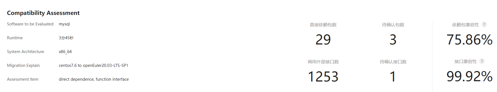
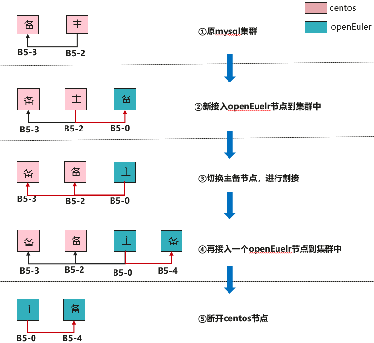
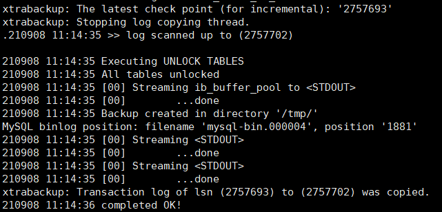
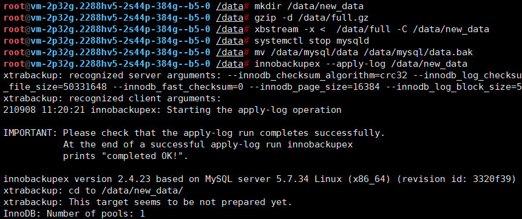
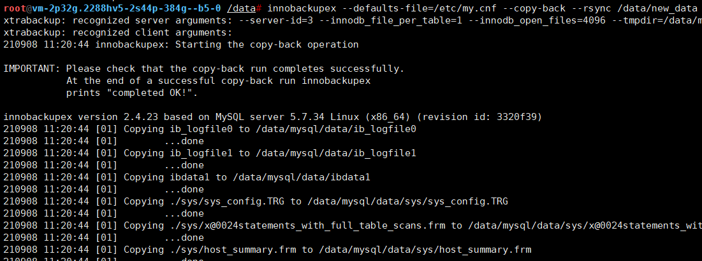
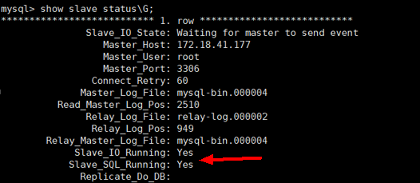
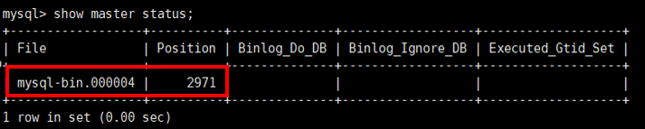
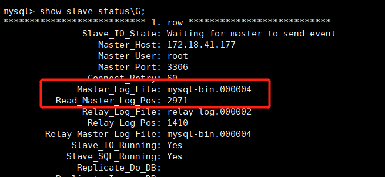
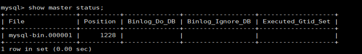

# MySQL 5.7.21 搬迁指南（openEuler 20.03 LTS SP1）

[TOC]


## 1.简要介绍

本文主要用于指导在已经搭建好的CentOS 7.6 数据库集群环境上，将集群内操作系统逐步替换为openEuler 20.03 sp1 操作系统，同时做到数据库可用、数据同步。

MySQL 是一款安全、跨平台、高效的，并与 PHP、Java 等主流编程语言紧密结合的数据库系统。
本案例使用x86_64架构虚拟机，通过评估工具x2openEuler评估MySQL 5.7.21软件移植到openEuler操作系统的兼容性，再实施数据搬迁。

建议使用版本为MySQL 5.7.21。

> 说明:
> 本文档适用于MySQL 5.7.21，其他版本的MySQL移植步骤也可参考本文档。

## 2.案例环境

| 项目     | 说明              |
| -------- | ----------------- |
| 服务器   | TaiShan 200服务器 |
| CPU      | 华为鲲鹏920处理器 |
| Raid卡   | SAS3508           |
| 网络卡   | Mellanox SP333    |
|          | TM210             |
|          | TM280             |
| 磁盘容量 | 500GB以上         |

| 软件 | 版本                | 备注                |
| ---- | ------------------- | ------------------- |
| OS   | Centos 7.6.1810     | 当前mysql集群服务器 |
| OS   | openEuler 20.03 SP1 | 迁移目标服务器      |

| 软件                  | 版本   |
| --------------------- | ------ |
| mysql5                | 5.7.21 |
| mysql5-common         | 5.7.21 |
| mysql5-embedded       | 5.7.21 |
| mysql5-embedded-devel | 5.7.21 |
| mysql5-errmsg         | 5.7.21 |
| mysql5-libs           | 5.7.21 |
| mysql5-server         | 5.7.21 |
| mysql5-test           | 5.7.21 |

| 平台      | 架构 | mysql节点 | mysql节点 | 主节点 |
| --------- | ---- | --------- | --------- | ------ |
| CentOS    | X86  | B5-2      | B5-3      | B5-2   |
| openEuler | X86  | B5-0      | B5-4      | B5-0   |

> 网络要求：
>
> 迁移目标服务器和当前mysql集群的节点需在同一个网络环境内，并可以访问外部网或本次有openEuler sp1镜像仓库源，支持操作系统仓库配置。


## 3.软件兼容性评估

openEuler社区提供了 [x2openEuler 工具](https://repo.oepkgs.net/openEuler/rpm/openEuler-20.03-LTS-SP1/extras-tgz/noarch/) ，针对已经编译好的二进制程序，进行主要完成软件包、接口级评估，明确应用软件是否需要移植适配，是否有依赖的软件包待引入；同时评估软件调用的接口原型在两个系统中是否有差异。

注：已经编译好的二进制程序，难以保障全部兼容新OS，严重时会引发才内存风险，往往这种问题很难通过验证的方式识别出来，迁移前针对软件兼容性评估尤为重要。

#### 3.1获取mysql的RPM包并解压到/opt/mysql目录下

```
wget -P /opt https://downloads.mysql.com/archives/get/p/23/file/mysql-5.7.21-1.el7.x86_64.rpm-bundle.tar
```
```
cd /opt/
mkdir mysql
tar -xf mysql-5.7.21-1.el7.x86_64.rpm-bundle.tar -C mysql
```

#### 3.2下载工具到/opt/mysql

```
cd /opt/mysql
wget https://repo.oepkgs.net/openEuler/rpm/openEuler-20.03-LTS-SP1/extras-tgz/noarch/x2openEuler-1.0-1.noarch.rpm

用户指南：
https://gitee.com/openeuler/docs/blob/stable2-20.03_LTS_SP1/docs/zh/docs/thirdparty_migration/x2openEuleruseguide.md
```
#### 3.3部署工具

```
cd /opt/mysql
rpm -ivh x2openEuler-1.0-1.noarch.rpm
```

> 注意：安装rpm时需要使用root用户，且目前需要网络（用于下载安装依赖）
> 注意：根据提示安装依赖包如bzip2-devel等

```
su x2openEuler
x2openEuler redis-db -init
```
> 依次录入redis数据库的ip:127.0.0.1
> 端口：6379
> 数据库索引号（0-16）：0
> 密码（工具会对密码加密处理）：如果redis密码没有设置或者为空时，直接回车即可

```
x2openEuler init source_centos7.6-openEuler20.03-LTS-SP1.tar.gz
```

> 备注：x2openEuler使用rpm安装完成后会在/opt/x2openEuler目录下带有source_centos7.6-openEuler20.03-LTS-SP1.tar.gz这个默认资源包
> 需要支持centos8.2到openEuler20.03-LTS-SP1的评估，则需获取对应的静态资源包导入，如对应的资源包为source_centos8.2-openEuler20.03-LTS-SP1.tar.gz，导入此包命令：`x2openEuler init source_centos8.2-openEuler20.03-LTS-SP1.tar.gz`，请示情况选择对应的资源包

#### 3.4扫描mysql

```
x2openEuler scan /opt/mysql/
注意要分析的移植文件需要有能够让x2openEuler用户可以读取的权限
扫描完成后会在/opt/x2openEuler/output目录生成html格式的报告
```
## 4.评估结果分析

软件兼容性评估报告分三块内容展示软件兼容性，分别是依赖包兼容性、C/C++接口兼容性、java接口兼容性，依赖包兼容性反映了软件包安装过程中的直接依赖，非100%表明无法正确安装；接口兼容性反映的是单个软件运行过程中对其他软件包、动态库或系统接口的调用变化，非100%表明在某个功能调用时可能会触发异常，未调用到时可能表现正常；部分结果建议人工复核，最终软件包使用建优先级建议 openEuler已移植包>openEuler上人工重编译包>centos软件包。

#### 4.1报告分析

```
打开html报告，逐行分析，得出结论：在openEuler上直接使用centos的mysql包存在风险，风险如下：
1个待确认接口表明mysql系列软件包会调用到libaio.so.1.0.1，其函数参数数量从4变为5，直接影响了功能，在某个功能调用时可能会触发异常；

另外，报告显示需要确认3个依赖软件包，经过人工确认属于mysql系列包自闭环的依赖，故软件包安装无影响
```




#### 4.2分析结果建议

```
建议：由于函数调用风险，建议直接使用在openEuler官方编译移植过的mysql-5.7.21系列软件包
https://repo.openeuler.org/openEuler-20.03-LTS-SP1/everything/x86_64/Packages/mysql5-5.7.21-3.oe1.x86_64.rpm
https://repo.openeuler.org/openEuler-20.03-LTS-SP1/everything/x86_64/Packages/mariadb-common-10.3.9-9.oe1.x86_64.rpm
https://repo.openeuler.org/openEuler-20.03-LTS-SP1/everything/x86_64/Packages/mysql5-common-5.7.21-3.oe1.x86_64.rpm
https://repo.openeuler.org/openEuler-20.03-LTS-SP1/everything/x86_64/Packages/mysql5-server-5.7.21-3.oe1.x86_64.rpm
https://repo.openeuler.org/openEuler-20.03-LTS-SP1/everything/x86_64/Packages/mysql5-errmsg-5.7.21-3.oe1.x86_64.rpm
https://repo.openeuler.org/openEuler-20.03-LTS-SP1/everything/x86_64/Packages/mecab-0.996-2.oe1.x86_64.rpm
```


## 5.搬迁方案

**搬迁实施过程主要包括以下几个部分：**

1）openEuler备节点方式接入到集群，完成全量数据同步及增量数据同步

2）切换主备节点，进行业务割接

3）再新增openEuler备节点到集群中，完成全量数据同步及增量数据同步

4）移除centos旧节点




> #### 本次搬迁实施过程中使用到了第三方备份工具xtrabackup
>
> **（1）Xtrabackup** **介绍**
>
> Percona-xtrabackup是 Percona公司开发的一个用于MySQL数据库物理热备（备份时不影响数据读写）的备份工具，支持MySQL、Percona server和MariaDB，开源免费，是目前较为受欢迎的主流备份工具。
>
> 在Xtrabackup包中主要有Xtrabackup和innobackupex两个工具。其中Xtrabackup只能备份InnoDB和XtraDB两种引擎; innobackupex则是封装了Xtrabackup，同时增加了备份MyISAM引擎的功能。
>
> **（2）Xtrabackup** **优点**
>
> \-      备份速度快，物理备份可靠
>
> \-      备份过程不会打断正在执行的事务(InnoDB表)
>
> \-      能够基于压缩等功能节约磁盘空间和流量
>
> \-      自动备份校验
>
> \-      还原速度快
>
> \-      可以流传将备份传输到另外一台机器上
>
> \-      在不增加服务器负载的情况备份数据

## 6.环境准备

#### 6.1安装操作系统

找一个新的硬件设备 TaiShan 200 2280 ，安装好openEuler 20.03 sp1 操作系统。

#### 6.2操作系统配置

**步骤1 检查操作系统版本**

> openEuler20.03(LTS-SP1)
>
> cat /etc/openEuler-release

**步骤2   检查操作系统默认语言**

> echo $LANG
>
> 若操作系统默认语言非en_US.UTF-8，则需要切换成英文。
>
> echo 'export LANG=en_US.UTF-8'>> ~/.bashrc
>
> 将当前会话关闭后重新登录。

**步骤3 关闭防火墙**

> systemctl stop firewalld
>
> systemctl disable firewalld

**步骤4  时间设置**

> 操作系统时区统一设置为（Asia/Shanghai)。
>
> cp /usr/share/zoneinfo/Asia/Shanghai /etc/localtime
>
> 集群中所有节点的时间必须设置同步，以确保数据一致性。

**安装NTP服务**

> 检查是否安装NTP服务。
>
> **rpm -qa|grep ntp**
>
> **yum install ntp -y**
>
> 在集群内所有节点检查是否设置时钟同步开机自启。
>
> **systemctl is-enabled ntpd**
>
> l  若已设置，则进入[步骤3](#li120011306449)。
>
> l  若未设置，则设置开机自启。
>
> systemctl enable ntpd
>
> **vi /etc/ntp.conf**
>
> 添加如下内容：
>  restrict *IP address1* mask *IP address2* nomodify notrap 
>  server *IP address*  prefer           #设置为ntpserver的ip
>  fudge *IP address*  stratum 10
>
> 重启ntp服务。
>
> **systemctl restart ntpd.service**
>
> 5分钟后验证ntp时钟同步
>
> **ntpstat**
>
> ntp client状态如下:
>
> synchronised to NTP server (*IP address*) at stratum 7 
>   time correct to within 41 ms 
>   polling server every 1024 s


## 7.安装数据库mysql及xtrabackup

#### 7.1安装mysql并配置密码

> 迁移目标服务器都需要安装mysql及xtrabackup。例如分别在openEuler B5-0 机器及 B5-4机器安装， 目前openEuler sp1系统已提供以下安装包 。

**1）安装mariadb及mysql相关服务。**

yum install –y mysql5 mysql5-common mysql5-devel mysql5-embedded mysql5-embedded-devel mysql5-errmsg mysql5-libs mysql5-server mysql5-test

**2） 启动mysql。**

systemctl start mysqld

**3）mysql状态查询。**

systemctl status mysqld

状态为running则启动成功：

```
root@vm-2p32g.2288hv5-2s44p-384g--b5-0 ~# systemctl status mysqld

● mysqld.service - MySQL 5.7 database server

  Loaded: loaded (/usr/lib/systemd/system/mysqld.service; disabled; vendor preset: disabled)

  Active: active (running) since Thu 2021-09-09 10:23:25 CST; 1 day 4h ago

 Process: 103715 ExecStartPre=/usr/libexec/mysql-check-socket (code=exited, status=0/SUCCESS)

 Process: 103738 ExecStartPre=/usr/libexec/mysql-prepare-db-dir mysqld.service (code=exited, sta>

 Process: 103773 ExecStart=/usr/libexec/mysqld --daemonize --basedir=/usr --pid-file=/run/mysqld>

 Process: 103803 ExecStartPost=/usr/libexec/mysql-check-upgrade (code=exited, status=0/SUCCESS)

 Main PID: 103775 (mysqld)

  Tasks: 37

  Memory: 188.4M

  CGroup: /system.slice/mysqld.service

​      └─103775 /usr/libexec/mysqld --daemonize --basedir=/usr --pid-file=/run/mysqld/mysqld.
```

**4） 登录并修改默认密码。**

mysql -uroot -p

a.     默认没有密码，按回车即可登录。

```
root@vm-2p32g.2288hv5-2s44p-384g--b5-0 /# mysql -uroot -p

Enter password: 

Welcome to the MySQL monitor. Commands end with ; or \g.

Your MySQL connection id is 2

Server version: 5.7.21 MySQL Community Server (GPL)

 
Copyright (c) 2000, 2018, Oracle and/or its affiliates. All rights reserved.

 
Oracle is a registered trademark of Oracle Corporation and/or its

affiliates. Other names may be trademarks of their respective

owners.


Type 'help;' or '\h' for help. Type '\c' to clear the current input statement.

mysql>
```

b.     设置密码。

alter user 'user'@'localhost' identified by 'passward';

```
mysql> alter user 'root'@'localhost' identified by '123456';

Query OK, 0 rows affected (0.00 sec)

mysql> flush privileges;

Query OK, 0 rows affected (0.00 sec)

mysql>
```

> **flush privileges**必须执行，否则设置不生效。

**5） 验证密码。**

退出后重新登录，查看密码是否修改成功。

```
root@vm-2p32g.2288hv5-2s44p-384g--b5-0 /# mysql -uroot -p

Enter password: 

Welcome to the MySQL monitor. Commands end with ; or \g.

Your MySQL connection id is 3

Server version: 5.7.21 MySQL Community Server (GPL)


Copyright (c) 2000, 2018, Oracle and/or its affiliates. All rights reserved.

 
Oracle is a registered trademark of Oracle Corporation and/or its

affiliates. Other names may be trademarks of their respective

owners.


Type 'help;' or '\h' for help. Type '\c' to clear the current input statement.


mysql>
```

#### 7.2安装xtrabckup

> Percona XtraBackup 2.4支持MySQL5.6和5.7数据库。Centos与openEuler安装xtrabckup的不同，根据操作系统类型按以下步骤执行即可。

**1）centos安装xtrabackup**

由于搬迁实施时centos节点需要将全量数据导出，因此centos也需要安装xtrabackup。

```
yum install -y libev perl-DBD-MySQL perl-Digest-MD5

wget https://downloads.percona.com/downloads/Percona-XtraBackup-2.4/Percona-XtraBackup-2.4.23/binary/redhat/7/x86_64/Percona-XtraBackup-2.4.23-r3320f39-el7-x86_64-bundle.tar

tar xf Percona--2.4.23-r3320f39-el7-x86_64-bundle.tar

rpm -ivh percona-xtrabackup-*.rpm
```

**2） openEuler安装xtrabackup**

```
yum install -y dnf-plugins-core rpmdevtools

useradd jenkins
cd /home/Jenkins

# 下载安装源码包
wget https://downloads.percona.com/downloads/Percona-XtraBackup-2.4/Percona-XtraBackup-2.4.23/source/redhat/percona-xtrabackup-24-2.4.23-1.generic.src.rpm

rpm -ivh percona-xtrabackup-24-2.4.23-1.generic.src.rpm

# 需要root权限
yum-builddep rpmbuild/SPECS/percona-xtrabackup.spec

# jenkin用户执行
rpmbuild -ba rpmbuild/SPECS/percona-xtrabackup.spec

# 安装percona-xtrabackup rpm包
rpm -ivh rpmbuild/RPMS/x86_64/percona-xtrabackup-*.rpm
```


## 8.数据库搬迁实施

#### 8.1openEuler备节点接入集群

先将openEuler(B5-0)机器以备节点的方式接入mysql集群，具体指令如下：

##### 8.1.1 mysql配置同步

**1）发送配置文件**

在openEuler(B5-0)机器，对mysql原配置文件进行备份

mv /etc/my.cnf /etc/my.cnf.bak

将centos主节点(B5-2)发送配置文件到openeuler(B5-2)机器

scp /etc/my.cnf [root@172.18.61.79:/etc/](mailto:root@172.18.61.79:/etc/)


**2）修改openEuler(B5-0)机器的配置文件**

  例如原centos的配置文件如下：

```
[mysqld]

server-id=1  # 为防止集群中相同的server-id导致冲突，需修改server-id

innodb-file-per-table=ON

innodb_open_files=4096

skip_name_resolve=ON

 
log-error=/data/mysql/log/mysql.log

socket=/data/mysql/data/mysql.sock

tmpdir=/data/mysql/tmp

datadir=/data/mysql/data

default_authentication_plugin=mysql_native_password

port=3306

user=root

 
log-slave-updates=1

relay_log=relay-log

relay-log-index=relay-log.index

log_bin=mysql-bin
```

**3）根据centos配置文件中的datadir，创建相应目录并赋予权限**

由my.cnf的datadir可知，mysql的数据将存放在/data/mysql/data路径下，mysql运行所需的文件放在/data/mysql（datadir的上一层目录）路径下。

为保持与centos的mysql配置一致，需先创建目录，赋予mysql权限，并拷贝运行mysql所需文件到datadir路径下。

```
mkdir -p /data/mysql/{run,tmp,share,log,data}

chown -R mysql:mysql /data

cp -a /var/lib/mysql/* /data/mysql/data/           # 拷贝运行mysql所需文件到datadir

systemctl restart mysqld

systemctl status mysqld
```

##### 8.1.2接入集群

**1）centos（B5-2）主节点全量数据同步到openEuler（B5-0）**

**从centos（B5-2）主节点导出数据**

```
innobackupex --defaults-file=/etc/my.cnf --user=root --password=123456 --port=3306 /tmp --stream=xbstream |gzip - > /data/full.gz
```



**发送数据到openEuler机器（B5-0）**

```
scp /data/full.gz root@172.18.61.79:/data/
```

**在openEuler（B5-0）节点恢复数据**

```
gzip -d /data/full.gz  # 解压后是二进制流

mkdir /data/new_data

xbstream -x < /data/full -C /data/new_data

systemctl stop mysqld # 停止mysql服务，并备份原始数据库

mv /data/mysql/data /data/mysql/data.bak

innobackupex --apply-log /data/new_data # 恢复数据
```



根据my.cnf配置文件，将备份数据文件拷贝到MySQL服务器配置文件中指定的datadir

```
innobackupex --defaults-file=/etc/my.cnf --copy-back --rsync /data/new_data
```



**重启mysql服务**

```
chown -R mysql:mysql /data/mysql/data #修改权限
systemctl start mysqld  
systemctl status mysqld  
```

**2）openEuler备节点（B5-0）接入集群及增量同步**

**授予备份权限**

在centos主节点（B5-2）上，授予openeuler节点备份的权限。登录mysql终端后执行

```
mysql> CREATE USER 'root'@'%' identified by '123456'; 

mysql> GRANT REPLICATION SLAVE ON *.* to 'root'@'192.168.8.11' identified by '123456';

mysql> GRANT ALL PRIVILEGES ON *.* to 'root'@'%' identified by '123456';

mysql> FLUSH PRIVILEGES;
```

**记录log_file 及position**

在openeuler（B5-0）节点上，5.1.2章节同步的全量数据路径下（配置文件中指定的datadir），xtrabackup_info文件中查看并记录log_file 和position数据的值，openEuler从节点接入需用到。

```
cat /data/mysql/data/xtrabackup_info
```


**备节点接入并同步增量数据**

openEuler（B5-0）作为备节点接入，在mysql终端执行以下指令。（MASTER_LOG_FILE及MASTER_LOG_POS须确保与上文中的xtrabackup_info文件保持一致，以同步增量数据）

```
mysql> CHANGE MASTER TO MASTER_HOST='172.18.41.177',MASTER_USER='root',MASTER_PASSWORD='123456',MASTER_LOG_FILE='mysql-bin.000004',MASTER_LOG_POS=1881;

mysql> FLUSH PRIVILEGES;
```

**查看是否连接成功**

在openEuler（B5-0）节点查看主备是否连接成功，Slave_IO_Running 与Slave_SQL_Runing都为Yes则说明主备连接成功。

```
mysql> start slave;

mysql> show slave status\G;
```



经过本章节全量数据同步、openEuler备节点接入及增量同步后，目前mysql集群部署情况如下：

**centos：B5-2（主节点），B5-3（备节点）openEuler：B5-0（备节点）**


#### 8.2主备节点替换

##### 8.2.1centos主节点设置为只读

为防止在主备切换时产生数据不一致的现象，必须将先将centos上的主节点（B5-2）设置为只读。

```
mysql> show global variables like 'read_only';

mysql> set global read_only=on;

mysql> set global super_read_only=on;

mysql> flush privileges;
```

##### 8.2.2确认数据同步完成

> 说明：由于主备复制可能存在延迟问题，因此在主备切换时需查看同步数据是否一致。若数据量过大，延迟较严重，可在配置文件中采用多线程同步的方式。

查看centos主节点（B5-2）和其它备节点（B5-3，B5-0）数据是否⼀致。在centos（B5-2）主节点进入mysql终端，查看状态：

```
mysql> show master status;
```



在openEuler (B5-0)备节点及centos（B5-3）备节点查看状态（下图以openEuler (B5-0)备节点为例）：

```
mysql> show slave status\G;
```



由上述主备节点状态图中可知，File及Position的值均一致，同步完成，可进行下一步操作。

##### 8.2.3停止slave，赋予备份权限

在openEuler(B5-0)节点停止slave服务，并赋予centos（B5-2）节点备份权限。

```
mysql> stop slave;

mysql> CREATE USER 'root'@'%' identified by '123456';

mysql> grant replication slave on *.* to 'root'@'172.18.41.177' identified by '123456';

mysql> GRANT ALL PRIVILEGES ON *.* to 'root'@'%' identified by '123456';

mysql> show master status;
```

##### 8.2.4主备切换

**centos（B5-2）作为备节点连接openEuler(B5-0)**

（1）在openEuler(B5-0)节点查看master状态后，记录File及Position。



（2）在centos（B5-2）节点以备节点的方式接入openeuler(b5-0)，MASTER_LOG_FILE和MASTER_LOG_POS为上述master状态的File和Position。

```
mysql> CHANGE MASTER TO MASTER_HOST='172.18.61.79',MASTER_USER='root',MASTER_PASSWORD='123456',MASTER_LOG_FILE='mysql-bin.000001',MASTER_LOG_POS=1228;

mysql> start slave;

mysql> show slave status\G;
```

当Slave_IO_Running 与Slave_SQL_Runing都为Yes则说明主备连接成功。

**此操作完成后，主备切换完成，业务割接也在此阶段完成，原centos的主节点业务切换到了openEuler主节点上。另外，需插入数据确认数据能否同步，验证是否集群能提供服务。**

目前节点情况如下：

**Centos: B5-2(备节点)  B5-3(子备节点) openEuler：B5-0(主节点)**

存在级联关系：B5-0 -> B5-2 -> B5-3


#### 8.3openEuler新备节点接入集群

##### 8.3.1节点准备与配置同步

类似8.1章节将openEuler以备节点的方式接入集群，本章节也是新接入一个openEuler（B5-4）的备节点到集群。在接入节点到集群之前，需在openEuler（B5-4）节点完成以下步骤：

\-      8.1.1 mysql配置同步

##### 8.3.2 接入集群

**1）全量数据同步到**

从openeuler（B5-0）主节点导出数据

```
innobackupex --defaults-file=/etc/my.cnf --user=root --password=123456 --port=3306 /tmp --stream=xbstream |gzip - > /data/full.gz 

scp /data/full.gz root@172.18.35.51:/data
```

openEuler（B5-4）备节点恢复数据

```
gzip -d /data/full.gz   # 解压后是二进制流

mkdir /data/new_data

xbstream -x <  /data/full -C /data/new_data

systemctl stop mysqld  # 停止mysql服务，并备份原始数据库

mv /data/mysql/data /data/mysql/data.bak

innobackupex --apply-log /data/new_data  # 恢复数据

innobackupex --defaults-file=/etc/my.cnf --copy-back --rsync /data/new_data

chown -R mysql:mysql /data/mysql/data
```

启动服务

```
systemctl start mysqld
```

**2）新接入openEuler（B5-4）的节点作为备节点**

在openEuler（B5-0）主节点上授予权限：

```
grant replication slave on *.* to 'root'@'172.18.35.51' identified by '123456';

flush privileges;
```

openEuler（B5-4）机器以备节点的方式接入集群：

```
CHANGE MASTER TO MASTER_HOST='172.18.61.79',MASTER_USER='root',MASTER_PASSWORD='123456',MASTER_LOG_FIL_LOG_FILE='mysql-bin.000001',MASTER_LOG_POS=2165;
```

在openEuler主节点上插入数据，确认主备连接成功，确认其它三个备节点数据是否一致。

**上述操作完成后，** **目前节点情况如下：**

**Centos: B5-2(备节点)  B5-3(子备节点) openEuler：B5-0(主节点) B5-4(备节点)**


#### 8.4 断开centos旧节点，搬迁完成

观察一段时间内若未发现问题，确保数据一致性后，可停止centos （B5-2）与（B5-3）节点的mysql服务。

```
systemctl stop mysqld

systemctl status mysqld
```

**上述操作完成后，** **目前节点情况如下：**

**openEuler：B5-0(主节点) B5-4(备节点)**


