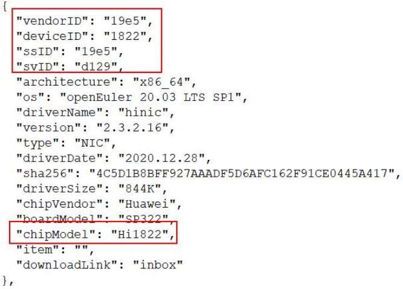
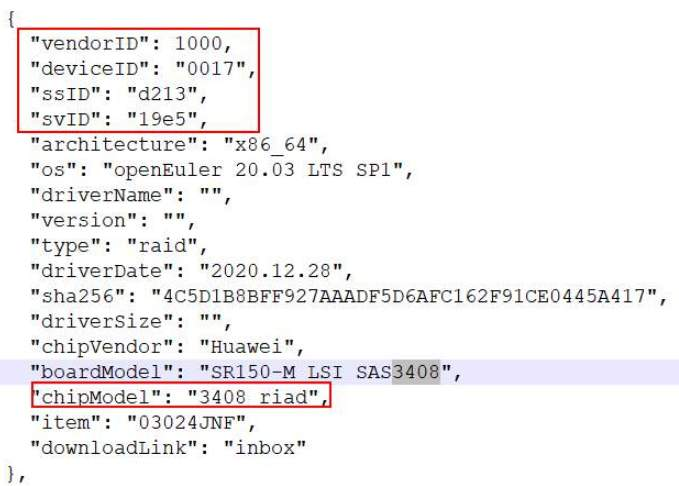

# X86硬件兼容性移迁指南(Hi1822&3408raid)(openEuler 20.03 LTS SP1)

# 介绍
Hi1822网卡是华为生产的一款网卡。
3408raid卡是华为生产的一款raid卡。

# 环境要求
## 硬件要求
硬件要求如下表所示

项目 | 说明 |  
----- | ----- |
服务器 | 2288H V5 
CPU | Inter(R) Xeon(R) Gold 6266C CPU @ 3.00GHz 
NIC卡 | Hi1822 
RIAD卡 | LTS SAS 3408 

## 操作系统要求
操作系统要求如下所示

项目 | 说明 |
----- | ----- | 
Centos Linux | 7.9.2009（Core)  
Kernel | 3.10.0  x86_64  

检查当前系统版本信息
cat /etc/os-release

# x2openEuler软件运行和配置信息采集

## 环境信息采集步骤

    1、安装x2openEuler工具的rpm包
        rpm -ivh x2openEuler-1.0-1.noarch.rpm
    2、进入x2openEuler用户，初始化工具和导入资源包
        su x2openEuler
        cd 
        x2openEuler redis-db -init       
        x2openEuler使用rpm安装完成后会在/opt/x2openEuler目录下带有source_centos7.6-openEuler20.03-LTS-SP1.tar.gz这个默认资源包
        需要支持centos8.2到openEuler20.03-LTS-SP1的评估，则需获取对应的静态资源包导入，如对应的资源包为source_centos8.2-openEuler20.03-LTS-SP1.tar.gz，导入此                
        包命令：`x2openEuler init source_centos8.2-openEuler20.03-LTS-SP1.tar.gz`,视情况选择对应的资源包
    3、执行下面命令开始采集数据
       x2openEuler conf-collect

## 查看采集结果

  板卡的采集结果保存在输出结果的压缩包中。
  输出位置为`/opt/x2openEuler/output`目录，如下，资源包为`sysconf-时间戳.tar.gz`形式    
# 迁移结果人工分析

从南向板卡兼容性清单网站(https://gitee.com/openeuler/website-v2/tree/feature-compatibility/data/compatibility), 可以查找Hi1822和3408raid卡适配openEuler 20.03 LTS SP1系统，信息如下。

## Hi1822网卡适配信息

## 3408 raid卡适配信息

通过VID、DID、SVID、SSID四元组值可确定唯一一种板卡。从上面的截图可以看到，南向兼容性清单网站可以查询到Hi822卡和3408raid板卡，并且各板卡的四元组信息和采集到的板卡四元组信息相同，以此得出Hi1822板卡和3408raid从centos上迁移到openEuler 20.03 LTS SP1成功。

# 卸载x2openEuler软件
分析完成后，执行下面命令删除x2openEuler软件包和采集结果

rpm -e x2openEuler

同时，需要手动删除x2openEuler用户