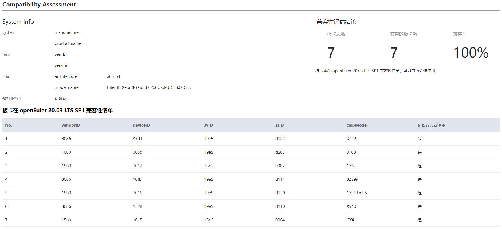

# X86硬件兼容性移迁指南(openEuler 20.03 LTS SP1)

[TOC]

# 案例环境

## 硬件

硬件如下表所示

项目 | 说明 
----- | ----- 
服务器 | 2288H V5 
CPU | Inter(R) Xeon(R) Gold 6266C CPU @ 3.00GHz 
NIC卡 | CX5（CX5网卡是mellanox公司生产的一款网卡） 
RIAD卡 | LTS SAS 3108（3108raid卡是华为生产的一款raid卡） 

## 操作系统

操作系统如下所示

项目 | 说明 |
----- | ----- | 
Centos Linux | 7.9.2009（Core)  
Kernel | 3.10.0  x86_64  

检查当前系统版本信息
cat /etc/os-release


# x2openEuler软件运行和硬件兼容性评估

openEuler社区提供了 [x2openEuler 工具](https://repo.oepkgs.net/openEuler/rpm/openEuler-20.03-LTS-SP1/extras-tgz/noarch/) ，具有硬件评估、软件评估、系统配置评估的功能，其中硬件评估针对centos系统上正常运行的板卡在openEuler上兼容性，工具采集板卡信息生成html报告，直观快捷展示硬件的兼容性。

## 下载x2openEuler工具

```
cd /opt/
wget https://repo.oepkgs.net/openEuler/rpm/openEuler-20.03-LTS-SP1/extras-tgz/noarch/x2openEuler-1.0-1.noarch.rpm

用户指南：
https://gitee.com/openeuler/docs/blob/stable2-20.03_LTS_SP1/docs/zh/docs/thirdparty_migration/x2openEuleruseguide.md
```

## 部署工具

```
cd /opt/
rpm -ivh x2openEuler-1.0-1.noarch.rpm
```

> 注意：安装rpm时需要使用root用户，且目前需要网络（用于下载安装依赖）
> 注意：根据提示安装依赖包如bzip2-devel等

```
su x2openEuler
x2openEuler redis-db -init
```

> 依次录入redis数据库的ip:127.0.0.1
> 端口：6379
> 数据库索引号（0-16）：0
> 密码（工具会对密码加密处理）：如果redis密码没有设置或者为空时，直接回车即可

```
x2openEuler init source_centos7.6-openEuler20.03-LTS-SP1.tar.gz
```

> 备注：x2openEuler使用rpm安装完成后会在/opt/x2openEuler目录下带有source_centos7.6-openEuler20.03-LTS-SP1.tar.gz这个默认资源包
> 需要支持centos8.2到openEuler20.03-LTS-SP1的评估，则需获取对应的静态资源包导入，如对应的资源包为source_centos8.2-openEuler20.03-LTS-SP1.tar.gz，导入此包命令：`x2openEuler init source_centos8.2-openEuler20.03-LTS-SP1.tar.gz`，请示情况选择对应的资源包

## 硬件兼容性分析

    x2openEuler hardware-analyse 
    返回信息如下：
    2021-11-30 09:41:20,865 - INFO - Log save directory: /var/log/x2openEuler
    2021-11-30 09:41:20,887 - INFO - x2openEuler hardware-analyse
    2021-11-30 09:41:20,888 INFO manager/get_param_config/179: Parameter configuration file loaded.
    2021-11-30 09:41:20,905 INFO manager/get_regex_config/218: Regex pattern compiled.
    2021-11-30 09:41:20,905 INFO manager/load_parsers/233: All builtin parsers loaded.
    2021-11-30 09:41:20,905 INFO manager/load_parsers/236: All custom parsers loaded.
    2021-11-30 09:41:21,254 INFO time_utils/wrapper/21: 0.35s taken for running function [get_data]
    2021-11-30 09:41:21,269 WARNING list/parse_content/47: no data in ls_dev
    2021-11-30 09:41:21,377 INFO time_utils/wrapper/21: 0.12s taken for running function [get_parsed_content]
    2021-11-30 09:41:21,377 INFO manager/write_res/135: write to /opt/x2openEuler/_tmp_18ambppj_/run/9e81f536-517e-11ec-ae65-a01c8dfeddfa/sysconf/kernel_startup_param.json.
    2021-11-30 09:41:21,378 INFO manager/write_res/135: write to /opt/x2openEuler/_tmp_18ambppj_/run/9e81f536-517e-11ec-ae65-a01c8dfeddfa/sysconf/syscall_interface.json.
    2021-11-30 09:41:21,378 INFO manager/write_res/135: write to /opt/x2openEuler/_tmp_18ambppj_/run/9e81f536-517e-11ec-ae65-a01c8dfeddfa/sysconf/path.json.
    2021-11-30 09:41:21,379 INFO manager/write_res/135: write to /opt/x2openEuler/_tmp_18ambppj_/run/9e81f536-517e-11ec-ae65-a01c8dfeddfa/sysconf/port.json.
    2021-11-30 09:41:21,379 INFO manager/write_res/135: write to /opt/x2openEuler/_tmp_18ambppj_/run/9e81f536-517e-11ec-ae65-a01c8dfeddfa/sysconf/device_interface.json.
    2021-11-30 09:41:21,380 INFO manager/write_res/135: write to /opt/x2openEuler/_tmp_18ambppj_/run/9e81f536-517e-11ec-ae65-a01c8dfeddfa/sysconf/linux_command.json.
    2021-11-30 09:41:21,387 INFO manager/write_res/135: write to /opt/x2openEuler/_tmp_18ambppj_/run/9e81f536-517e-11ec-ae65-a01c8dfeddfa/sysconf/hardware_configure.json.
    2021-11-30 09:41:21,396 INFO manager/write_res/135: write to /opt/x2openEuler/_tmp_18ambppj_/run/9e81f536-517e-11ec-ae65-a01c8dfeddfa/sysconf/proc.json.
    2021-11-30 09:41:21,404 INFO manager/write_res/135: write to /opt/x2openEuler/_tmp_18ambppj_/run/9e81f536-517e-11ec-ae65-a01c8dfeddfa/sysconf/system_configure.json.
    2021-11-30 09:41:21,408 INFO manager/write_res/135: write to /opt/x2openEuler/_tmp_18ambppj_/run/9e81f536-517e-11ec-ae65-a01c8dfeddfa/sysconf/system_service.json.
    2021-11-30 09:41:21,412 INFO manager/write_res/135: write to /opt/x2openEuler/_tmp_18ambppj_/run/9e81f536-517e-11ec-ae65-a01c8dfeddfa/sysconf/kernel_configure.json.
    2021-11-30 09:41:21,426 - INFO - Producing report...
    2021-11-30 09:41:21,427 - INFO - Generate Success! The results are saved: /opt/x2openEuler/output/hw_compat_report-20211130094121.html
    返回信息中，“/opt/x2openEuler/output/hw_compat_report-20211130094121.html“为评估报告文件。

# 硬件评估结果分析

硬件兼容性评估报告可直接展示每项板卡是否兼容以及整机是否兼容，有任意一项不在兼容清单里的则需要适配。




通过VID、DID、SVID、SSID四元组值可确定唯一一种板卡。从上面的截图可以看到，每一项板卡都可以在南向兼容性清单查询到，因此该硬件服务器从centos迁移到openEuler 20.03 LTS SP1可以实施。
