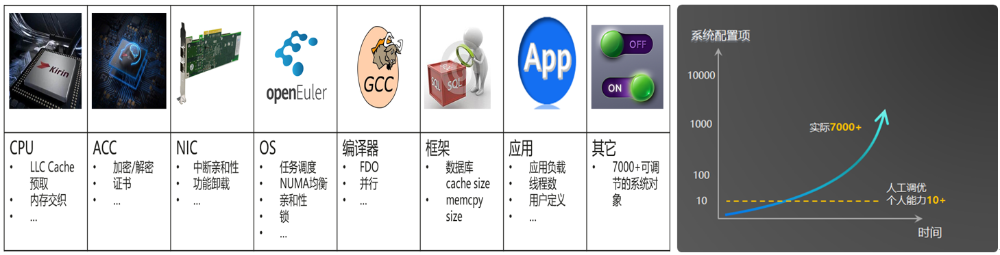
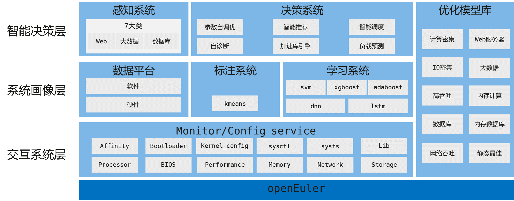
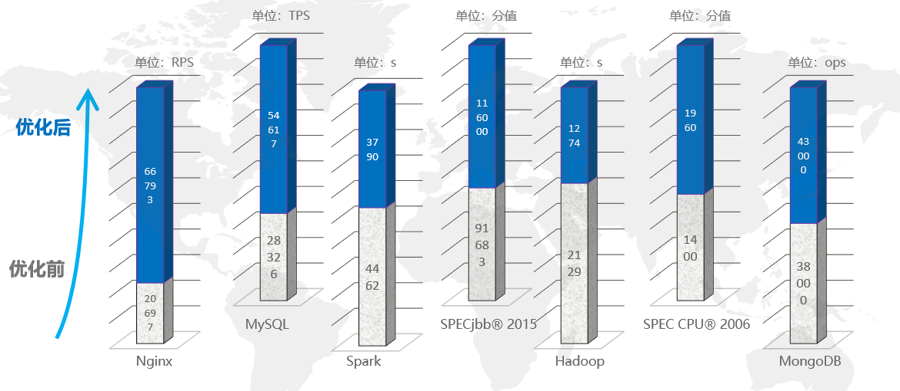

# A-Tune让系统调优更智能

2020年1月1日，openEuler开源社区如约而至。2020年3月27日，在华为开发者大会（HDC 2020）上，openEuler首个长期支持版openEuler LTS 20.03正式推出。自此，我们的计算世界将变得更为精彩。

那么，openEuler社区除了提供openEuler这个开源Linux操作系统的标准组件之外，还有哪些厉害的子项目呢？ A-Tune和iSula便是答案。

接下来，就让我们来揭开A-Tune的神秘面纱吧。

## A-Tune是什么

让我们先从名字来认识下A-Tune吧。“Tune”代表了**性能调优**；“A”则承载了Tune的愿景与定位，其蕴含了3层寓意Aware、Adaptive、Auto，即

**自感知（Aware）**- 自动感知负载和业务模型；

**自适应（Adaptive）**- 动态监测负载特征变化，适时调整资源；

**自调节（Auto）**- 通过感知负载模型，自动匹配优化库。

顾名思义，A-Tune就是一款基于openEuler开发的，自动化、智能化性能调优引擎。它利用人工智能，对运行在操作系统上的业务建立精准模型，感知并推理出业务特征，根据业务特征及负载情况给出最佳的参数配置组合，从而使业务处于最佳系统性能状态下运行。

## 为什么要开发A-Tune

系统调优一直是一个门槛高的系统性工程，强依赖工程师的技能和经验。如，一个简单的应用，除了自身代码外，支撑其运行的环境，如硬件平台、操作系统、数据库等都可能是影响性能的因素。如何在众多因素中找到性能瓶颈，需要工程师们熟悉大量参数的含义、配置方法，以及业务场景，并不断积累经验，才能对系统进行快速精准调优。

随着各行各业数字化智能化转型，新应用、新技术、新计算架构层出不穷，传统系统调优更是面临以下挑战：

- 涉及上万的能力组合，挑战人工调优极限

运行在操作系统上的业务类型成百上千，形态千差万别，从硬件到操作系统，到中间件再到上层应用，涉及的调优参数组合上万+。随着业务复杂度和调优对象的增加，调优组合和调优所需成本指数级增长，大大超过了工程师的能力范围。

- 应用场景剧增，实验室测试无法穷举

实际业务场景成千上万，计算、网络、存储等硬件配置层出不穷，实验室无法遍历所有的应用和业务场景，不可能完全模拟动态负载，无法对不同的场景组合进行穷举测试。

为了降低调优门槛、提升调优效率，A-Tune应运而生。

## A-Tune的优势

A-Tune利用大数据和人工智能技术，通过对各种类型的业务进行大数据分析，建立精准业务模型，并制定相应的调优策略。A-Tune具有如下优势：

- **简化系统调优**

A-Tune尽可能的屏蔽了硬件和操作系统底层细节，工程师无需感知底层细节，就可以快速上手调优。因此，降低了对工程师的技能要求，简化了系统调优。

- **提升调优效率**

A-Tune利用大数据和人工智能技术，从CPU、IO、网络、内存等多个维度抽象刻画不同业务类型系统行为的特征，并对收集到的结果进行大数据分析和机器学习，识别有效的调优参数，快速匹配多种配置组合，从而找到最佳配置。对于业务复杂、配置项多，能够大大提升调优效率。

- **持续积累调优经验** 

A-Tune能够利用人工智能技术自动分析业务特征，寻找优化配置，建立优化模型库。针对具体的业务场景，结合历史经验，训练并持续优化业务模型，积累和优化模型库，满足多业务多场景下的调优。

## A-Tune的架构

A-Tune分层架构如下图所示，主要包括智能决策层、系统画像层、交互系统层以及优化模式库。

- **智能决策层**：包含感知系统和决策系统。感知系统获取环境资源使用数据，利用人工智能技术推理判断业务类型；决策系统根据感知子系统获得的数据进行调优决策。

- **系统画像层**：包含数据平台、标注系统和学习系统。数据平台用于存放软硬件数据；标注系统用于业务环境数据采集和业务模型的聚类；学习系统用于业务模型的学习和分类。

- **交互系统层**：用于各类系统资源的监控和配置，执行调优策略。

- **优化模式库**：构建并积累各种业务模型对应的优化能力和配置。

## A-Tune应用场景

当前，A-Tune根据不同的负载情况，在如下场景进行了测试

| **应用类型**        | **已支持应用**                      |
| ------------------- | ----------------------------------- |
| https应用           | Nginx                               |
| 数据库              | MongoDB、MySQL、PostgreSQL、MariaDB |
| 大数据              | Hadoop、Spark                       |
| 内存密集型应用      | SPECjbb2015                         |
| 计算+网络密集型应用 | Redis                               |
| 计算密集型应用      | SPECCPU2006                         |
| 网络密集型应用      | Dubbo                               |

实验结果如下图所示：

注：实验室测试数据，结果在不同环境存在偏差

## 关注A-Tune

当前A-Tune还在不断的开发和完善当中，如你对A-Tune感兴趣，欢迎关注A-Tune项目（扫描二维码，点击star），我们将在此发布开发路标并进行讨论，期待你的加入。

https://gitee.com/openeuler/A-Tune

