# aarch64安装流程
## 环境信息

1. 宿主机环境： openEuler release 20.09

2. 虚拟机iso：openEuler-20.09-aarch64-dvd.iso

3. iso获取地址：
https://repo.openeuler.org/openEuler-20.09/ISO/aarch64/openEuler-20.09-aarch64-dvd.iso

## 准备工作

### 1. 准备好iso，在宿主机安装虚拟机化相关组件libvirt*、qemu*、virt-install，并开启libvirtd服务:
        yum install –y libvirt*
        yum install –y qemu*
        yum install –y virt-install
        systemctl start libvirtd

### 2. 安装edk2
        yum install –y edk2

在windows侧或者可以连通该宿主机的且有图形界面的机器上安装vncviewer，设置VNC客户端选项：

## 图形界面安装
### 1. 执行如下命令使用vnc安装：

virt-install --connect qemu:///system --virt-tpye kvm --vcpus [cpu_num] --memory [memory size] --name [domain name] --cdrom [iso_path] --disk [disk_path_and_parameter] --boot cdrom --network [network] --graphics vnc,listen=0.0.0.0

例：
virt-install --connect qemu:///system --virt-tpye kvm --vcpus 4 --memory 4096 --name sgs-oe-20.09 --cdrom /home/images/openEuler-20.09-aarch64-dvd.iso --disk path=/home/images/test.img,size=50,format=qcow2,bus=scsi --boot cdrom --network network=default --graphics vnc,listen=0.0.0.0

### 2. 重新开启一个终端，使用如下命令查看vnc端口号
virsh vncdisplay [domain name]

### 3. 打开vncviewer输入【主机名：端口号】连接，进入如下界面：

注意：如果打不开，请再宿主机使用如下命令开通端口：

    firewall-cmd --add-port=[port]/tcp
    firewall-cmd --add-port=[port]/tcp --permanent

其中，[port]的值应该等于5900+端口号的值，比如，此处应该是:

    firewall-cmd --add-port=5903/tcp
    firewall-cmd --add-port=5903/tcp --permanent

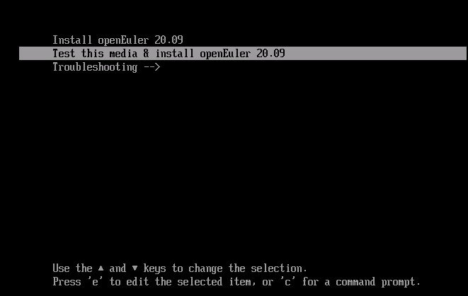

#### 选择安装或者测试后安装，进入如下界面：

#### 选择continue，进入下一步：
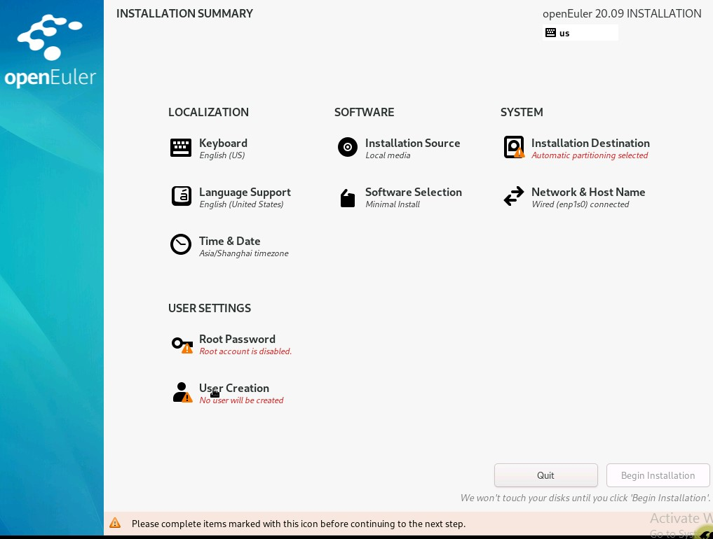

#### 选中标黄的部分，设置后，开始安装：
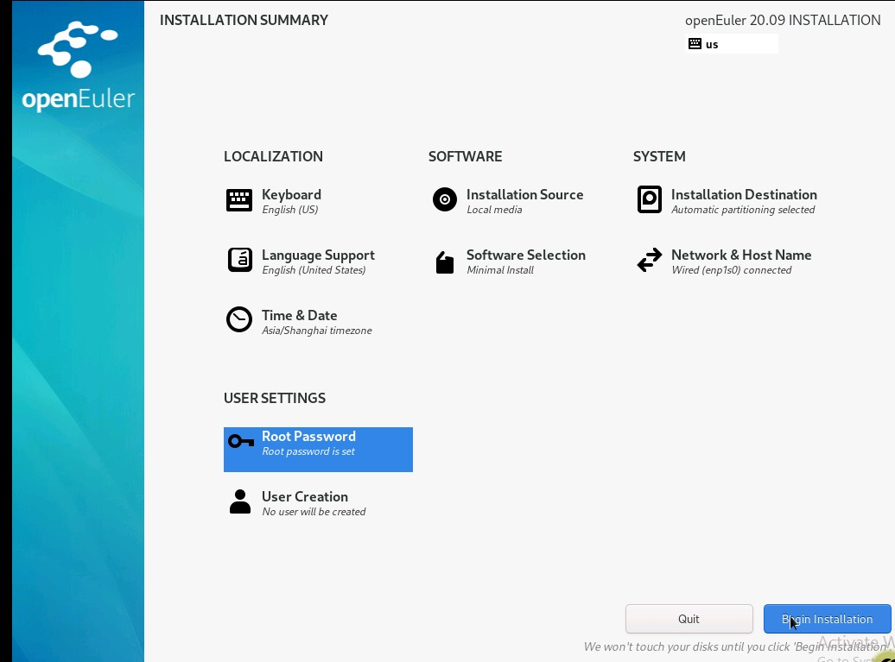
等待安装完毕，重启。

### 4. 由于virt-install时设置的启动方式是boot，当安装完毕重启系统时，会进入如下界面，输入exit，退出console

### 5. 进入bios界面，选择系统启动方式Boot Manager->UEFI QEMU QEMU HARDDISK
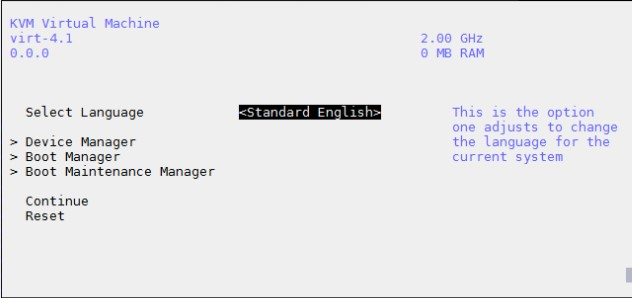
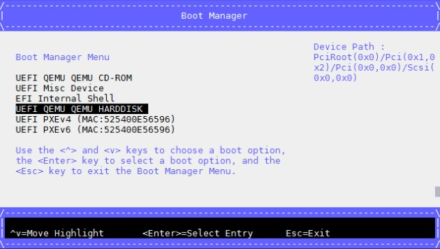

### 6. 系统重启，安装完成
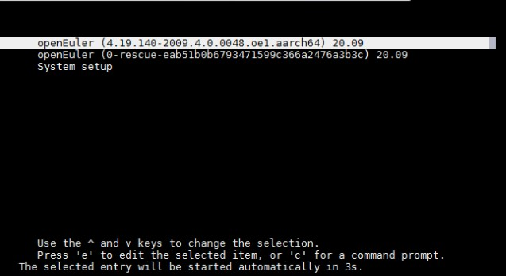

## 文本方式安装
### 1. 执行如下命令使用vnc安装：
virt-install --connect qemu:///system --virt-tpye kvm --vcpus [cpu_num] --memory [memory size] --name [domain name] --cdrom [iso_path] --disk [disk_path_and_parameter] --boot cdrom --network [network]

例：
virt-install --connect qemu:///system --virt-tpye kvm --vcpus 4 --memory 4096 --name wx-oe-20.09 --cdrom /home/images/openEuler-20.09-aarch64-dvd.iso --disk path=/home/images/test.img,size=50,format=qcow2,bus=scsi --boot cdrom --network network=default

### 2. 输入e，编辑文本模式，设置console=ttyAMA0,115200,tty0
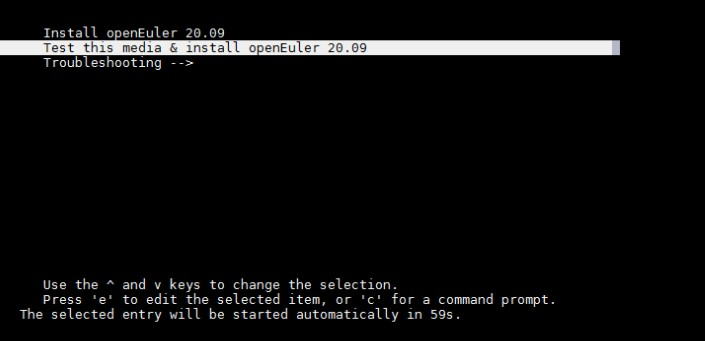
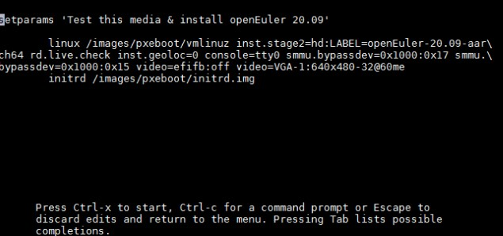

修改console，设置console=ttyAMA0,115200,tty0
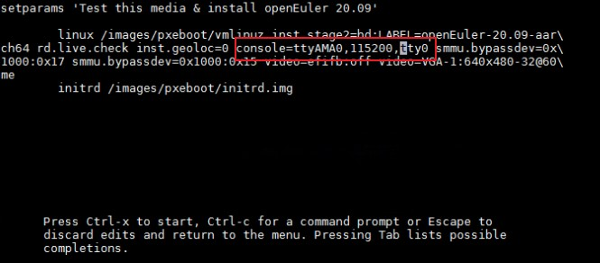

修改完成后，输入Ctrl-x开始

### 3. 选择2），使用文本模式安装
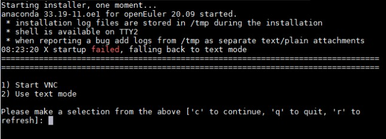

### 4. 系统自定义安装。“！”感叹号的条目需要自定义设置
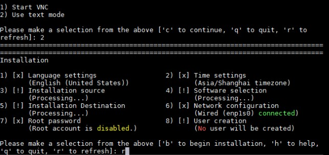

输入r，对Processing的条目状态进行刷新
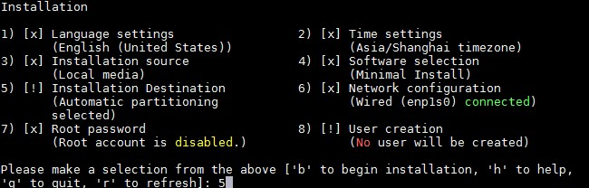
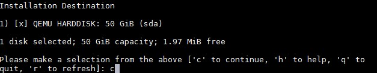
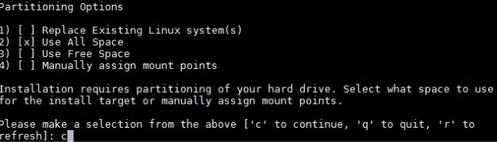
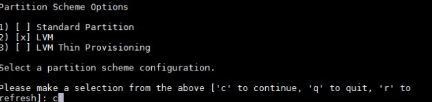

### 5. 设置root用户的密码
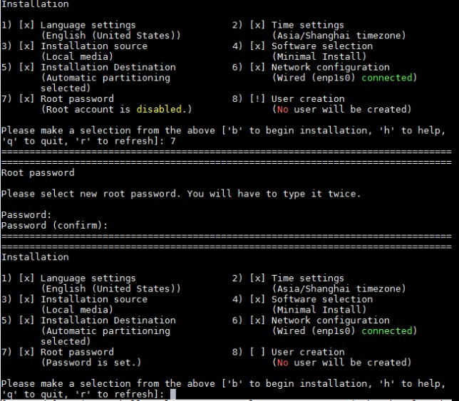

### 6. 上述自定义设置完成后，输入b，开始安装系统
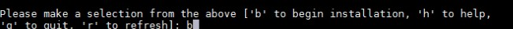
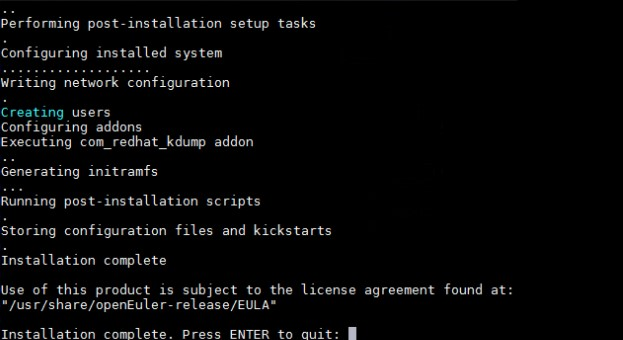

### 7. 系统安装完成后，由于virt-install时设置的启动方式是boot，当安装完毕重启系统时，会进入如下界面，输入exit，退出console
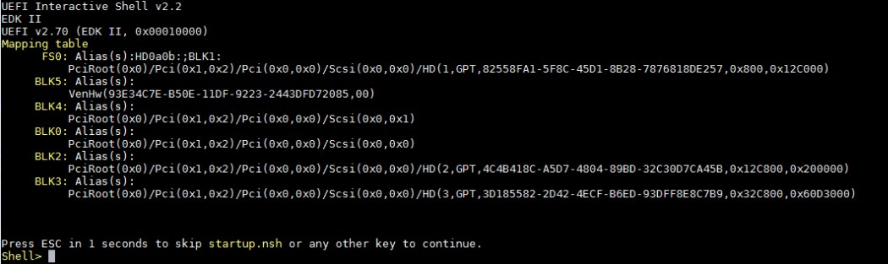

### 8. 进入bios界面，选择系统启动方式Boot Manager->UEFI QEMU QEMU HARDDISK

### 9. 系统重启，安装完成

# x86_64安装流程
## 环境信息

1. 宿主机环境： openEuler release 20.09
2. 虚拟机iso：openEuler-20.09-x86_64-dvd.iso
3. iso获取地址：
https://repo.openeuler.org/openEuler-20.09/ISO/x86_64/openEuler-20.09-x86_64-dvd.iso

## 准备工作
### 1. 准备好iso，在宿主机安装虚拟机化相关组件libvirt*、qemu*、virt-install，并开启libvirtd服务:
        yum install –y libvirt*
        yum install –y qemu*
        yum install –y virt-install
        systemctl start libvirtd

### 2. 安装edk2
        yum install –y edk2

### 3. 在windows侧或者可以连通该宿主机的且有图形界面的机器上安装vncviewer，设置VNC客户端选项

## 图形界面安装
### 1. 执行如下命令使用vnc安装：
virt-install --connect qemu:///system --vcpus [cpu_num] --memory [memory size] --name [domain name] --cdrom [iso_path] --disk [disk_path_and_parameter] --boot cdrom --network [network] --graphics vnc,listen=0.0.0.0

例：
virt-install --connect qemu:///system --vcpus 4 --memory 4096 --name wx-oe-20.09 --cdrom /home/images/openEuler-20.09-x86_64-dvd.iso --disk path=/home/images/test.img,size=50,format=qcow2,bus=virtio --video virtio --boot cdrom --network network=default --graphics vnc,listen=0.0.0.0

### 2. 重新开启一个终端，使用如下命令查看vnc端口号
        virsh vncdisplay [domain name]

### 3.打开vncviewer输入【主机名：端口号】连接，进入如下界面:
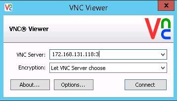

注意：如果打不开，请再宿主机使用如下命令开通端口：

        firewall-cmd --add-port=[port]/tcp
        firewall-cmd --add-port=[port]/tcp --permanent
其中，[port]的值应该等于5900+端口号的值，比如，此处应该是

        firewall-cmd --add-port=5903/tcp
        firewall-cmd --add-port=5903/tcp --permanent
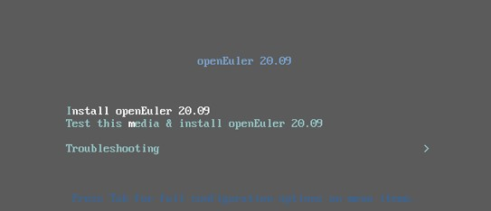

### 4. 选择安装或者测试后安装，进入如下界面：
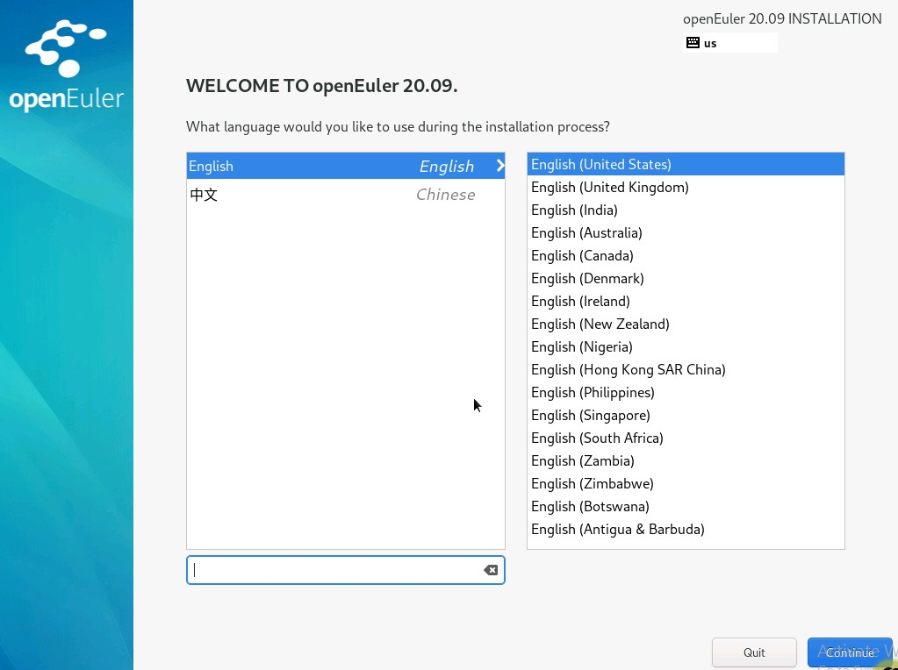
选择continue，进入下一步：

选中标黄的部分，设置后，开始安装：

等待安装完毕，重启。

### 5. 重新开启一个终端，关闭新安装的虚拟机
        virsh destroy [domain name]
### 6. 编辑虚拟机的启动方式，更改boot dev='cdrom'为boot dev='hd' 
        virsh edit [domain name]
### 7. 重启虚拟机
        virsh start [domain name]
### 8.通过vncviewer再次连接虚拟机，确认虚拟机重启ok。
