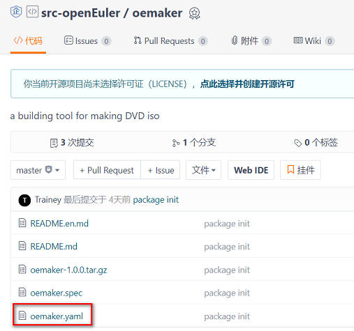

#### 一、背景介绍

通过`yaml`文件承载`openEuler`制品仓软件包的上游社区信息，便于统一校验及管理。

#### 二、yaml文件命名及位置要求

`yaml`文件名称与仓库名称应该保持一致，并跟软件包的`spec`文件在同级目录，一般放置到根目录。例如，`oemaker`代码仓的`yaml`文件名称是`oemaker.yaml`，放置到根目录，如下所示：

#### 三、yaml文件字段介绍

`yaml`文件中需要人工填写的字段有 `version_control`、`src_repo`、`tag_prefix`、`separator`。

<table>
<tr>
<th>字段名</th>
<th>字段描述</th>
<th>备注</th>
</tr>
<tr>
<td>version_control</td>
<td>上游仓库使用的版本控制协议</td>
<td>目前支持svn, git, hg, github, gnome, metacpan, pypi, gitee</td>
</tr>
<tr>
<td>src_repo</td>
<td>上游仓库的实际地址</td>
<td>通过version_control和src_repo我们可以使用工具下载对应的代码</td>
</tr>
<tr>
<td>tag_prefix</td>
<td>上游仓库的tag名version前缀</td>
<td>例如，上游给的tag名是v1_0_1, 那么tag_prefix应该配置为"^v"</td>
</tr>
<tr>
<td>separator</td>
<td>tag中版本的间隔符</td>
<td>例如，上游给的tag名是v1_0_1, 那么separator应该配置为"_"</td>
</tr>
</table>
#### 四、常见类型写法示例

<table>
<tr>
<th>version_control类型</th>
<th>示例写法（链接）</th>
</tr>
<tr>
<td>svn</td>
<td><a href="https://gitee.com/src-openeuler/amanda/blob/master/amanda.yaml">amanda.yaml</a></td>
</tr>
<tr>
<td>git</td>
<td><a href="https://gitee.com/src-openeuler/mdadm/blob/master/mdadm.yaml">mdadm.yaml</a></td>
</tr>
<tr>
<td>hg</td>
<td><a href="https://gitee.com/openeuler/openEuler-Advisor/blob/master/upstream-info/nginx.yaml">nginx.yaml</a></td>
</tr>
<tr>
<td>github</td>
<td><a href="https://gitee.com/src-openeuler/asciidoc/blob/master/asciidoc.yaml">asciidoc.yaml</a></td>
</tr>
<tr>
<td>gnome</td>
<td><a href="https://gitee.com/src-openeuler/gnome-terminal/blob/master/gnome-terminal.yaml">gnome-terminal.yaml</a></td>
</tr>
<tr>
<td>metacpan</td>
<td><a href="https://gitee.com/src-openeuler/perl-Authen-SASL/blob/master/perl-Authen-SASL.yaml">perl-Authen-SASL.yaml</a></td>
</tr>
<tr>
<td>pypi</td>
<td><a href="https://gitee.com/src-openeuler/python-apipkg/blob/master/python-apipkg.yaml">python-apipkg.yaml</a></td>
</tr>
<tr>
<td>gitee</td>
<td><a href="https://gitee.com/src-openeuler/oemaker/blob/master/oemaker.yaml">oemaker.yaml</a></td>
</tr>
</table>