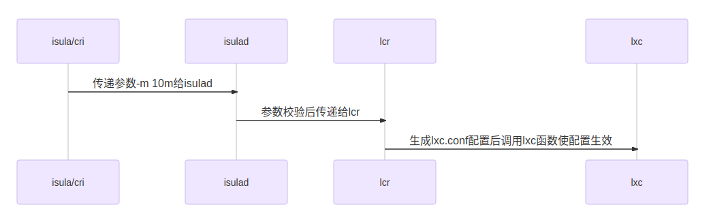
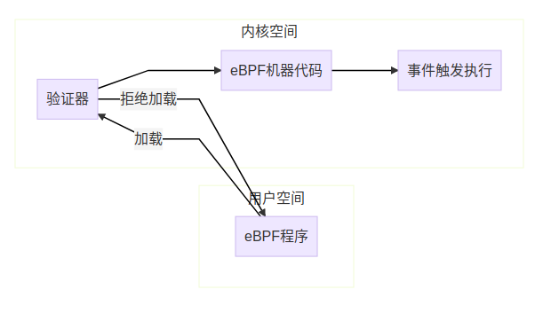
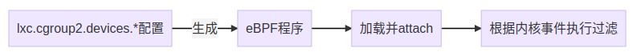

cgroup是linux中用于限制进程组资源的功能。cgroup目前包括两个版本，cgroup v1和cgroup v2。cgroup v2的目标是取代cgroup v1，出于兼容性的考虑，cgroup v1并没有在内核中删除，并且大概率会长期存在。iSulad目前已支持pure cgroup v2，该功能目前还是实验功能。


## cgroup v2相比cgroup v1有什么变化

cgroup v2和cgroup v1相比的主要差异如下：

1. cgroup v1的各个子系统(控制器)单独挂载在各自的目录下，而cgroup v2里所有子系统都挂载在同一个目录下扁平分布。
2. 进程只能绑定到cgroup的“/”目录和叶子节点，无法绑定到中间节点。
3. 需要在cgroup.subtree_control中开启对应的控制器才能在子目录中使用该控制器的功能。
4. 去掉了cgroup v1中的tasks文件，cpu控制器中的cgroup.clone_children也被移除了。
5. 修改了通知机制，cgroup v2通过cgroup.events文件进行通知。
6. 去掉了部分接口(见下面iSulad支持cgroup v2和cgroup v1的功能对比)，并将部分cgroup的实现方式修改为ebpf方式实现(后面有介绍ebpf方式的实现原理)。


下面我们介绍一下iSulad里面会用到的几个重要差异。

1. 在cgroup v1中，各个子系统都是各自独立实现并单独挂载的，像这样：

```
root@wft-pc:~# ls /sys/fs/cgroup/
blkio  cpuacct      cpuset   freezer  memory   net_cls,net_prio  perf_event  rdma     unified
cpu    cpu,cpuacct  devices  hugetlb  net_cls  net_prio          pids        systemd
root@wft-pc:~#
```

在cgroup v2中，各个子系统的实现进行了统一的规划(例如值的取值范围基本都是1到10000)，并全部挂载到同一个目录下，像这样：

```
root@wft-pc:/sys/fs/cgroup/isulad# ls
cgroup.controllers      cpu.max                cpu.weight                hugetlb.2MB.events.local  memory.events.local  memory.swap.high
cgroup.events           cpu.pressure           cpu.weight.nice           hugetlb.2MB.max           memory.high          memory.swap.max
cgroup.freeze           cpuset.cpus            hugetlb.1GB.current       hugetlb.2MB.rsvd.current  memory.low           pids.current
cgroup.max.depth        cpuset.cpus.effective  hugetlb.1GB.events        hugetlb.2MB.rsvd.max      memory.max           pids.events
cgroup.max.descendants  cpuset.cpus.partition  hugetlb.1GB.events.local  io.max                    memory.min           pids.max
cgroup.procs            cpuset.mems            hugetlb.1GB.max           io.pressure               memory.oom.group     rdma.current
cgroup.stat             cpuset.mems.effective  hugetlb.1GB.rsvd.current  io.stat                   memory.pressure      rdma.max
cgroup.subtree_control  cpu.stat               hugetlb.1GB.rsvd.max      io.weight                 memory.stat
cgroup.threads          cpu.uclamp.max         hugetlb.2MB.current       memory.current            memory.swap.current
cgroup.type             cpu.uclamp.min         hugetlb.2MB.events        memory.events             memory.swap.events
root@wft-pc:/sys/fs/cgroup/isulad#
```

2. cgroup v1中，挂载了的控制器就是可用的，但在cgroup v2中，需要开启才能使用。在cgroup目录中有一个cgroup.controllers文件和一个cgroup.subtree_control文件。

​       cgroup.controllers：当前目录可用的控制器，只读文件无法修改，内容由上一层文件夹中的cgroup.subtree_control决定。

​       cgroup.subtree_control：子目录可用的控制器。需要开启控制器则需要在该文件中增加对应的控制器，开启后在子目录可使用该控制器。

可以使用echo +memory > cgroup.subtree_control命令开启子目录的控制器，这里的+memory可以是cgroup.controllers里支持的任意一种控制器。看下面的例子，一开始在test目录下没有memory设置相关的控制器，当开启memory控制器后，目录下的test目录下就出现了memory相关的控制器。

```
root@wft-pc:/sys/fs/cgroup/test# cat cgroup.controllers
cpuset cpu io memory hugetlb pids rdma
root@wft-pc:/sys/fs/cgroup/test# cat cgroup.subtree_control
root@wft-pc:/sys/fs/cgroup/test# mkdir test
root@wft-pc:/sys/fs/cgroup/test# ls test
cgroup.controllers  cgroup.freeze     cgroup.max.descendants  cgroup.stat             cgroup.threads  cpu.pressure  io.pressure
cgroup.events       cgroup.max.depth  cgroup.procs            cgroup.subtree_control  cgroup.type     cpu.stat      memory.pressure
root@wft-pc:/sys/fs/cgroup/test# echo +memory > cgroup.subtree_control
root@wft-pc:/sys/fs/cgroup/test# ls test
cgroup.controllers  cgroup.max.descendants  cgroup.threads  io.pressure          memory.high  memory.oom.group     memory.swap.events
cgroup.events       cgroup.procs            cgroup.type     memory.current       memory.low   memory.pressure      memory.swap.high
cgroup.freeze       cgroup.stat             cpu.pressure    memory.events        memory.max   memory.stat          memory.swap.max
cgroup.max.depth    cgroup.subtree_control  cpu.stat        memory.events.local  memory.min   memory.swap.current
root@wft-pc:/sys/fs/cgroup/test#
```


## 配置iSulad支持cgroup v2

内核虽然在4.5版本就正式支持了cgroup v2，但是支持的功能并不全，建议使用尽可能新的内核版本以便支持更多的cgroup子系统。要验证iSulad支持cgroup v2的功能，建议至少使用5.8的内核版本，例如openEuler 21.03创新版本采用5.10的内核版本，可以使用uname -r命令查询内核的版本。iSulad会自动检测当前的cgroup版本，如果系统配置成了只支持cgroup v2并将cgroup v2挂载到/sys/fs/cgroup目录下(系统自动挂载)，则iSulad会使用cgroup v2来限制容器的资源。可以在系统的启动命令行参数中配置cgroup_no_v1=all参数表示禁用所有V1的cgroup，这样系统启动时就会只开启cgroup v2并默认将cgroup v2子系统挂载到/sys/fs/cgroup目录下。系统重启后，执行mount | grep cgroup命令，如果已经将cgroup2挂载到了/sys/fs/cgroup，则说明支持cgroup v2的环境配置好了：

```
root@wft-pc:~# mount | grep cgroup
cgroup2 on /sys/fs/cgroup type cgroup2 (rw,nosuid,nodev,noexec,relatime)
root@wft-pc:~#
```


## iSulad使用cgroup v2限制资源

### 简单示例：

1. 以限制内存资源为例，假设我们需要限制单个容器最多使用10M内存，则可以在运行容器时加上-m 10m参数进行限制：

   ```
   root@wft-pc:~# isula run -tid -m 10m busybox sh
   dcea83315b7b23d094f629f397c196df6e59be9e9fcd4774afa8428f078338a3
   root@wft-pc:~#
   ```

   -m 10m表示限制容器内最多只能使用10m内存，可以通过isula stats命令查看资源的限制情况：

   ```
   root@wft-pc:~# isula stats --no-stream dcea83315b7b23d094f629f397c196df6e59be9e9fcd4774afa8428f078338a3
   CONTAINER        CPU %      MEM USAGE / LIMIT          MEM %      BLOCK I / O                PIDS
   dcea83315b7b     0.00       300.00 KiB / 10.00 MiB     2.93       0.00 B / 0.00 B            1
   root@wft-pc:~#
   ```

   可以动态更新资源的限制：

   ```
   root@wft-pc:~# isula update -m 20m dcea83315b7b23d094f629f397c196df6e59be9e9fcd4774afa8428f078338a3
   dcea83315b7b23d094f629f397c196df6e59be9e9fcd4774afa8428f078338a3
   root@wft-pc:~# isula stats --no-stream dcea83315b7b23d094f629f397c196df6e59be9e9fcd4774afa8428f078338a3
   CONTAINER        CPU %      MEM USAGE / LIMIT          MEM %      BLOCK I / O                PIDS
   dcea83315b7b     0.00       300.00 KiB / 20.00 MiB     1.46       0.00 B / 0.00 B            1
   root@wft-pc:~#
   ```

2. 假设我们要将设备/dev/nvme0n1挂载到容器中成为/dev/sdx并限制为只读设备，则可以这么配置：

   ```
   root@wft-pc:~# isula run -ti --rm --device=/dev/nvme0n1:/dev/sdx:wm busybox fdisk /dev/sdx
   fdisk: can't open '/dev/sdx'
   root@wft-pc:~#
   ```

   挂载设备到容器的语法为--device=$host:$container:rwm
   $host指定设备在主机上的绝对路径，$container指定设备在容器内的绝对路径，r表示可读，w表示可写，m表示可以创建node
   上述命令中rwm三个参数缺少r参数，也就是说允许写和创建node但是不允许读(即只读)。

### 更多资源限制：

无论是cgroup v1还是cgroup v2，iSulad提供给用户使用的接口都是一致的。不过由于有部分cgroup v1支持的功能在cgroup v2中被去掉了或者实现方式有所变化，因此部分接口在cgroup v2中不可用或者含义发生变化。iSulad支持限制如下资源：

| 资源       | 功能                                           | 和cgroup v1的差异                                            |
| ---------- | ---------------------------------------------- | ------------------------------------------------------------ |
| devices    | 限制对应的设备是否可以在容器中访问以及访问权限 | devcies子系统不再使用往cgroup文件里写值的方式进行限制，而是采用ebpf的方式进行限制 |
| memory     | 限制容器的内存资源                             | 不支持swappiness，不支持kmem相关参数，不支持oom_control      |
| cpu/cpuset | 限制容器的cpu资源                              | 不支持rt_*相关(实时线程)的限制                               |
| blkio/io   | 限制容器的块设备io                             | 不仅限制块设备的IO，也能限制buffer IO                        |
| hugetlb    | 限制大页内存的使用                             | 无差异                                                       |
| pids       | 限制容器使用的pid                              | 无差异                                                       |
| files      | 限制容器使用的fd                               | 无差异                                                       |
| freeze     | 暂停容器                                       | 无差异                                                       |

以上资源限制的用法示例请参考如下脚本中的示例：

https://gitee.com/openeuler/iSulad/blob/master/CI/test_cases/manual_cases/cgroupv2.sh


## iSulad支持cgroup v2实现原理解析：




iSulad的资源限制流程如上图所示。iSulad负责参数的合法性校验，lcr负责生成lxc.conf中对应的lxc可识别的配置，lxc负责解析lxc.conf的参数并将参数配置给容器对应的cgroup的接口文件或使用eBPF方式实现对应的功能。

lcr中根据/sys/fs/cgroup文件系统的magic值来判断当前是cgroup v1还是cgroup v2：

```
int lcr_util_get_cgroup_version()
{
    struct statfs fs = {0};

    if (statfs(CGROUP_MOUNTPOINT, &fs) != 0) {
        ERROR("failed to statfs %s: %s", CGROUP_MOUNTPOINT, strerror(errno));
        return -1;
    }

    if (fs.f_type == CGROUP2_SUPER_MAGIC) {
        return CGROUP_VERSION_2;
    } else {
        return CGROUP_VERSION_1;
    }
}
```

如果当前是cgroup v2则生成cgroup v2的配置，否则生成cgroup v1的配置：

```
static struct lcr_list *trans_oci_resources(const defs_resources *res)
{
    int cgroup_version = 0;

    cgroup_version = lcr_util_get_cgroup_version();
    if (cgroup_version < 0) {
        return NULL;
    }

    if (cgroup_version == CGROUP_VERSION_2) {
        return trans_oci_resources_v2(res);
    } else {
        return trans_oci_resources_v1(res);
    }
}
```

lcr生成的cgroup v2的配置如下：

```
root@wft-pc:/var/lib/isulad/engines/lcr/dcea83315b7b23d094f629f397c196df6e59be9e9fcd4774afa8428f078338a3# cat config | grep cgroup2
lxc.cgroup2.devices.deny = a *:* rwm
lxc.cgroup2.devices.allow = c *:* m
lxc.cgroup2.devices.allow = b *:* m
lxc.cgroup2.devices.allow = c 1:3 rwm
lxc.cgroup2.devices.allow = c 1:5 rwm
lxc.cgroup2.devices.allow = c 1:7 rwm
lxc.cgroup2.devices.allow = c 5:0 rwm
lxc.cgroup2.devices.allow = c 5:1 rwm
lxc.cgroup2.devices.allow = c 5:2 rwm
lxc.cgroup2.devices.allow = c 1:8 rwm
lxc.cgroup2.devices.allow = c 1:9 rwm
lxc.cgroup2.devices.allow = c 136:* rwm
lxc.cgroup2.devices.allow = c 10:200 rwm
lxc.cgroup2.devices.deny = c 10:229 rwm
lxc.cgroup2.memory.max = 10485760
lxc.cgroup2.memory.swap.max = 10485760
root@wft-pc:/var/lib/isulad/engines/lcr/dcea83315b7b23d094f629f397c196df6e59be9e9fcd4774afa8428f078338a3#
```

其中lxc.cgroup2.memory.max = 10485760是根据配置-m 10m生产的，lxc.cgroup2.memory.swap.max = 10485760也是根据这个配置生成的(swap不配置的话默认和内存限制相同)，其他的lxc.cgroup2.devices相关参数是lcr为容器配置的默认devices参数。

### 通用配置cgroup v2文件的方式实现资源限制

大部分的配置，lxc根据lxc.conf中的配置，将配置写入容器对应的cgroup目录下对应的文件即可实现对资源的限制：

```
root@wft-pc:/sys/fs/cgroup/isulad/dcea83315b7b23d094f629f397c196df6e59be9e9fcd4774afa8428f078338a3# pwd
/sys/fs/cgroup/isulad/dcea83315b7b23d094f629f397c196df6e59be9e9fcd4774afa8428f078338a3
root@wft-pc:/sys/fs/cgroup/isulad/dcea83315b7b23d094f629f397c196df6e59be9e9fcd4774afa8428f078338a3# cat memory.max
10485760
root@wft-pc:/sys/fs/cgroup/isulad/dcea83315b7b23d094f629f397c196df6e59be9e9fcd4774afa8428f078338a3# cat memory.swap.max
10485760
root@wft-pc:/sys/fs/cgroup/isulad/dcea83315b7b23d094f629f397c196df6e59be9e9fcd4774afa8428f078338a3#
```

注意容器的cgroup目录为/sys/fs/cgroup/isulad/$container_id，而文件则为lxc.conf配置文件中的配置去掉"lxc.cgroup2."前缀后的值，例如lxc.cgroup2.memory.max配置对应的文件为memory.max

剩下的就交给内核了，内核会更据cgroup的配置来实现对该资源的限制。

### 使用eBPF实现cgroup v2的devices资源限制

前面介绍过，部分cgroup v2的资源限制是通过ebpf来实现的，iSulad使用的资源中，devices就是通过ebpf来实现资源限制的，也就是前面的lxc.cgroup2.devices.开头的那些配置。下面我们来介绍一下如何通过eBPF方式实现devices资源限制。



ebpf不需要重新编译内核，也不需要加载内核模块，就可以动态地将一段字节码加载到内核中执行，从而使用内核的数据进行数据的观测或限制。和linux内核模块(LKM)不同的是，ebpf不像LKM一样直接不受限地访问内核的资源，而是采用类似虚拟机的机制，在隔离环境中执行代码。eBPF运行过程如下：

1. 用户编写eBPF程序，eBPF程序通常是一小段汇编代码，用于实现用户自定义的功能，例如进行内核数据的观察或者进行控制权限过滤等。实现cgroup v2的devices功能时，就是由lxc代码中编写的一小段汇编程序用于实现设备的过滤功能。

2. eBPF被真正加载前，验证器会对eBPF程序进行严格的验证。验证器会根据代码生成有向无环图并进行验证，确保程序合法，合法的程序必须没有递归，没有控制循环，没有无法到达的指令，指令条数在允许的范围内，指令不会超过程序界限。除了基本的校验外，验证器还会分析程序执行的每条指令进行预执行。验证通过后eBPF程序会被编译成机器代码用于执行。

3. eBPF程序加载时需要指定程序附加的执行点，执行点是根据eBPF程序的类型决定的，eBPF程序根据指定的类型被挂接到指定的内核事件上，当有对应的内核事件产生时，就会执行eBPF机器代码。cgroup v2的devices功能的eBPF程序的类型是BPF_PROG_TYPE_CGROUP_DEVICE，加载点是/sys/fs/cgroup/isulad/$container_id。

4. lxc在创建容器时，根据lxc.conf中的lxc.cgroup2.devices.*相关配置，生成eBPF程序并attach到容器的cgroup根文件夹，从而实现对容器内设备权限的过滤。lxc在销毁容器时，卸载eBFP程序。

   
