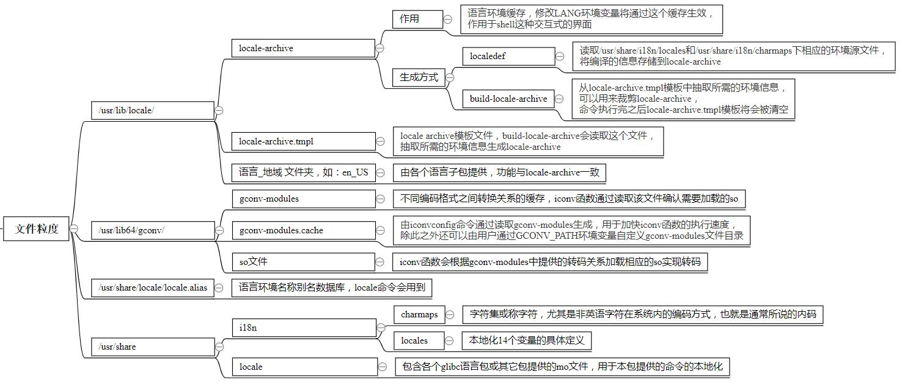
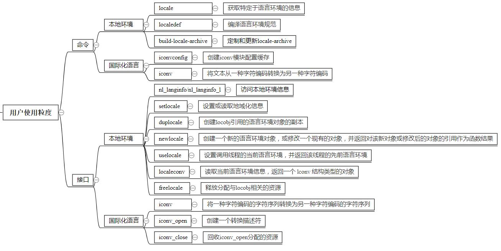

# 1 概述
IBM社区曾有篇名为《glibc与Linux 的国际化与本地化机制》的帖子（链接：https://cutt.ly/KzjZUxW ），详细介绍了glibc的国际化和本地化的相关知识，本文将在此基础上这次将结合openEuler glibc及其子包提供的文件详细说明glibc locale相关的使用方法。<br><br>
软件信息如下：
| <div style="width: 30pt">软件项</div>  | <div style="width: 150pt">版本信息</div>                 | 
| :------------------------------------:| :------------------------------------------------------: | 
| <div style="width: 30pt">OS</div>     | <div style="width: 150pt">openEuler 20.03 (LTS)</div>    | 
| <div style="width: 30pt">kernel</div> | <div style="width: 150pt">4.19.90-2003.4.0.0036.oe1</div>| 
| <div style="width: 30pt">glibc</div>  | <div style="width: 150pt">2.28</div>                     | 
| <div style="width: 30pt">gcc</div>    | <div style="width: 150pt">7.3.0</div>                    | 
<br>

# 2 功能介绍
这部分我们从文件粒度、用户使用粒度和rpm包粒度来说明，具体内容见下图：
<center></center>
<br>

## 2.1 文件层面
文件层面，各个模块的功能如下：
<center></center>
<br>

## 2.2 用户层面
用户使用层面，各个模块的功能如下：
<center></center>
<br>

## 2.3 rpm包层面
rpm包层面，各个模块的功能如下：
<center></center>
<br>

图中各个层面都已有大致的介绍，在此不再加文字赘述。
<br><br>

# 3 常用功能
## 3.1 本地化
通俗地讲，locale就是本地交互环境的呈现形式，再通俗的说，就是shell界面显示哪种语言，哪种组织形式，让我们通过具体案例来认识locale。
<br>

### 3.1.1 locale与子语言包
直接敲locale命令：
```
$ locale
LANG=en_US.UTF-8
LC_CTYPE="en_US.UTF-8"
LC_NUMERIC="en_US.UTF-8"
LC_TIME="en_US.UTF-8"
LC_COLLATE="en_US.UTF-8"
LC_MONETARY="en_US.UTF-8"
LC_MESSAGES="en_US.UTF-8"
LC_PAPER="en_US.UTF-8"
LC_NAME="en_US.UTF-8"
LC_ADDRESS="en_US.UTF-8"
LC_TELEPHONE="en_US.UTF-8"
LC_MEASUREMENT="en_US.UTF-8"
LC_IDENTIFICATION="en_US.UTF-8"
LC_ALL=en_US.UTF-8
```

可以看出，locale按照将文化传统的各个方面分成12个大类，这12个大类分别是：
```
1、语言符号及其分类(LC_CTYPE)
2、数字(LC_NUMERIC)
3、比较和排序习惯(LC_COLLATE)
4、时间显示格式(LC_TIME)
5、货币单位(LC_MONETARY)
6、信息主要是提示信息,错误信息,状态信息,标题,标签,按钮和菜单等(LC_MESSAGES)
7、姓名书写方式(LC_NAME)
8、地址书写方式(LC_ADDRESS)
9、电话号码书写方式(LC_TELEPHONE)
10、度量衡表达方式 (LC_MEASUREMENT)
11、默认纸张尺寸大小(LC_PAPER)
12、对locale自身包含信息的概述(LC_IDENTIFICATION)
```

所以说，locale就是某一个地域内的人们的语言习惯和文化传统和生活习惯。一个地区的locale就是根据这几大类的习惯定义的，这些locale定义文件放在 /usr/share/i18n/locales 目录下面，例如en_US, zh_CN and de_DE@euro都是locale的定义文件。<br>

通过修改环境变量即可修改locale，比如：
```
# echo $LANG
en_US.UTF-8
# LANG="zh_CN.UTF-8"

```
我们修改了LANG这个环境变量，这时候输入date命令：
```
# date
2021年 03月 09日 星期二 11:11:02 CST
```

已经成功将loacle变成中文了，但是如果随便一个--help（例如iconv --help）发现还是英文，这是为什么？
```
# iconv --help 
Usage: iconv [OPTION...] [FILE...]
Convert encoding of given files from one encoding to another.

 Input/Output format specification:
  -f, --from-code=NAME       encoding of original text
  -t, --to-code=NAME         encoding for output

 Information:
  -l, --list                 list all known coded character sets

 Output control:
  -c                         omit invalid characters from output
  -o, --output=FILE          output file
  -s, --silent               suppress warnings
      --verbose              print progress information

  -?, --help                 Give this help list
      --usage                Give a short usage message
  -V, --version              Print program version

Mandatory or optional arguments to long options are also mandatory or optional
for any corresponding short options.

For bug reporting instructions, please see:
<http://www.gnu.org/software/libc/bugs.html>.
```
这就需用到glibc的子语言包了，具体来说，我们需要安装glibc-langpack-zh子语言包，我们可以先把这个包解压开来看看有什么：
```
.
└── usr
    ├── lib
    │    └── locale
    └── share
         └── locale
```

/usr/lib/locale这个位置是不是很熟悉，没错，就是放置locale-archive文件的目录，在2.1小节的图中其实有提到“语言_地域”文件夹所对应的每个子语言包提供的/usr/lib/locale下的文件实际上和全量locale-archive是有交叉的。
<br>

继续分析子语言包，另一个/usr/share/locale目录下实际上是一个mo文件，名字为libc，而glibc作为基础库主要提供的文件就是 libc.so，这下其实很明朗了，我们刚才输入的iconv命令是glibc提供的，而子语言包也提供了一个以libc命名的mo文件，因此只有安装了提供命令本地化的语言包，glibc提供的命令本地化才能生效。对其他命令来说也是这个道理，一般mo文件会由命令所属的rpm包一并提供。比如我们一直使用的date命令，该命令由coreutils包提供，我们通过rpm -ql列出coreutils包提供的文件可以发现其提供了本地化所需的mo文件，因此我们在通过LANG修改当前的环境信息后，就可以使date命令显示我们需要的语言了。
```
# rpm -ql coreutils | grep mo
...
/usr/share/locale/zh_CN/LC_MESSAGES/coreutils.mo
/usr/share/locale/zh_CN/LC_TIME/coreutils.mo
...
```
<br>

安装glibc-langpack-zh包再试一下，已显示中文。
```
# iconv --help 
用法： iconv [选项...] [文件...]
转换给定文件的编码。

 输入/输出格式规范：
  -f, --from-code=名称     原始文本编码
  -t, --to-code=名称       输出编码

 信息：
  -l, --list                 列举所有已知的字符集

 输出控制：
  -c                         从输出中忽略无效的字符
  -o, --output=文件        输出文件
  -s, --silent               关闭警告
      --verbose              打印进度信息

  -?, --help                 给出此帮助列表
      --usage                给出简要的用法信息
  -V, --version              打印程序版本号

长选项的强制或可选参数对对应的短选项也是强制或可选的。

要知道错误报告指令，请参看：
<http://www.gnu.org/software/libc/bugs.html>。
```
<br>

我们来总结一下，/usr/share/locale目录提供了包括glibc本身在内的各个包本地化相关的mo文件夹，后续mo文件由rpm来提供，配合LANG环境变量即可实现命令的本地化。
<br><br>

### 3.1.2 locale-archive
经常有人会问，locale-archive是什么？能不能删？这么大，能不能裁？我在网上找了很久也没找到locale-archive的定义。不妨通俗地给它下个定义：locale-archive是fedora系的glibc提供的一种本地化缓存，未裁剪的全量locale-archive，等效于所有子语言包提供的/usr/lib/locale/目录下文件的集合。
<br>

举个例子就好懂了，假设我们把locale-archive给mv走，然后修改LANG会怎么样？
```
# pwd
/usr/lib/locale
# mv locale-archive bak
# LANG="zh_CN.UTF-8"
# date 
Wed Mar 10 09:21:27 CST 2021
```
此时，我们试图修改成中文环境，但没有生效。如果安装了glibc-langpack-zh子语言包呢？
```
# date
2021年 03月 10日 星期三 09:22:59 CST
```
修改生效了，我们卸载掉中文子语言包，把locale-archive给mv回来
```
# pwd
/usr/lib/locale
# mv bak locale-archive
# LANG="zh_CN.UTF-8"
# date 
2021年 03月 10日 星期三 09:24:17 CST
```

同样生效了，好了，破案了。其实glibc在spec中已经申明了，当你安装了所需的子语言包，实际上可以卸载掉all-langpacks这个包，即去掉locale-archive这个文件来节省空间。
```
glibc.spec

# The glibc-all-langpacks provides the virtual glibc-langpack,
# and thus satisfies glibc's requirement for installed locales.
# Users can add one more other langauge packs and then eventually
# uninstall all-langpacks to save space.
%package all-langpacks
Summary: All language packs for %{name}.
Requires: %{name} = %{version}-%{release}
Requires: %{name}-common = %{version}-%{release}
Provides: %{name}-langpack = %{version}-%{release}
%description all-langpacks
```
<br>

这里附上locale-archive的裁剪方法：<br>
step1、列出当前环境中的所有locale
```
# localedef --list-archive
```
step2、指定需要裁剪的locale
```
# localedef --delete-from-archive [待裁剪locale]
```
step3、用当前的locale-archive覆盖locale-archive.tmpl
```
# mv /usr/lib/locale/locale-archive /usr/lib/locale/locale-archive.tmpl
```
step4、重新生成locale-archive
```
# build-locale-archive
```
<br> 

例如：裁剪掉非英文支持
```
# localedef --list-archive | grep -v -i ^en | xargs localedef --delete-from-archive
# mv /usr/lib/locale/locale-archive /usr/lib/locale/locale-archive.tmpl
# build-locale-archive
```
注意：执行build-locale-archive后，可能出现ssh断掉的现象，重新连接即可 
<br><br>

## 3.2 国际化
所谓国际化指的是一个程序或软件可给特定的人群使用而无须修改或重新编译源代码。glibc提供了两个相关的命令（iconv/iconvconfig）和三个接口（iconv_open、iconv和iconv_close），这部分网上有很详细的资料，这里首推《字符编码知识简介和iconv函数的简单使用》这篇帖子（链接：https://cutt.ly/HzcP6nG ），具体作用不再赘述，这里仅稍微补充一点：/usr/lib64/gconv/目录（也可能在/usr/lib/gconv目录）下的文件，其使用逻辑为：iconv接口通过gconv-modules.cache来加载对应so做转码操作，而gconv-modules.cache由iconvconfig命令读取gconv-modules文件来生成。
<br><br>

# 4 参考资料
1、浅析 Linux 的国际化与本地化机制：
https://cutt.ly/KzjZUxW

2、字符编码知识简介和iconv函数的简单使用：
https://www.cnblogs.com/qingergege/p/7491590.html

3、locale localedef --之Linux字符集理解：
https://www.cnblogs.com/wn1m/p/10837609.html

4、捣鼓一下linux下的locale：
http://www.360doc.com/content/15/1105/08/14513665_510854234.shtml

5、locale的设定及其LANG、LC_ALL、LANGUAGE环境变量的区别：
https://cutt.ly/DzjXdvr

6、GNU官方关于gconv-modules文件作用以及iconv转码方式的讲解：
https://cutt.ly/5zjXoOr
<br><br>

# glibc相关文章推荐
glibc malloc系列文章：<br>
&nbsp;&nbsp;&nbsp;&nbsp;原理简析：https://cutt.ly/NzcDUEd <br>
&nbsp;&nbsp;&nbsp;&nbsp;数据结构：https://cutt.ly/JzcSBfB <br>
&nbsp;&nbsp;&nbsp;&nbsp;malloc：https://cutt.ly/TzcSjUX <br>
&nbsp;&nbsp;&nbsp;&nbsp;free：https://cutt.ly/QzcSy5G <br>

glibc问题定位与分析系列文章：<br>
&nbsp;&nbsp;&nbsp;&nbsp;memcpy 1k字节x86_64虚拟机性能下降分析：https://cutt.ly/8zcDyPi <br>
