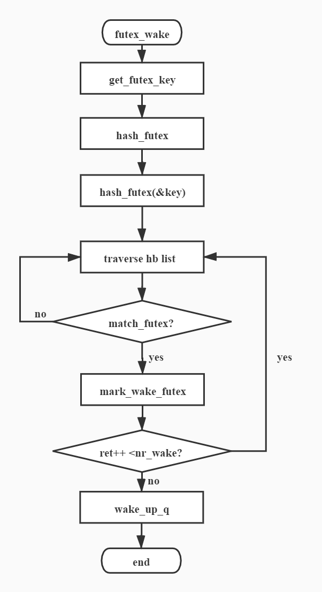

# 前言
Futex是Fast Userspace mutexes的缩写，翻译过来就是快速用户空间互斥体。其设计思想是通过增加在用户态原子检查来决定是否陷入内核进行wait。关于用户态的逻辑这里暂且不表，接下来本文将结合linux源码介绍futex的基本功能。
<br>

软件信息如下：
| <div style="width: 50pt">软件项</div>  | <div style="width: 170pt">版本信息</div>                         | 
| :------------------------------------:| :--------------------------------------------------------------: |
| <div style="width: 50pt">OS</div>     | <div style="width: 170pt">openEuler 20.03 (LTS)</div>            | 
| <div style="width: 50pt">kernel</div> | <div style="width: 170pt">4.19.90-2003.4.0.0036.oe1.aarch64</div>| 
| <div style="width: 50pt">glibc</div>  | <div style="width: 170pt">2.28</div>                             | 
| <div style="width: 50pt">gcc</div>    | <div style="width: 170pt">7.3.0</div>                            |
<br><br>


# 原理简介
Futex是一种用户态和内核态混合的同步机制，支持进程内的线程之间和进程间的同步锁操作。当用于线程同步时，因为线程共享虚拟内存空间，虚拟地址就可以唯一的标识出futex变量，即线程用同样的虚拟地址来访问futex变量。当用于进程间时，进程有独立的虚拟内存空间，因此只有通过mmap()让它们共享同一段物理地址空间来使用futex变量。<br>
以进程同步为例，首先，同步的进程间通过mmap共享一段内存，futex变量就位于这段共享的内存中且操作是原子的，当进程尝试进入互斥区或者退出互斥区的时候，先去查看共享内存中的futex变量，如果没有竞争发生，则只修改futex，而不用再执行系统调用，仅当通过访问futex变量告诉进程有竞争发生时，才执行系统调用去完成相应的处理。<br>
当任务需要陷入内容等待时最终会调用futex_wait，当需要唤醒其它任务时最终会调用futex_wake，这两个函数完成了最基本的futex机制，其简化版的定义如下：

```
//uaddr指向一个地址，val代表这个地址期待的值，当*uaddr==val时，才会进行wait
int futex_wait(int *uaddr, int val);

//唤醒n个在uaddr指向的锁变量上挂起等待的进程
int futex_wake(int *uaddr, int n);
```
<br>

# 数据结构
上文提到，futex变量创建于用户空间，在进程或线程间共享，当进程或线程想要进入临界区时，通常会判断futex变量是否满足条件，若满足则成功进入临界区，否则则阻塞在该futex变量上；当进程或线程将要离开临界区时，则会唤醒阻塞在futex变量上的其他进程或线程。在内核中通过struct futex_q结构将一个futex变量与一个挂起的进程（线程）关联起来，其定义以及关键成员的作用如下：
```
struct futex_q {
    struct plist_node list;        //链表节点
    struct task_struct *task;      //挂起在该futex变量关联的进程（线程）
    spinlock_t *lock_ptr;          //自旋锁，控制链表访问
    union futex_key key;           //futex变量地址标识

    //下面三个与优先级继承相关，在此不多介绍
    struct futex_pi_state *pi_state;
    struct rt_mutex_waiter *rt_waiter;
    union futex_key *requeue_pi_key;
     
    u32 bitset;                    //类似掩码匹配
};
```
<br>

在内核中通过一个全局哈希表来维护所有挂起阻塞在futex变量上的进程（线程），不同的futex变量会根据其地址标识计算出一个hash key并定位到一个bucket上，因此挂起阻塞在同一个futex变量的所有进程（线程）会对应到同一个bucket上，数据结构如下：
```
//bucket
struct futex_hash_bucket {
    //当前自旋等待哈希桶的waiter数目
	atomic_t waiters;

    //自旋锁，用于控制chain的访问，
    //struct futex_q中lock_ptr，就是引用其所在的bucket的自旋锁
	spinlock_t lock;

	//优先级链，与传统等待队列不同，futex使用优先级链表来实现等待队列，
    //是为了实现优先级继承，从而解决优先级翻转问题
	struct plist_head chain;
} ____cacheline_aligned_in_smp;

//全局哈希表
static struct {
	struct futex_hash_bucket *queues;
	unsigned long            hashsize;
} __futex_data __read_mostly __aligned(2*sizeof(long));
#define futex_queues   (__futex_data.queues)
#define futex_hashsize (__futex_data.hashsize)
```
<br>

上文提到进程（线程）对应的bucket为全局哈希表的value，这里展示一下哈希表的key，其结构如下。
```
union futex_key {
	struct {
		u64 i_seq;
		unsigned long pgoff;
		unsigned int offset;
	} shared;  //不同进程间通过文件共享futex变量，表明该变量在文件中的位置

	struct {
		union {
			struct mm_struct *mm;
			u64 __tmp;
		};
		unsigned long address;
		unsigned int offset;
	} private;  //同一进程的不同线程共享futex变量，表明该变量在进程地址空间中的位置

	struct {
		u64 ptr;
		unsigned long word;
		unsigned int offset;
	} both;
};
```
<br>
futex_key是一个union类型的结构，可以给进程和线程使用。futex会根据用户态的uaddr和进程（线程）的信息填充futex_key，并通过jhash计算出一个全局哈希表的索引，从而对应到一个bucket，尝试获取同一个futex的进程（线程）会映射到同一个bucket，然后再根据futex_key中的值在bucket链表中找到其它进程（线程）。<br>
几个结构体之间的关系如下图所示：
<center></center>
<br><br>

# 源码分析
## futex前期操作
futex初始化的源码如下，可以看出在kernel启动的时候即完成了初始化。初始化的内容也比较简单，申请固定数量的bucket交由全局哈希表__futex_data管理，然后初始化每个bucket的链表的自旋锁。
```
static int __init futex_init(void)
{

    ...

#if CONFIG_BASE_SMALL
	futex_hashsize = 16;
#else
	futex_hashsize = roundup_pow_of_two(256 * num_possible_cpus());
#endif

	futex_queues = alloc_large_system_hash("futex", sizeof(*futex_queues),
					       futex_hashsize, 0,
					       futex_hashsize < 256 ? HASH_SMALL : 0,
					       &futex_shift, NULL,
					       futex_hashsize, futex_hashsize);
	futex_hashsize = 1UL << futex_shift;

	futex_detect_cmpxchg();

	for (i = 0; i < futex_hashsize; i++) {
		atomic_set(&futex_queues[i].waiters, 0);
		plist_head_init(&futex_queues[i].chain);
		spin_lock_init(&futex_queues[i].lock);
	}

	return 0;
}
core_initcall(futex_init);
```
<br>

futex系统调用进入内核后都会先走到do_futex，源码如下。用户态需要确定入参（入参个数，具体操作等），在内核会根据入参来决定采取何种操作，本文作为futex的入门帖，仅需关注futex_wait和futex_wake即可。
```
long do_futex(u32 __user *uaddr, int op, u32 val, ktime_t *timeout,
		u32 __user *uaddr2, u32 val2, u32 val3)
{
	int cmd = op & FUTEX_CMD_MASK;
	unsigned int flags = 0;

    ...

	switch (cmd) {
	case FUTEX_WAIT:
		val3 = FUTEX_BITSET_MATCH_ANY;
		fallthrough;
	case FUTEX_WAIT_BITSET:
		return futex_wait(uaddr, flags, val, timeout, val3);
	case FUTEX_WAKE:
		val3 = FUTEX_BITSET_MATCH_ANY;
		fallthrough;
	case FUTEX_WAKE_BITSET:
		return futex_wake(uaddr, flags, val, val3);
	case FUTEX_REQUEUE:
		return futex_requeue(uaddr, flags, uaddr2, val, val2, NULL, 0);
	case FUTEX_CMP_REQUEUE:
		return futex_requeue(uaddr, flags, uaddr2, val, val2, &val3, 0);
	case FUTEX_WAKE_OP:
		return futex_wake_op(uaddr, flags, uaddr2, val, val2, val3);
	case FUTEX_LOCK_PI:
		return futex_lock_pi(uaddr, flags, timeout, 0);
	case FUTEX_UNLOCK_PI:
		return futex_unlock_pi(uaddr, flags);
	case FUTEX_TRYLOCK_PI:
		return futex_lock_pi(uaddr, flags, NULL, 1);
	case FUTEX_WAIT_REQUEUE_PI:
		val3 = FUTEX_BITSET_MATCH_ANY;
		return futex_wait_requeue_pi(uaddr, flags, val, timeout, val3,
					     uaddr2);
	case FUTEX_CMP_REQUEUE_PI:
		return futex_requeue(uaddr, flags, uaddr2, val, val2, &val3, 1);
	}
	return -ENOSYS;
}
```
<br><br>

## futex wait分析
futex的执行流程参考下图。
<center></center>
<br><br>
futex源码如下，下面让我们结合流程图来分析源码。对于带超时的场景，futex wait会首先通过futex_setup_timer设置定时器。接下来调用futex_wait_setup函数，后者主要做了两件事，一是根据入参获取全局哈希表的key从而找到task所属的bucket并获取自旋锁；二是在入队之前最后判断*uaddr是否为预期值。如果*uaddr被更新即非预期值，则会重新返回用户态去抢锁。否则执行下一步，即调用futex_wait_queue_me。后者主要做了几件事：1、将当前的task插入等待队列；2、启动定时任务；3、触发重新调度。接下来当task能够继续执行时会判断自己是如何被唤醒的，并释放hrtimer退出。

```
static int futex_wait(u32 __user *uaddr, unsigned int flags, u32 val,
		      ktime_t *abs_time, u32 bitset)
{

    ...

	to = futex_setup_timer(abs_time, &timeout, flags,
			       current->timer_slack_ns);
retry:
	/*
	 * Prepare to wait on uaddr. On success, holds hb lock and increments
	 * q.key refs.
	 */
	ret = futex_wait_setup(uaddr, val, flags, &q, &hb);
	if (ret)
		goto out;

	/* queue_me and wait for wakeup, timeout, or a signal. */
	futex_wait_queue_me(hb, &q, to);

	/* If we were woken (and unqueued), we succeeded, whatever. */
	ret = 0;
	/* unqueue_me() drops q.key ref */
	if (!unqueue_me(&q))
		goto out;
	ret = -ETIMEDOUT;
	if (to && !to->task)
		goto out;

	/*
	 * We expect signal_pending(current), but we might be the
	 * victim of a spurious wakeup as well.
	 */
	if (!signal_pending(current))
		goto retry;

	ret = -ERESTARTSYS;
	if (!abs_time)
		goto out;

    ...

out:
	if (to) {
		hrtimer_cancel(&to->timer);
		destroy_hrtimer_on_stack(&to->timer);
	}
	return ret;
}
```
<br><br>

## futex wake分析
futex_wake的执行流程如下。<br>
<center></center>
<br><br>

futex_wake源码如下，首先是通过get_futex_key生成全局哈希表的key，并通过hash_futex找到对应的bucket。以上两步实际上在上文提到的futex_wait_setup函数中也被调用到。接下来会遍历bucket根据key找目前wait在当前futex的task，并将其从bucket取出放入临时队列wake_q。随后释放bucket的自旋锁并逐个唤醒wake_q中的task。
```
static int
futex_wake(u32 __user *uaddr, unsigned int flags, int nr_wake, u32 bitset)
{

    ...

	ret = get_futex_key(uaddr, flags & FLAGS_SHARED, &key, FUTEX_READ);
	if (unlikely(ret != 0))
		return ret;

	hb = hash_futex(&key);

	/* Make sure we really have tasks to wakeup */
	if (!hb_waiters_pending(hb))
		return ret;

	spin_lock(&hb->lock);

	plist_for_each_entry_safe(this, next, &hb->chain, list) {
		if (match_futex (&this->key, &key)) {
			if (this->pi_state || this->rt_waiter) {
				ret = -EINVAL;
				break;
			}

			/* Check if one of the bits is set in both bitsets */
			if (!(this->bitset & bitset))
				continue;

			mark_wake_futex(&wake_q, this);
			if (++ret >= nr_wake)
				break;
		}
	}

	spin_unlock(&hb->lock);
	wake_up_q(&wake_q);
	return ret;
}
```
<br><br>

# 小结
本文结合linux中futex的源码简单介绍了其最基本的两个功能futex_wait和futex_wake，后续有机会将陆续介绍futex相关的其它实现。
<br><br>

# 参考文献
futex内核实现源码分析（1-3）：https://www.jianshu.com/p/8f4b8dd37cbf <br>
linux内核级同步机制--futex： https://cloud.tencent.com/developer/article/1474735 <br>
<br><br>

