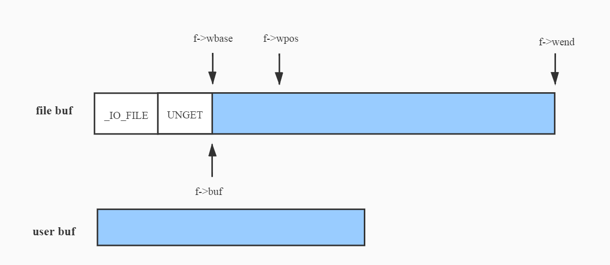

# 前言
musl是在Linux系统调用API之上构建的C标准库的实现，其中包括在基本语言标准POSIX中定义的接口，以及广泛认可的扩展。相比于glibc，musl轻巧，快速，简单并且协议友好，本文将以musl的fopen为切入点，结合源码介绍musl对文件的基本操作。
<br><br>

# 数据结构
musl涉及文件的关键数据结构如下，该结构体即为我们平时使用的FILE，本文重点关注4个函数指针（close、read、write和seek）和5个位置指针（读两个：rpos、rend，写三个：wend、wpos和wbase）即可。
```
struct _IO_FILE {
	unsigned flags;
	unsigned char *rpos, *rend;
	int (*close)(FILE *);
	unsigned char *wend, *wpos;
	unsigned char *mustbezero_1;
	unsigned char *wbase;
	size_t (*read)(FILE *, unsigned char *, size_t);
	size_t (*write)(FILE *, const unsigned char *, size_t);
	off_t (*seek)(FILE *, off_t, int);
	unsigned char *buf;
	size_t buf_size;
	FILE *prev, *next;
	int fd;
	int pipe_pid;
	long lockcount;
	int mode;
	volatile int lock;
	int lbf;
	void *cookie;
	off_t off;
	char *getln_buf;
	void *mustbezero_2;
	unsigned char *shend;
	off_t shlim, shcnt;
	FILE *prev_locked, *next_locked;
	struct __locale_struct *locale;
};
```
<br><br>

# 接口
## fopen
fopen的源码如下，逻辑非常简单，判断打开的模式，然后使用open系统调用从内核获取一个fd，随后通过__fdopen函数将fd封装为一个FILE，并为4个函数指针（close、read、write和seek）挂上默认的函数。<br>
FILE初始状态可以用下图表示。最前面一段即为FILE的主体，接下来是一个名为UNGET的预留区域处理不缓冲时的场景（默认8字节），接下来便是musl预留的一段缓冲区，默认1024字节。
```
FILE *fopen(const char *restrict filename, const char *restrict mode)
{
	FILE *f;
	int fd;
	int flags;

	/* Check for valid initial mode character */
	if (!strchr("rwa", *mode)) {
		errno = EINVAL;
		return 0;
	}

	/* Compute the flags to pass to open() */
	flags = __fmodeflags(mode);

	fd = sys_open(filename, flags, 0666);
	if (fd < 0) return 0;
	if (flags & O_CLOEXEC)
		__syscall(SYS_fcntl, fd, F_SETFD, FD_CLOEXEC);

	f = __fdopen(fd, mode);
	if (f) return f;

	__syscall(SYS_close, fd);
	return 0;
}

...

FILE *__fdopen(int fd, const char *mode)
{
	...

	/* Allocate FILE+buffer or fail */
	if (!(f=malloc(sizeof *f + UNGET + BUFSIZ))) return 0;

	/* Zero-fill only the struct, not the buffer */
	memset(f, 0, sizeof *f);

	...

	f->fd = fd;
	f->buf = (unsigned char *)f + sizeof *f + UNGET;
	f->buf_size = BUFSIZ;

	...

	/* Initialize op ptrs. No problem if some are unneeded. */
	f->read = __stdio_read;
	f->write = __stdio_write;
	f->seek = __stdio_seek;
	f->close = __stdio_close;

	...

}
```
<br><br>

<center></center>
<br><br>

## fclose
fclose函数源码如下，这里只列出了关键步骤。将写缓冲的内容刷入文件，通过f->close(f)调用真正的close函数__stdio_close，通过系统调用关闭fd对应的文件，然后释放掉外部封装的数据结构。
```
int fclose(FILE *f)
{
	int r;
	
	FLOCK(f);
	r = fflush(f);
	r |= f->close(f);
	FUNLOCK(f);

	...

	free(f->getln_buf);
	free(f);

	return r;
}

...

int __stdio_close(FILE *f)
{
	return syscall(SYS_close, __aio_close(f->fd));
}
```
<br><br>

## fread
分析fread的时候我们把顺序反过来，先看_IO_FILE中的read成员，上文已提过该成员为指针函数，在fopen的时候初始化，fread最终会调用该函数，其源码如下。其核心思想是在满足用户读取len长度内容到buf之外，预读一部分到FILE中的缓冲区。<br>
从iov结构体数组的初始化可知，第一个元素是用户的buf，第二个是FILE的缓冲区，即先读出给用户，然后再读到缓冲区，读到缓冲区的内容默认小于等于1023，为何不是1024？<br>
让我们把视线重新放回到iov的初始化，其中第一个元素的起始地址确实是用户的地址，但是长度实际上减去了1，即iov[0]最多只会读出len - 1个元素，最后一个元素会放入iov[1]，在结尾时重新赋给buf[len - 1]，这么做的目的是使rpos指针在读取后偏移一个字节从而表明FILE的缓冲区已经有预读的内容。预读之后的指针情况可以用下图表示（与写相关的三个指针此时为空）。<br>
<center></center>
<br><br>

```
size_t __stdio_read(FILE *f, unsigned char *buf, size_t len)
{
	struct iovec iov[2] = {
		{ .iov_base = buf, .iov_len = len - !!f->buf_size },
		{ .iov_base = f->buf, .iov_len = f->buf_size }
	};
	ssize_t cnt;

	cnt = iov[0].iov_len ? syscall(SYS_readv, f->fd, iov, 2)
		: syscall(SYS_read, f->fd, iov[1].iov_base, iov[1].iov_len);
	if (cnt <= 0) {
		f->flags |= cnt ? F_ERR : F_EOF;
		return 0;
	}
	if (cnt <= iov[0].iov_len) return cnt;
	cnt -= iov[0].iov_len;
	f->rpos = f->buf;
	f->rend = f->buf + cnt;
	if (f->buf_size) buf[len-1] = *f->rpos++;
	return len;
}
```
<br><br>


接下来看fread函数，其源码如下。上文提到每次__stdio_read都会预读一部分内容，因此fread会优先通过memcpy从缓冲区读，如果读完仍不满足用户需求才会调用__stdio_read从文件中读取。
```
size_t fread(void *restrict destv, size_t size, size_t nmemb, FILE *restrict f)
{
	unsigned char *dest = destv;
	size_t len = size*nmemb, l = len, k;
	if (!size) nmemb = 0;

	FLOCK(f);

	f->mode |= f->mode-1;

	if (f->rpos != f->rend) {
		/* First exhaust the buffer. */
		k = MIN(f->rend - f->rpos, l);
		memcpy(dest, f->rpos, k);
		f->rpos += k;
		dest += k;
		l -= k;
	}
	
	/* Read the remainder directly */
	for (; l; l-=k, dest+=k) {
		k = __toread(f) ? 0 : f->read(f, dest, l);
		if (!k) {
			FUNLOCK(f);
			return (len-l)/size;
		}
	}

	FUNLOCK(f);
	return nmemb;
}
```
<br><br>

这里提一下fread在调用__stdio_read之前调用的一个函数__toread，其源码如下。该函数可以理解为读写模式的切换，如果上一次是写，由于读写共用一个缓冲区，因此需要先把写缓存刷入文件并把写相关的三个指针清零，然后再执行读操作，此外，__toread函数还负责判断文件是否可读。
```
int __toread(FILE *f)
{
	f->mode |= f->mode-1;
	if (f->wpos != f->wbase) f->write(f, 0, 0);
	f->wpos = f->wbase = f->wend = 0;
	if (f->flags & F_NORD) {
		f->flags |= F_ERR;
		return EOF;
	}
	f->rpos = f->rend = f->buf + f->buf_size;
	return (f->flags & F_EOF) ? EOF : 0;
}
```
<br><br>


## fwrite
同样还是先从__stdio_write来看，源码如下。其核心思想是先把用户buf中的内容写入到FILE提供的缓冲区，写满了之后才会往文件中写，相较__stdio_read来说比较简单，在完成一次__stdio_write并且未写满缓冲区的情况下，FILE的指针位置如下图所示。
```
size_t __stdio_write(FILE *f, const unsigned char *buf, size_t len)
{
	struct iovec iovs[2] = {
		{ .iov_base = f->wbase, .iov_len = f->wpos-f->wbase },
		{ .iov_base = (void *)buf, .iov_len = len }
	};
	struct iovec *iov = iovs;
	size_t rem = iov[0].iov_len + iov[1].iov_len;
	int iovcnt = 2;
	ssize_t cnt;
	for (;;) {
		cnt = syscall(SYS_writev, f->fd, iov, iovcnt);
		if (cnt == rem) {
			f->wend = f->buf + f->buf_size;
			f->wpos = f->wbase = f->buf;
			return len;
		}
		if (cnt < 0) {
			f->wpos = f->wbase = f->wend = 0;
			f->flags |= F_ERR;
			return iovcnt == 2 ? 0 : len-iov[0].iov_len;
		}
		rem -= cnt;
		if (cnt > iov[0].iov_len) {
			cnt -= iov[0].iov_len;
			iov++; iovcnt--;
		}
		iov[0].iov_base = (char *)iov[0].iov_base + cnt;
		iov[0].iov_len -= cnt;
	}
}
```
<br><br>

<center></center>
<br><br>
接下来看fwirte函数，其源码如下。同样也是先通过__towrite切换模式，如果写缓冲区的剩余空间不足，则会调用__stdio_write，由上文可知，此时是先刷缓冲区的内容，然后才操作用户buf的内容。如果缓冲区空间充足则直接通过memcpy写入缓冲区。

```
size_t __fwritex(const unsigned char *restrict s, size_t l, FILE *restrict f)
{
	size_t i=0;

	if (!f->wend && __towrite(f)) return 0;

	if (l > f->wend - f->wpos) return f->write(f, s, l);

	if (f->lbf >= 0) {
		/* Match /^(.*\n|)/ */
		for (i=l; i && s[i-1] != '\n'; i--);
		if (i) {
			size_t n = f->write(f, s, i);
			if (n < i) return n;
			s += i;
			l -= i;
		}
	}

	memcpy(f->wpos, s, l);
	f->wpos += l;
	return l+i;
}

size_t fwrite(const void *restrict src, size_t size, size_t nmemb, FILE *restrict f)
{
	size_t k, l = size*nmemb;
	if (!size) nmemb = 0;
	FLOCK(f);
	k = __fwritex(src, l, f);
	FUNLOCK(f);
	return k==l ? nmemb : k/size;
}
```
<br><br>

类似于__toread，__towrite用作切换到写操作，源码如下。这里其实有个bug，我们在下文细说。
```
int __towrite(FILE *f)
{
	f->mode |= f->mode-1;
	if (f->flags & F_NOWR) {
		f->flags |= F_ERR;
		return EOF;
	}
	/* Clear read buffer (easier than summoning nasal demons) */
	f->rpos = f->rend = 0;

	/* Activate write through the buffer. */
	f->wpos = f->wbase = f->buf;
	f->wend = f->buf + f->buf_size;

	return 0;
}
```
<br><br>

# 一点不足
如果仔细对比__towrite和__toread的代码可以发现，二者其实并不“对称”，具体来说，__toread即切换到写之前会通过f->write(f, 0, 0)将写缓冲刷到文件，但是__towrite即切换到写时则是简单粗暴地把读相关的指针（rpos、rend）清理，这样做会有什么问题呢？我们看以下操作：<br>

|<div style="width: 30pt">步骤</div>   |<div style="width: 50pt">动作</div>     |<div style="width: 50pt">期望pos</div>  |<div style="width: 50pt">实际pos</div>  | 
|:------------------------------------:|:--------------------------------------:|:--------------------------------------:|:--------------------------------------:| 
|<div style="width: 30pt">1</div>      |<div style="width: 50pt">写30</div>     |<div style="width: 50pt">30</div>       |<div style="width: 50pt">30</div>       | 
|<div style="width: 30pt">2</div>      |<div style="width: 50pt">返回开头</div> |<div style="width: 50pt">0</div>        |<div style="width: 50pt">0</div>        | 
|<div style="width: 30pt">3</div>      |<div style="width: 50pt">读15</div>     |<div style="width: 50pt">15</div>       |<div style="width: 50pt">15</div>       | 
|<div style="width: 30pt">4</div>      |<div style="width: 50pt">写15</div>     |<div style="width: 50pt">30</div>       |<div style="width: 50pt">45</div>       | 
<br><br>

如果在第4步执行完时通过fgetpos获取当前文件指针的位置，则会发现并非期望的30，而是45，事实上，第4步期望是覆盖文件的后15字节，实际上变成了追加写15字节，pos自然是45，这是为什么？<br>
由上文可知，fread实际上会预读一部分内容，因此当我们在第三步读15时，实际上fread读了30即整个文件，至于这一步为何没有问题，可以看以下代码：

```
off_t __ftello_unlocked(FILE *f)
{
	off_t pos = f->seek(f, 0,
		(f->flags & F_APP) && f->wpos != f->wbase
		? SEEK_END : SEEK_CUR);
	if (pos < 0) return pos;

	/* Adjust for data in buffer. */
	if (f->rend)
		pos += f->rpos - f->rend;
	else if (f->wbase)
		pos += f->wpos - f->wbase;
	return pos;
}
```
<br><br>

fgetpos最终调用了__ftello_unlocked，该函数通过系统调用从内核获取文件pos的真实位置，然后会做一个矫正，具体来说，我们在第3步做了读操作，因此读指针rend非空，__ftello_unlocked会减去多读的内容，因此第3步没问题。但是到第4步，由于__towrite简单粗暴地把读指针清空，写的15字节内容直接放入了FILE的缓冲区，下一次读时这15字节会直接追加到文件的末尾。
<br>
对于这个问题，处理方式也很简单，在__towrite清理读指针之前把pos移动回多读之前的位置即可。<br><br>

# 小结
本文结合musl的源码分析了fopen相关的接口实现。相较于glibc，musl的代码浅显易懂，当然也存在考虑不完善的问题。<br>
<br>

# 文章推荐
glibc malloc系列文章：<br>
&nbsp;&nbsp;&nbsp;&nbsp;原理简析：<br>
&nbsp;&nbsp;&nbsp;&nbsp; https://openeuler.org/zh/blog/wangshuo/glibc+malloc%E5%8E%9F%E7%90%86%E7%AE%80%E6%9E%90/glibc+malloc%E5%8E%9F%E7%90%86%E7%AE%80%E6%9E%90.html <br>
&nbsp;&nbsp;&nbsp;&nbsp;数据结构：<br>
&nbsp;&nbsp;&nbsp;&nbsp; https://openeuler.org/zh/blog/wangshuo/glibc+malloc%E6%BA%90%E7%A0%81%E7%AE%80%E6%9E%90.html <br>
&nbsp;&nbsp;&nbsp;&nbsp;malloc：<br>
&nbsp;&nbsp;&nbsp;&nbsp; https://openeuler.org/zh/blog/wangshuo/glibc+malloc%E6%BA%90%E7%A0%81%E7%AE%80%E6%9E%90(%E4%BA%8C).html <br>
&nbsp;&nbsp;&nbsp;&nbsp;free：<br>
&nbsp;&nbsp;&nbsp;&nbsp; https://openeuler.org/zh/blog/wangshuo/glibc+malloc%E6%BA%90%E7%A0%81%E7%AE%80%E6%9E%90(%E4%B8%89).html <br>
<br>

glibc问题定位与分析系列文章：<br>
&nbsp;&nbsp;&nbsp;&nbsp;memcpy 1k字节x86_64虚拟机性能下降分析：<br>
&nbsp;&nbsp;&nbsp;&nbsp; https://openeuler.org/zh/blog/wangshuo/memcpy_1k%E5%AD%97%E8%8A%82x86_64%E8%99%9A%E6%8B%9F%E6%9C%BA%E6%80%A7%E8%83%BD%E4%B8%8B%E9%99%8D%E5%88%86%E6%9E%90.html <br>
&nbsp;&nbsp;&nbsp;&nbsp;调用栈问题分析：<br>
&nbsp;&nbsp;&nbsp;&nbsp; https://openeuler.org/zh/blog/wangshuo/glibc%E9%97%AE%E9%A2%98%E5%AE%9A%E4%BD%8D--%E6%8E%A8%E6%A0%88%E9%97%AE%E9%A2%98%E5%88%86%E6%9E%90.html <br>
<br>

&nbsp;&nbsp;&nbsp;&nbsp;glibc locale使用简析：<br>
&nbsp;&nbsp;&nbsp;&nbsp; https://openeuler.org/zh/blog/wangshuo/glibc%20locale%E4%BD%BF%E7%94%A8%E7%AE%80%E6%9E%90/glibc+locale%E4%BD%BF%E7%94%A8%E7%AE%80%E6%9E%90.html <br>