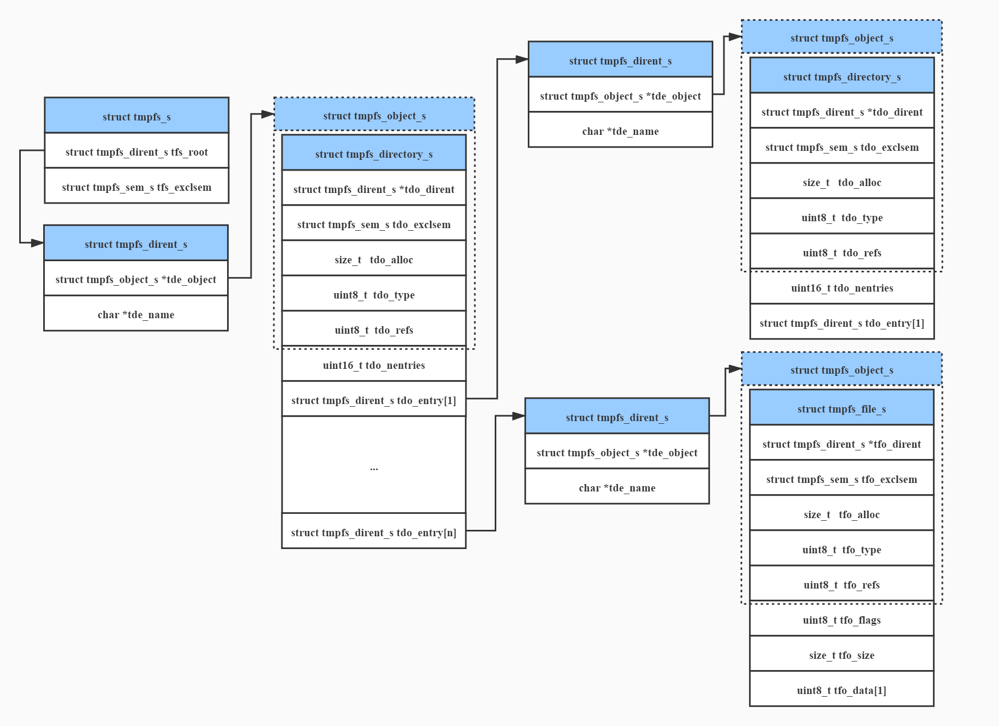

# 前言
tmpfs（temporary filesystem）直译为临时文件系统，类似于虚拟磁盘（ramdisk），但ramdisk是一个块设备，而且需要一个mkfs之类的命令格式化后才能使用。而tmpfs是一个独立的文件系统，不是块设备，只要挂载，就可以立即使用。本文将以nuttx-10.0.1的tmpfs为研究对象介绍其基本数据结构和基础接口功能实现。<br>
<br>

# 数据结构
tmpfs的源码位于nuttx的fs/tmpfs目录下，只有一个C文件，因此阅读起来相对比较简单，这里先介绍一下tmpfs的关键数据结构。<br>
<br>

## object
目录和文件的抽象，从下图几个结构体的对比也可以看出，object结构体可以认为是为了便于统一接口而将文件和目录的结构体进行的抽象，从面向对象的角度来看，object可以理解为file和directory结构体的的父类。
```
/* The generic form of a TMPFS memory object */

struct tmpfs_object_s
{
  FAR struct tmpfs_dirent_s *to_dirent;
  struct tmpfs_sem_s to_exclsem;

  size_t   to_alloc;     /* Allocated size of the memory object */
  uint8_t  to_type;      /* See enum tmpfs_objtype_e */
  uint8_t  to_refs;      /* Reference count */
};
```
<br><br>

<center></center>
<br><br>

## dirent
可以理解为检索项，后续将通过dirent来找到对应的object，从源码可以看出，dirent只是在object之外增加了对象的名称。
```
/* The form of one directory entry */

struct tmpfs_dirent_s
{
  FAR struct tmpfs_object_s *tde_object;
  FAR char *tde_name;
};
```
<br>

## directory
目录，directory里面有一个或多个dirent，目录中的dirent可以指向文件或子目录，从根目录开始文件和目录交织在一起构成一棵tmpfs树。
```
/* The form of a directory memory object */

struct tmpfs_directory_s
{
  /* First fields must match common TMPFS object layout */

  FAR struct tmpfs_dirent_s *tdo_dirent;
  struct tmpfs_sem_s tdo_exclsem;

  size_t   tdo_alloc;    /* Allocated size of the directory object */
  uint8_t  tdo_type;     /* See enum tmpfs_objtype_e */
  uint8_t  tdo_refs;     /* Reference count */

  /* Remaining fields are unique to a directory object */

  uint16_t tdo_nentries; /* Number of directory entries */
  struct tmpfs_dirent_s tdo_entry[1];
};
```
<br>

## file
文件，书面地讲是有顺序的字节流。每个文件都有一个可阅读的文件名，用户可以对指定文件名的文件进行读、写、创建删除等操作。
```
/* The form of a regular file memory object
 *
 * NOTE that in this very simplified implementation, there is no per-open
 * state.  The file memory object also serves as the open file object,
 * saving an allocation.  This has the negative side effect that no per-
 * open state can be retained (such as open flags).
 */

struct tmpfs_file_s
{
  /* First fields must match common TMPFS object layout */

  FAR struct tmpfs_dirent_s *tfo_dirent;
  struct tmpfs_sem_s tfo_exclsem;

  size_t   tfo_alloc;    /* Allocated size of the file object */
  uint8_t  tfo_type;     /* See enum tmpfs_objtype_e */
  uint8_t  tfo_refs;     /* Reference count */

  /* Remaining fields are unique to a directory object */

  uint8_t  tfo_flags;    /* See TFO_FLAG_* definitions */
  size_t   tfo_size;     /* Valid file size */
  uint8_t  tfo_data[1];  /* File data starts here */
};
```
<br>

## tmpfs_s
tmpfs的实例，其tfs_root成员指向了tmpfs的根目录。
```
/* This structure represents one instance of a TMPFS file system */

struct tmpfs_s
{
  /* The root directory */

  FAR struct tmpfs_dirent_s tfs_root;
  struct tmpfs_sem_s tfs_exclsem;
};
```
<br>


## 结构体关系
以上结构体的之间的关系如下图所示。
<center></center>
<br><br>

# 主要内部接口
这里根据操作内容将关键的内部接口分为以下四类。
<br><br>
## dirent操作
### tmpfs_add_dirent
上文提到dirent是object加上名称的简化封装版本，而object是目录和文件的抽象，因此文件和目录的新增都会用到tmpfs_add_dirent，其源码如下。<br>
可以看出tmpfs_add_dirent其实只做了一件事，即在对当前目录tdo进行realloc，新增一项tdo_entry，并把新的object（即to）和name赋值给新的tdo_entry。
```
/****************************************************************************
 * Name: tmpfs_add_dirent
 ****************************************************************************/

static int tmpfs_add_dirent(FAR struct tmpfs_directory_s **tdo,
                            FAR struct tmpfs_object_s *to,
                            FAR const char *name)
{
  FAR struct tmpfs_directory_s *oldtdo;
  FAR struct tmpfs_directory_s *newtdo;
  FAR struct tmpfs_dirent_s *tde;
  FAR char *newname;
  unsigned int nentries;
  int index;

  /* Copy the name string so that it will persist as long as the
   * directory entry.
   */

  newname = strdup(name);
  if (newname == NULL)
    {
      return -ENOMEM;
    }

  /* Get the new number of entries */

  oldtdo = *tdo;
  nentries = oldtdo->tdo_nentries + 1;

  /* Reallocate the directory object (if necessary) */

  index = tmpfs_realloc_directory(tdo, nentries);
  if (index < 0)
    {
      kmm_free(newname);
      return index;
    }

  /* Save the new object info in the new directory entry */

  newtdo          = *tdo;
  tde             = &newtdo->tdo_entry[index];
  tde->tde_object = to;
  tde->tde_name   = newname;

  /* Add backward link to the directory entry to the object */

  to->to_dirent  = tde;
  return OK;
}
```
<br>
<br>

### tmpfs_find_dirent
tmpfs_find_dirent函数用于在指定的目录tdo中查找指定name的dirent，其源码如下，实现较为简单，就是单纯的遍历查找。
```
/****************************************************************************
 * Name: tmpfs_find_dirent
 ****************************************************************************/

static int tmpfs_find_dirent(FAR struct tmpfs_directory_s *tdo,
                             FAR const char *name)
{
  int i;

  /* Search the list of directory entries for a match */

  for (i = 0;
       i < tdo->tdo_nentries &&
       strcmp(tdo->tdo_entry[i].tde_name, name) != 0;
       i++);

  /* Return what we found, if anything */

  return i < tdo->tdo_nentries ? i : -ENOENT;
}
```
<br><br>

### tmpfs_remove_dirent
tmpfs_remove_dirent函数用于从指定的目录tdo中删除名称为name的dirent，其源码如下。这里首先free掉在tmpfs_add_dirent函数中strdup的name，然后判断被删除的dirent是否为最后一个，如果是直接退出，否则把最后一个dirent覆盖到要删除的dirent中从而空出最后一个dirent以备后续使用，避免频繁realloc。
```
/****************************************************************************
 * Name: tmpfs_remove_dirent
 ****************************************************************************/

static int tmpfs_remove_dirent(FAR struct tmpfs_directory_s *tdo,
                               FAR const char *name)
{
  int index;
  int last;

  /* Search the list of directory entries for a match */

  index = tmpfs_find_dirent(tdo, name);
  if (index < 0)
    {
      return index;
    }

  /* Free the object name */

  if (tdo->tdo_entry[index].tde_name != NULL)
    {
      kmm_free(tdo->tdo_entry[index].tde_name);
    }

  /* Remove by replacing this entry with the final directory entry */

  last = tdo->tdo_nentries - 1;
  if (index != last)
    {
      FAR struct tmpfs_dirent_s *newtde;
      FAR struct tmpfs_dirent_s *oldtde;
      FAR struct tmpfs_object_s *to;

      /* Move the directory entry */

      newtde             = &tdo->tdo_entry[index];
      oldtde             = &tdo->tdo_entry[last];
      to                 = oldtde->tde_object;

      newtde->tde_object = to;
      newtde->tde_name   = oldtde->tde_name;

      /* Reset the backward link to the directory entry */

      to->to_dirent      = newtde;
    }

  /* And decrement the count of directory entries */

  tdo->tdo_nentries = last;
  return OK;
}
```
<br><br>

## object操作
### tmpfs_find_object
上文提到object是目录和文件的抽象，因此文件和目录的find都用tmpfs_find_object来实现，其源码如下。<br>
函数虽然在150行左右，但是并不复杂。入参中的relpath为绝对路径，函数从tmpfs的根目录开始查找，具体某一目录下的查找用到了上文提到的tmpfs_find_dirent函数，如果找不到则返回错误码，如果找到则目标object以及其所在的目录上锁，to_refs和tdo_refs都加1。
```
/****************************************************************************
 * Name: tmpfs_find_object
 ****************************************************************************/

static int tmpfs_find_object(FAR struct tmpfs_s *fs,
                             FAR const char *relpath,
                             FAR struct tmpfs_object_s **object,
                             FAR struct tmpfs_directory_s **parent)
{
  FAR struct tmpfs_object_s *to = NULL;
  FAR struct tmpfs_directory_s *tdo = NULL;
  FAR struct tmpfs_directory_s *next_tdo;
  FAR char *segment;
  FAR char *next_segment;
  FAR char *tkptr;
  FAR char *copy;
  int index;
  int ret;

  /* Make a copy of the path (so that we can modify it via strtok) */

  copy = strdup(relpath);
  if (copy == NULL)
    {
      return -ENOMEM;
    }

  /* Traverse the file system for any object with the matching name */

  to       = fs->tfs_root.tde_object;
  next_tdo = (FAR struct tmpfs_directory_s *)fs->tfs_root.tde_object;

  for (segment =  strtok_r(copy, "/", &tkptr);
       segment != NULL;
       segment = next_segment)
    {
      /* Get the next segment after the one we are currently working on.
       * This will be NULL is we are working on the final segment of the
       * relpath.
       */

      next_segment = strtok_r(NULL, "/", &tkptr);

      /* Search the next directory. */

      tdo = next_tdo;

      /* Find the TMPFS object with the next segment name in the current
       * directory.
       */

      index = tmpfs_find_dirent(tdo, segment);
      if (index < 0)
        {
          /* No object with this name exists in the directory. */

          kmm_free(copy);
          return index;
        }

      to = tdo->tdo_entry[index].tde_object;

      /* Is this object another directory? */

      if (to->to_type != TMPFS_DIRECTORY)
        {
          /* No.  Was this the final segment in the path? */

          if (next_segment == NULL)
            {
              /* Then we can break out of the loop now */

               break;
            }

          /* No, this was not the final segment of the relpath.
           * We cannot continue the search if any of the intermediate
           * segments do no correspond to directories.
           */

          kmm_free(copy);
          return -ENOTDIR;
        }

      /* Search this directory for the next segment.  If we
       * exit the loop, tdo will still refer to the parent
       * directory of to.
       */

      next_tdo = (FAR struct tmpfs_directory_s *)to;
    }

  /* When we exit this loop (successfully), to will point to the TMPFS
   * object associated with the terminal segment of the relpath.
   * Increment the reference count on the located object.
   */

  /* Free the dup'ed string */

  kmm_free(copy);

  /* Return what we found */

  if (parent)
    {
      if (tdo != NULL)
        {
          /* Get exclusive access to the parent and increment the reference
           * count on the object.
           */

          ret = tmpfs_lock_directory(tdo);
          if (ret < 0)
            {
              return ret;
            }

          tdo->tdo_refs++;
        }

      *parent = tdo;
    }

  if (object)
    {
      if (to != NULL)
        {
          /* Get exclusive access to the object and increment the reference
           * count on the object.
           */

          ret = tmpfs_lock_object(to);
          if (ret < 0)
            {
              return ret;
            }

          to->to_refs++;
        }

      *object = to;
    }

  return OK;
}
```
<br><br>


## 文件操作
### tmpfs_alloc_file
tmpfs_alloc_file函数用于为新的文件分配空间，其源码如下，实现也非常简单，申请内存，结构体初始化，仅此而已。
```
/****************************************************************************
 * Name: tmpfs_alloc_file
 ****************************************************************************/

static FAR struct tmpfs_file_s *tmpfs_alloc_file(void)
{
  FAR struct tmpfs_file_s *tfo;
  size_t allocsize;

  /* Create a new zero length file object */

  allocsize = SIZEOF_TMPFS_FILE(CONFIG_FS_TMPFS_FILE_ALLOCGUARD);
  tfo = (FAR struct tmpfs_file_s *)kmm_malloc(allocsize);
  if (tfo == NULL)
    {
      return NULL;
    }

  /* Initialize the new file object.  NOTE that the initial state is
   * locked with one reference count.
   */

  tfo->tfo_alloc = allocsize;
  tfo->tfo_type  = TMPFS_REGULAR;
  tfo->tfo_refs  = 1;
  tfo->tfo_flags = 0;
  tfo->tfo_size  = 0;

  tfo->tfo_exclsem.ts_holder = getpid();
  tfo->tfo_exclsem.ts_count  = 1;
  nxsem_init(&tfo->tfo_exclsem.ts_sem, 0, 0);

  return tfo;
}
```
<br><br>

### tmpfs_create_file
tmpfs_create_file用于创建一个新文件，其源码如下。一开始会先判断是否是在根目录下创建文件，如果是则parent变量为根目录，反正则通过tmpfs_find_directory函数找到待创建文件的上一级目录。然后会通过tmpfs_find_dirent函数查找当前文件是否存在，如果存在则返回错误码退出；如果不存在则调用tmpfs_alloc_file函数为新文件分配空间，调用tmpfs_add_dirent函数在新文件所在的目录下为其分配一个dirent。
```
/****************************************************************************
 * Name: tmpfs_create_file
 ****************************************************************************/

static int tmpfs_create_file(FAR struct tmpfs_s *fs,
                             FAR const char *relpath,
                             FAR struct tmpfs_file_s **tfo)
{
  FAR struct tmpfs_directory_s *parent;
  FAR struct tmpfs_file_s *newtfo;
  FAR char *copy;
  FAR char *name;
  int ret;

  /* Duplicate the path variable so that we can modify it */

  copy = strdup(relpath);
  if (copy == NULL)
    {
      return -ENOMEM;
    }

  /* Separate the path into the file name and the path to the parent
   * directory.
   */

  name = strrchr(copy, '/');
  if (name == NULL)
    {
      /* No subdirectories... use the root directory */

      name   = copy;
      parent = (FAR struct tmpfs_directory_s *)fs->tfs_root.tde_object;

      /* Lock the root directory to emulate the behavior of
       * tmpfs_find_directory()
       */

      ret = tmpfs_lock_directory(parent);
      if (ret < 0)
        {
          kmm_free(copy);
          return ret;
        }

      parent->tdo_refs++;
    }
  else
    {
      /* Terminate the parent directory path */

      *name++ = '\0';

      /* Locate the parent directory that should contain this name.
       * On success, tmpfs_find_directory() will lock the parent
       * directory and increment the reference count.
       */

      ret = tmpfs_find_directory(fs, copy, &parent, NULL);
      if (ret < 0)
        {
          goto errout_with_copy;
        }
    }

  /* Verify that no object of this name already exists in the directory */

  ret = tmpfs_find_dirent(parent, name);
  if (ret != -ENOENT)
    {
      /* Something with this name already exists in the directory.
       * OR perhaps some fatal error occurred.
       */

      if (ret >= 0)
        {
          ret = -EEXIST;
        }

      goto errout_with_parent;
    }

  /* Allocate an empty file.  The initial state of the file is locked with
   * one reference count.
   */

  newtfo = tmpfs_alloc_file();
  if (newtfo == NULL)
    {
      ret = -ENOMEM;
      goto errout_with_parent;
    }

  /* Then add the new, empty file to the directory */

  ret = tmpfs_add_dirent(&parent, (FAR struct tmpfs_object_s *)newtfo, name);
  if (ret < 0)
    {
      goto errout_with_file;
    }

  /* Release the reference and lock on the parent directory */

  parent->tdo_refs--;
  tmpfs_unlock_directory(parent);

  /* Free the copy of the relpath and return success */

  kmm_free(copy);
  *tfo = newtfo;
  return OK;

  /* Error exits */

errout_with_file:
  nxsem_destroy(&newtfo->tfo_exclsem.ts_sem);
  kmm_free(newtfo);

errout_with_parent:
  parent->tdo_refs--;
  tmpfs_unlock_directory(parent);

errout_with_copy:
  kmm_free(copy);
  return ret;
}

```
<br><br>

### tmpfs_find_file
tmpfs_find_file函数用于从指定的绝对路径中查找目标文件，其源码如下。可以看出本质上就是调用了tmpfs_find_object，同时增加了判断，如果找到的目标文件的属性（to_type）不是文件，则返回错误码退出。
```
/****************************************************************************
 * Name: tmpfs_find_file
 ****************************************************************************/

static int tmpfs_find_file(FAR struct tmpfs_s *fs,
                           FAR const char *relpath,
                           FAR struct tmpfs_file_s **tfo,
                           FAR struct tmpfs_directory_s **parent)
{
  FAR struct tmpfs_object_s *to;
  int ret;

  /* Find the object at this path.  If successful, tmpfs_find_object() will
   * lock both the object and the parent directory and will increment the
   * reference count on both.
   */

  ret = tmpfs_find_object(fs, relpath, &to, parent);
  if (ret >= 0)
    {
      /* We found it... but is it a regular file? */

      if (to->to_type != TMPFS_REGULAR)
        {
          /* No... unlock the object and its parent and return an error */

          tmpfs_release_lockedobject(to);

          if (parent)
            {
              FAR struct tmpfs_directory_s *tdo = *parent;

              tdo->tdo_refs--;
              tmpfs_unlock_directory(tdo);
            }

          ret = -EISDIR;
        }

      /* Return the verified file object */

      *tfo = (FAR struct tmpfs_file_s *)to;
    }

  return ret;
}
```
<br><br>


### tmpfs_realloc_file
tmpfs_realloc_file函数用于扩充当前文件的空间，其源码如下。结构体tmpfs_file_s中的tfo_alloc成员记录了当前file的实际大小，且在文件新创建时会预分配一部分空间，因此当待扩充的大小不超过文件的实际大小时，改变tfo_size的值即可。否则通过kmm_realloc函数进行扩充并完成结构体的更新。
```
/****************************************************************************
 * Name: tmpfs_realloc_file
 ****************************************************************************/

static int tmpfs_realloc_file(FAR struct tmpfs_file_s **tfo,
                              size_t newsize)
{
  FAR struct tmpfs_file_s *oldtfo = *tfo;
  FAR struct tmpfs_file_s *newtfo;
  size_t objsize;
  size_t allocsize;
  size_t delta;

  /* Check if the current allocation is sufficient */

  objsize = SIZEOF_TMPFS_FILE(newsize);

  /* Are we growing or shrinking the object? */

  if (objsize <= oldtfo->tfo_alloc)
    {
      /* Shrinking ... Shrink unconditionally if the size is shrinking to
       * zero.
       */

      if (newsize > 0)
        {
          /* Otherwise, don't realloc unless the object has shrunk by a
           * lot.
           */

          delta = oldtfo->tfo_alloc - objsize;
          if (delta <= CONFIG_FS_TMPFS_FILE_FREEGUARD)
            {
              /* Hasn't shrunk enough.. Return doing nothing for now */

              oldtfo->tfo_size = newsize;
              return OK;
            }
        }
    }

  /* Added some additional amount to the new size to account frequent
   * reallocations.
   */

  allocsize = objsize + CONFIG_FS_TMPFS_FILE_ALLOCGUARD;

  /* Realloc the file object */

  newtfo = (FAR struct tmpfs_file_s *)kmm_realloc(oldtfo, allocsize);
  if (newtfo == NULL)
    {
      return -ENOMEM;
    }

  /* Adjust the reference in the parent directory entry */

  DEBUGASSERT(newtfo->tfo_dirent);
  newtfo->tfo_dirent->tde_object = (FAR struct tmpfs_object_s *)newtfo;

  /* Return the new address of the reallocated file object */

  newtfo->tfo_alloc = allocsize;
  newtfo->tfo_size  = newsize;
  *tfo              = newtfo;
  return OK;
}
```
<br><br>

## 目录操作
### tmpfs_alloc_directory
tmpfs_alloc_directory函数用于为新的目录分配空间，类似于tmpfs_alloc_file，其实现主要为申请内存，结构体初始化，在此不多赘述。
<br><br>

### tmpfs_create_directory
tmpfs_create_directory用于创建一个新目录，类似于tmpfs_create_file，在此不多赘述。
<br><br>

### tmpfs_find_directory
tmpfs_find_directory函数用于从指定的绝对路径中查找目标兖，类似于tmpfs_find_file。本质上也是是调用了tmpfs_find_object，同时增加了判断，如果找到的目标文件的属性（to_type）不是目录，则返回错误码退出。
<br><br>


### tmpfs_realloc_directory
tmpfs_realloc_directory用于为指定目录tdo扩充一个dirent，其源码如下。不同于tmpfs_realloc_file，这里tmpfs_realloc_directory的入参为期望realloc后dirent的总数。上文提到tmpfs不会立即删去dirent而是将结尾部分预留出来，因此如果当前目录中预留的dirent满足需求，则仅需更新tdo_nentries即可。反之则调用kmm_realloc扩充空间并更新相关结构体。
```
/****************************************************************************
 * Name: tmpfs_realloc_directory
 ****************************************************************************/

static int tmpfs_realloc_directory(FAR struct tmpfs_directory_s **tdo,
                                   unsigned int nentries)
{
  FAR struct tmpfs_directory_s *oldtdo = *tdo;
  FAR struct tmpfs_directory_s *newtdo;
  size_t objsize;
  int ret = oldtdo->tdo_nentries;

  /* Get the new object size */

  objsize = SIZEOF_TMPFS_DIRECTORY(nentries);
  if (objsize <= oldtdo->tdo_alloc)
    {
      /* Already big enough.
       * REVISIT: Missing logic to shrink directory objects.
       */

      oldtdo->tdo_nentries = nentries;
      return ret;
    }

  /* Added some additional amount to the new size to account frequent
   * reallocations.
   */

  objsize += CONFIG_FS_TMPFS_DIRECTORY_ALLOCGUARD;

  /* Realloc the directory object */

  newtdo = (FAR struct tmpfs_directory_s *)kmm_realloc(oldtdo, objsize);
  if (newtdo == NULL)
    {
      return -ENOMEM;
    }

  /* Adjust the reference in the parent directory entry */

  DEBUGASSERT(newtdo->tdo_dirent);
  newtdo->tdo_dirent->tde_object = (FAR struct tmpfs_object_s *)newtdo;

  /* Return the new address of the reallocated directory object */

  newtdo->tdo_alloc    = objsize;
  newtdo->tdo_nentries = nentries;
  *tdo                 = newtdo;

  /* Return the index to the first, newly allocated directory entry */

  return ret;
}
```
<br><br>


# 接口
与一般的文件系统一样，tmpfs也提供了一些标准接口作为系统调用的最终实现，这里我们着重讲几个常用的接口。<br><br>

## bind
### 作用
被调用于初始化阶段，用于创建一个tmpfs根文件系统实例。
<br><br>

### 源码分析
从源码可以看出，bind函数其实就做了两件事：tmpfs_s结构体的内存申请和初始化，涉及的接口在上文已介绍，这里不多赘述。
```
/****************************************************************************
 * Name: tmpfs_bind
 ****************************************************************************/

static int tmpfs_bind(FAR struct inode *blkdriver, FAR const void *data,
                      FAR void **handle)
{
  FAR struct tmpfs_directory_s *tdo;
  FAR struct tmpfs_s *fs;

  finfo("blkdriver: %p data: %p handle: %p\n", blkdriver, data, handle);
  DEBUGASSERT(blkdriver == NULL && handle != NULL);

  /* Create an instance of the tmpfs file system */

  fs = (FAR struct tmpfs_s *)kmm_zalloc(sizeof(struct tmpfs_s));
  if (fs == NULL)
    {
      return -ENOMEM;
    }

  /* Create a root file system.  This is like a single directory entry in
   * the file system structure.
   */

  tdo = tmpfs_alloc_directory();
  if (tdo == NULL)
    {
      kmm_free(fs);
      return -ENOMEM;
    }

  fs->tfs_root.tde_object = (FAR struct tmpfs_object_s *)tdo;
  fs->tfs_root.tde_name   = "";

  /* Set up the backward link (to support reallocation) */

  tdo->tdo_dirent         = &fs->tfs_root;

  /* Initialize the file system state */

  fs->tfs_exclsem.ts_holder = TMPFS_NO_HOLDER;
  fs->tfs_exclsem.ts_count  = 0;
  nxsem_init(&fs->tfs_exclsem.ts_sem, 0, 1);

  /* Return the new file system handle */

  *handle = (FAR void *)fs;
  return OK;
}
```
<br><br>

## unbind
### 作用
释放整个tmpfs文件系统
<br><br>

### 源码分析
unbind的核心为tmpfs_foreach函数，该函数通过层层遍历逐级释放掉tmpfs中的内容，最后tmpfs释放掉根文件系统。
```
/****************************************************************************
 * Name: tmpfs_unbind
 ****************************************************************************/

static int tmpfs_unbind(FAR void *handle, FAR struct inode **blkdriver,
                        unsigned int flags)
{
  FAR struct tmpfs_s *fs = (FAR struct tmpfs_s *)handle;
  FAR struct tmpfs_directory_s *tdo;
  int ret;

  finfo("handle: %p blkdriver: %p flags: %02x\n",
        handle, blkdriver, flags);
  DEBUGASSERT(fs != NULL && fs->tfs_root.tde_object != NULL);

  /* Lock the file system */

  ret = tmpfs_lock(fs);
  if (ret < 0)
    {
      return ret;
    }

  /* Traverse all directory entries (recursively), freeing all resources. */

  tdo = (FAR struct tmpfs_directory_s *)fs->tfs_root.tde_object;
  ret = tmpfs_foreach(tdo, tmpfs_free_callout, NULL);

  /* Now we can destroy the root file system and the file system itself. */

  nxsem_destroy(&tdo->tdo_exclsem.ts_sem);
  kmm_free(tdo);

  nxsem_destroy(&fs->tfs_exclsem.ts_sem);
  kmm_free(fs);
  return ret;
}
```
<br><br>

## open
### 作用
对应于用户态使用open系统调用，用于打开一个文件。
<br><br>

### 源码分析

代码虽150行左右，但是内部接口我们之前已有介绍，因此此时再看并不复杂。首先是通过tmpfs_find_file函数查找文件，如果文件确实不存在，则根据用户态传进来的flag来决定是tmpfs_create_file创建一个新文件还是报错退出；如果文件存在，则根据用户态传进来的flag来决定是返回EEXIST错误码退出还是将文件清零。
```
/****************************************************************************
 * Name: tmpfs_open
 ****************************************************************************/

static int tmpfs_open(FAR struct file *filep, FAR const char *relpath,
                      int oflags, mode_t mode)
{
  FAR struct inode *inode;
  FAR struct tmpfs_s *fs;
  FAR struct tmpfs_file_s *tfo;
  off_t offset;
  int ret;

  finfo("filep: %p\n", filep);
  DEBUGASSERT(filep->f_priv == NULL && filep->f_inode != NULL);

  /* Get the mountpoint inode reference from the file structure and the
   * mountpoint private data from the inode structure
   */

  inode = filep->f_inode;
  fs    = inode->i_private;

  DEBUGASSERT(fs != NULL && fs->tfs_root.tde_object != NULL);

  /* Get exclusive access to the file system */

  ret = tmpfs_lock(fs);
  if (ret < 0)
    {
      return ret;
    }

  /* Skip over any leading directory separators (shouldn't be any) */

  for (; *relpath == '/'; relpath++);

  /* Find the file object associated with this relative path.
   * If successful, this action will lock both the parent directory and
   * the file object, adding one to the reference count of both.
   * In the event that -ENOENT, there will still be a reference and
   * lock on the returned directory.
   */

  ret = tmpfs_find_file(fs, relpath, &tfo, NULL);
  if (ret >= 0)
    {
      /* The file exists.  We hold the lock and one reference count
       * on the file object.
       *
       * It would be an error if we are asked to create it exclusively
       */

      if ((oflags & (O_CREAT | O_EXCL)) == (O_CREAT | O_EXCL))
        {
          /* Already exists -- can't create it exclusively */

          ret = -EEXIST;
          goto errout_with_filelock;
        }

      /* Check if the caller has sufficient privileges to open the file.
       * REVISIT: No file protection implemented
       */

      /* If O_TRUNC is specified and the file is opened for writing,
       * then truncate the file.  This operation requires that the file is
       * writeable, but we have already checked that. O_TRUNC without write
       * access is ignored.
       */

      if ((oflags & (O_TRUNC | O_WRONLY)) == (O_TRUNC | O_WRONLY))
        {
          /* Truncate the file to zero length (if it is not already
           * zero length)
           */

          if (tfo->tfo_size > 0)
            {
              ret = tmpfs_realloc_file(&tfo, 0);
              if (ret < 0)
                {
                  goto errout_with_filelock;
                }
            }
        }
    }

  /* ENOENT would be returned by tmpfs_find_file() if the full directory
   * path was found, but the file was not found in the final directory.
   */

  else if (ret == -ENOENT)
    {
      /* The file does not exist.  Were we asked to create it? */

      if ((oflags & O_CREAT) == 0)
        {
          /* No.. then we fail with -ENOENT */

          ret = -ENOENT;
          goto errout_with_fslock;
        }

      /* Yes.. create the file object.  There will be a reference and a lock
       * on the new file object.
       */

      ret = tmpfs_create_file(fs, relpath, &tfo);
      if (ret < 0)
        {
          goto errout_with_fslock;
        }
    }

  /* Some other error occurred */

  else
    {
      goto errout_with_fslock;
    }

  /* Save the struct tmpfs_file_s instance as the file private data */

  filep->f_priv = tfo;

  /* In write/append mode, we need to set the file pointer to the end of the
   * file.
   */

  offset = 0;
  if ((oflags & (O_APPEND | O_WRONLY)) == (O_APPEND | O_WRONLY))
    {
      offset = tfo->tfo_size;
    }

  filep->f_pos = offset;

  /* Unlock the file file object, but retain the reference count */

  tmpfs_unlock_file(tfo);
  tmpfs_unlock(fs);
  return OK;

  /* Error exits */

errout_with_filelock:
  tmpfs_release_lockedfile(tfo);

errout_with_fslock:
  tmpfs_unlock(fs);
  return ret;
}
```
<br><br>


## close
### 作用
对应于用户态使用close系统调用，用于关闭一个文件。
<br><br>

### 源码分析
close函数的实现也非常简单，其核心其实就是对tfo_refs成员的操作，源码如下，不多赘述。
```
/****************************************************************************
 * Name: tmpfs_close
 ****************************************************************************/

static int tmpfs_close(FAR struct file *filep)
{
  FAR struct tmpfs_file_s *tfo;
  int ret;

  finfo("filep: %p\n", filep);
  DEBUGASSERT(filep->f_priv != NULL && filep->f_inode != NULL);

  /* Recover our private data from the struct file instance */

  tfo = filep->f_priv;

  /* Get exclusive access to the file */

  ret = tmpfs_lock_file(tfo);
  if (ret < 0)
    {
      return ret;
    }

  /* Decrement the reference count on the file */

  DEBUGASSERT(tfo->tfo_refs > 0);
  if (tfo->tfo_refs > 0)
    {
      tfo->tfo_refs--;
    }

  filep->f_priv = NULL;

  /* If the reference count decremented to zero and the file has been
   * unlinked, then free the file allocation now.
   */

  if (tfo->tfo_refs == 0 && (tfo->tfo_flags & TFO_FLAG_UNLINKED) != 0)
    {
      /* Free the file object while we hold the lock?  Weird but this
       * should be safe because the object is unlinked and could not
       * have any other references.
       */

      kmm_free(tfo);
      return OK;
    }

  /* Release the lock on the file */

  tmpfs_unlock_file(tfo);
  return OK;
}
```
<br><br>

## read
### 作用
对应于用户态使用read系统调用，用于从文件中读取内容到指定buf。
<br><br>

### 源码分析
read函数的源码如下，核心是调用memcpy将文件指定位置的内容复制到用户提供的buf中。
```
/****************************************************************************
 * Name: tmpfs_read
 ****************************************************************************/

static ssize_t tmpfs_read(FAR struct file *filep, FAR char *buffer,
                          size_t buflen)
{
  FAR struct tmpfs_file_s *tfo;
  ssize_t nread;
  off_t startpos;
  off_t endpos;
  int ret;

  finfo("filep: %p buffer: %p buflen: %lu\n",
        filep, buffer, (unsigned long)buflen);
  DEBUGASSERT(filep->f_priv != NULL && filep->f_inode != NULL);

  /* Recover our private data from the struct file instance */

  tfo = filep->f_priv;

  /* Get exclusive access to the file */

  ret = tmpfs_lock_file(tfo);
  if (ret < 0)
    {
      return ret;
    }

  /* Handle attempts to read beyond the end of the file. */

  startpos = filep->f_pos;
  nread    = buflen;
  endpos   = startpos + buflen;

  if (endpos > tfo->tfo_size)
    {
      endpos = tfo->tfo_size;
      nread  = endpos - startpos;
    }

  /* Copy data from the memory object to the user buffer */

  memcpy(buffer, &tfo->tfo_data[startpos], nread);
  filep->f_pos += nread;

  /* Release the lock on the file */

  tmpfs_unlock_file(tfo);
  return nread;
}
```
<br><br>

## write
### 作用
对应于用户态使用write系统调用，用于把指定buf中的内容写入文件。
<br><br>

### 源码分析
write函数的源码如下，核心是调用memcpy将用户提供的buf中的内容复制到文件指定位置。如果文件空间不足则会先调用tmpfs_realloc_file函数进行扩容。
```
/****************************************************************************
 * Name: tmpfs_write
 ****************************************************************************/

static ssize_t tmpfs_write(FAR struct file *filep, FAR const char *buffer,
                           size_t buflen)
{
  FAR struct tmpfs_file_s *tfo;
  ssize_t nwritten;
  off_t startpos;
  off_t endpos;
  int ret;

  finfo("filep: %p buffer: %p buflen: %lu\n",
        filep, buffer, (unsigned long)buflen);
  DEBUGASSERT(filep->f_priv != NULL && filep->f_inode != NULL);

  /* Recover our private data from the struct file instance */

  tfo = filep->f_priv;

  /* Get exclusive access to the file */

  ret = tmpfs_lock_file(tfo);
  if (ret < 0)
    {
      return ret;
    }

  /* Handle attempts to write beyond the end of the file */

  startpos = filep->f_pos;
  nwritten = buflen;
  endpos   = startpos + buflen;

  if (endpos > tfo->tfo_size)
    {
      /* Reallocate the file to handle the write past the end of the file. */

      ret = tmpfs_realloc_file(&tfo, (size_t)endpos);
      if (ret < 0)
        {
          goto errout_with_lock;
        }

      filep->f_priv = tfo;
    }

  /* Copy data from the memory object to the user buffer */

  memcpy(&tfo->tfo_data[startpos], buffer, nwritten);
  filep->f_pos += nwritten;

  /* Release the lock on the file */

  tmpfs_unlock_file(tfo);
  return nwritten;

errout_with_lock:
  tmpfs_unlock_file(tfo);
  return (ssize_t)ret;
}
```
<br><br>

## seek
### 作用
对应于用户态使用lseek系统调用，用于获取或移动文件指针的位置。
<br><br>

### 源码分析
tmpfs中用f_pos成员表示当前文件指针的位置，上文中也可以看到open时f_pos根据用户需要会清理或追加到文件尾部。tmpfs的seek源码如下，实现较为简单， 这里不多赘述。
```
/****************************************************************************
 * Name: tmpfs_seek
 ****************************************************************************/

static off_t tmpfs_seek(FAR struct file *filep, off_t offset, int whence)
{
  FAR struct tmpfs_file_s *tfo;
  off_t position;

  finfo("filep: %p\n", filep);
  DEBUGASSERT(filep->f_priv != NULL && filep->f_inode != NULL);

  /* Recover our private data from the struct file instance */

  tfo = filep->f_priv;

  /* Map the offset according to the whence option */

  switch (whence)
    {
      case SEEK_SET: /* The offset is set to offset bytes. */
          position = offset;
          break;

      case SEEK_CUR: /* The offset is set to its current location plus
                      * offset bytes. */
          position = offset + filep->f_pos;
          break;

      case SEEK_END: /* The offset is set to the size of the file plus
                      * offset bytes. */
          position = offset + tfo->tfo_size;
          break;

      default:
          return -EINVAL;
    }

  /* Attempts to set the position beyond the end of file will
   * work if the file is open for write access.
   *
   * REVISIT: This simple implementation has no per-open storage that
   * would be needed to retain the open flags.
   */

#if 0
  if (position > tfo->tfo_size && (tfo->tfo_oflags & O_WROK) == 0)
    {
      /* Otherwise, the position is limited to the file size */

      position = tfo->tfo_size;
    }
#endif

  /* Save the new file position */

  filep->f_pos = position;
  return position;
}
```
<br><br>

## mkdir
### 作用
对应于用户态使用mkdir系统调用，用于创建一个新目录。
<br><br>

### 源码分析
write函数的源码如下，核心是调用tmpfs_create_directory来创建目录，具体实现上文已介绍，这里不多赘述。
```
/****************************************************************************
 * Name: tmpfs_mkdir
 ****************************************************************************/

static int tmpfs_mkdir(FAR struct inode *mountpt, FAR const char *relpath,
                       mode_t mode)
{
  FAR struct tmpfs_s *fs;
  int ret;

  finfo("mountpt: %p relpath: %s mode: %04x\n", mountpt, relpath, mode);
  DEBUGASSERT(mountpt != NULL && relpath != NULL);

  /* Get the file system structure from the inode reference. */

  fs = mountpt->i_private;
  DEBUGASSERT(fs != NULL && fs->tfs_root.tde_object != NULL);

  /* Get exclusive access to the file system */

  ret = tmpfs_lock(fs);
  if (ret < 0)
    {
      return ret;
    }

  /* Create the directory. */

  ret = tmpfs_create_directory(fs, relpath, NULL);
  tmpfs_unlock(fs);
  return ret;
}
```
<br><br>

## opendir
### 作用
对应于用户态使用opendir，用于打开一个目录。
<br><br>

### 源码分析
opendir函数的源码如下，核心是调用tmpfs_find_directory找到指定的目录，并将目录结构体返回给调用opendir的上一级，并经过处理返回给用户。
```
/****************************************************************************
 * Name: tmpfs_opendir
 ****************************************************************************/

static int tmpfs_opendir(FAR struct inode *mountpt, FAR const char *relpath,
                         FAR struct fs_dirent_s *dir)
{
  FAR struct tmpfs_s *fs;
  FAR struct tmpfs_directory_s *tdo;
  int ret;

  finfo("mountpt: %p relpath: %s dir: %p\n",
        mountpt, relpath, dir);
  DEBUGASSERT(mountpt != NULL && relpath != NULL && dir != NULL);

  /* Get the mountpoint private data from the inode structure */

  fs = mountpt->i_private;
  DEBUGASSERT(fs != NULL && fs->tfs_root.tde_object != NULL);

  /* Get exclusive access to the file system */

  ret = tmpfs_lock(fs);
  if (ret < 0)
    {
      return ret;
    }

  /* Skip over any leading directory separators (shouldn't be any) */

  for (; *relpath == '/'; relpath++);

  /* Find the directory object associated with this relative path.
   * If successful, this action will lock both the parent directory and
   * the file object, adding one to the reference count of both.
   * In the event that -ENOENT, there will still be a reference and
   * lock on the returned directory.
   */

  ret = tmpfs_find_directory(fs, relpath, &tdo, NULL);
  if (ret >= 0)
    {
      dir->u.tmpfs.tf_tdo   = tdo;
      dir->u.tmpfs.tf_index = tdo->tdo_nentries;

      tmpfs_unlock_directory(tdo);
    }

  /* Release the lock on the file system and return the result */

  tmpfs_unlock(fs);
  return ret;
}
```
<br><br>

## closedir
### 作用
对应于用户态使用closedir，用于关闭通过opendir打开的目录。
<br><br>

### 源码分析
closedir函数的源码如下，核心就是将tdo_refs自减，该成员在opendir的使用由于调用了tmpfs_find_object发生了自增。
```
/****************************************************************************
 * Name: tmpfs_closedir
 ****************************************************************************/

static int tmpfs_closedir(FAR struct inode *mountpt,
                          FAR struct fs_dirent_s *dir)
{
  FAR struct tmpfs_directory_s *tdo;

  finfo("mountpt: %p dir: %p\n",  mountpt, dir);
  DEBUGASSERT(mountpt != NULL && dir != NULL);

  /* Get the directory structure from the dir argument */

  tdo = dir->u.tmpfs.tf_tdo;
  DEBUGASSERT(tdo != NULL);

  /* Decrement the reference count on the directory object */

  tmpfs_lock_directory(tdo);
  tdo->tdo_refs--;
  tmpfs_unlock_directory(tdo);
  return OK;
}
```
<br><br>

## readdir
### 作用
对应于用户态使用readdir，用于读取opendir打开的目录。
<br><br>

### 源码分析
readdir的源码如下，其核心是使用opendir时获取的tf_index从后往前访问目标目录下的dirent，然后index自减。
```
/****************************************************************************
 * Name: tmpfs_readdir
 ****************************************************************************/

static int tmpfs_readdir(FAR struct inode *mountpt,
                         FAR struct fs_dirent_s *dir)
{
  FAR struct tmpfs_directory_s *tdo;
  unsigned int index;
  int ret;

  finfo("mountpt: %p dir: %p\n",  mountpt, dir);
  DEBUGASSERT(mountpt != NULL && dir != NULL);

  /* Get the directory structure from the dir argument and lock it */

  tdo = dir->u.tmpfs.tf_tdo;
  DEBUGASSERT(tdo != NULL);

  tmpfs_lock_directory(tdo);

  /* Have we reached the end of the directory? */

  index = dir->u.tmpfs.tf_index;
  if (index-- == 0)
    {
      /* We signal the end of the directory by returning the special error:
       * -ENOENT
       */

      finfo("End of directory\n");
      ret = -ENOENT;
    }
  else
    {
      FAR struct tmpfs_dirent_s *tde;
      FAR struct tmpfs_object_s *to;

      /* Does this entry refer to a file or a directory object? */

      tde = &tdo->tdo_entry[index];
      to  = tde->tde_object;
      DEBUGASSERT(to != NULL);

      if (to->to_type == TMPFS_DIRECTORY)
        {
          /* A directory */

           dir->fd_dir.d_type = DTYPE_DIRECTORY;
        }
      else /* to->to_type == TMPFS_REGULAR) */
        {
          /* A regular file */

           dir->fd_dir.d_type = DTYPE_FILE;
        }

      /* Copy the entry name */

      strncpy(dir->fd_dir.d_name, tde->tde_name, NAME_MAX);

      /* Save the index for next time */

      dir->u.tmpfs.tf_index = index;
      ret = OK;
    }

  tmpfs_unlock_directory(tdo);
  return ret;
}
```
<br><br>

## unlink
### 作用
对应于用户态使用unlink系统调用，用于删除一个文件。
<br><br>

### 源码分析
unlink函数源码如下，首先通过tmpfs_find_file找到目标文件以及其所在的目录，然后通过tmpfs_remove_dirent函数将目标文件的dirent从所在目录中删去。随后会判断文件的tfo_refs值，如果小于等于1，则会调用kmm_free释放目标文件占用的内存。
```
/****************************************************************************
 * Name: tmpfs_unlink
 ****************************************************************************/

static int tmpfs_unlink(FAR struct inode *mountpt, FAR const char *relpath)
{
  FAR struct tmpfs_s *fs;
  FAR struct tmpfs_directory_s *tdo;
  FAR struct tmpfs_file_s *tfo = NULL;
  FAR const char *name;
  int ret;

  finfo("mountpt: %p relpath: %s\n", mountpt, relpath);
  DEBUGASSERT(mountpt != NULL && relpath != NULL);

  /* Get the file system structure from the inode reference. */

  fs = mountpt->i_private;
  DEBUGASSERT(fs != NULL && fs->tfs_root.tde_object != NULL);

  /* Get exclusive access to the file system */

  ret = tmpfs_lock(fs);
  if (ret < 0)
    {
      return ret;
    }

  /* Find the file object and parent directory associated with this relative
   * path.  If successful, tmpfs_find_file will lock both the file object
   * and the parent directory and take one reference count on each.
   */

  ret = tmpfs_find_file(fs, relpath, &tfo, &tdo);
  if (ret < 0)
    {
      goto errout_with_lock;
    }

  DEBUGASSERT(tfo != NULL);

  /* Get the file name from the relative path */

  name = strrchr(relpath, '/');
  if (name != NULL)
    {
      /* Skip over the file '/' character */

      name++;
    }
  else
    {
      /* The name must lie in the root directory */

      name = relpath;
    }

  /* Remove the file from parent directory */

  ret = tmpfs_remove_dirent(tdo, name);
  if (ret < 0)
    {
      goto errout_with_objects;
    }

  /* If the reference count is not one, then just mark the file as
   * unlinked
   */

  if (tfo->tfo_refs > 1)
    {
      /* Make the file object as unlinked */

      tfo->tfo_flags |= TFO_FLAG_UNLINKED;

      /* Release the reference count on the file object */

      tfo->tfo_refs--;
      tmpfs_unlock_file(tfo);
    }

  /* Otherwise we can free the object now */

  else
    {
      nxsem_destroy(&tfo->tfo_exclsem.ts_sem);
      kmm_free(tfo);
    }

  /* Release the reference and lock on the parent directory */

  tdo->tdo_refs--;
  tmpfs_unlock_directory(tdo);
  tmpfs_unlock(fs);

  return OK;

errout_with_objects:
  tmpfs_release_lockedfile(tfo);

  tdo->tdo_refs--;
  tmpfs_unlock_directory(tdo);

errout_with_lock:
  tmpfs_unlock(fs);
  return ret;
}
```
<br><br>

## rmdir
### 作用
对应于用户态使用rmdir系统调用，用于删除一个目录。
<br><br>

### 源码分析
rmdir的源码如下，类似于unlink，先通过tmpfs_find_directory查找目标目录，不同的是如果目标目录下还有文件或目标目录被其它进程打开，会直接返回错误码退出。其余过程与unlink基本一致。
```
/****************************************************************************
 * Name: tmpfs_rmdir
 ****************************************************************************/

static int tmpfs_rmdir(FAR struct inode *mountpt, FAR const char *relpath)
{
  FAR struct tmpfs_s *fs;
  FAR struct tmpfs_directory_s *parent;
  FAR struct tmpfs_directory_s *tdo;
  FAR const char *name;
  int ret;

  finfo("mountpt: %p relpath: %s\n", mountpt, relpath);
  DEBUGASSERT(mountpt != NULL && relpath != NULL);

  /* Get the file system structure from the inode reference. */

  fs = mountpt->i_private;
  DEBUGASSERT(fs != NULL && fs->tfs_root.tde_object != NULL);

  /* Get exclusive access to the file system */

  ret = tmpfs_lock(fs);
  if (ret < 0)
    {
      return ret;
    }

  /* Find the directory object and parent directory associated with this
   * relative path.  If successful, tmpfs_find_file will lock both the
   * directory object and the parent directory and take one reference count
   * on each.
   */

  ret = tmpfs_find_directory(fs, relpath, &tdo, &parent);
  if (ret < 0)
    {
      goto errout_with_lock;
    }

  /* Is the directory empty?  We cannot remove directories that still
   * contain references to file system objects.  No can we remove the
   * directory if there are outstanding references on it (other than
   * our reference).
   */

  if (tdo->tdo_nentries > 0 || tdo->tdo_refs > 1)
    {
      ret = -EBUSY;
      goto errout_with_objects;
    }

  /* Get the directory name from the relative path */

  name = strrchr(relpath, '/');
  if (name != NULL)
    {
      /* Skip over the fidirectoryle '/' character */

      name++;
    }
  else
    {
      /* The name must lie in the root directory */

      name = relpath;
    }

  /* Remove the directory from parent directory */

  ret = tmpfs_remove_dirent(parent, name);
  if (ret < 0)
    {
      goto errout_with_objects;
    }

  /* Free the directory object */

  nxsem_destroy(&tdo->tdo_exclsem.ts_sem);
  kmm_free(tdo);

  /* Release the reference and lock on the parent directory */

  parent->tdo_refs--;
  tmpfs_unlock_directory(parent);
  tmpfs_unlock(fs);

  return OK;

errout_with_objects:
  tdo->tdo_refs--;
  tmpfs_unlock_directory(tdo);

  parent->tdo_refs--;
  tmpfs_unlock_directory(parent);

errout_with_lock:
  tmpfs_unlock(fs);
  return ret;
}
```
<br><br>

## rename
### 作用
对应于用户态使用rename系统调用，用于重命名文件或目录。
<br><br>

### 源码分析
rename源码如下，tmpfs_rename传入的oldrelpath和newrelpath均已经处理为绝对路径。首先先判断newrelpath是否在根目录，若是则父目录为根文件系统，否则通过tmpfs_find_directory函数查找新文件名对应的新父目录，找到后通过tmpfs_find_dirent函数在新父目录中查找新文件名是否已经有对应的文件存在，如果是则返回错误码，否则继续执行。接下来会查找旧文件名对应的父目录以及文件本身的结构体，并将旧文件名对应的dirent从旧父目录中删去，然后将新文件名对应的dirent与文件结构体关联并添加到新的父目录，如此便rename完成。
```
/****************************************************************************
 * Name: tmpfs_rename
 ****************************************************************************/

static int tmpfs_rename(FAR struct inode *mountpt,
                        FAR const char *oldrelpath,
                        FAR const char *newrelpath)
{
  FAR struct tmpfs_directory_s *oldparent;
  FAR struct tmpfs_directory_s *newparent;
  FAR struct tmpfs_object_s *to;
  FAR struct tmpfs_s *fs;
  FAR const char *oldname;
  FAR char *newname;
  FAR char *copy;
  int ret;

  finfo("mountpt: %p oldrelpath: %s newrelpath: %s\n",
        mountpt, oldrelpath, newrelpath);
  DEBUGASSERT(mountpt != NULL && oldrelpath != NULL && newrelpath != NULL);

  /* Get the file system structure from the inode reference. */

  fs = mountpt->i_private;
  DEBUGASSERT(fs != NULL && fs->tfs_root.tde_object != NULL);

  /* Duplicate the newpath variable so that we can modify it */

  copy = strdup(newrelpath);
  if (copy == NULL)
    {
      return -ENOMEM;
    }

  /* Get exclusive access to the file system */

  ret = tmpfs_lock(fs);
  if (ret < 0)
    {
      kmm_free(copy);
      return ret;
    }

  /* Separate the new path into the new file name and the path to the new
   * parent directory.
   */

  newname = strrchr(copy, '/');
  if (newname == NULL)
    {
      /* No subdirectories... use the root directory */

      newname   = copy;
      newparent = (FAR struct tmpfs_directory_s *)fs->tfs_root.tde_object;

      tmpfs_lock_directory(newparent);
      newparent->tdo_refs++;
    }
  else
    {
      /* Terminate the parent directory path */

      *newname++ = '\0';

      /* Locate the parent directory that should contain this name.
       * On success, tmpfs_find_directory() will lockthe parent
       * directory and increment the reference count.
       */

      ret = tmpfs_find_directory(fs, copy, &newparent, NULL);
      if (ret < 0)
        {
          goto errout_with_lock;
        }
    }

  /* Verify that no object of this name already exists in the destination
   * directory.
   */

  ret = tmpfs_find_dirent(newparent, newname);
  if (ret != -ENOENT)
    {
      /* Something with this name already exists in the directory.
       * OR perhaps some fatal error occurred.
       */

      if (ret >= 0)
        {
          ret = -EEXIST;
        }

      goto errout_with_newparent;
    }

  /* Find the old object at oldpath.  If successful, tmpfs_find_object()
   * will lock both the object and the parent directory and will increment
   * the reference count on both.
   */

  ret = tmpfs_find_object(fs, oldrelpath, &to, &oldparent);
  if (ret < 0)
    {
      goto errout_with_newparent;
    }

  /* Get the old file name from the relative path */

  oldname = strrchr(oldrelpath, '/');
  if (oldname != NULL)
    {
      /* Skip over the file '/' character */

      oldname++;
    }
  else
    {
      /* The name must lie in the root directory */

      oldname = oldrelpath;
    }

  /* Remove the entry from the parent directory */

  ret = tmpfs_remove_dirent(oldparent, oldname);
  if (ret < 0)
    {
      goto errout_with_oldparent;
    }

  /* Add an entry to the new parent directory. */

  ret = tmpfs_add_dirent(&newparent, to, newname);

errout_with_oldparent:
  oldparent->tdo_refs--;
  tmpfs_unlock_directory(oldparent);

  tmpfs_release_lockedobject(to);

errout_with_newparent:
  newparent->tdo_refs--;
  tmpfs_unlock_directory(newparent);

errout_with_lock:
  tmpfs_unlock(fs);
  kmm_free(copy);
  return ret;
}
```
<br><br>


# 小结
本文结合nuttx源码介绍了tmpfs的基本数据结构以及常用的几个系统调用实现。nuttx tmpfs的内容虽然并不复杂但是功能基本完备，并且对于后续理解linux中复杂的文件系统具有一定的参考价值。<br>
<br>

# 文章推荐
glibc malloc系列文章：<br>
&nbsp;&nbsp;&nbsp;&nbsp;原理简析：<br>
&nbsp;&nbsp;&nbsp;&nbsp; https://www.openeuler.org/zh/blog/wangshuo/glibc+malloc%E5%8E%9F%E7%90%86%E7%AE%80%E6%9E%90/glibc+malloc%E5%8E%9F%E7%90%86%E7%AE%80%E6%9E%90.html <br>
&nbsp;&nbsp;&nbsp;&nbsp;数据结构：<br>
&nbsp;&nbsp;&nbsp;&nbsp; https://www.openeuler.org/zh/blog/wangshuo/glibc+malloc%E6%BA%90%E7%A0%81%E7%AE%80%E6%9E%90.html <br>
&nbsp;&nbsp;&nbsp;&nbsp;malloc：<br>
&nbsp;&nbsp;&nbsp;&nbsp; https://www.openeuler.org/zh/blog/wangshuo/glibc+malloc%E6%BA%90%E7%A0%81%E7%AE%80%E6%9E%90(%E4%BA%8C).html <br>
&nbsp;&nbsp;&nbsp;&nbsp;free：<br>
&nbsp;&nbsp;&nbsp;&nbsp; https://www.openeuler.org/zh/blog/wangshuo/glibc+malloc%E6%BA%90%E7%A0%81%E7%AE%80%E6%9E%90(%E4%B8%89).html <br>
<br>

glibc问题定位与分析系列文章：<br>
&nbsp;&nbsp;&nbsp;&nbsp;memcpy 1k字节x86_64虚拟机性能下降分析：<br>
&nbsp;&nbsp;&nbsp;&nbsp; https://www.openeuler.org/zh/blog/wangshuo/memcpy_1k%E5%AD%97%E8%8A%82x86_64%E8%99%9A%E6%8B%9F%E6%9C%BA%E6%80%A7%E8%83%BD%E4%B8%8B%E9%99%8D%E5%88%86%E6%9E%90.html <br>
&nbsp;&nbsp;&nbsp;&nbsp;调用栈问题分析：<br>
&nbsp;&nbsp;&nbsp;&nbsp; https://www.openeuler.org/zh/blog/wangshuo/glibc%E9%97%AE%E9%A2%98%E5%AE%9A%E4%BD%8D--%E6%8E%A8%E6%A0%88%E9%97%AE%E9%A2%98%E5%88%86%E6%9E%90.html <br>
<br>

&nbsp;&nbsp;&nbsp;&nbsp;glibc locale使用简析：<br>
&nbsp;&nbsp;&nbsp;&nbsp; https://www.openeuler.org/zh/blog/wangshuo/glibc%20locale%E4%BD%BF%E7%94%A8%E7%AE%80%E6%9E%90/glibc+locale%E4%BD%BF%E7%94%A8%E7%AE%80%E6%9E%90.html <br>
