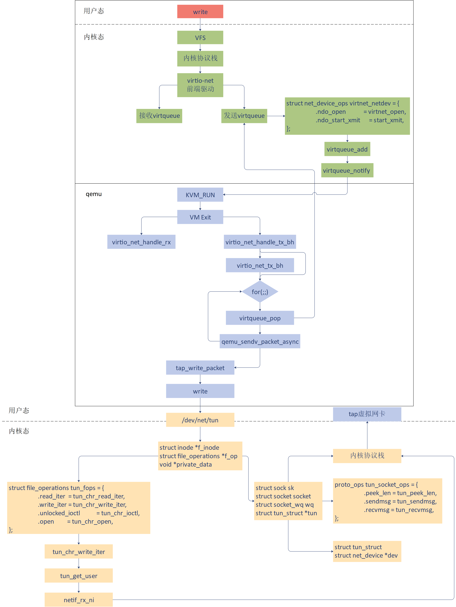

```
title: Virtio-Net 技术分析
date: 2020-11-23
tags: 
    - 虚拟化
    - virtio net
archives: 2020-11
author: Xinle Guo
summary: 本文介绍virtio net原理，包括前端驱动和后端设备。
```

## 简介

传统的设备模拟中，虚拟机内部设备驱动完全不知道自己处于虚拟化环境中。对于网络，存储，IO 等操作完全由虚拟机内核到 qemu，最后到宿主机内核处理，这样会产生很多的 VM exit 和 VM entry，因此性能很差。virtio 技术提高了虚拟机的性能，在该方案中，虚拟机能够感知到子集处于虚拟机环境中，并且会加载 virtio 总线驱动和 virtio 设备驱动。

virtio-net 方案，包括前端驱动和后端设备，以及自身定义的 virtio 传输协议。虚拟机作为前端驱动，安装了 virtio-net 的driver，在 qemu 中加载 virtio-net 后端设备，用来接收前端发送的 I/O 请求，然后从接收的数据中按照传输协议进行解析。最后 qemu 通过操作虚拟tap设备，对物理设备进行操作，从而完成请求，并且会通过中断机制通知前端驱动。

virtio-net网络包的发送过程：



## Virtio-Net 后端

### 收包流程

当网卡有数据包时，tap 设备首先会收到报文，对应 virtio-net 的 tap 设备 fd 变为可读。qemu 通过 epoll 方式监测到有网络数据包，调用回调函数发起收报流程。virtio_net_receive 函数把数据拷贝到虚拟机的 virtio 网卡接收队列。然后向虚拟机注入一个中断，虚拟机便感知到有网络数据报文。

```c
qemu/hw/net/virtio-net.c
virtio_net_receive
	virtio_net_do_receive
		virtio_net_receive_rcu
```

上述是 virtio-net 的函数调用关系，virtio-net 最终调用 virtio_net_receive_rcu 函数，对网络数据包添加到 virtio queue。

```c
virtio_net_receive_rcu {
    virtio_net_can_receive 	// 根据vm running状态，queue和设备状态判断virtio-net是否可以收包
    virtio_net_has_buffers 	// 检查缓冲区，避免出现竞争状况
    receive_filter 		    // 对网络包进行过滤
    
    while (offset < size) {
        elem = virtqueue_pop 	// 从vring中取出一个请求，将信息传递给elem域中
        len = iov_from_buf 		// 负责将报文拷贝到buffer中，实现向guest物理地址写入数据
        virtqueue_fill 		    // 当数据写完后，撤销映射，更新VRingAvail.ring[]的相关字段
    }
    
    virtqueue_flush 		// 更新VRingUsed.ring的idx，表明可以回收
    virtio_notify 			// 负责注入中断，通知前端虚拟机
}
```

### 发包流程

虚拟机的 virtio 网卡驱动向网卡缓冲区填好报文，然后写 queue notify 寄存器。这样，触发 VM exit ，虚拟机就会退出到root 模式，在 qemu 的 vcpu 线程 virtio_mmio_write 对其处理。

```c
qemu/hw/net/virtio-net.c
virtio_net_add_queue
	virtio_net_handle_tx_bh
		qemu_bh_schedule
			virtio_net_tx_bh
				virtio_net_flush_tx
			virtio_queue_set_notification
```

这里将 virtio_net_handle_tx_bh 函数绑定到 tx_vq。内部调用 qemu_bh_schedule 运行指定的函数，这里绑定的是virtio_net_tx_bh。最终调用 virtio_net_flush_tx 函数发送报文。

```c
virtio_net_flush_tx
	for (;;) {
        elem = virtqueue_pop 	// 从vring中取出一个请求
        qemu_sendv_packet_async // qemu发包函数
	}
```

在 virtio_net_flush_tx 函数中，获取报文 elem，写 tap 设备的 fd，最终发给 tap 设备，投递出去。qemu_sendv_packet_async 发送网络包的调用链为： qemu_sendv_packet_async->qemu_net_queue_send_iov->qemu_net_queue_flush- >qemu_net_queue_deliver。qemu 后端最终调用 tap_write_packet- >writev 写入 tap 字符设备。

接着在内核的字符设备驱动中，tun_chr_write_iter 会被调用，在 TCP/IP 协议栈进一步处理网络包。

### 创建设备

````c
virtio_net_class_init
	virtio_net_device_realize
	virtio_net_get_config
	virtio_net_get_features
	...
````

virtio_net_device_realize 完成对 virtio-net 设备的初始化过程。

```c
virtio_net_device_realize
	virtio_net_set_config_size
	virtio_init
	virtio_net_set_default_queue_size
	virtio_net_add_queue
	n->ctrl_vq = virtio_add_queue(virtio_net_handle_ctrl)
	qemu_new_nic
```

这个函数创建了一个 VirtIODevice，virtio_init 用来初始化这个设备。接着调用 virtio_net_add_queue 初始化队列。当设置多队列特性，还要额外增加一个 ctrl_vq 队列，用作控制队列。最后，qemu_new_nic 会创建一个虚拟机里面的网卡。这里的网卡对应的是后端 tap 设备。

### 模拟网卡

tap 设备的使用：qemu 使用 tap 作为网络后端。首先需要在宿主机上创建 tap 设备，并添加到网桥 br0 上。

```shell
# brctl addbr br0 
# ip tuntap add dev tap0 mode tap
# brctl addif br0 tap0
# ip link set dev tap0 up
```

在使用 qemu 命令启动虚拟机的过程中，传递参数：net，nic，model，netdev，ifname...

其中 nic 表示前端虚拟机网卡，model 表示创建网卡类型，netdev 定义后端 tap 设备，ifname 表示 tap 设备的名字。

qemu 的 main 函数会调用 net_init_clients 进行网络设备的初始化 ，在该函数内对 netdev 参数进行解析。

```c
net_init_clients
	qemu_opts_foreach(qemu_find_opts("netdev"),net_init_netdev, NULL, errp))
		net_init_netdev
			net_client_init->net_client_init1 // 根据不同的driver类型，调用不同的初始化函数
				net_init_tap
					net_tap_init
						tap_open
```

tap_open 函数打开一个文件 "/dev/net/tun" ，然后通过 ioctl 操作这个文件。 

```c
tap_open{
    fd = open(PATH_NET_TUN, O_RDWR)
    ioctl(fd, TUNGETFEATURES, &features)
    ioctl(fd, TUNSETVNETHDRSZ, &len)
    ioctl(fd, TUNSETIFF, (void *) &ifr)
}
```

最终，通过宿主机内核复杂的网络协议栈，形成一个网络包，发送到外部网络中。这样做的原因是：虚拟机将网络包发送给 qemu，qemu 没有自己的网络协议栈，因此，qemu 将网络包转换成文件流，写入 "/dev/net/tun" 字符设备。内核TUN/TAP 字符设备驱动收到这个写入的文件流，然后交给 TUN/TAP 虚拟网卡驱动。驱动将文件流再次转成网络包，交给TCP/IP 协议栈，从 tap 设备发出标准的网络包。

## Virtio-Net 前端

虚拟机里面的进程发送一个网络包，通过文件系统和 Socket 调用网络协议栈，到达网络设备层。 这里将调用 virtio-net 驱动做进一步处理。

前端 driver 将报文发送出去，注册的 ops 函数定义如下，其中指定的发送函数为 start_xmit。

```c
kernel/drivers/net/virtio_net.c
static const struct net_device_ops virtnet_netdev = {
	.ndo_open            = virtnet_open,
	.ndo_stop   	     = virtnet_close,
	.ndo_start_xmit      = start_xmit,
	...
};
```

调用 start_xmit 函数，将 skb 发送到 virtqueue 中， 然后调用 virtqueue_kick 通知 qemu 后端将数据包发送出去。 

```c
start_xmit{
	free_old_xmit_skbs // 释放backend处理过的desc
    xmit_skb 		  // 发包
    	sg_init_table
    	sg_set_buf(sq->sg, hdr, hdr_len); 				     // 数据包头部填入scatterlist
		num_sg = skb_to_sgvec(skb, sq->sg + 1, 0, skb->len);  // 数据包填入scatterlist
    	virtqueue_add_outbuf // sg table 写入desc描述符表，head desc信息写vring.avail
    virtqueue_kick_prepare(sq->vq) && virtqueue_notify(sq->vq) // kick通知qemu后端
}
```

当虚拟机写入一个 I/O 会使得 qemu 触发 VM exit 。接下来进入 qemu 做 virtio-net 相关处理。

## 流程总结

1. 在虚拟机里面的用户态，应用程序通过 write 系统调用写入 socket。
2. 写入的内容经过 VFS 层，内核协议栈，到达虚拟机里面的内核的网络设备驱动，即 virtio_net。
3. virtio_net 网络设备有一个操作结构 struct net_device_ops，里面定义了发送一个网络包调用的函数为 start_xmit。
4. 在 virtio_net 的前端驱动和 qemu 中的后端驱动之间，有两个队列 virtqueue，一个用于发送，一个用于接收。然后，我们需要在 start_xmit 中调用 virtqueue_add，将网络包放入发送队列，然后调用 virtqueue_notify 通知 qemu。
5. qemu 本来处于 KVM_RUN 的状态，收到通知后，通过 VM exit 指令退出客户机模式，进入宿主机模式。发送网络包的时候，virtio_net_handle_tx_bh 函数会被调用。
6. 接下来是一个 for 循环，我们需要在循环中调用 virtqueue_pop，从传输队列中获取要发送的数据，然后调用 qemu_sendv_packet_async 进行发送。
7. qemu 会调用 writev 向字符设备文件写入，进入宿主机的内核。
8. 在宿主机内核中字符设备文件的 file_operations 里面的 write_iter 会被调用，也即会调用 tun_chr_write_iter。
9. 在 tun_chr_write_iter 函数中，tun_get_user 将要发送的网络包从 qemu 拷贝到宿主机内核里面来，然后调用 netif_rx_ni 开始调用宿主机内核协议栈进行处理。
10. 宿主机内核协议栈处理完毕之后，会发送给 tap 虚拟网卡，完成从虚拟机里面到宿主机的整个发送过程。