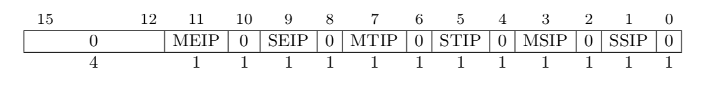
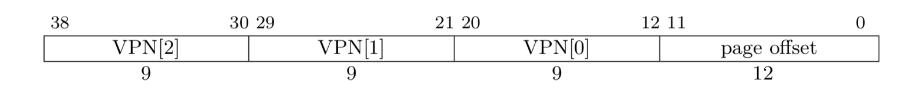
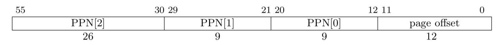
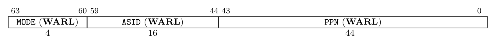
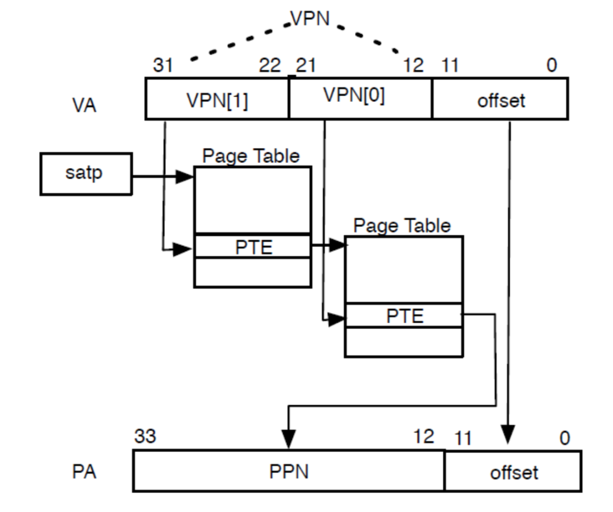

---
title: RISC-V特权级架构与系统启动
date: 2020-11-28
tags: 
    - RISC-V
    - opensbi
    - kernel
archives: 2020-11
author: Xinhao Zhang
summary: RISC-V特权级架构以及CPU、中断、内存初始化介绍

---

### RISC-V

RISC-V架构主要由美国加州大学伯克利分校发明，相比于x86和ARM架构，RISC-V开源采用BSD协议，它允许用户自由地使用、修改源代码，也可以将修改后的代码作为开源或者专有软件再发布。计算机体系结构的传统方法是增量ISA，新处理器不仅必须实现新的ISA扩展，还必须 实现过去的所有扩展。目的是为了保持向后的二进制兼容性，这样几十年前程序的二进制 版本仍然可以在最新的处理器上正确运行。导致了传统ISA的体量随时间大幅增长。而RISC-V是模块化的。它的核心是一个名为RV32I的基础ISA，支持运行一个完整的软件栈。RV32I是固定的，永远不会改变。这为编译器编写者，操作系统开发人员和汇编语言程序员提供了稳定的目标。模块化来源于可选的标准扩展，根据应用程序的需要，硬件可以包含或不包含这些扩展。

### 1. RISC-V 特权级架构

RISC-V定义了三种特权模式，分别为Machine Mode（M Mode），Supervisor Mode（S Mode），User Mode（U Mode）。


在特权级架构实现中，M Mode为必选模式，另外两种为可选模式。通过不同的模式组合可以实现不同用途的系统。


* M Mode：通常为简单的嵌入式系统
* M Mode + U Mode：该系统可以实现用户和机器模式的区分，从而实现资源的保护
* M Mode + U Mode + U Mode：该系统可以实现类Unix操作系统

### 2. RISC-V 通用寄存器

基本整数指令集是RISC-V最基本也是唯一强制要求实现的指令集模块，能够实现完整的软件编译器，支持现代操作系统运行。RV32I是其中一种整数指令集，支持32个通用整数寄存器，每一个寄存器有32位，由x0~x31表示，其中x0寄存器被预留为常数0.在汇编语言中，通用寄存器组中的每一个寄存器都有别名。

| Register | ABI Name | Description |
| :------ | :------ | :------ |
| x0 | zero | Hard-wired zero |
| x1 | ra | Return address |
| x2 | sp | Stack pointer |
| x3 | gp | Global pointer |
| x4 | tp | Thread pointer |
| x5-7 | t0-2 | Temporaries |
| x8 | s0/fp | Saved register/frame pointer |
| x9 | s1 | Saved register |
| x10-11 | a0-1 | Function arguments/retrurn values |
| x12-17 | a2-7 | Function arguments |
| x18-27 | s2-11 | Saved register |
| x28-31 | t3-6 | Temporaries |


### 3. RISC-V 特权级寄存器

除了通用寄存器，RISC-V针对各个特权级，还定义了一系列特权级控制状态寄存器。本节以M模式为例介绍相关控制状态寄存器。

* misa：表示hart支持的架构扩展，包括整数、乘除、原子、浮点数、双精度浮点数和压缩指令扩展等
* mhartid：当前正在执行代码的hart id
* medeleg：默认情况下，所有的异常都是在M模式下处理。当相应的medeleg位置1时，该异常直接由S模式或U模式处理。
* mideleg：默认情况下，所有的中断都是在M模式下处理。当相应的mideleg位置1时，该中断直接由S模式或U模式处理。
* mtime：存储当前的时钟计数值
* mtimecmp：时钟计数比较器。当当前mtime寄存器中的值大于mtimecmp中的值时，触发时钟中断
* mstatus：表示当前处理器的控制状态，包括全局中断使能位。内存特权级，字节序控制位等
* mtvec：保存发生trap时处理器需要跳转到的地址
* mip：指示正准备处理的中断类型。EIP表示外部中断，TIP表示时钟中断，SIP表示软件中断。当相应的中断位置1时，表示存在该类型中断待处理

* mie：指示处理器目前使能和忽略的中断类型。EIP表示外部中断，TIP表示时钟中断，SIP表示软件中断。当相应的中断位置1时，表示该类型中断可以被处理器响应

* mscratch：保存指向当前hart上下文的指针
* mepc：保存引发异常的指令
* mtval：它保存了trap的附加信息:地址例外中出错的地址、发生非法指令例外的指令本身，对于其他trap，它的值为 0
* mcause：指示发生trap的种类。当最高位为1时，低位字段表示发生中断的类型；当最高位为0时，低位字段表示发生异常或系统调用的类型。

| Interrupt | Exception Code | Description |
| :------ | :------ | :------ |
| 1 | 0 | Reserved |
| 1 | 1 | Supervisor software interrupt |
| 1 | 2 | Reserved |
| 1 | 3 | Machine software interrupt |
| 1 | 4 | Reserved |
| 1 | 5 | Supervisor timer interrupt |
| 1 | 6 | Reserved |
| 1 | 7 | Machine timer interrupt |
| 1 | 8 | Reserved |
| 1 | 9 | Supervisor external interrupt |
| 1 | 10 | Reserved |
| 1 | 11 | Machine external interrupt |
| 1 | 12-15 | Reserved |
| 1 | >=16 | Available for platform use |
| 0 | 0 | Instruction address misaligned |
| 0 | 1 | Instruction access fault |
| 0 | 2 | Illegal instruction |
| 0 | 3 | Breakpoint |
| 0 | 4 | Load address misaligned |
| 0 | 5 | Load access fault |
| 0 | 6 | Store/AMO address misaligned |
| 0 | 7 | Store/AMO access fault |
| 0 | 8 | Environment call from U-mode |
| 0 | 9 | Environment call from S-mode |
| 0 | 10 | Reserved |
| 0 | 11 | Environment call from M-mode |
| 0 | 12 | Instruction page fault |
| 0 | 13 | Load page fault |
| 0 | 14 | Reserved |
| 0 | 15 | Store/AMO page fault |
| 0 | 16-23 | Reserved |
| 0 | 24-31 | Available for custom use |
| 0 | 32-47 | Reserved |
| 0 | 48-63 | Available for custom use |
| 0 | >=64 | Reserved |

### 4. RISC-V CPU初始化

opensbi是M模式的一种实现。本节以opensbi为例介绍M模式下的CPU初始化。在硬件超线程处理器中，一个处理器核存在多个硬件线程，单以处理器核描述一个硬件线程不太精准。RISC-V提出了hart的概念（Hardware Thread），表示一个硬件线程。opensbi可以作为一种固件为其他特权级模式的软件提供运行时服务。在机器上电后，作为加载的第一个启动阶段代码，opensbi固件需要对cpu进行初始化。

每一个hart都有自己的上下文状态，上下文状态的指针保存在mscratch寄存器中。opensbi首先根据平台定义的hart的数量和hart栈的大小分配栈空间，然后依次为每一个hart初始化sbi scratch结构体，包括固件在内存中的地址，下一个启动阶段要执行的代码入口地址，参数以及特权级等信息，并将sbi scratch的地址赋值给mscratch寄存器。

```c
/* sbi_scratch结构体定义 */
struct sbi_scratch {
    /** opensbi固件地址 */
    unsigned long fw_start;
    /** opensbi固件大小 */
    unsigned long fw_size;
    /** 下一个启动阶段的参数 */
    unsigned long next_arg1;
    /** 下一个启动阶段代码入口 */
    unsigned long next_addr;
    /** 下一个启动阶段执行特权级 */
    unsigned long next_mode;
···
···
} __packed;
```


```c
_relocate_done:
···
···
    /* 根据hart的数量和hart栈的大小分配栈空间 */
    la  tp, _fw_end
    mul a5, s7, s8
    add tp, tp, a5
   
_scratch_init:
    /* 对第t1个hart进行初始化，将指针指向第t1个hart的栈空间 */
    add tp, t3, zero
    mul a5, s8, t1
    sub tp, tp, a5
    li  a5, SBI_SCRATCH_SIZE
    sub tp, tp, a5

    /* 初始化第t1个hart的sbi_scratch结构体 */
    /* 初始化fw_start和fw_size */
    la  a4, _fw_start
    la  a5, _fw_end
    mul t0, s7, s8
    add a5, a5, t0
    sub a5, a5, a4
    REG_S   a4, SBI_SCRATCH_FW_START_OFFSET(tp)
    REG_S   a5, SBI_SCRATCH_FW_SIZE_OFFSET(tp)
    /* 将下一阶段传入的参数赋值给next_arg1，通常是fdt的地址 */
    MOV_3R  s0, a0, s1, a1, s2, a2
    call    fw_next_arg1
    REG_S   a0, SBI_SCRATCH_NEXT_ARG1_OFFSET(tp)
    MOV_3R  a0, s0, a1, s1, a2, s2
    /* 将下一阶段代码的入口地址赋值给next_addr */
    MOV_3R  s0, a0, s1, a1, s2, a2
    call    fw_next_addr
    REG_S   a0, SBI_SCRATCH_NEXT_ADDR_OFFSET(tp)
    MOV_3R  a0, s0, a1, s1, a2, s2
    /* 将下一阶段执行特权级模式赋值给next_mode */
    MOV_3R  s0, a0, s1, a1, s2, a2
    call    fw_next_mode
    REG_S   a0, SBI_SCRATCH_NEXT_MODE_OFFSET(tp)
    /* 初始化下一个hart */
    add t1, t1, t2
    blt t1, s7, _scratch_init
···
···
```

hart上下文初始化完成后，需要初始化trap。通过清空mie寄存器和mip寄存器关闭所有中断，将trap handler的地址赋值给mtvec寄存器，作为trap服务总控函数的入口地址。当系统发生中断时，将通过tvec寄存器找到trap处理函数。


```c
_start_warm:
    /* 清空通用寄存器 */
    li  ra, 0
    call    _reset_regs

    /* 关闭中断，清空mie寄存器和mip寄存器 */
    csrw    CSR_MIE, zero
    csrw    CSR_MIP, zero
···
···
    /* 设置trap处理函数 */
    la  a4, _trap_handler
    csrw    CSR_MTVEC, a4

    /* 进入启动阶段 */
    csrr    a0, CSR_MSCRATCH
    call    sbi_init
```

启动hart。随机选择一个hart作为主hart。其他hart通过将mie寄存器中的MSIE位置1打开软件中断开关，并陷入WFI，等待主hart发出中断唤醒。主hart执行冷启动，进行一系列初始化，初始化完成后向其他hart发出处理器间中断以唤醒其他hart，并执行下一阶段代码。如果是目标是裸机程序，则下一段代码为用户程序代码；如果想启动内核，则下一段为内核代码，并将fdt地址作为参数传给下一段代码，进入下一阶段。


```c
void __noreturn sbi_init(struct sbi_scratch *scratch)
{
    bool coldboot           = FALSE;
    u32 hartid          = current_hartid();
···
···
    /* 随机选择一个hart作为主hart，执行冷启动，其他hart执行热启动 */
    if (next_mode_supported && atomic_xchg(&coldboot_lottery, 1) == 0)
        coldboot = TRUE;

    if (coldboot)
        init_coldboot(scratch, hartid);
    else
        init_warmboot(scratch, hartid);
}

static void __noreturn init_warmboot(struct sbi_scratch *scratch, u32 hartid)
{
    int rc;
    unsigned long *init_count;
    const struct sbi_platform *plat = sbi_platform_ptr(scratch);
    /* 打开进程间中断开关，陷入WFI，等待冷启动结束 */
    wait_for_coldboot(scratch, hartid);
···
···
    /* 执行下一阶段代码 */
    sbi_hsm_prepare_next_jump(scratch, hartid);
    sbi_hart_switch_mode(hartid, scratch->next_arg1,
                 scratch->next_addr,
                 scratch->next_mode, FALSE);
}

static void __noreturn init_coldboot(struct sbi_scratch *scratch, u32 hartid)
{
    int rc;
    unsigned long *init_count;
    const struct sbi_platform *plat = sbi_platform_ptr(scratch);
    ···
    ···

    /* 初始化终端串口 */
    rc = sbi_console_init(scratch);
    if (rc)
        sbi_hart_hang();

    /* 初始化中断控制器 */
    rc = sbi_platform_irqchip_init(plat, TRUE);
    if (rc) {
        sbi_printf("%s: platform irqchip init failed (error %d)\n",
               __func__, rc);
        sbi_hart_hang();
    }

    /* 处理器间中断初始化 */
    rc = sbi_ipi_init(scratch, TRUE);
    if (rc) {
        sbi_printf("%s: ipi init failed (error %d)\n", __func__, rc);
        sbi_hart_hang();
    }

    /* TLB初始化 */
    rc = sbi_tlb_init(scratch, TRUE);
    if (rc) {
        sbi_printf("%s: tlb init failed (error %d)\n", __func__, rc);
        sbi_hart_hang();
    }

    /* 时钟初始化 */
    rc = sbi_timer_init(scratch, TRUE);
    if (rc) {
        sbi_printf("%s: timer init failed (error %d)\n", __func__, rc);
        sbi_hart_hang();
    }

    /* 注册系统调用 */
    rc = sbi_ecall_init();
    if (rc) {
        sbi_printf("%s: ecall init failed (error %d)\n", __func__, rc);
        sbi_hart_hang();
    }

    /* 物理内存保护机制配置 */
    rc = sbi_hart_pmp_configure(scratch);
    if (rc) {
        sbi_printf("%s: PMP configure failed (error %d)\n",
               __func__, rc);
        sbi_hart_hang();
    }

    /* 调整ftd内存布局 */
    rc = sbi_platform_final_init(plat, TRUE);
    if (rc) {
        sbi_printf("%s: platform final init failed (error %d)\n",
               __func__, rc);
        sbi_hart_hang();
    }

    /* 发出软件中断，唤醒其他hart */
    wake_coldboot_harts(scratch, hartid);

    /* 执行下一阶段代码 */
    init_count = sbi_scratch_offset_ptr(scratch, init_count_offset);
    (*init_count)++;
    sbi_hsm_prepare_next_jump(scratch, hartid);
    sbi_hart_switch_mode(hartid, scratch->next_arg1, scratch->next_addr,
                 scratch->next_mode, FALSE);
}

```


### 5. RISC-V 中断、异常、系统调用

RISC-V将trap分为两类，一类是同步trap，在指令执行期间产生，包括地址访问错误异常，断点异常，非法指令异常，非对齐地址异常和系统调用。另一类是中断。RISC-V中定义了三种标准的中断源，软件中断、时钟中断和外部中断。

当发生trap时，硬件会将mpec寄存器设置为触发trap的指令地址，将mcause寄存器设置为trap的来源，将mstatus寄存器的SIE位置零以禁用中断，将mtval寄存器设置为trap相关的附加信息，将pc寄存器设置为stvec寄存器中指向的trap服务总控函数的入口地址。

opensbi将 trap handler设置为stvec寄存器指向的trap服务总控函数入口地址。trap handler首先在异常栈上存储sp寄存器，通过改变sp寄存器的值以分配异常栈空间，然后保存通用寄存器，调用sbi trap handler处理trap，trap处理结束后恢复通用寄存器和sp寄存器。

```c
_trap_handler:
...
...
    /* 保存sp寄存器 */
    REG_S   sp, (SBI_TRAP_REGS_OFFSET(sp) - SBI_TRAP_REGS_SIZE)(t0)

    /* 分配异常栈空间 */
    add sp, t0, -(SBI_TRAP_REGS_SIZE)
    
    /* 保存通用寄存器 */
    REG_S   zero, SBI_TRAP_REGS_OFFSET(zero)(sp)
    REG_S   ra, SBI_TRAP_REGS_OFFSET(ra)(sp)
    REG_S   gp, SBI_TRAP_REGS_OFFSET(gp)(sp)
    REG_S   tp, SBI_TRAP_REGS_OFFSET(tp)(sp)
    REG_S   t1, SBI_TRAP_REGS_OFFSET(t1)(sp)
    REG_S   t2, SBI_TRAP_REGS_OFFSET(t2)(sp)
    REG_S   s0, SBI_TRAP_REGS_OFFSET(s0)(sp)
    REG_S   s1, SBI_TRAP_REGS_OFFSET(s1)(sp)
    REG_S   a0, SBI_TRAP_REGS_OFFSET(a0)(sp)
    REG_S   a1, SBI_TRAP_REGS_OFFSET(a1)(sp)
    REG_S   a2, SBI_TRAP_REGS_OFFSET(a2)(sp)
    REG_S   a3, SBI_TRAP_REGS_OFFSET(a3)(sp)
    REG_S   a4, SBI_TRAP_REGS_OFFSET(a4)(sp)
    REG_S   a5, SBI_TRAP_REGS_OFFSET(a5)(sp)
    REG_S   a6, SBI_TRAP_REGS_OFFSET(a6)(sp)
    REG_S   a7, SBI_TRAP_REGS_OFFSET(a7)(sp)
    REG_S   s2, SBI_TRAP_REGS_OFFSET(s2)(sp)
    REG_S   s3, SBI_TRAP_REGS_OFFSET(s3)(sp)
    REG_S   s4, SBI_TRAP_REGS_OFFSET(s4)(sp)
    REG_S   s5, SBI_TRAP_REGS_OFFSET(s5)(sp)
    REG_S   s6, SBI_TRAP_REGS_OFFSET(s6)(sp)
    REG_S   s7, SBI_TRAP_REGS_OFFSET(s7)(sp)
    REG_S   s8, SBI_TRAP_REGS_OFFSET(s8)(sp)
    REG_S   s9, SBI_TRAP_REGS_OFFSET(s9)(sp)
    REG_S   s10, SBI_TRAP_REGS_OFFSET(s10)(sp)
    REG_S   s11, SBI_TRAP_REGS_OFFSET(s11)(sp)
    REG_S   t3, SBI_TRAP_REGS_OFFSET(t3)(sp)
    REG_S   t4, SBI_TRAP_REGS_OFFSET(t4)(sp)
    REG_S   t5, SBI_TRAP_REGS_OFFSET(t5)(sp)
    REG_S   t6, SBI_TRAP_REGS_OFFSET(t6)(sp)

    /* 调用sbi_trap_handler处理trap */
    add a0, sp, zero
    call    sbi_trap_handler
    
    /* 恢复通用寄存器 */
    REG_L   ra, SBI_TRAP_REGS_OFFSET(ra)(sp)
    REG_L   gp, SBI_TRAP_REGS_OFFSET(gp)(sp)
    REG_L   tp, SBI_TRAP_REGS_OFFSET(tp)(sp)
    REG_L   t1, SBI_TRAP_REGS_OFFSET(t1)(sp)
    REG_L   t2, SBI_TRAP_REGS_OFFSET(t2)(sp)
    REG_L   s0, SBI_TRAP_REGS_OFFSET(s0)(sp)
    REG_L   s1, SBI_TRAP_REGS_OFFSET(s1)(sp)
    REG_L   a0, SBI_TRAP_REGS_OFFSET(a0)(sp)
    REG_L   a1, SBI_TRAP_REGS_OFFSET(a1)(sp)
    REG_L   a2, SBI_TRAP_REGS_OFFSET(a2)(sp)
    REG_L   a3, SBI_TRAP_REGS_OFFSET(a3)(sp)
    REG_L   a4, SBI_TRAP_REGS_OFFSET(a4)(sp)
    REG_L   a5, SBI_TRAP_REGS_OFFSET(a5)(sp)
    REG_L   a6, SBI_TRAP_REGS_OFFSET(a6)(sp)
    REG_L   a7, SBI_TRAP_REGS_OFFSET(a7)(sp)
    REG_L   s2, SBI_TRAP_REGS_OFFSET(s2)(sp)
    REG_L   s3, SBI_TRAP_REGS_OFFSET(s3)(sp)
    REG_L   s4, SBI_TRAP_REGS_OFFSET(s4)(sp)
    REG_L   s5, SBI_TRAP_REGS_OFFSET(s5)(sp)
    REG_L   s6, SBI_TRAP_REGS_OFFSET(s6)(sp)
    REG_L   s7, SBI_TRAP_REGS_OFFSET(s7)(sp)
    REG_L   s8, SBI_TRAP_REGS_OFFSET(s8)(sp)
    REG_L   s9, SBI_TRAP_REGS_OFFSET(s9)(sp)
    REG_L   s10, SBI_TRAP_REGS_OFFSET(s10)(sp)
    REG_L   s11, SBI_TRAP_REGS_OFFSET(s11)(sp)
    REG_L   t3, SBI_TRAP_REGS_OFFSET(t3)(sp)
    REG_L   t4, SBI_TRAP_REGS_OFFSET(t4)(sp)
    REG_L   t5, SBI_TRAP_REGS_OFFSET(t5)(sp)
    REG_L   t6, SBI_TRAP_REGS_OFFSET(t6)(sp)

...
...
    /* 恢复sp寄存器 */
    REG_L   sp, SBI_TRAP_REGS_OFFSET(sp)(sp)
```

sbi trap handler作为trap处理服务，首先会读取mcause寄存器的最高位，判断trap类型。

* 当mcause寄存器的最高位为1时，此时trap类型为中断。读取mcause的Exception Code.
	* 若Exception Code为7，则此时trap为时钟中断，调用时钟中断处理函数
	* 若Exception Code为3，则此时trap为软件中断，调用软件中断处理函数
* 当mcause寄存器的最高位为0时，此时trap类型为异常或系统调用。读取mcause的Exception Code.
	* 若Exception Code为2，4或者6，则此时trap为异常，调用相应的异常处理函数
	* 若Exception Code为9或11，则此时trap为系统调用，调用ecall处理函数。

```c
void sbi_trap_handler(struct sbi_trap_regs *regs)
{
...
...
    /** 当mcause寄存器的最高位为1时，此时trap类型为中断  **/
    if (mcause & (1UL << (__riscv_xlen - 1))) {
        mcause &= ~(1UL << (__riscv_xlen - 1));
        switch (mcause) {
        /** 时钟中断  **/
        case IRQ_M_TIMER:
            sbi_timer_process();
            break;
        /** 软件中断  **/
        case IRQ_M_SOFT:
            sbi_ipi_process();
            break;
        default:
            msg = "unhandled external interrupt";
            goto trap_error;
        };
        return;
    }

    /** 当mcause寄存器的最高位为0时，此时trap类型为异常或系统调用 **/
    switch (mcause) {
    /** 异常 **/
    case CAUSE_ILLEGAL_INSTRUCTION:
        rc  = sbi_illegal_insn_handler(mtval, regs);
        msg = "illegal instruction handler failed";
        break;
    case CAUSE_MISALIGNED_LOAD:
        rc = sbi_misaligned_load_handler(mtval, mtval2, mtinst, regs);
        msg = "misaligned load handler failed";
        break;
    case CAUSE_MISALIGNED_STORE:
        rc  = sbi_misaligned_store_handler(mtval, mtval2, mtinst, regs);
        msg = "misaligned store handler failed";
        break;
    /** 系统调用 **/
    case CAUSE_SUPERVISOR_ECALL:
    case CAUSE_MACHINE_ECALL:
        rc  = sbi_ecall_handler(regs);
        msg = "ecall handler failed";
        break;
    default:
...
...
        break;
    };

trap_error:
    if (rc)
        sbi_trap_error(msg, rc, mcause, mtval, mtval2, mtinst, regs);
}

```

### 6. RISC-V 虚拟内存

相比于M模式，S模式提供了基于页面的虚拟内存系统，将内存划分为固定大小的页来进行地址的转换和对内存内容的保护。RISC-V的分页方案有很多种，linux kernel使用Sv39作为页表的实现。

Sv39模式支持39位的虚拟内存地址空间，其中第38-12位为虚拟页号，第11-0位为页内偏移，每一个页面4KB。物理内存地址为56位，其中第55-12位为物理页号。27位的虚拟页号通过三级页表映射到44位的物理页号。





Sv39模式中每一个页表项为64位。其中63-54位为保留位。53-10位为物理页号。9-0位为页状态的描述位。V表示该页表项是否有效。R，W，X为权限控制位，分别表示页的可读可写可执行权限，当R，W，X为都为0时，表示该页表项指向的是下一级页表，为非叶页表项。U表示该页是否可以被User模式访问，只有当U位为1时，User模式的软件才可以访问该页。G为为全局映射位。当G位为1且该页表项为非叶页表项时，表示该页表项所指向的下一级页表为全局可访问的。A表示Accessed，当A位为1时，表示该页表项所指向的页面自从上次A位被清零后有被访问过。D表示Dirty，当D位为1时，表示该页表项所指向的页面自从上次D位被清零后有被修改过。RSW位为预留位。


每一级的页表项都可以为叶页表项。当三级页表的页表项为叶页表项时，所指向的页面大小为4KB；当二级页表的页表项为叶页表项时，所指向的页面大小为2MB；当一级页表的页表项为叶页表项时，所指向的页面大小为1GB。

S模式使用satp寄存器控制虚拟内存分页系统。satp有三个域。MODE可以开启分页并选择页表级数。ASID是地址空间标识符，可以用来降低上下文切换的开销。PPN字段保存了页表的基址地址。



当在satp寄存器中启用了分页时，S 模式和 U 模式中的虚拟地址会以从根部遍历页表 的方式转换为物理地址。

1. satp.PPN 给出了一级页表的基址，VA[31:22]给出了一级页号，因此处理器会读取 位于地址(satp. PPN × 4096 + VA[31: 22] × 4)的页表项。
2. 该PTE包含二级页表的基址，VA[21:12]给出了二级页号，因此处理器读取位于地址(PTE. PPN × 4096 + VA[21: 12] × 4)的叶节点页表项。
3. 叶节点页表项的PPN字段和页内偏移(原始虚址的最低12个有效位)组成了最终结果:物理地址就是(LeafPTE. PPN × 4096 + VA[11: 0])




linux kernel使用Sv39作为页表的实现。当内核开启了MMU选项时，会读取已经分配好的页表数组的物理地址，并将其作为参数传入relocate函数。relocate函数中首先会获取页表数组的物理页号，与SATP MODE39拼接在一起赋值给satp寄存器。在CPU内部，使用TLB来作为虚拟页号到物理页号映射的缓存。当修改了satp寄存器时，TLB中的将失效。S模式使用sfence.vma解决这个问题，会通知处理器，软件可能已经修改了页表，于是处理器可以相应地刷新转换缓存。在赋值satp寄存器后，使用sfence.vma刷新TLB。


```c
#define PAGE_SHIFT (12)
#define SATP_MODE_39 _AC(0x8000000000000000, UL)
#define SATP_MODE SATP_MODE_39

#ifdef CONFIG_MMU
	/* 使能虚拟内存并重新分配虚拟地址并重新分配虚拟地址 */
	/* swapper_pg_dir为页表基地址 */
	la a0, swapper_pg_dir
	call relocate
#endif

.align 2
#ifdef CONFIG_MMU
relocate:
	/* 重新分配返回地址 */
	li a1, PAGE_OFFSET
	la a2, _start
	sub a1, a1, a2
	add ra, ra, a1

	/* 计算satp寄存器的值 */
	srl a2, a0, PAGE_SHIFT
	li a1, SATP_MODE
	or a2, a2, a1
···
···
	/* 设置satp寄存器的值并刷新TLB */
	csrw CSR_SATP, a2
	sfence.vma
```

### 7. 参考文献

1. [RISC-V spec](https://github.com/riscv/riscv-isa-manual/releases/download/Ratified-IMAFDQC/riscv-spec-20191213.pdf)
2. [RISC-V privileged spec](https://github.com/riscv/riscv-isa-manual/releases/download/Ratified-IMFDQC-and-Priv-v1.11/riscv-privileged-20190608.pdf)
3. [RISC-V-Reader-Chinese](http://riscvbook.com/chinese/RISC-V-Reader-Chinese-v2p1.pdf)
