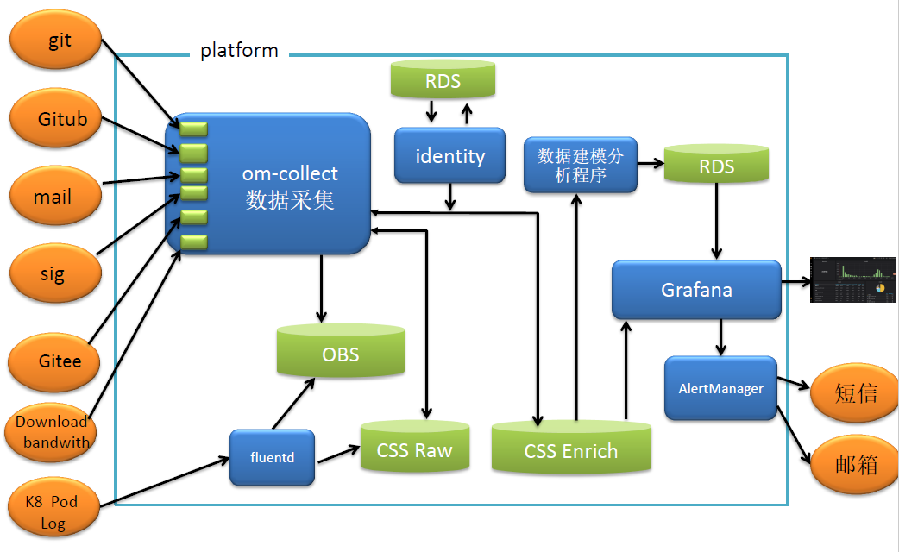

---
title: 浅谈openEuler开源社区运营度量分析系统选型
date: 2020-05-07
tags:
    - 社区运营
    - 度量
archives: 2020-05
author: zhongjun
summary: 浅谈openEuler开源社区运营度量分析系统选型，属于系列博客的第二篇。
---

## 背景

openEuler开源社区建立后，我们采取了一系列的运营措施，可是如何知道这些运营措施是有效的，如何才能知道哪些措施更优呢，如何判断一次运营活动真正带来了多少用户呢？为了解决这一系列问题，我们试图搭建一个运营度量分析系统，用数字去量化这些指标。

## 如何选型

通常选型方法是4看3定，看业界、看友商、看客户、看自己，定方案、定策略、定计划。根据这个思路，我们先来看看当前业界主流的社区用了哪些运营系统：

### 看业界 

|社区/基金会   |系统   |连接   |
| ------------ | ------------ | ------------ |
|CNCF   |[devstats](https://github.com/cncf/devstats)   |https://github.com/cncf/devstats   |
|开源数据统计   |[chaoss](https://github.com/chaoss/grimoirelab)   |https://github.com/chaoss/grimoirelab   |
|OpenStack   |[stackalytics](https://opendev.org/x/stackalytics)   |https://opendev.org/x/stackalytics   |
|Apache   |[kibble](https://github.com/apache/kibble)   |https://github.com/apache/kibble   |

横向对比了一下各个系统的实现、生态、能力等指标，详见下图

|    |OpenStack stackalytics|CNCF devstate|Chaoss Grimoirelab|Apache kibble|
| ------------ | ------------ | ------------ | ------------ | ------------ |
|生态   |少（4个）   |少（2个） Git  github|多 10+   |一般  |
|数据库   | Memcached|PostgresSQL|ElasticSearch|ElasticSearch
|界面|Dashboard自定义|Grafana|Kibiter(kibana增强)|Kibble UI
|分析能力|把需要分析的数据配置到yaml文件中|弱|一般(借助elasticsearch自身算法)|一般
|是否支持Gitee|否|否|否|否
|数据类型|Key/value|时序|日志文本|日志文本
|是否支持企业用户映射|否（仅以domain区分）|是（companies.yaml）|是（sortinghat）|否
|获取数据工具|Stackalytics.processor|sh脚本调用cli/API命令收集|Perceval 程序调用API或者CLI命令获取日志或API返回信息|Kibble-scanners
|语言|python|sh|python|Python
|数据结构定义|[schema.py](https://opendev.org/x/stackalytics/src/branch/master/stackalytics/processor/schema.py)|[Structure.sql](https://github.com/cncf/devstats/blob/master/structure.sql)文件中定义|[grimoirelab-elk](https://github.com/chaoss/grimoirelab-elk)工程中定义raw(原始数据)和enrich(处理后的结构化数据)的mapping|

### 看自己

再看看我们自身的需要的数据：

|数据类型|详细|
| ------------ | ------------ |
|git|git提交日志数据 |
|Gitee|1.Gitee issue数据  2.Gitee pull request数据  3.repo数据  4.评论数据  5.事件数据  6.clone review来源数据等|
|Download|1.下载iso数据  2.下载rpm源数据 |
|maillist|1.message数据（个数、内容、收发发件信息等）  2.用户注册数据等|
|SIG|组织用户数据|
|网站|1.访问量数据  2.访问访客数据  3.搜索词  4.来源网站  5.入口页面  6.受访页面等 |
|容器服务|1.基础服务数据  2.容器pod日志数据等|

根据这些数据我们期望得到基本的用户模型（详见上一篇[文章](https://www.openeuler.org/zh/blog/2020/05/06/2020-05-06-os-metrics-1.html)提到的人、组织的度量框架），或者更深入的用户轨迹行为分析，数据挖掘等。
我们自身的主要代码仓库托管在Gitee数据库下面，以上的方案都不能支持我们对数据运营的诉求。我们有同事试图在Chaoss上提供Gitee的[backend](https://github.com/chaoss/grimoirelab-perceval/pull/645)让Chaoss支持Gitee生态，chaoss方表示不是很愿意维护。

上面的方案进行了简单的数据统计以及简单的数据加权计算统计，对于我们需求的80%的数据不支持，也就没有对这些数据的一些分析处理的逻辑参考。

因此我们初步通过借鉴上面方案的python部分框架，按照我们自己的数据处理及分析逻辑编写自己的轻量级数据收集及分析、建模程序。

## 初定方案

当前我们将原始的数据git、Gitee、maillist等通过api或者日志的方式，以backend的形式接入om-collect服务。K8 pod日志通过Fluentd收集日志数据，里面包括了所有pod的服务访问日志、服务运行日志等等全量的日志。

考虑到Elasticsearch服务在大数据场景下搜索的速度，深度搜索会导致Elasticsearch内部产生副本数过多占用内存空间过大等导致Elasticsearch集群索引变成red不可用的状态，或者Elasticsearch集群挂掉的状态。我们对数据都做了一个备份，备份到OBS对象存储服务上。

Identity服务用以做company用户与社区用户的映射关系。CSS是华为云的云搜索服务，将原始的日志数据存储到CSS中。再将数据字段解析出来保存到CSS云搜索服务，这时候的数据就带了基础的索引字段，根据日志解析的最原始的字段。Grafana可以取CSS Enrich里面的数据直接显示一些用户的基本信息，比如用户名、用户贡献的issue个数、pull request个数等。当前也是只做到基本信息的展示。

数据建模分析程序会对原始字段进行建模，比如将用户按照时间分类，分析用户的行为轨迹，哪一类用户更关注哪一类的topic信息等。为后期的运营策略提供数据支持。

## 结束语
我们当前只做到基本的数据采集及显示部分，根据这些数据能得到一些基本的分析结果（详见下一章openeuler运营系统发现的用户习惯》），到更复杂的数据建模与分析还没开始，欢迎大家贡献更好的思路到[社区](https://gitee.com/opensourceway),有对度量分析系统的诉求也可以往[社区issue](https://gitee.com/opensourceway/om-collections)上提。
