# 小白虚拟化之虚拟机热迁移

​		在了解过虚拟机最基本的操作流程之后，我们终于把一只脚踏进了openEuler虚拟化的大门了。不过虚拟化的世界还有很多精彩的内容等待着我们去探索。比如这个乍一听就非常高大上的技术——虚拟机热迁移！

## Why-为什么要有热迁移

​		在学习使用这个技术之前，我们先来一起了解一下，为什么要有这个技术，它的作用又是什么？我们都知道虚拟机运行在物理机之上，而物理机会遇到负载过重、硬件更换、软件升级、组网调整和故障处理等情况。此时，既要完成这些操作，又要保证虚拟机保持正常的运行，我们就需要用到虚拟机热迁移的技术了。

## What-热迁移是什么意思

​		虚拟机热迁移又称作虚拟机动态迁移，一般指将整个虚拟机运行状态完整保留，在其他不同的硬件平台上快速恢复的技术。在其他硬件平台上恢复后，虚拟机运行平滑如初，用户不会感受任何差异。相对的还有虚拟机冷迁移也叫静态迁移，但这种技术需要关闭虚拟机，在这里我们就不多提了。

虚拟机的迁移就是数据的迁移。数据又分为两种形式：

1.  静态数据，指的是镜像文件。

2.  动态数据，虚拟机运行时存在内存里的动态变化的数据。

## When-什么时候需要用到热迁移

场景1：当物理服务器的硬件设备需要更新升级或者增加设备的时候，虚拟机不能停止运行，对于用户的重要业务在上面运行。（硬件更新）

场景2：当物理服务器软件系统需要打补丁或者更新版本。（软件更新）

场景3：当某些物理服务器负载过重或者故障的时候，需要把虚拟机迁移出去。（负载

过重，故障）

场景4：在跨域环境下，多数物理服务器负载过轻，虚拟机做迁移整合，可以减少物理机器的数量，提要资源利用率。（整合资源）

更多场景可以查看社区文档哟。

## Where-热迁移用在什么地方

​		从上面可以看出，热迁移技术是用在不同的硬件平台上的。这里需要注意的是，虚拟机迁移的存储方式分为共享存储和非共享存储两种。

​		共享存储就是虚拟机的数据存在共享磁盘上，这样迁移的时候只需要完成内存数据的迁移即可。

​		非共享存储就是虚拟机的数据存在本地磁盘上，这样迁移的时候就需要把镜像文件和内存数据同时迁移。

## How-使用方法

简要思路
--------

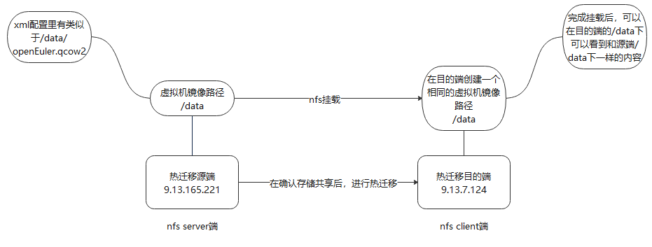

环境准备
--------

重要的环节到了。我们找了两个物理机分别作为源端和目的端来简单演示虚拟机热迁移的方法。

两个物理机的基本信息：

源端ip 9.13.165.221

版本信息：

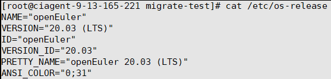

目的端ip 9.13.7.124

版本信息:

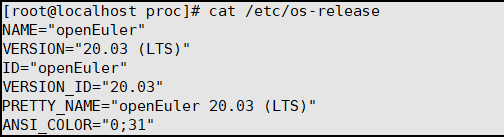

热迁移前的必要检查：

### 1.权限检查

> 检查一下当前用户有无权限执行热迁移。

### 2.网络检查

> 检查一下源端和目的端主机之间的网络是互通的，并保证两个主机在相同网段，否则虚拟机迁移后悔出现网络异常。
>
> 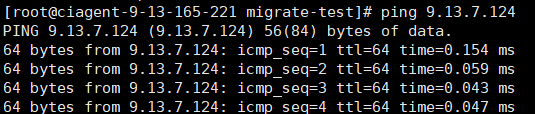

### 3.检查存储资源

> 检查两端是否可以访问相同的存储资源。

对两端进行必要的健康检查，并确保目的端主机有足够的CPU、内存和存储资源。

### 4.检查cpu资源

> Cpu检查： 可以看到两个主机都有96个cpu。
>
> 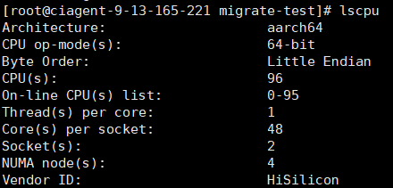
>
> 
>
> 内存检查：
>
> 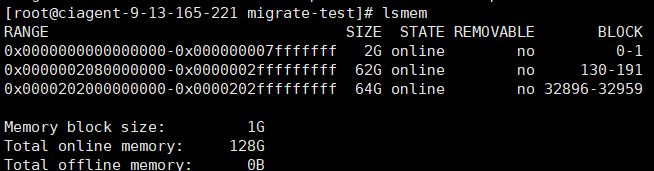
>
> 
>
> 存储检查：
>
> 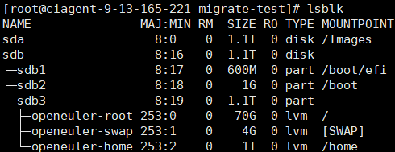
>
> 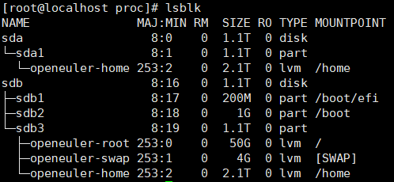

### 5.检查虚拟机状态

> 检查被迁移的虚拟机是否是 running 状态。
>
> 我们以vm11作为被热迁移的例子
>
> 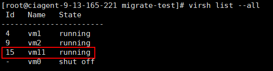

### 6.设置热迁移参数(可选)

> 比如设置虚拟机热迁移过程中能够容忍的最大停机时间
>
> 使用
> ```shell
> virsh migrate-setmaxdowntime vm11 500
> ```
> 设置名为vm11的虚拟机最大停机时间为500ms，之后使用virsh migrate-getmaxdowntime vm11命令来查看名为vm11的虚拟机最大停机时间。
>
> 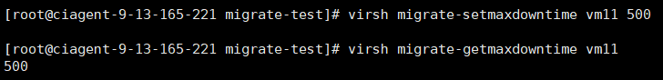
>
> 设置虚拟机热迁移过程中的最大带宽
>
> 使用
> 
> ```shell
> virsh migrate-setspeed vm11 --bandwidth 1000
> ```
> 设置名为vm11的虚拟机热迁移带宽为500Mbps，之后使用virsh migrate-getspeed vm11命令来查看名为vm11的虚拟机热迁移过程中的最大带宽。
>
> 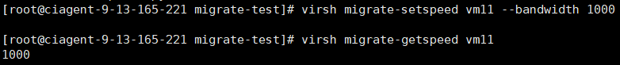

1.  是共享存储还是非共享存储

> 
>
> 再通过查询sdb的存储方式，我们知道这个是非共享存储方式。但是我们可以通过配置nfs，来使得两个主机共享这个目录。

配置nfs
-------------------

我们顺便提一下如何配置nfs：

一、yum 安装(以下操作是对源端进行的操作)

>```shell
>yum -y install nfs-utils rpcbind
>```
>
> nfs 的配置文件 /etc/exports
>
> 默认为空
>```shell
> vi /etc/exports
>```
> \#注意下面的9.13.7.124指的是目的端的ip网段 下面这段配置全部写在exports里
>
> /data 9.13.7.124(rw,no\_root\_squash,no\_all\_squash,sync,anonuid=501,anongid=501)
>
> 我们要共享的目录是/home/migrate-test 也就是思路中所说的/data
>
> 注：配置文件说明：
>
> /data 为共享目录
>
> 9.13.7.124 可以为一个网段，一个IP，也可以是域名，域名支持通配符 如: \*.abc.com
>
> rw：read-write，可读写；
>
> ro：read-only，只读；
>
> sync：文件同时写入硬盘和内存；
>
> async：文件暂存于内存，而不是直接写入内存；
>
> no\_root\_squash：NFS客户端连接服务端时如果使用的是root的话，那么对服务端分享的目录来说，也拥有root权限。显然开启这项是不安全的。
>
> root\_squash：NFS客户端连接服务端时如果使用的是root的话，那么对服务端分享的目录来说，拥有匿名用户权限，通常他将使用nobody或nfsnobody身份；
>
> all\_squash：不论NFS客户端连接服务端时使用什么用户，对服务端分享的目录来说都是拥有匿名用户权限；
>
> anonuid：匿名用户的UID值，可以在此处自行设定。
>
> anongid：匿名用户的GID值。
>
> 二、使配置生效
>
>```shell
>exportfs –r
>```
>
> 如果要取消：
>
> exportfs -u 9.13.7.124:/data 取消对特定IP和网段共享某本地目录
>
> 三、启动 nfs
>
>```shell
>systemctl start rpcbind
>
>systemctl start nfs
>```
>
> 查询nfs状态
>```shell
>systemctl status nfs
>```
> 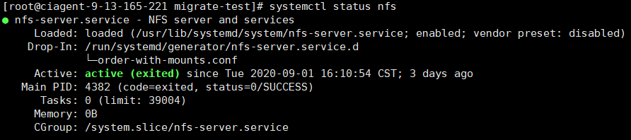
>
> 查询rpcbind状态
>```shell
>systemctl status rpcbind
>```
> 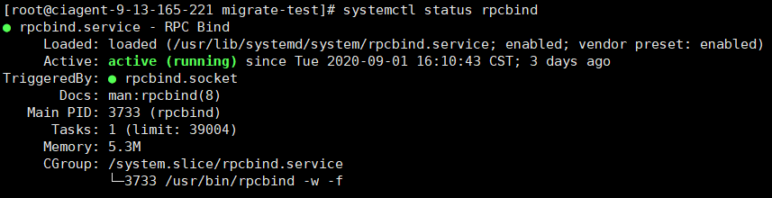
>
> Note：
>
> 切记检查下iptables 设置 以及 nfs路径的权限！
>
> \#清空iptables 规则
>
>```shell
>iptables -F
>
>iptables -X
>
>chmod -R 755 /data
>```
>
>
> 四、目的端挂载：(以下操作是对目的端进行的操作)
>
>```shell
>showmount -e 9.13.165.221
>```
>
> 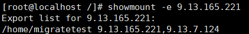
>
> mkdir /data(data指的是目的端要被挂载的目录哟)
>
>```shell
>mount -t nfs 9.13.165.221:/data /data
>```
>
> 这里的例子是：
>```shell
>mount -t nfs 9.13.165.221: /home/migrate-test /home/migrate-test
>```
>
> 使用命令：df –h 检查是否成功
>
> 除了nfs，还有其他方式可以配置共享存储，这里就不一一介绍了，等待大家去探索。

热迁移操作
----------

> 最后使用virsh migrate --live --unsafe vm11 qemu+ssh://9.13.7.124/system tcp://9.13.7.124进行热迁移。

如果使用非共享存储

> 我们需要在xml配置中找到镜像目录。
>
> 
>
> 执行热迁移之前需要在目的端主机相同磁盘目录下创建一个虚拟磁盘文件，注意磁盘的格式和大小必须保持一致。
>
>```shell
> qemu-img create -f qcow2 /home/data1 /openEuler011.qcow2 40G
>```
> 使用下面这个命令来进行热迁移
>
>```shell
> virsh migrate --live --unsafe --copy-storage-all --migrate-disks sda \\vm11 qemu+ssh://9.13.7.124 /system tcp://9.13.7.124
> ```
