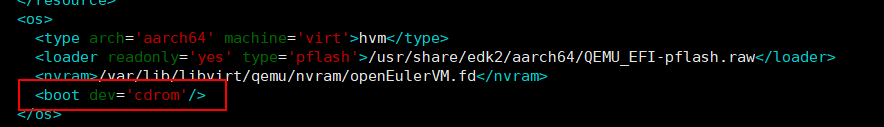
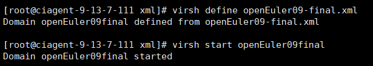
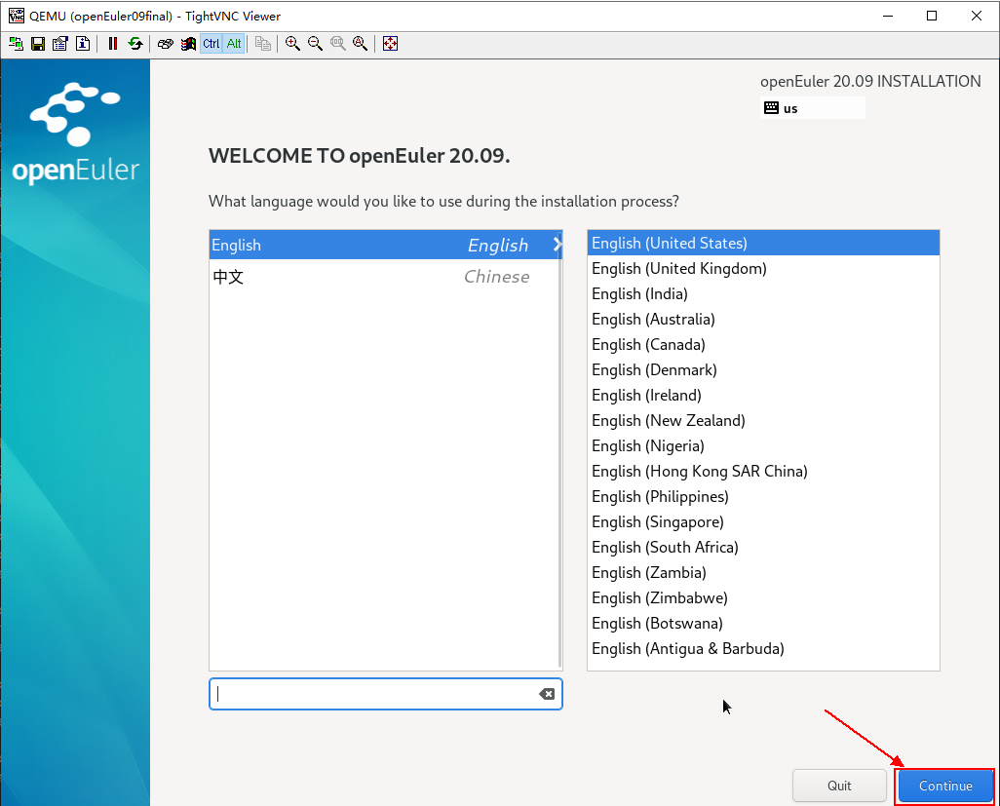
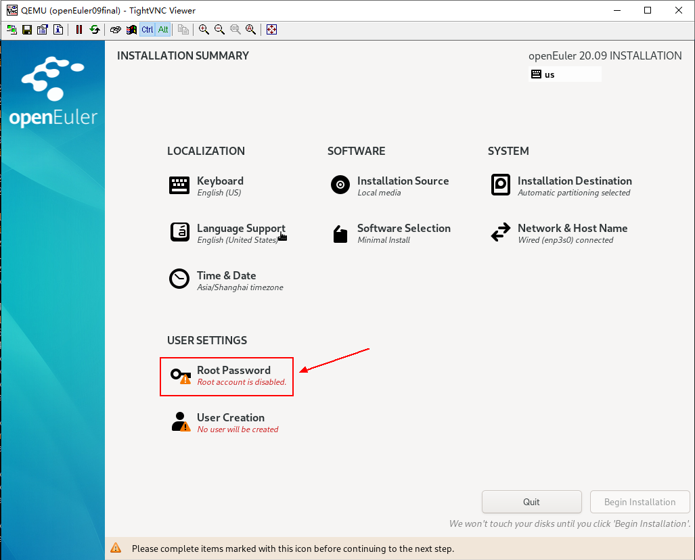
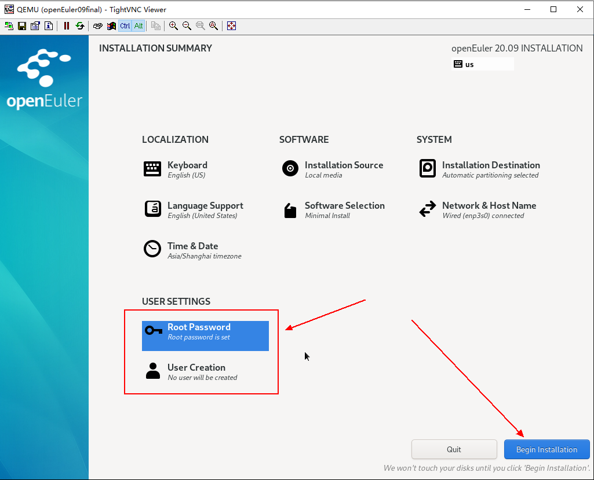
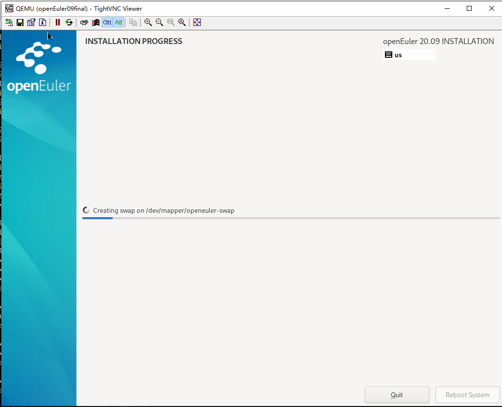
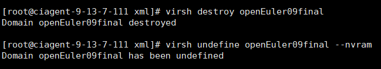
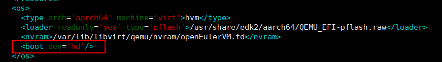
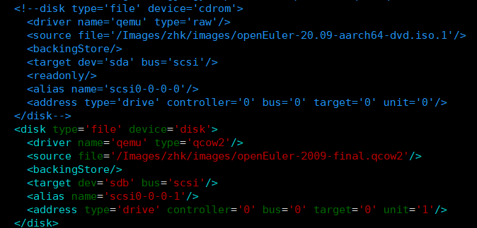

# openEuler镜像制作

虚拟机镜像是一个文件，包含了已经完成安装并且可启动操作系统的虚拟磁盘。虚拟机镜像具有不同格式，常见的有raw格式和qcow2格式。qcow2格式镜像相比raw格式，具有占用更小的空间，支持快照、Copy-On-Write、AES加密、zlib压缩等特性，但性能略逊于raw格式镜像。镜像文件的制作借助于qemu-img工具，本节以qcow2格式镜像文件为例，介绍虚拟机镜像制作过程。qcow2格式的镜像文件，本身是稀疏文件，只有在虚拟机实际占用了磁盘空间后，qcow2文件才会增长，而raw格式不支持动态增长。对于现在常用的可以支持稀疏文件的文件系统（ext4）来说，qcow2十分有优势。

## 制作流程

1.下载iso
---------

可以使用wget命令来下到本地

openEuler：

每日构建https://www.openeuler.org/zh/download/

如图下载好了需要用到的iso。


2.制作镜像
----------

1．使用命令：

```shell
yum install -y qemu-img root
```

安装好qemu-img包。

2. 
使用create命令来创建镜像文件
```shell
qemu-img create -f <imgFormat> -o <fileOption> <fileName> <diskSize>
```

注：

imgFormat：镜像格式，取值为raw, qcow2等。

fileOption：文件选项，用于设置镜像文件的特性，如指定后端镜像文件，压缩，加密等特性。

fileName：文件名称。

diskSize：磁盘大小，用于指定块磁盘设备的大小，支持的单位有K、M、G、T，分别代表KiB、MiB、GiB、TiB。


如图我创建了一个磁盘设备大小为24GB、格式为qcow2的镜像文件openEuler-2009-final.qcow2镜像文件。（因为是稀疏文件，所以它的实际大小是很小的）

3.安装系统
----------

### 配置xml

首先需要准备好一个xml文件来定义虚拟机。其中需要将启动方式写成从cdrom启动：



之后如图所示分别设置两个存储设备分别对应iso和qcow2文件：


其他的配置按照一般虚拟机xml配置即可。

### 从cdrom启动虚拟机



### 安装步骤

如图选择安装openEuler 20.09。


进入安装界面，选择continue。



点击选择安装目的。


选择我们刚刚创建好的qcow2镜像文件作为安装目的点。


设置root用户的密码



输入密码。


完成后会发现用户将会被自动创建好。



接下来进入自动化安装啦。



### 从hd启动虚拟机

完成上一步的安装后先销毁刚刚的虚拟机。



之后来修改xml配置，将启动方式从cdrom启动改为从hd启动。



紧接着把之前存储启动项里的iso项注释或者删除掉，如果不删除，则iso会成为一个额外的盘，也可以用来做yum源。



完成后就可以启动虚拟机啦。

4.添加rpm包
-----------

安装好的系统可能缺少一些需要的包，这里主要有两种方式来安装。

一种是通过配置yum源，在/etc/yum.repos.d下的openEuler.repo文件中来添加yum源，注意虚拟机使用的网段和yum源的网段是否一致，不一致则不能使用，需要配置虚拟机的网卡。或者就是配置本地yum源作为来源。


如上图，把iso做为cdrom，启动虚拟机后，把/dev/sr0挂载在/mnt下，在/etc/yum.repos.d下的openEuler.repo，配置如下图。


另一种方法是直接下载或拷贝rpm包到虚拟机上安装，但是注意有些rpm包会有前置依赖，需要一起下载。使用哪种方法视具体情况而定，如果有前置依赖，建议配置yum源。
