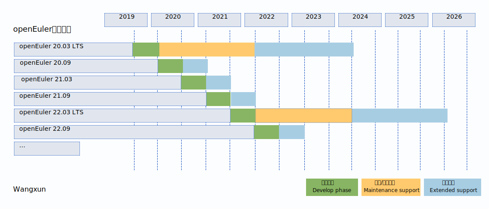

## 生命周期
社区版本按照交付年份和月份进行版本号命名。例如，openEuler 20.09于2020年09月发布。
 
社区版本分为长期支持版本和创新版本。
 
 
+ <b>长期支持版本:</b>发布间隔周期定为2年，提供4年社区支持。社区首个LTS版本openEuler 20.03 已于20年3月正式发布。
 
 
+ <b>社区创新版本:</b>LTS版本之间每隔6个月openEuler会发布一个社区创新版本，提供6个月社区支持，下一个社区创新版本将于2020年09月发布
 

