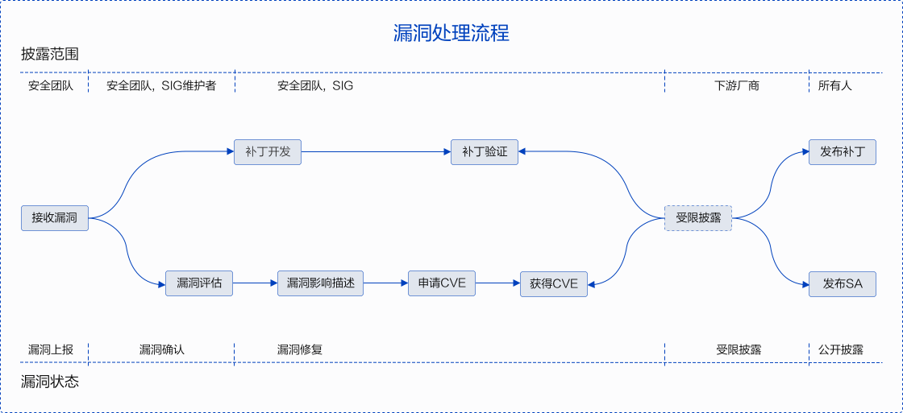

<ClientOnly>
  <security-reporting />
</ClientOnly>

## 漏洞响应
openEuler社区非常重视社区版本的安全性，openEuler安全委员会负责接收、调查和披露openEuler社区相关的安全漏洞。我们鼓励漏洞研究人员和行业组织主动将openEuler社区的疑似安全漏洞报告给openEuler社区安全委员会。我们会快速的响应、分析和解决上报的安全问题或安全漏洞。

## 支持版本
漏洞响应流程主要支持openEuler社区的LTS发行版和其分支版本。

## 漏洞处理流程
每个一个安全漏洞都会有一个指定的人员进行跟踪和处理，协调员是openEuler安全委员会的成员，他将负责跟踪和推动漏洞的修复和披露。漏洞端到端的处理流程如下图。

在这里我们主要介绍流程中漏洞上报、漏洞评估和漏洞披露这三部分内容。

## 漏洞上报
如果您认为openEuler产品存在一个疑似安全漏洞，我们希望您将漏洞上报给openEuler社区，并与我们配合以负责任的方式修复和披露该问题。

### 漏洞上报方式
您可以通过email将openEuler产品的潜在安全漏洞发送到openEuler安全团队邮箱（<securities@openeuler.org>）。因为漏洞信息比较敏感，建议您使用安全团队邮箱<a href="./public_key_securities.asc" download>GPG公钥</a>对邮件信息进行加密。
安全团队成员信息如下：

+ 刘金刚@liujingang09，<liujingang09@huawei.com>, <a href="./public_key_liujingang.asc" download>GPG公钥</a>。

+ 杨丽[@yangli69393]，<runningforever@gmail.com>。

+ 颜小兵[@yanxiaobing2020]，<yanxiaobing@huawei.com>, <a href="./public_key_yanxiaobing.asc" download>GPG公钥</a>。

+ 朱健伟@zhujianwei001，<zhujianwei7@huawei.com>, <a href="./public_key_zhujianwei.asc" download>GPG公钥</a>。

### 漏洞上报内容
为了便于快速的确认和验证疑似漏洞，请在漏洞上报邮件中包含但不限于以下内容：
- 基本信息：包括漏洞影响的模块、漏洞的触发条件和成功利用后对系统的影响等。

- 技术细节：包括系统配置、定位方法、Exploit的描述、POC、问题重现方法和步骤等。	

- 修复方案建议。

- 上报者的组织和联系方式。

- 上报者可能的漏洞披露计划。

### 邮件响应时间
我们将在48小时内响应通过邮箱上报的疑似安全漏洞，并向上报者反馈漏洞处理的进展。

## 漏洞严重性评估
业界普遍使用CVSS标准评估漏洞的严重性，openEuler在使用CVSSv3进行漏洞评估时，需要设定漏洞攻击场景，基于在该攻击场景下的实际影响进行评估。漏洞严重等级评估是指针对漏洞利用难易程度，以及利用后对机密性、完整性、可用性的影响进行评估，并生成一个评分值。
### 评估标准
openEuler社区采用CVSS v3对漏洞进行评估，CVSS V3由通过对以下向量来评估一个漏洞的影响：

- 攻击向量（AV）-表示攻击的“远程性”以及如何利用此漏洞。

- 攻击复杂性（AC）-讲述攻击执行的难度以及成功进行攻击需要哪些因素。

- 用户交互（UI）-确定攻击是否需要用户参与。

- 所需的权限（PR）-记录成功进行攻击所需的用户身份验证级别。

- 范围（S）-确定攻击者是否可以影响具有不同权限级别的组件。

- 机密性（C）-衡量信息泄露给非授权方后导致的影响程度。

- 完整性（I）-衡量信息被篡改后导致的影响程度。

- 可用性（A）-衡量用户在需要访问数据或服务时受影响的程度。

### 评估原则
- 评估漏洞的严重等级，不是评估风险。

- 评估时必须基于攻击场景，且保证在该场景下，攻击者成功攻击后能对系统造成机密性、完整性、可用性影响。

- 当安全漏洞有多个攻击场景时，应以造成最大的影响，即CVSS评分最高的攻击场景为依据。

- 被嵌入调用的库存在漏洞，要根据该库在产品中的使用方式，确定漏洞的攻击场景后进行评估。

- 安全缺陷不能被触发或不影响CIA(机密性/完整性/可用性)，CVSS评分为0分。

### 评估步骤
对漏洞进行评估时，可根据下述步骤进行操作：

- 设定可能的攻击场景，基于攻击场景评分。

- 确定漏洞组件（Vulnerable Component）和受影响组件（Impact Component）。

- 选择基础评估指标的值：通过对可利用指标（攻击向量/攻击复杂度/所需权限/用户交互/范围）和受影响指标（机密性/完整性/可用性）给出漏洞影响评估。

### 严重等级划分
 <table board="2" class="table table-bordered table-striped">     
      <thead>
          <tr>
              <th align="left" style="width:40px">严重等级（Severity Rating）</th>
              <th align="left" style="width:40px">CVSS评分（Score）</th>
          </tr>
          <tr>
              <td align="left">致命（Critical）</td>
              <td>9.0 - 10.0</td>
          </tr>
          <tr>
              <td align="left">高（High）</td>
              <td>7.0 - 8.9</td>
          </tr>
           <tr>
              <td align="left">中（Medium）</td>
              <td>4.0 - 6.9</td>
          </tr>
          <tr>
              <td align="left">低（Low）</td>
              <td>0.1 - 3.9</td>
          </tr>
          <tr>
              <td align="left">无（None）</td>
              <td>0.0</td>              
          </tr>          
      </thead>      
  </table>

### 和NVD评估分数差异说明
CVSS基础评分与受影响组件的版本号，提供和使用的方式，平台以及软件的编译方式相关，NVD评分考虑了漏洞被利用的所有场景，而openEuler是基于上游社区自己构建的，主要应用于服务器场景，所以对于openEuler开源产品来说，直接采用NVD评分是不合适的，因此openEuler对所有受影响的CVE有自己的评分，存在打分和NVD不同的情况。

## 漏洞披露
为了保护openEuler用户的安全，在进行调查、修复和发布安全公告之前，openEuler社区不会公开披露、讨论或确认openEuler产品的安全问题。安全漏洞修复后openEuler社区会发布安全公告，安全公告内容包括该漏洞的技术细节、CVE编号、CVSS安全评分、严重性等级以及受到该漏洞影响的版本和修复版本等信息。安全公告提供邮件订阅功能，您可以通过“[sa-announce](https://mailweb.openeuler.org/postorius/lists/sa-announce.openeuler.org/)"链接订阅openEuler社区的安全公告。

